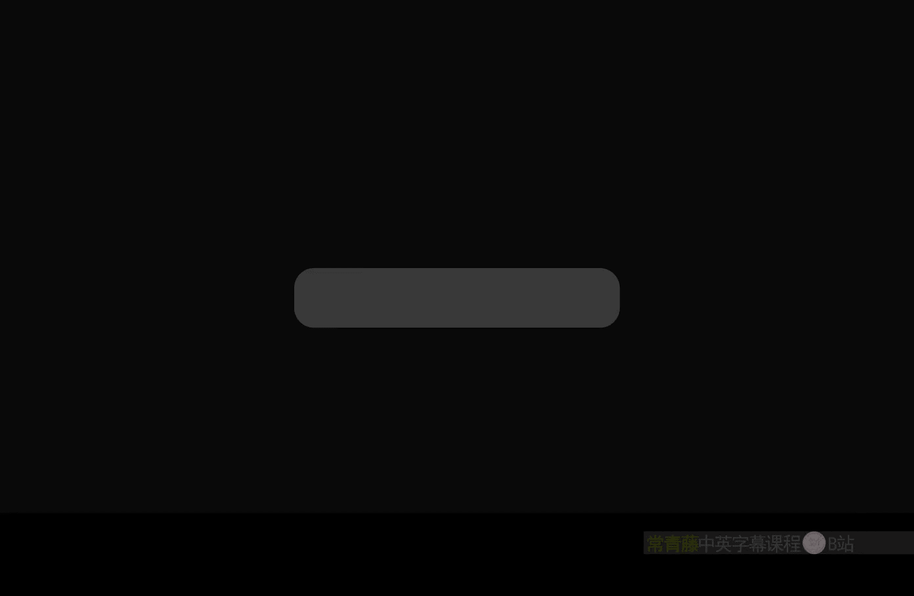
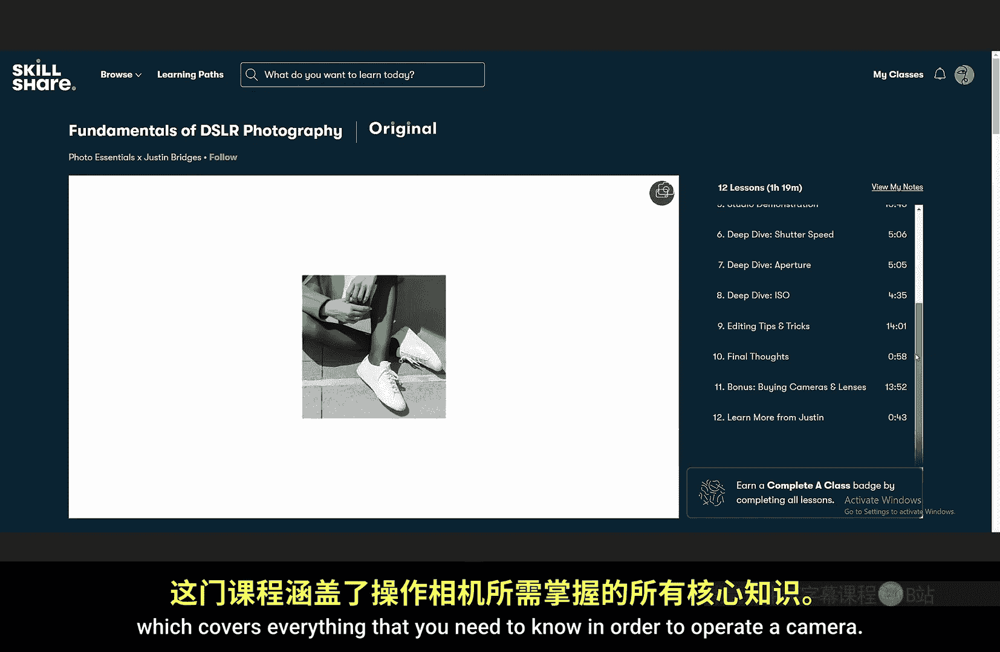
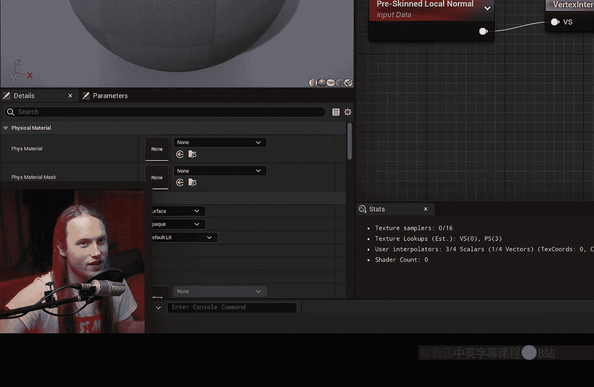
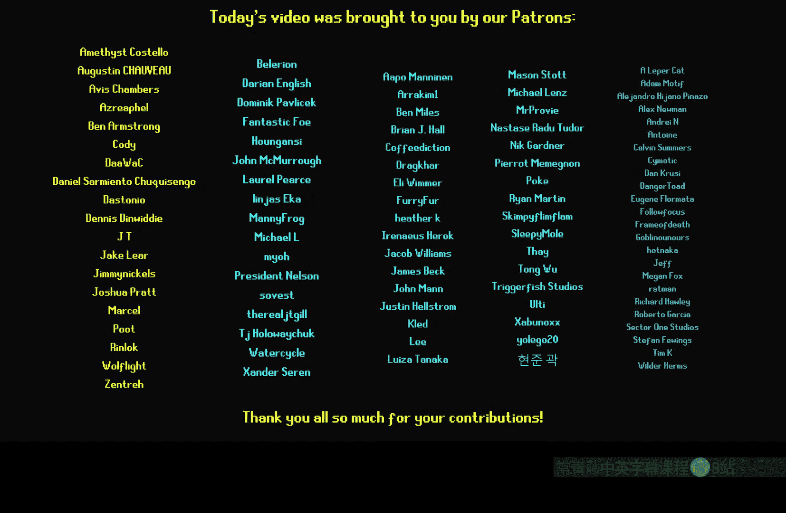

# 032：预蒙皮节点详解 🎨



在本节课中，我们将学习虚幻引擎材质编辑器中的两个核心节点：**预蒙皮局部位置**节点和**预蒙皮顶点法线**节点。它们是制作高质量角色着色器的关键工具，能够确保纹理和效果在角色动画时保持稳定。

---

## 预蒙皮局部位置节点

上一节我们介绍了节点的重要性，本节中我们来看看第一个核心节点：**预蒙皮局部位置**节点。

这个节点提供的是角色在应用动画（即“蒙皮”）之前的局部空间位置数据。这意味着，基于此位置绘制的效果会像“纹身”一样，跟随角色的骨骼移动，而不是在动画之后才被“画”上去。

### 节点功能与错误处理

直接将 `PreSkinnedLocalPosition` 节点连接到 `Base Color` 会报错，提示该节点只能在顶点着色器阶段使用。解决方法是通过 `VertexInterpolator` 节点进行传递。

**代码示例：连接方式**
```cpp
// 正确连接流程
PreSkinnedLocalPosition -> VertexInterpolator -> Base Color (或其他需要位置输入的端口)
```

### 核心应用场景

以下是该节点的三个主要应用场景。

**1. 投影纹理**
你可以使用此节点将纹理投影到角色模型上。例如，创建一个从顶部投影的遮罩。

**操作步骤：**
*   将 `PreSkinnedLocalPosition` 的坐标（通常是R和G通道）通过 `VertexInterpolator` 传递给纹理采样节点的UV输入。
*   通过 `Divide` 节点控制纹理的平铺大小。

**2. 创建位置遮罩**
此功能常用于制作基于模型局部空间位置的效果，例如角色浸入水中的湿润感。

**操作步骤：**
*   使用 `ComponentMask` 节点获取 `PreSkinnedLocalPosition` 的B（蓝色/垂直）通道。
*   通过 `Divide` 和 `ScalarParameter` 节点控制遮罩的偏移和范围。
*   使用 `Clamp` 或 `Saturate` 节点限制数值，然后通过 `VertexInterpolator` 传递，最后用于混合两种材质（如干燥与湿润）。

**3. 生成附着噪声**
将 `PreSkinnedLocalPosition` 作为噪声函数（如 `Noise` 或 `VectorNoise`）的坐标输入，可以创建附着在角色身上、随动画移动的有机纹理效果。

**核心优势：** 所有基于此节点的效果都会在角色动画前被“固化”在模型表面，无论角色如何运动、旋转，效果都会保持在预期的局部位置。

---

## 预蒙皮顶点法线节点

了解了位置节点后，我们再来看看它的“伙伴”——**预蒙皮顶点法线**节点。




这个节点提供的是角色在蒙皮前的顶点法线数据。它对于制作方向敏感且需要跟随角色动画的效果至关重要。



### 基本用法

与位置节点类似，`PreSkinnedLocalNormal` 也必须通过 `VertexInterpolator` 节点才能在像素着色器中使用。直接连接至 `Base Color` 可以直观地看到模型在绑定姿势下的法线分布。

### 核心应用场景

以下是该节点的两个关键用途。

**1. 创建方向性遮罩**
这是最常用的功能之一，例如模拟雪或水从上方落在角色身上的效果。

**操作步骤：**
*   将 `PreSkinnedLocalNormal` 通过 `VertexInterpolator` 传递。
*   使用 `ComponentMask` 节点提取B（向上）通道。
*   由此得到的遮罩会标识出角色在初始姿势下所有朝上的面。当角色动画时，这个遮罩区域会保持稳定，确保“积雪”始终在模型顶部，而不会因为手臂抬起就移到手臂上。

**2. 构建三平面投影纹理**
结合 `PreSkinnedLocalPosition` 和 `PreSkinnedLocalNormal` 节点，可以为角色创建高级的三平面纹理投影。

**操作步骤：**
*   使用引擎自带的 `WorldAlignedTexture` 材质函数。
*   将 `PreSkinnedLocalPosition` 连接到 `World Position` 输入。
*   将 `PreSkinnedLocalNormal` 连接到 `World Normal` 输入。
*   这样产生的纹理会完美贴合角色模型，并且在动画过程中不会发生扭曲或滑动，仿佛纹理是模型固有的部分。

---

## 总结 🎬

本节课中我们一起学习了两个强大的材质节点：
1.  **预蒙皮局部位置**：用于生成基于模型局部空间、且不受动画影响的位置数据，适用于投影、位置遮罩和噪声。
2.  **预蒙皮顶点法线**：用于获取模型在初始姿势下的法线方向，是制作方向性遮罩和高级纹理投影（如三平面投影）的基础。



它们的共同核心是 **“预蒙皮”**，即在骨骼动画计算之前获取模型数据，从而确保所有视觉效果能牢固地附着在角色表面，随骨骼自然运动，这是制作专业级角色材质的关键技术。