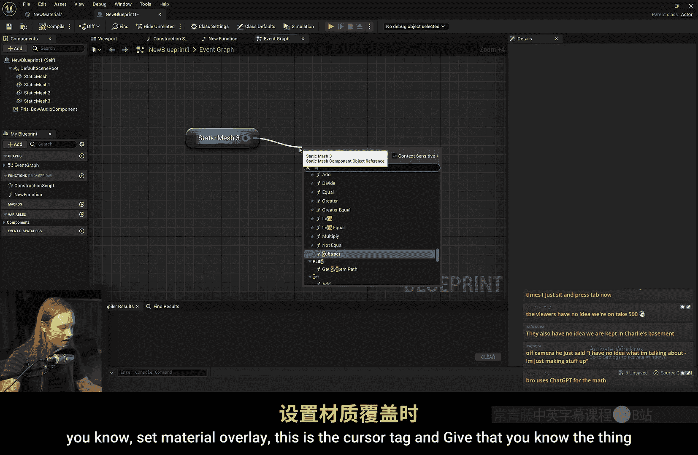
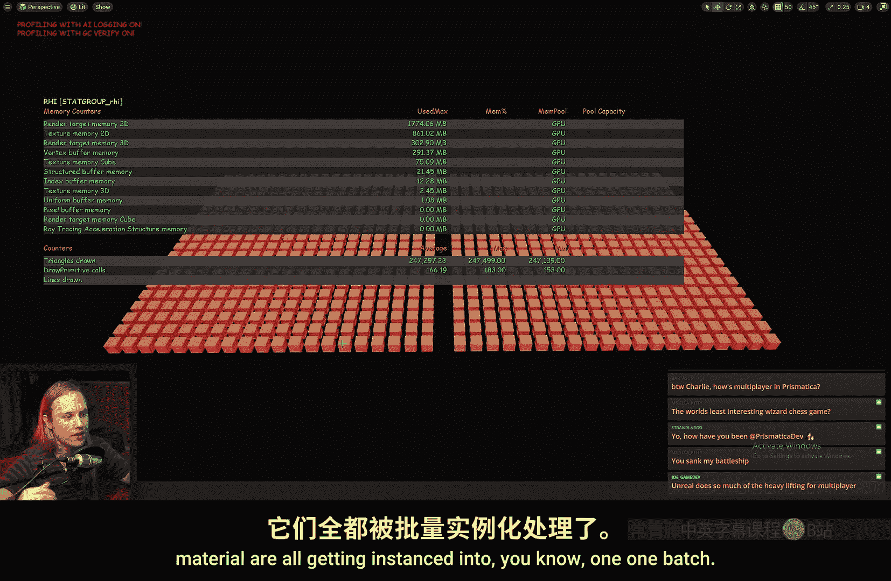
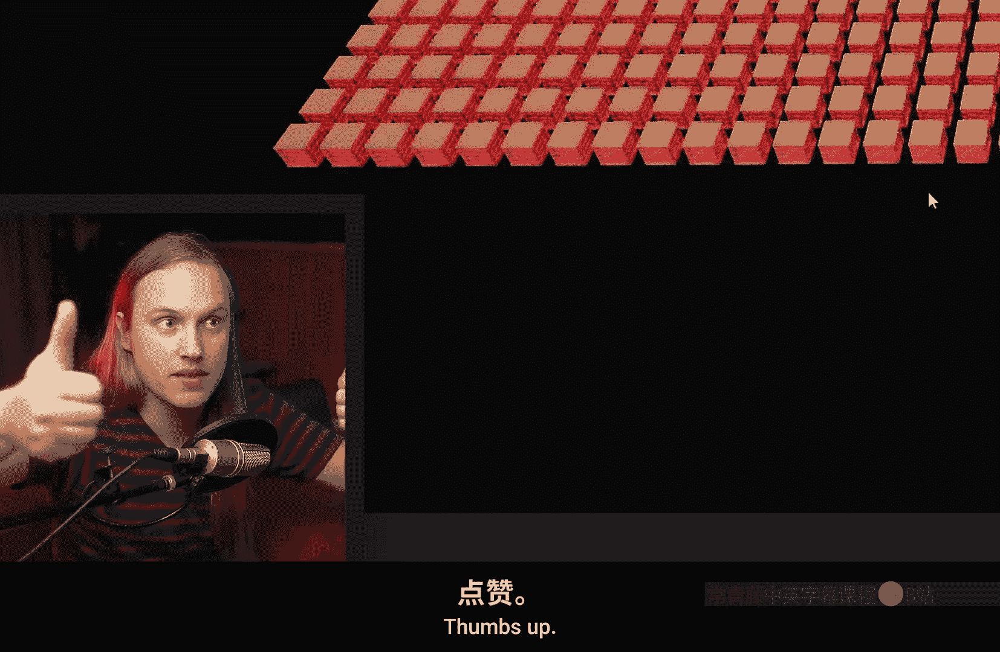
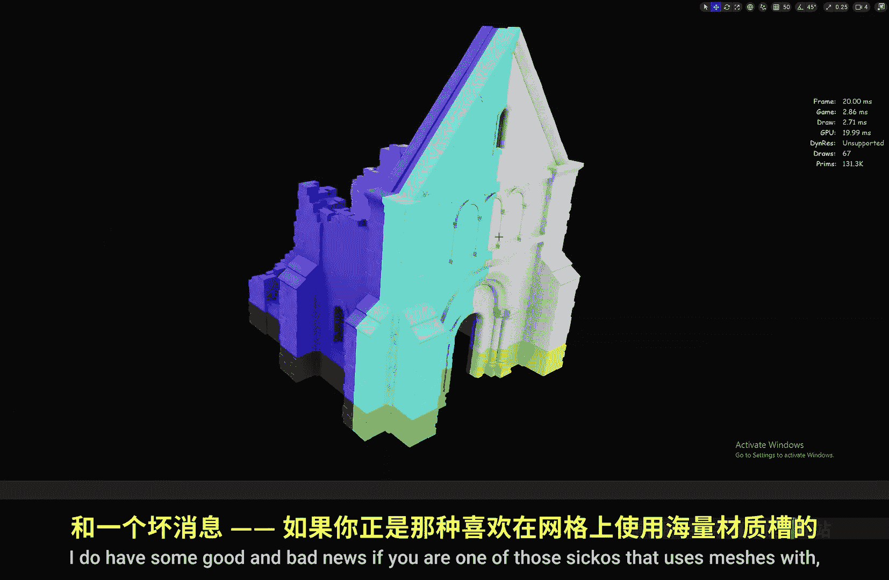
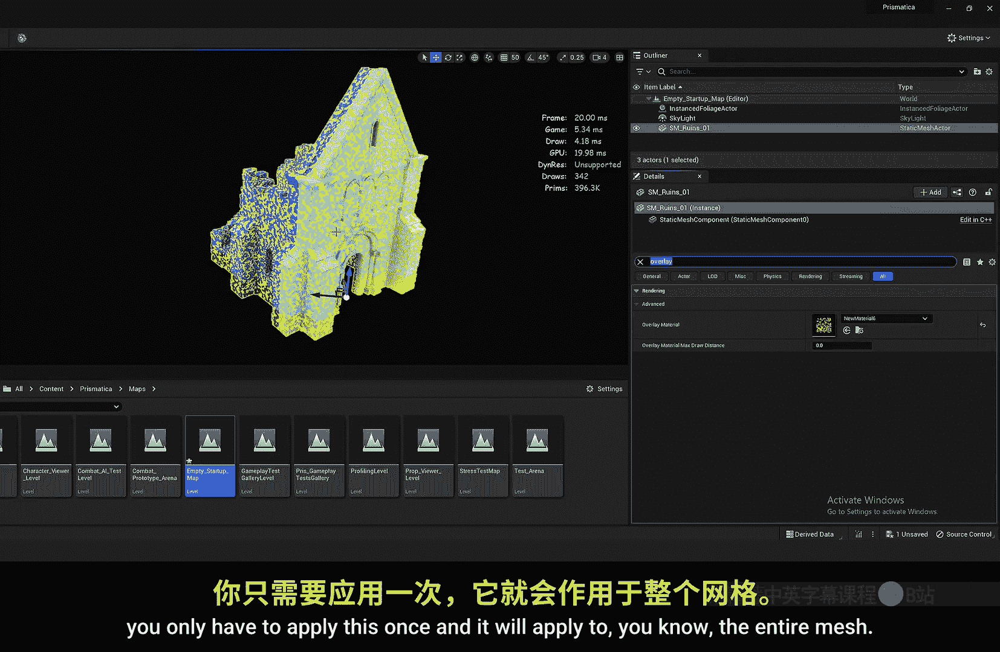

# 033：材质叠加系统完全指南 🎨

在本节课中，我们将学习虚幻引擎5引入的新功能——材质叠加系统。我们将了解该系统是什么、它能做什么、以及何时使用它比在着色器内部实现效果更合适。

## 概述

材质叠加系统允许我们在同一个网格上渲染两次，每次使用不同的材质。这非常适合实现临时性的视觉效果，而无需修改复杂的原始材质。

## 什么是材质叠加？🤔

材质叠加系统本质上会渲染网格两次，每次使用不同的材质。例如，我们可以为主角材质添加一个轮廓线着色器，而无需修改主角原本复杂的材质代码。

## 如何使用材质叠加？🔧

以下是启用材质叠加的步骤：

1.  在场景中选择任意网格体（静态网格体或骨架网格体）。
2.  在“细节”面板中搜索“Overlay”。
3.  在“渲染”->“高级”部分找到“覆盖材质”选项。
4.  为其指定一个材质，叠加效果便会生效。

该选项还包含“剔除距离”设置，可用于控制叠加材质在特定距离外是否渲染。

## 在蓝图中控制材质叠加 💙

在蓝图中，我们可以动态地设置或清除叠加材质。

1.  获取对目标网格体的引用。
2.  使用“设置覆盖材质”节点。
3.  要应用效果，传入一个材质实例。
4.  要清除效果，将材质设置为“无”。

例如，实现鼠标悬停高亮效果：在“鼠标悬停”事件中设置高亮材质，在结束时清除它。

## 创建基础叠加材质 🛠️

创建一个简单的叠加材质时，需要注意渲染顺序问题。

1.  创建一个新材质，例如使用云噪点纹理连接到“不透明度蒙版”，模拟污垢效果。
2.  直接应用时，叠加层可能被原始网格遮挡。
3.  解决方案：将“顶点法线（世界空间）”连接到“世界位置偏移”节点，将叠加材质轻微挤出网格表面，避免Z冲突。

## 何时使用材质叠加？✅

材质叠加最适合用于**新颖且临时**的视觉效果。

*   **典型用例**：角色身上的减益效果（如防御降低、速度降低）。
*   **优势**：将不常用的效果代码与主体材质分离。着色器是无状态的，即使效果不可见，相关计算也可能持续进行。使用叠加材质可以避免在主体材质中嵌入很少使用的复杂逻辑。

## 材质叠加的优势与限制 ⚖️

**优势：**
*   **通用性**：可以叠加到场景中任何其他材质或网格体上，无需为每种材质单独实现效果。
*   **数据共享**：叠加材质会读取原始网格的**顶点颜色**和**自定义（主要）数据**。这意味着你无需为了复制效果而复制网格数据。

**当前限制：**
*   **单一叠加层**：目前每个网格体只能同时应用一个叠加材质。这意味着你不能同时显示“减益”和“选中高亮”两种叠加效果。
*   **需匹配WPO**：如果原始材质使用了**世界位置偏移**（如风效、形变），叠加材质也需要复制相同的WPO计算，否则效果会错位。

## 运行时控制叠加参数 🎮

有两种主要方法在游戏运行时控制叠加材质的效果：

**方法一：使用动态材质实例**
1.  创建叠加材质的动态实例。
2.  将其设置为网格体的覆盖材质。
3.  通过蓝图节点（如“设置标量参数值”）动态修改实例的参数（如不透明度、颜色）。

**方法二：使用自定义（主要）数据**
1.  在叠加材质中，使用“Custom Primitive Data”节点读取数据。
2.  在蓝图中，使用“设置自定义主要数据...”节点修改网格体对应索引的数据值。
3.  叠加材质会自动响应这些数据变化，无需创建动态实例。

## 实例化网格体与性能考量 📊

材质叠加系统经过优化，对性能影响较小：

*   **自动实例化**：系统不会破坏虚幻引擎的自动实例化优化。即使为大量相同网格体应用相同的叠加材质，也只会增加少量绘制调用，而不是为每个网格体单独增加。
*   **多材质槽网格体**：对于拥有多个材质槽的复杂网格体，应用一个叠加材质会作用于整个网格。但**每个材质槽都会产生一个额外的绘制调用**。这是使用时需要考虑的性能成本。

## 总结

本节课我们一起学习了虚幻引擎5的材质叠加系统。

*   我们了解了它是一个用于渲染临时、新颖效果的独立系统。
*   掌握了如何通过细节面板和蓝图来启用与控制它。
*   学习了创建叠加材质时避免Z冲突的技巧。
*   明确了其适用场景（临时效果）和当前限制（单层叠加）。
*   探索了两种在运行时驱动效果的方法：动态材质实例和自定义数据。
*   最后，我们分析了它的性能特性，知道它不会严重破坏实例化，但在多材质槽物体上需注意绘制调用开销。

通过材质叠加，我们可以更模块化、更高效地管理复杂的视觉特效。