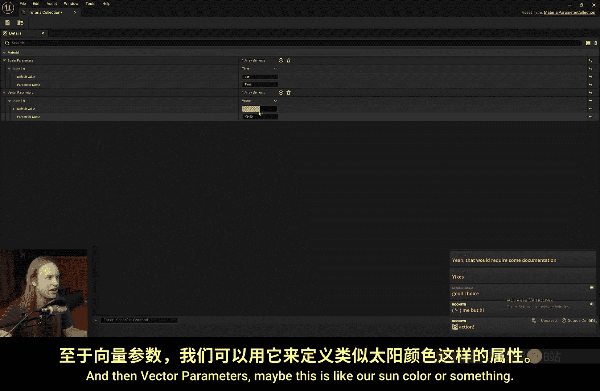
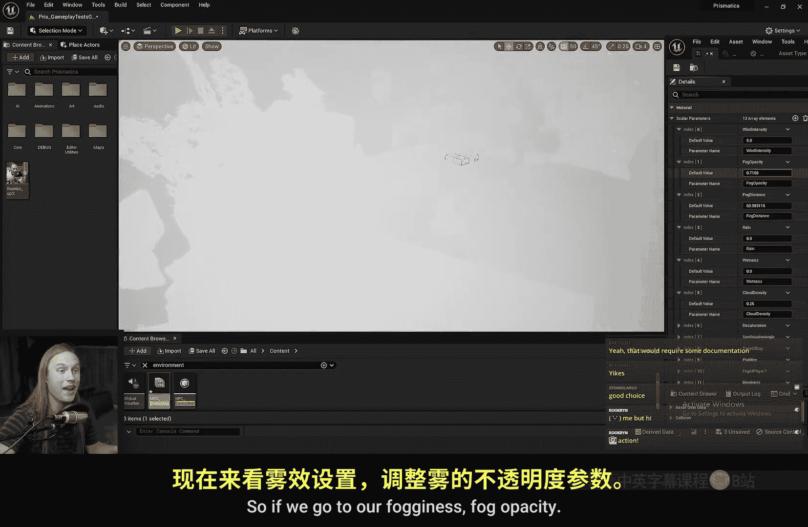
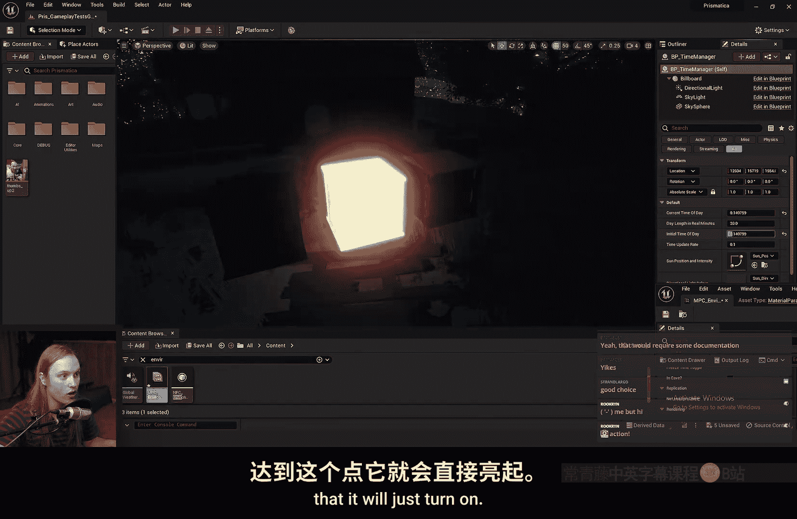
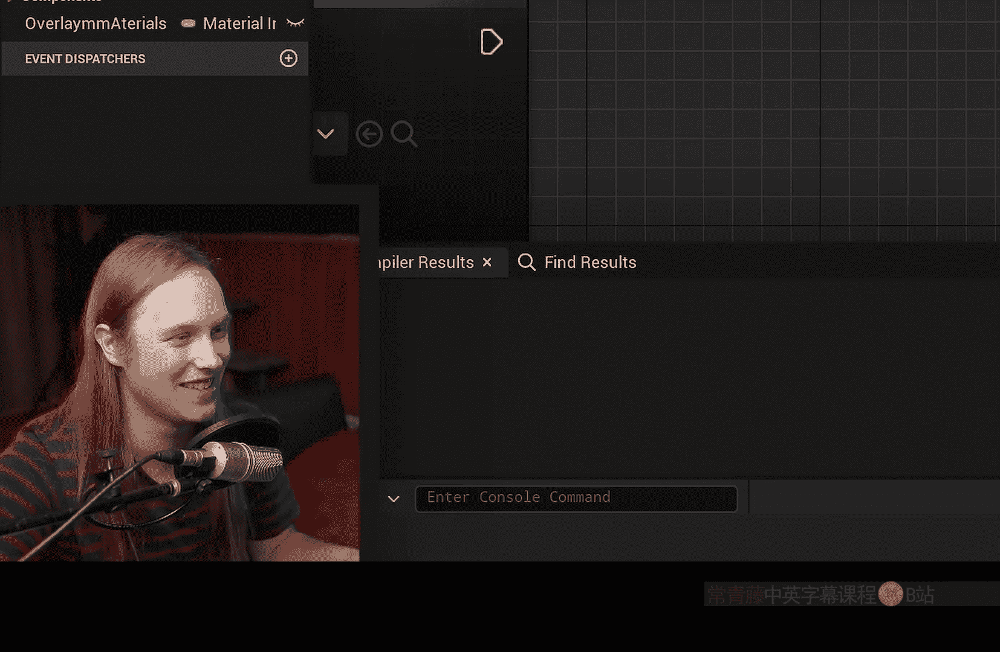
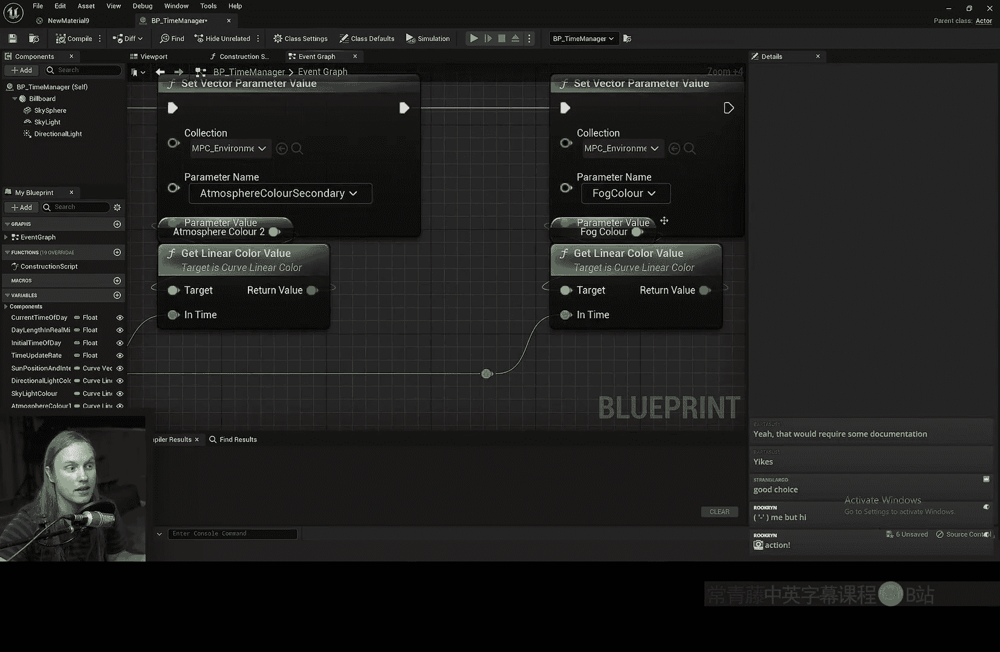
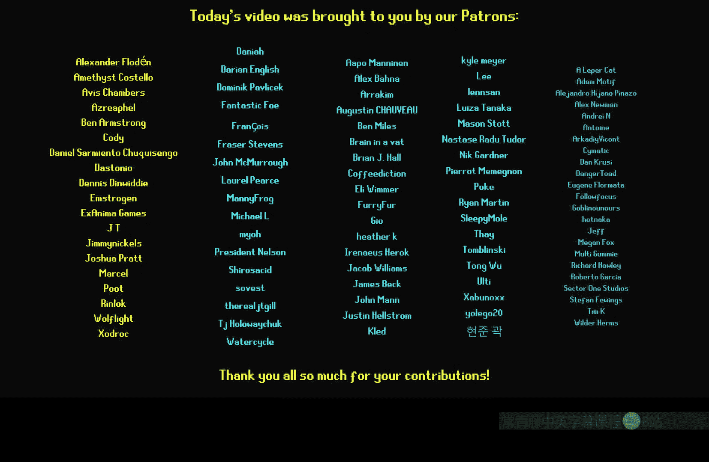

# 034：材质参数集合 🎨

## 概述
在本节课中，我们将要学习虚幻引擎中的“材质参数集合”。这是一种用于在多个材质之间共享和统一控制参数值的强大工具。我们将了解它的创建方法、应用场景以及如何在蓝图中动态更新这些参数。

## 什么是材质参数集合？
上一节我们介绍了材质的基础概念，本节中我们来看看材质参数集合。它是一个存储标量和向量参数的容器，可以被场景中的任意材质引用和读取。这意味着你可以从一个中心位置控制多个材质的属性。

## 创建材质参数集合
以下是创建材质参数集合的步骤：
1.  在内容浏览器中右键点击。
2.  选择 **Materials & Textures > Material Parameter Collection**。
3.  将其命名为 `Tutorial_Collection`。



创建后，你会看到一个空白的编辑界面。你可以在这里添加参数，例如：
*   一个名为 `Time` 的标量参数（范围0到1）。
*   一个名为 `Sun_Color` 的向量参数。

添加参数后，点击保存。

## 在材质中引用集合参数
现在，让我们创建一个新材质来测试这个集合。

1.  创建一个名为 `Material_8` 的新材质，并将其应用到一个物体上。
2.  在材质图表中，右键搜索并添加 **Collection Parameter** 节点。
3.  在节点细节面板中，将 `Collection` 属性指定为我们刚创建的 `Tutorial_Collection`。
4.  从 `Parameter Name` 下拉菜单中选择 `Time` 参数。

此时，材质中便引用了集合中的 `Time` 值。我们可以用它来驱动材质变化，例如将其输入到余弦函数中，以创建周期性的颜色变化。

```glsl
// 伪代码示例：使用时间参数驱动颜色
FinalColor = BaseColor * (0.5 + 0.5 * cos(2 * PI * Time_Parameter));
```

在另一个材质中，我们可以使用同一个 `Time` 值实现完全不同的效果，比如让一个箱子的顶点随时间推移而偏移，模拟缓慢爆炸的效果。

```glsl
// 伪代码示例：使用时间参数驱动顶点偏移
WorldPositionOffset = VertexNormal * 40.0 * Time_Parameter;
```

现在，如果我们在材质参数集合编辑器中修改 `Time` 的值，两个材质都会同步产生变化，但表现方式各不相同。



## 实际应用场景
材质参数集合通常用于控制全局变量。以下是几个常见的应用示例：

*   **环境控制**：控制昼夜时间、玩家位置、是否下雨等。不同的材质会对这些变量做出不同的反应。
*   **风力系统**：通过一个 `Wind_Intensity` 参数统一控制场景中所有树木和草地的摇摆幅度。树木和草地材质可以以不同的方式解读这个强度值。
*   **雨和湿润度**：通过 `Rain_Intensity` 或 `Wetness` 参数，让场景中的所有物体表面变得湿润、反光。
*   **后期处理**：控制雾的浓度 (`Fog_Density`)、雾的距离 (`Fog_Distance`) 等，这些值可以直接被后期处理材质引用。

如果你想在某个特定模型上排除全局效果（例如，某块石头不被雨水打湿），可以在该材质中结合顶点绘制来实现局部控制。

## 在蓝图和材质中动态更新
材质参数集合的真正威力在于可以在运行时通过蓝图动态修改。



### 设置参数值
在蓝图中，你可以使用以下节点来更新集合中的参数：

*   **Set Scalar Parameter Value**：更新标量参数（如 `Time`, `Wind_Intensity`）。
    *   在 `Collection` 输入引脚选择你的参数集合。
    *   在 `Parameter Name` 中输入参数名。
    *   在 `Parameter Value` 中输入新值。
*   **Set Vector Parameter Value**：更新向量参数（如 `Sun_Color`, `Fog_Color`）。
    *   操作方式与标量类似，但输入值是线性颜色。

例如，你可以用时间轴或计时器，在开始下雨时，将 `Rain_Intensity` 参数从0渐变到1。



### 获取参数值
你也可以从集合中读取参数值，用于其他逻辑计算。

*   **Get Scalar Parameter Value**
*   **Get Vector Parameter Value**



这在你不想显式地在多个系统间传递变量时非常方便。例如，你的时间管理系统可以每帧将当前时间写入集合，而任何需要时间信息的材质或蓝图都可以直接从集合中读取。

> **性能提示**：频繁获取或设置集合参数会涉及CPU与GPU之间的数据传递。对于运行时不变的常量（如基础草的颜色），更推荐使用**材质函数**来封装，这样在着色器编译时就能被优化，性能更好。

## 最佳实践与建议
材质参数集合非常适合管理那些需要全局联动、并在运行时变化的参数。

一个高效的使用模式是：**用少数核心参数驱动多种视觉效果**。

例如，与其在集合中为春夏秋冬各定义一个草的颜色参数，不如只定义一个 `Season`（范围0-1）参数。
*   在草的材质中，你可以根据 `Season` 值，通过插值计算出对应的颜色。
*   在树的材质中，你可以用同一个 `Season` 值来控制树叶的不透明度（在冬季变为0）。

这样，你只需控制一个 `Season` 参数，就能同步驱动整个场景的季节变化，保持了高度的一致性。



## 总结
本节课中我们一起学习了材质参数集合。我们了解了如何创建它、如何在材质中引用其参数，以及如何通过蓝图在运行时动态更新这些参数。它是一个强大的工具，能够帮助你高效地管理场景的全局状态（如时间、天气），并在多个材质间创建协调、联动的视觉效果，从而极大地提升场景的一致性和沉浸感。