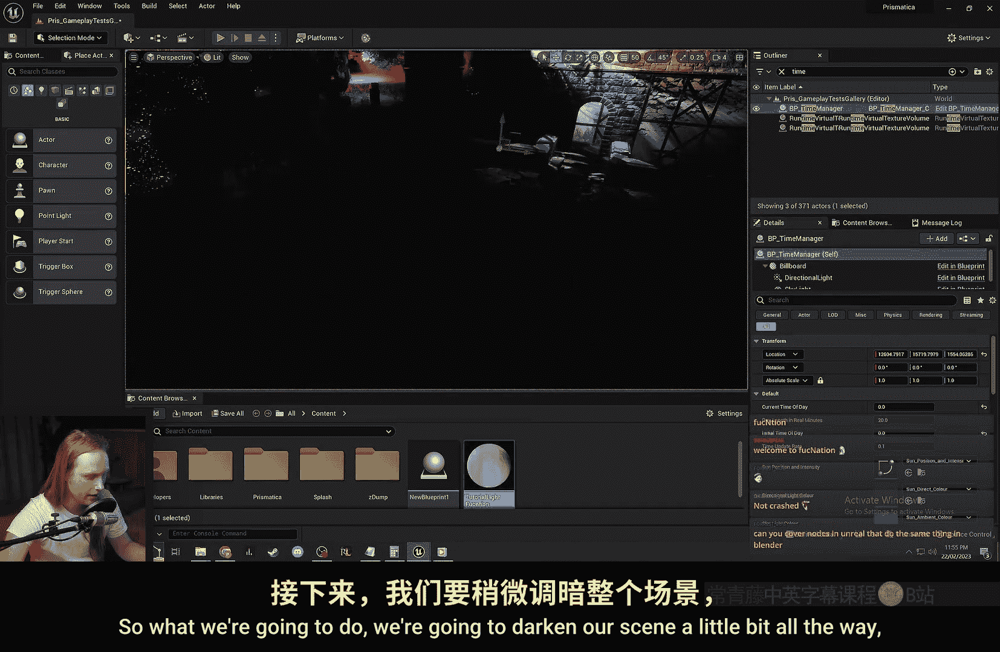
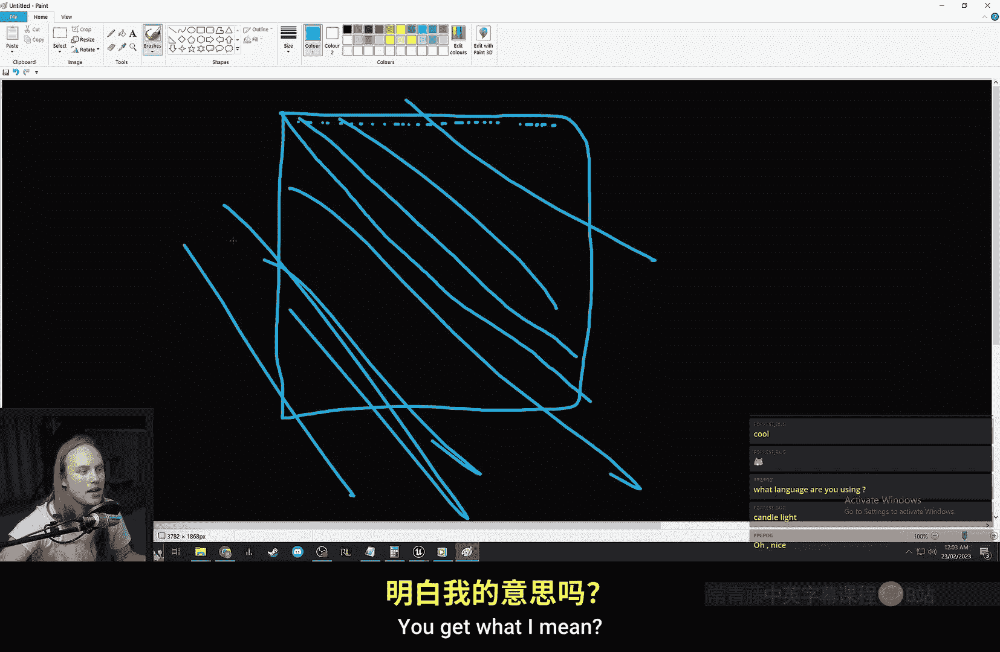
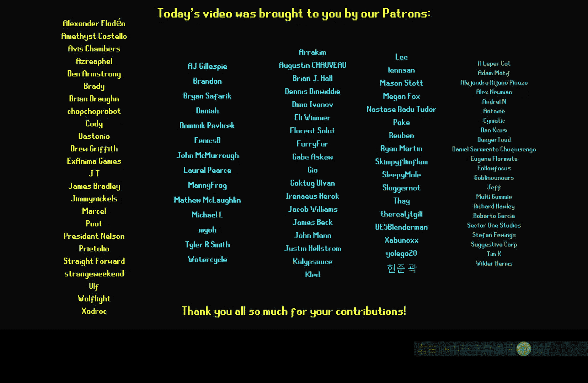

# 035：光照函数 🎭

在本节课中，我们将学习虚幻引擎中一个强大但常被忽视的功能——光照函数。我们将了解它的基本原理、创建方法以及几种实用的应用场景。

---

## 什么是光照函数？

上一节我们介绍了材质的基础概念，本节中我们来看看光照函数。光照函数本质上是一种可以附加到光源上的特殊材质。它允许你通过一个材质来控制光源的发射模式，从而创造出动态或图案化的光照效果。

## 创建基础光照函数

以下是创建一个基础光照函数的步骤：

1.  创建一个新材质，并将其命名为 `Tutorial_LightFunction`。
2.  在材质细节面板中，将 **材质域** 从默认的 `表面` 更改为 `光照函数`。
3.  更改后，你会发现只有 **自发光颜色** 输入引脚被激活，这正是我们需要的。

接下来，我们将创建一个平铺的世界空间图案。

```cpp
// 核心思路：使用世界位置坐标来平铺纹理
WorldPosition (Mask X, Y) / 200
```

上述公式意味着，纹理将以每2米（200单位）为一个单位在X和Y轴上进行平铺。编译材质后，我们就得到了一个基础的光照函数材质。

## 应用光照函数

要将创建的光照函数应用到场景中，请按以下步骤操作：

1.  在场景中选择一个光源（例如定向光）。
2.  在光源的细节面板中，找到 **光照函数** 分类。
3.  将 `材质` 属性指向我们创建的 `Tutorial_LightFunction` 材质。

应用后，你会立即看到光照效果发生了变化。光照函数材质中的白色区域允许光线通过，而黑色区域则会阻挡光线，从而在受该光源照射的物体上形成图案。



## 实用案例一：模拟云层阴影

了解了基础操作后，我们来看看光照函数的一个经典应用——模拟动态的云层阴影效果。

以下是创建云层阴影效果的步骤：

1.  使用两个不同平铺尺度的 **噪声纹理** 进行混合，以增加细节。
    `(Noise_Texture_A + Noise_Texture_B) / 2`
2.  使用 **Panner（平移）节点** 让噪声纹理移动，模拟云飘动的效果。
3.  通过数学节点（如 `Power` 或 `Multiply`）调整对比度，使明暗区域更分明。
4.  可以使用 `1 - (Noise * Intensity)` 公式来控制阴影的浓度，让效果更柔和自然。

通过将这些节点连接到自发光颜色，并将材质应用到定向光上，你就能在场景中看到动态的、掠过地面的云影效果了。



## 实用案例二：制作动态点光源

除了定向光，光照函数也可以用于点光源或聚光灯，创造出如烛光、篝火般闪烁不定的效果。

以下是模拟烛光闪烁效果的步骤：

1.  为点光源创建一个新的光照函数材质。
2.  使用一个 **噪声纹理**，并将其UV坐标与时间相连，公式如下：
    `TextureCoordinate + (Time * FlickerSpeed)`
3.  通过调整 `FlickerSpeed` 和 `FlickerIntensity` 参数，可以控制闪烁的快慢和强弱。
4.  将处理后的噪声值输出到自发光颜色。值1代表全亮，值0代表无光，中间的灰度值则产生明暗变化。

这样，点光源就会根据噪声纹理的采样值产生随机、动态的亮度变化，完美模拟出火焰的光照特性。

## 高级实验：彩色投影

需要注意的是，标准的光照函数只支持灰度值（0-1），无法直接输出颜色。但通过一个技巧可以实现彩色投影效果。

1.  原理是使用三个相同位置的光源，分别代表红、绿、蓝三原色。
2.  为每个光源创建独立的光照函数材质，并分别输入彩色纹理的R、G、B通道。
3.  三个光源的光照叠加后，就能在场景中合成出完整的彩色投影图像。

这种方法虽然能实现有趣的效果（如将图像投射到建筑上），但由于需要多个光源，会显著增加渲染开销，因此仅建议在特定小场景或非性能关键处使用。

## 其他应用场景

光照函数的功能远不止于此，它还是一个节省性能的利器。

*   **模拟窗户阴影**：你可以将窗户格栅的纹理应用到聚光灯的光照函数上，这样就能在不开启光源阴影投射（性能开销大）的情况下，在地板上模拟出窗户的阴影图案。
*   **创造图案光效**：为舞台灯光、信号灯或特殊环境氛围创建定制化的光斑图案。

## 总结

本节课中我们一起学习了虚幻引擎的光照函数功能。我们首先了解了光照函数是一个能控制光源发射模式的特殊材质。然后，我们逐步实践了如何创建和应用基础光照函数。接着，我们探索了两个核心实用案例：模拟动态云层阴影和为点光源添加烛光般的闪烁效果。最后，我们还探讨了实现彩色投影的高级技巧以及其他节省性能的应用思路。



记住，光照函数的本质是一个灰度遮罩，它用简单的方式为场景光照带来了巨大的灵活性和艺术表现力。