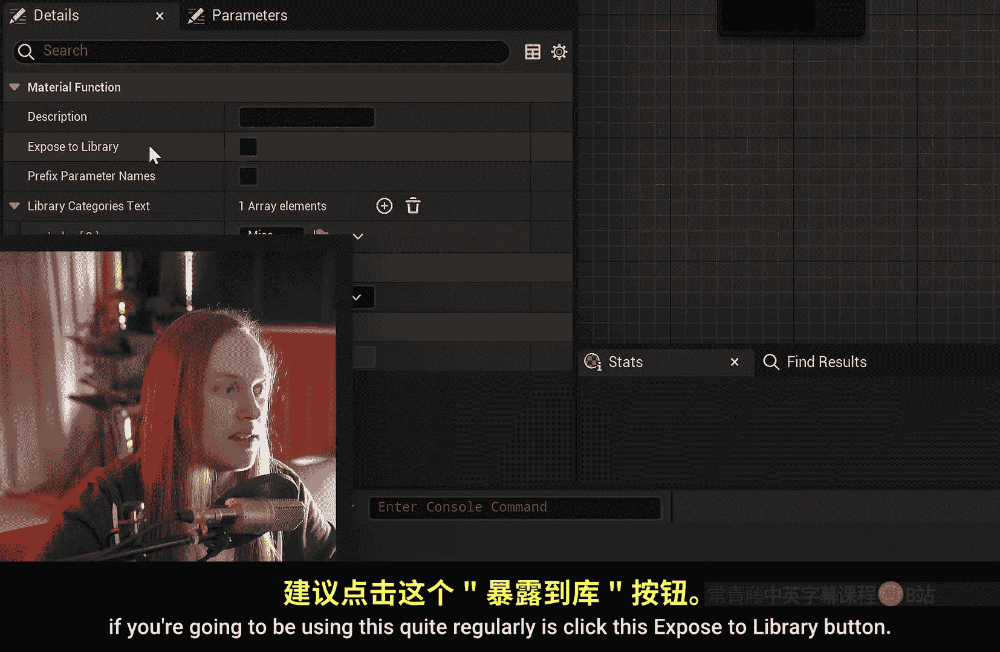
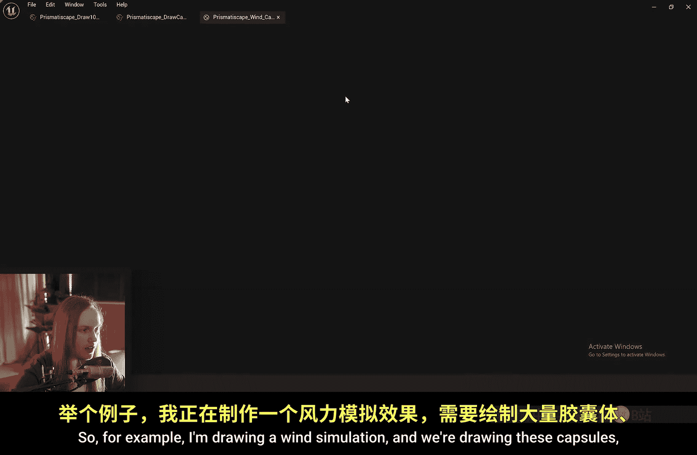
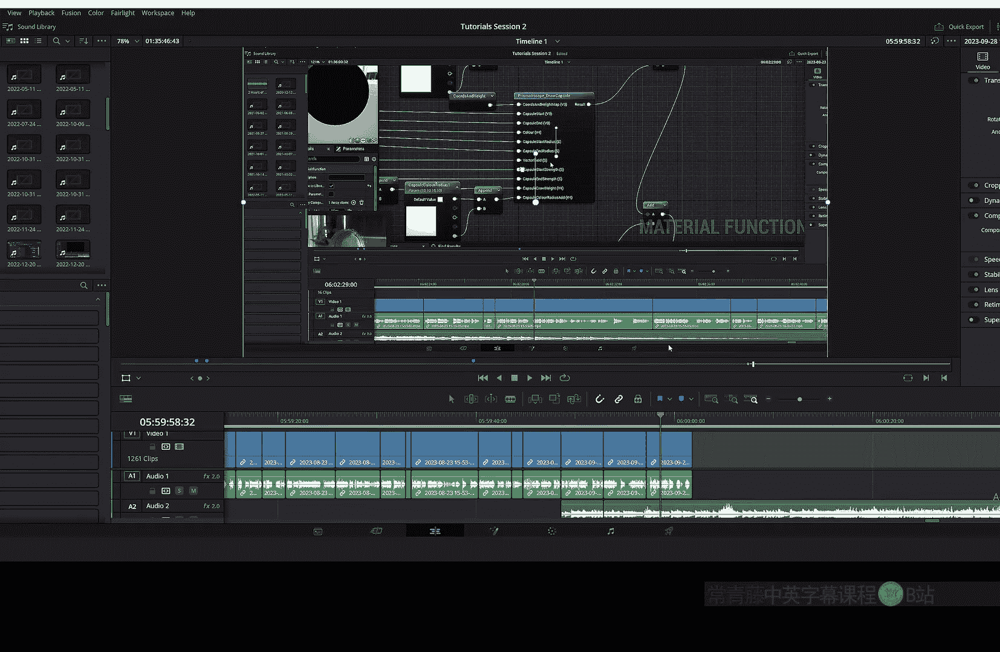
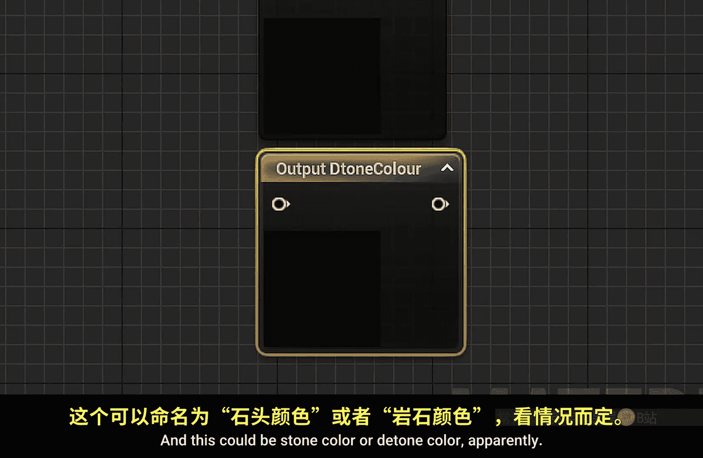
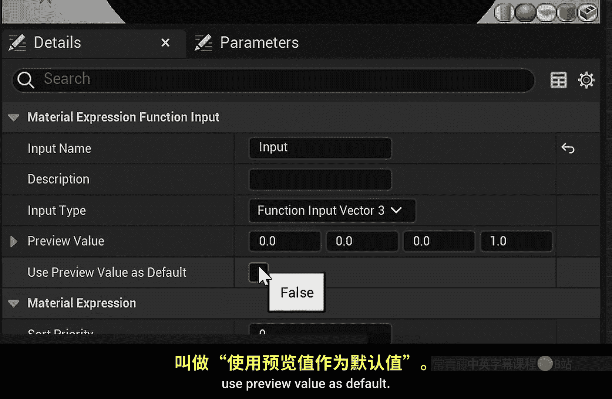
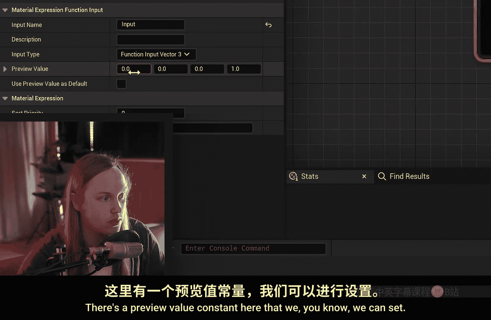
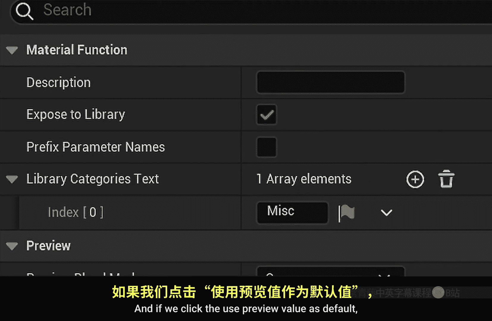

# 036：材质函数详解 🧩

在本节课中，我们将要学习虚幻引擎中一个非常核心的工具——材质函数。我们将了解它是什么、何时使用、如何使用以及为何使用。掌握材质函数能极大地提升你的着色器开发效率和代码复用性。

## 什么是材质函数？

上一节我们介绍了课程目标，本节中我们来看看材质函数的本质。

材质函数是一段可以被封装成独立节点的代码或数学运算。它拥有自己的输入和输出引脚，可以在常规的材质图表中被重复调用。本质上，它允许你将复杂的逻辑打包成一个简洁、可复用的模块。

## 如何创建材质函数？

理解了概念后，我们来看看如何创建一个材质函数。

首先，在内容浏览器中右键点击，选择 **材质 -> 材质函数**。

将其命名为 `MatFunction_Tutorial` 并打开。你会看到一个类似材质图表但输出节点不同的界面。这里的输出是 **函数输出** 节点。

## 构建一个简单的材质函数

创建好空白函数后，我们来构建一个具体的例子。

我们将创建一个函数，它接收一个 **Vector3** 输入，执行 **加1再除以2** 的运算，然后输出结果。

1.  添加一个 **函数输入** 节点，并将其类型设置为 **Vector3**。
2.  使用 **Add** 和 **Divide** 节点构建运算：`(Input + 1) / 2`。
3.  添加一个 **函数输出** 节点，并将运算结果连接至它。

为了让这个函数在材质编辑器中易于查找，请勾选其细节面板中的 **“暴露给库”** 选项，然后保存。

## 在材质中使用材质函数

函数创建完成后，我们来看看如何在普通材质中调用它。

新建一个材质，在图表中右键搜索 `MatFunction_Tutorial`，即可找到并使用我们创建的函数节点。例如，你可以将一个法线贴图连接至其输入，经过函数处理后查看调试效果。如果没有这个函数，你需要手动重复 `(Tex + 1) / 2` 的运算。

## 材质函数的优势：复用与维护

使用材质函数的核心优势在于代码复用和集中维护。

你可以在一个材质甚至多个材质中多次使用同一个函数。最大的好处在于，当你需要修改这段通用逻辑时（例如，发现计算公式有误或需要调整），只需进入该材质函数内部修改一次，所有使用了此函数的地方都会自动更新。这避免了在多个材质中手动查找和替换相同代码的繁琐工作。

## 高级应用：嵌套函数与参数传递

材质函数的功能远不止于此，本节我们来看看更高级的用法。

**嵌套函数**：你可以在一个材质函数内部调用另一个材质函数，构建多层级的模块化逻辑。

**参数传递**：材质函数内部的输入参数，可以在材质实例中进行调整。但请注意：**同一材质中多次使用的同一函数，其同名参数是共享的**。修改一处，所有实例的该参数都会改变。

## 实战案例：统一视觉效果与色彩调色板

让我们通过两个实战案例来深化理解。

**案例一：统一视觉效果**
你可以创建一个生成全局风效的材质函数。将其应用到场景中不同物体、不同材质上，虽然各自独立计算，但因其核心算法一致，最终能获得协调统一的动态效果。

**案例二：色彩调色板**
创建一个拥有多个输出（如草地色、泥土色、岩石色）的材质函数，充当调色板。多个不同的材质都可以引用这个“调色板”来获取一致的颜色定义。当你需要调整整体美术风格时（如将草地色改为秋黄色），只需在函数中修改一次，所有相关材质都会同步更新。

你甚至可以在函数内部实现更复杂的逻辑，例如让“草地色”基于世界坐标进行纹理混合。这样，所有引用该颜色的材质都能获得**无缝且对齐**的纹理效果。

## 重要概念与常见问题

在使用材质函数时，需要注意以下关键点和常见问题：

以下是关于输入输出节点的详细说明：

*   **函数输入**：必须具有唯一名称。可以使用 **命名重路由节点** 来将一个输入分配到多个地方。
*   **函数输出**：类型为“通配符”，会自动适配连接的类型。建议为调试目的添加一个“DebugColor”输出。
*   **输入类型**：必须明确指定（标量、向量2/3/4、纹理等）。但标量值可以自动广播到向量输入的所有通道。
*   **预览与默认值**：可以为输入设置预览值。勾选 **“使用预览值作为默认”** 后，即使材质中不连接该输入，函数也会使用预览值进行计算，避免报错。

## 探索内置函数

虚幻引擎中许多蓝色节点（如 `HeightLerp`）本身就是材质函数。你可以右键点击它们并选择 **“打开材质函数”** 来查看其内部实现，这对于学习和自定义非常有帮助。

## 总结

本节课中我们一起学习了虚幻引擎材质函数的全面知识。我们了解了材质函数是一个**封装可复用逻辑**的模块，通过 **`函数输入`** 和 **`函数输出`** 节点与外部交互。它的核心优势在于**提升代码复用性、简化维护工作、保证跨材质视觉效果的一致性**。记住，对于将在多处重复使用的复杂运算，将其转换为材质函数是明智的选择。这样，任何未来的修改都只需在一处进行，便能全局生效。

---
**附注**：材质函数本身的值不能在运行时动态修改（如需此功能，请结合 **材质参数集合** 使用）。另外，在函数内部，可以通过 **`Named Reroute`** 节点来优化连线布局。

