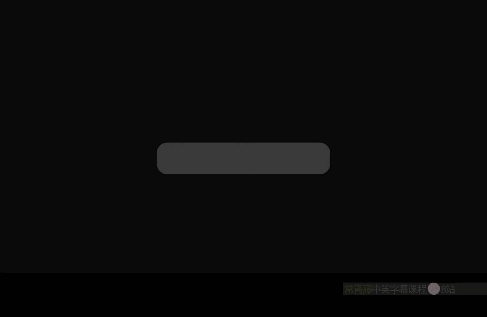
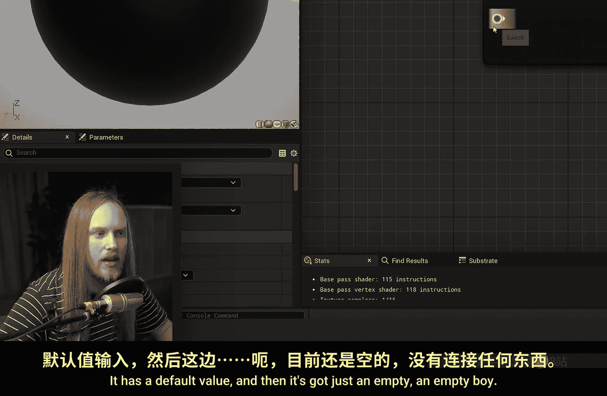
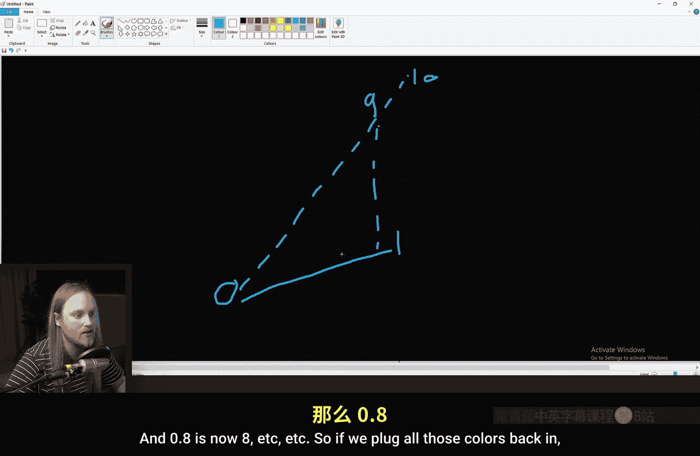
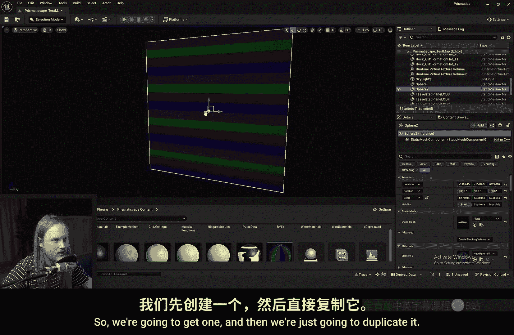
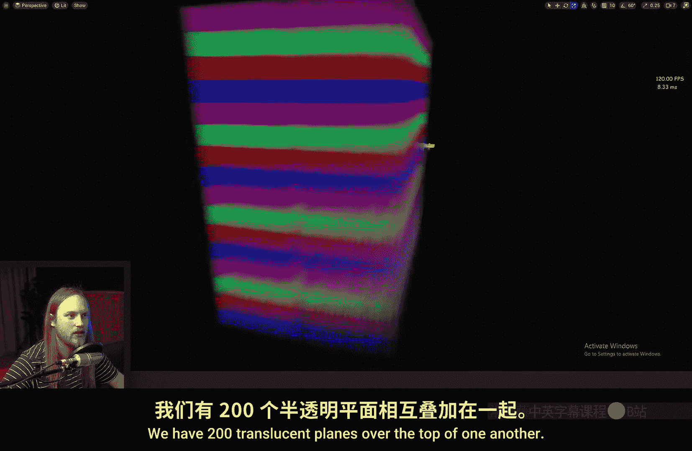
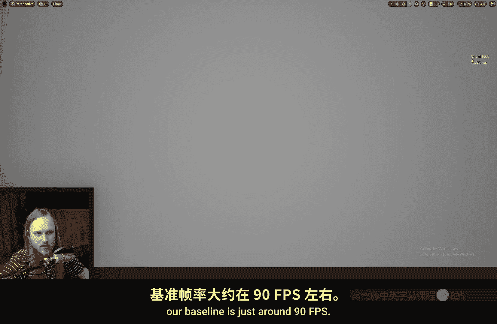
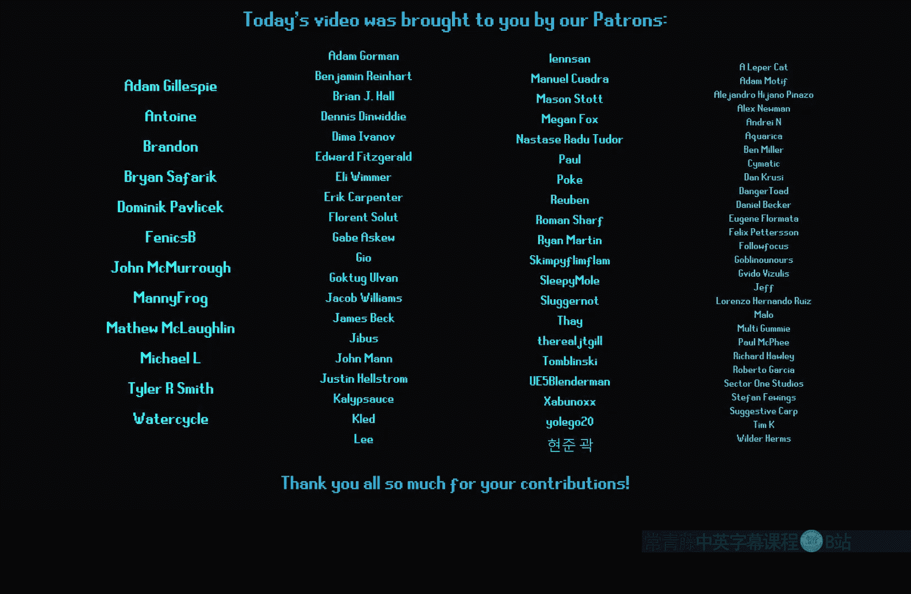

# 037：切换节点 🎛️

在本节课中，我们将学习虚幻引擎材质编辑器中的一个实用节点——**切换节点**。我们将了解它的功能、工作原理、与静态开关节点的区别，并通过实际案例展示其应用。

## 概述

切换节点允许你根据一个输入值，从多个选项中选择一个输出。它类似于编程中的 `switch` 语句，但运行在着色器中。本节将详细介绍其设置、使用场景和性能考量。

## 节点功能解析

上一节我们概述了课程内容，本节中我们来看看切换节点的具体功能。

在材质编辑器中搜索“Switch”，可以找到这个节点。它与“Static Switch”节点不同。切换节点有一个“Switch Value”输入、一个“Default”输入以及一系列可添加的输入引脚。

以下是该节点的核心组成部分：
*   **Switch Value**：一个浮点值输入，用于决定选择哪个分支。
*   **Default**：当 `Switch Value` 超出有效范围时的默认输出。
*   **可添加的输入引脚**：你可以点击节点上的“添加输入”按钮来创建多个选项，并可以为每个引脚命名。

如果将所有输入引脚留空并连接到 `Base Color`，材质会报错，因为每个输入都必须有值。为每个输入引脚赋予不同的颜色后，当 `Switch Value` 为0时，输出 `Default` 值；当值变为1时，输出切换到第一个输入的颜色；值为2时，切换到第二个输入，以此类推。如果输入值（如负数）超出定义的范围，节点将输出 `Default` 值。

## 与静态开关的区别

了解了基本功能后，我们需要区分它与静态开关节点的关键差异。

切换节点执行的是**三元操作**，并非真正的分支切换。静态开关节点只能在材质实例中更改，并且更改时会触发着色器重新编译，因此无法在运行时动态切换。它常用于主材质中，用于启用或禁用某些功能（例如是否使用细节纹理）。

相比之下，切换节点在值改变时**不会重新编译着色器**。所有输入分支的代码都会在GPU上执行，无论当前选择的是哪一个。GPU通常更擅长并行计算所有分支，而不是进行条件判断和分支跳转。因此，对于需要在运行时动态变化的值，使用切换节点通常是更合适的选择。如果输入值是静态的，编译器可能会优化掉未使用的分支。

## 实际应用案例

理解了理论区别后，本节我们来看看切换节点在实际项目中的两个应用。

### 案例一：简化UV分区材质函数

在我的一个项目中，为了减少绘制调用，我使用了一个将多个道具纹理合并到单一材质中的函数。旧方法使用了复杂的数学计算和 `Lerp` 节点链来实现UV分区。

这个复杂的设置可以用一个切换节点大大简化：
1.  获取纹理坐标的R通道（水平方向）。
2.  将其乘以你需要的分段数量（例如10）。
3.  将结果连接到切换节点的 `Switch Value`。
4.  将不同的颜色或纹理连接到切换节点的各个输入引脚。

**原理**：UV坐标范围通常是0到1。乘以10后，范围变为0到10。切换节点会取输入值的整数部分（例如，0.9*10=9，取整后为9），从而根据水平位置选择对应的颜色段。若要创建网格效果，可以再添加一个垂直方向的切换节点进行组合。

### 案例二：动态切换纹理

另一个用途是动态切换纹理，例如在卡通风格的角色面部表情切换中。你可以将高兴、悲伤等不同表情的纹理全部连接到切换节点，然后通过一个可动态修改的参数（连接到 `Switch Value`）来控制当前显示哪个表情，而无需将它们打包成巨大的纹理图集或使用复杂的动画逻辑。

## 性能测试与总结

最后，我们来对切换节点和旧方法进行一个简单的性能对比测试。

测试条件：创建200个重叠的半透明平面，运行相同的像素着色器。使用不同的材质配置观察帧率。
*   **基线（纯色）**：约90 FPS。
*   **使用单张纹理**：约80 FPS。
*   **使用切换节点（16个输入）**：约88-89 FPS。
*   **使用旧的UV图集函数**：约87 FPS。

测试表明，在这个特定场景下，切换节点的性能略优于旧的复杂函数方法。从着色器指令数来看，旧函数为179条指令，切换节点为186条指令。虽然指令数稍高，但实际帧率表现更好，这体现了GPU执行特性的影响。

本节课中我们一起学习了虚幻引擎材质编辑器中的切换节点。我们掌握了它的使用方法，明确了它与静态开关的关键区别，并探讨了它在简化材质函数和动态纹理切换中的实际应用。性能测试表明，在需要运行时动态选择的场景中，它是一个高效且简洁的选择。希望这个节点能为你的材质创作打开新的思路。