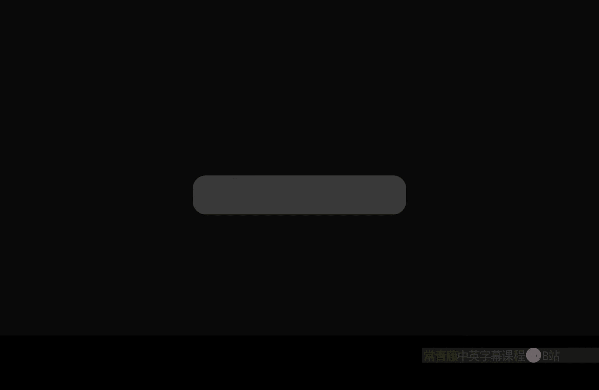
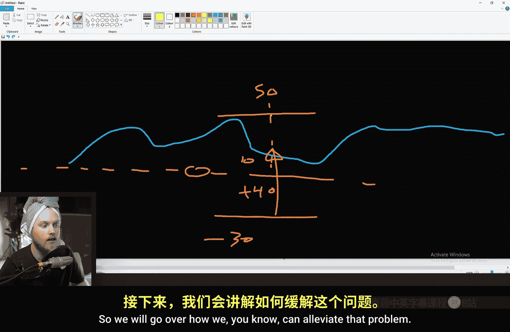
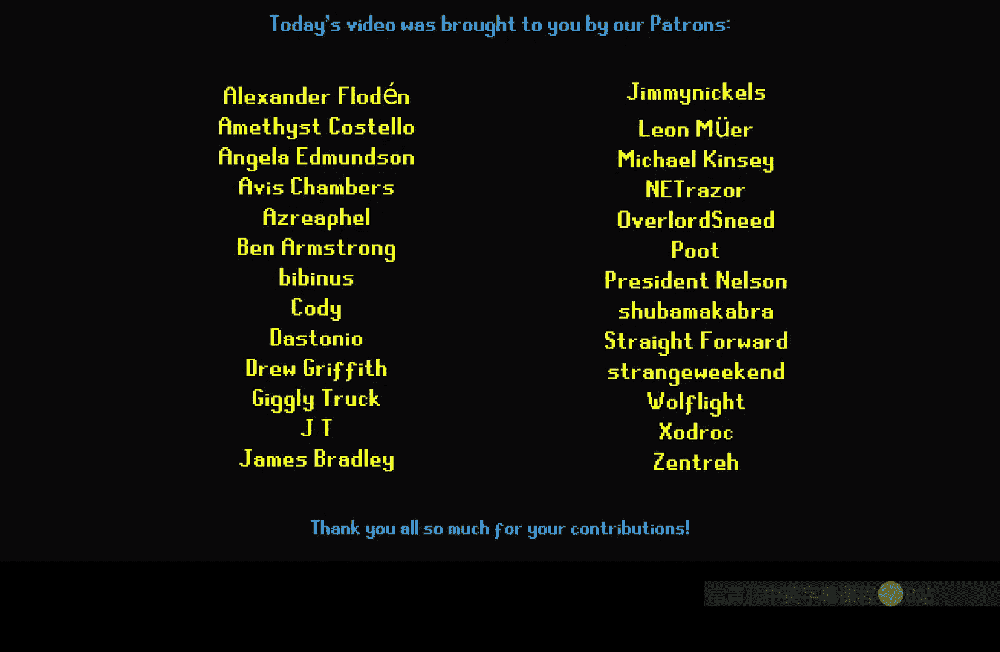
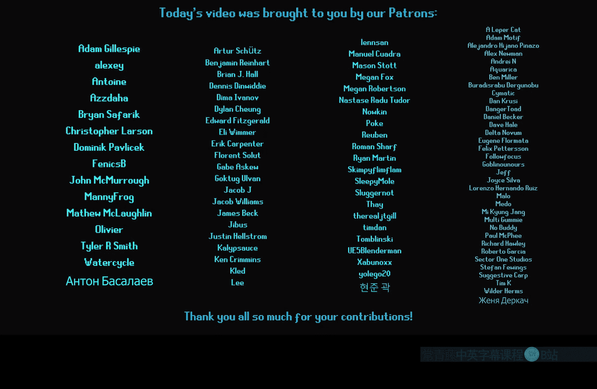

# 038：环境艺术必备技巧 - WPO贴纸

在本节课中，我们将学习一种称为“WPO贴纸”的技术。这项技术利用世界位置偏移与运行时虚拟纹理高度图或距离场相结合，解决植被、地毯等物体在复杂地形上漂浮或不贴合的问题，使其能够自然地“粘附”在场景表面上。

## 理论原理

上一节我们介绍了WPO贴纸的目标，本节中我们来看看其背后的核心工作原理。

该技术的核心思想是：获取场景表面的高度信息，然后调整物体顶点的世界位置，使其与表面贴合。

*   **运行时虚拟纹理高度图**：这是一张记录了场景表面在每个XY坐标点上Z轴高度值的纹理。
*   **世界位置偏移**：在材质中，我们可以获取模型每个顶点的世界坐标。
*   **计算与贴合**：用顶点自身的世界高度减去从高度图中采样得到的表面高度，得到一个差值。将这个差值（通常为负值）应用到顶点的世界位置偏移上，顶点就会向下移动，从而“贴合”到场景表面。

**核心公式**可以简化为：
`最终顶点高度 = 顶点原始世界高度 - 表面采样高度`

如果顶点高于表面，差值为正，WPO会将其向下移动；如果顶点低于表面（例如在凹陷处），差值为负，WPO会将其向上移动，最终结果是物体“包裹”在表面。

## 基础实现：使用RVT高度图

理解了原理后，我们开始动手实现。首先，我们学习如何使用运行时虚拟纹理高度图来实现贴合效果。

首先，需要将场景地形和静态网格体的高度信息渲染到一张运行时虚拟纹理中，作为我们的高度图。

在需要贴合的物体材质中，进行以下操作：
1.  使用 **Runtime Virtual Texture Sample** 节点采样之前创建的高度图。
2.  使用 **World Position** 节点获取顶点的世界空间坐标。
3.  使用 **Component Mask** 节点分离出世界位置的Z分量（高度）。
4.  将采样得到的高度值减去顶点自身的高度值。
5.  使用 **Make Float3** 节点创建一个三维向量，将上一步的差值赋予Z分量，X和Y分量设为0。
6.  将此向量输出到材质的 **World Position Offset** 引脚。

完成以上步骤后，物体会完全贴合到高度图定义的表面，但原有的模型几何形状可能会丢失，变得完全平坦。

## 保留模型细节

上一节我们实现了基础贴合，但模型变平了。本节中我们来看看如何保留模型自身的几何细节。

为了解决模型变平的问题，我们需要修改参考基准。不再将每个顶点与表面高度比较，而是将模型的轴心点与表面高度比较。

具体操作是：
1.  获取模型的世界位置（这代表其轴心点的位置）。
2.  使用 **Component Mask** 提取其Z分量（轴心点高度）。
3.  用高度图采样值减去这个轴心点高度，得到一个全局的“下沉”量。
4.  将这个下沉量应用到所有顶点的WPO上。

这样，整个模型会作为一个整体上下移动，模型自身起伏、褶皱等几何形状得以完整保留。**核心思路**从“每个顶点独立贴合”变为“整个模型整体沉降”。

## 应用示例：树叶与地毯

现在我们已经掌握了核心技术，本节中我们来看看如何将其应用到具体的环境元素上，比如树叶和地毯。

以下是针对不同物体的应用要点：

*   **对于树叶、草丛等散布物**：使用“整体沉降”方法。在植被绘制工具中，**禁用“对齐法线”**选项，让植被实例保持水平放置，然后由WPO材质负责将其贴合到地形。这样能有效避免树叶漂浮在空中。
*   **对于地毯、布料等单一网格体**：同样使用“整体沉降”方法。这可以让布料自然地覆盖在台阶、石块等不规则表面上。对于陡峭的斜坡，可能会出现拉伸，需谨慎放置。
*   **添加细节**：为了增加自然感，可以在WPO计算后添加一些世界空间噪声。例如，对地毯应用缓和的噪声，模拟微小的起伏褶皱。

## 注意事项与局限

任何技术都有其边界，本节中我们来看看使用WPO贴纸技术时需要注意的一些问题和限制。

使用此技术时，需要注意以下几点：

1.  **碰撞体失效**：WPO仅改变渲染位置，不改变物理碰撞体的位置。对于使用此技术的物体，通常需要移除或简化其碰撞。
2.  **距离场阴影错误**：距离场阴影基于原始网格位置计算，会导致阴影与WPO变形后的视觉位置不匹配。建议为这类材质禁用距离场阴影。
3.  **法线信息不更新**：WPO不会自动修正顶点法线。这意味着即使模型贴合了表面，其光照反射方向可能仍是错误的，这会影响视觉效果。
4.  **性能考量**：复杂的WPO计算会增加GPU负担，尤其是对大量植被实例使用时需进行性能测试。

## 进阶应用：使用距离场

RVT高度图主要处理垂直方向的贴合。本节中我们来看看如何利用距离场实现物体在任意方向（如侧面、底面）的贴合，例如让藤蔓附着在悬崖上。

距离场提供了到最近物体表面的有符号距离信息。我们可以利用它让物体向附近表面“收缩”。

基础步骤如下：
1.  使用 **Distance to Nearest Surface** 节点获取距离值。
2.  使用 **Distance Field Gradient** 节点获取距离场在当前位置的法线方向（指向空区域）。
3.  将距离值乘以-1，再乘以距离场法线，得到一个将顶点推向最近表面的偏移向量。
4.  可以对此偏移进行归一化或缩放处理，并添加一个基础偏移量，使物体恰好贴合在表面之外，而不是嵌入内部。
5.  将此三维偏移向量输出到 **World Position Offset**。

**核心代码逻辑**：
`WPO偏移向量 = -1 * (到最近表面的距离) * (距离场梯度方向) + 基础偏移`

这种方法同样不修正阴影和碰撞，且对网格比例敏感，使用更小、更分散的网格会得到更好的效果。

## 创意技巧：树木与碎片

技术可以激发创意。本节中我们分享一个利用此技术实现的创意效果：树木倒塌后，树叶“溅落”并贴合地面的效果。

我们可以扩展WPO贴纸逻辑，实现“单向贴合”：仅当物体部分低于地面时才将其上推，而高于地面的部分保持原样。

实现方法是：在计算出的高度差之后，使用一个 **Max** 节点将正值钳制为0。即：`贴合偏移 = Max(表面高度 - 物体高度， 0)`。这样，只有低于地面的顶点会被抬高至地面，而高于地面的部分（如树冠）不受影响。

利用这个原理，甚至可以快速创建地面碎片：将一棵树模型倒置，其枝叶就会以自然散落的状态“贴合”在地面上，形成廉价而有效的地面覆盖物。

## 总结

本节课中我们一起学习了“WPO贴纸”这项环境艺术技巧。

我们首先探讨了其核心理论：利用表面高度信息驱动世界位置偏移。然后，我们逐步实现了基于运行时虚拟纹理高度图的贴合方法，并学会了如何保留模型原有几何细节。我们将其应用于树叶和地毯，并指出了技术存在的局限，如碰撞和阴影问题。接着，我们学习了使用距离场进行多方向贴合的进阶方法。最后，我们探索了一个创意应用，展示了如何制作树木倒塌后树叶飞溅的效果。

这项技术是提升场景细节和真实感的强大工具，能够让你的植被、布料、碎片等环境元素与场景互动得更加自然。请记住根据实际需求权衡其效果与性能开销。