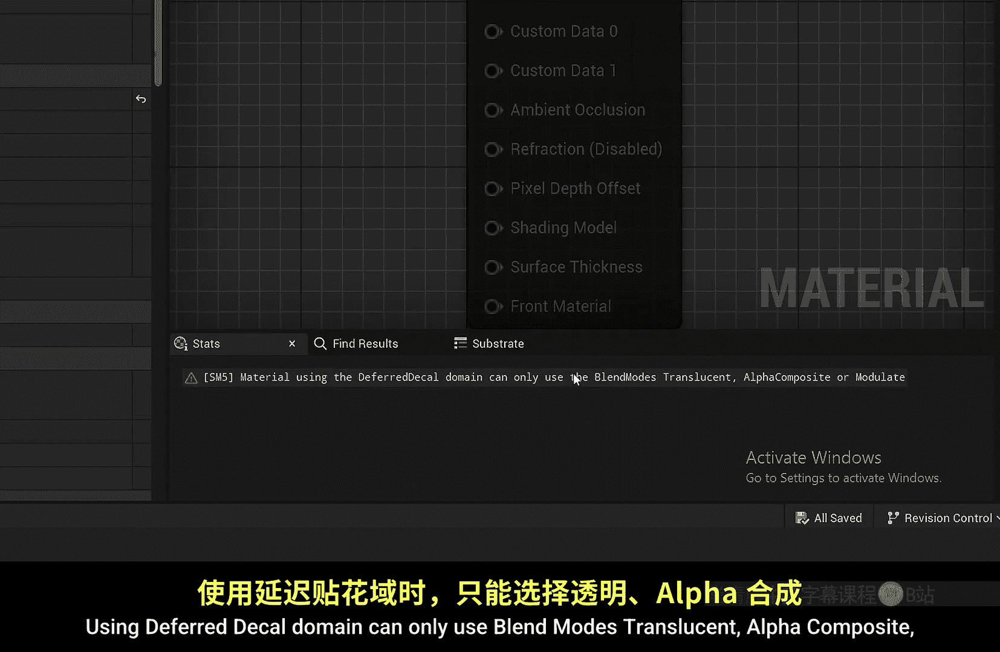
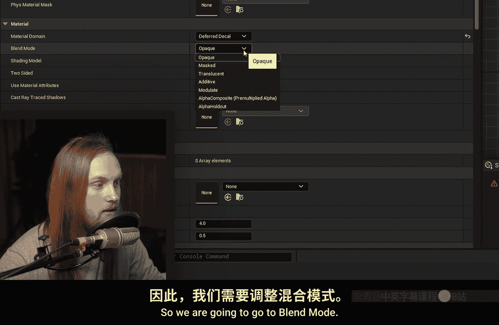
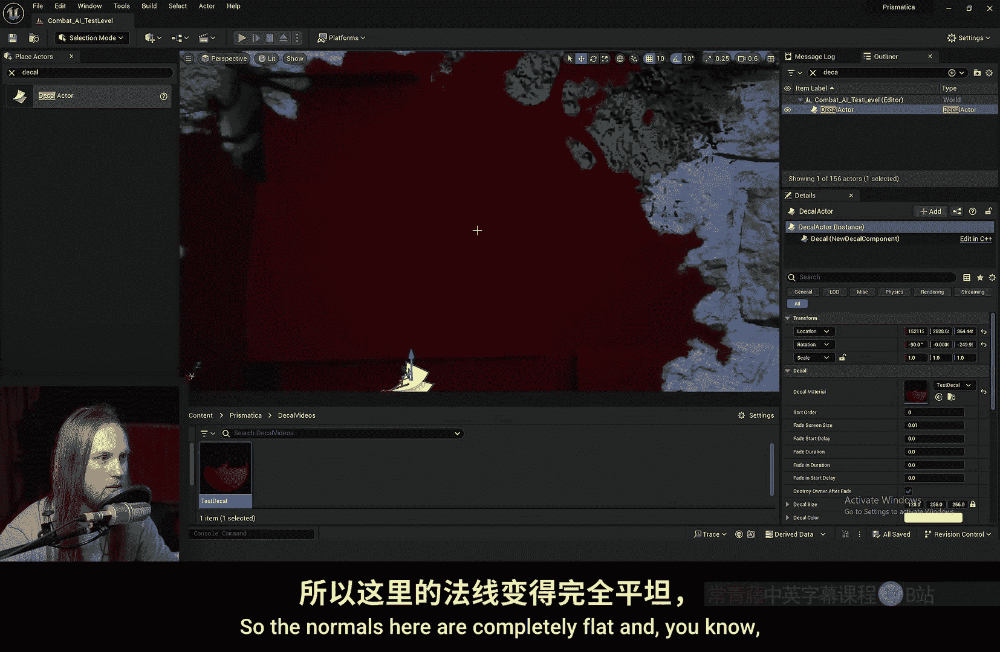
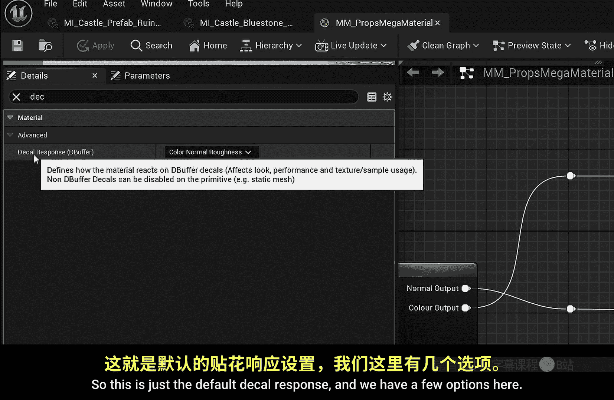
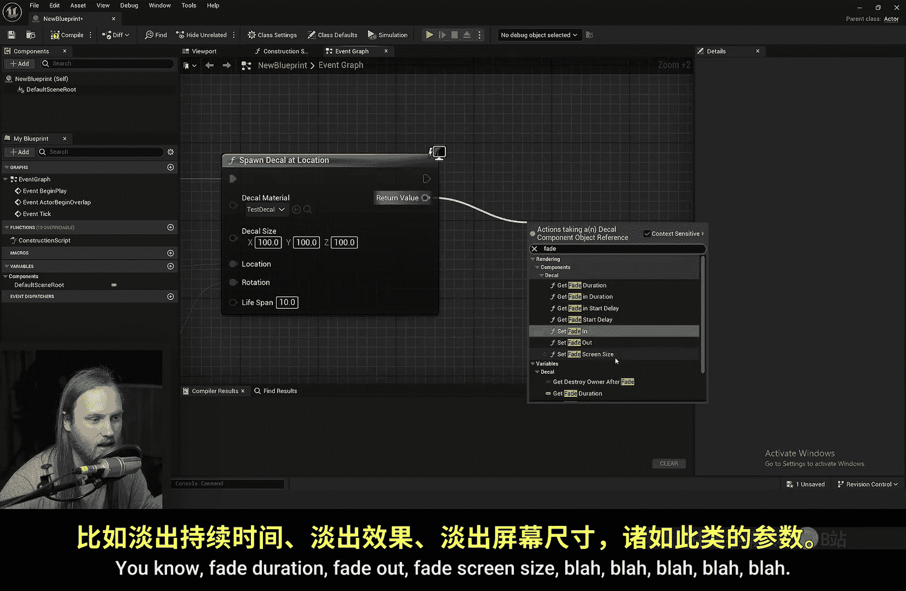
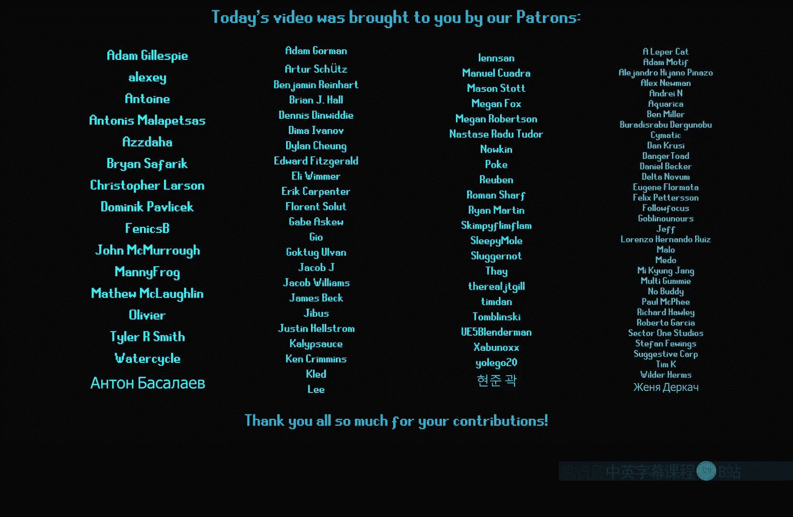

# 039：贴花入门 🎨

在本节课中，我们将学习虚幻引擎5中的贴花系统。我们将了解如何放置贴花、如何创建自定义贴花材质、相关的选项与优化，以及使用贴花的优缺点和替代方案。

## 放置贴花Actor

首先，我们需要获取一个贴花Actor。贴花Actor是一个包含贴花组件的Actor。你也可以将贴花组件用于自定义Actor中。

初始放置的贴花看起来会非常奇怪，因为它默认朝上，导致图像被拉伸。我们需要旋转它，使其面向正确的表面。旋转后，贴花会投射到场景中所有设置为接收贴花的网格体上。





目前，这个贴花只是将所有表面染成暗绿色，作用不大。我们需要创建一个自定义材质来赋予它实际效果。

## 创建贴花材质

要创建贴花材质，首先右键点击并选择创建材质。双击打开材质后，需要将其转换为贴花材质。

转换方法如下：在材质细节面板中，找到 **`Material Domain`** 选项，将其从默认的 **`Surface`** 改为 **`Deferred Decal`**。

此时可能会立即看到一个错误提示：“使用延迟贴花域只能使用混合模式：半透明、Alpha合成或调制”。因此，我们需要将 **`Blend Mode`** 改为 **`Translucent`**。更改后，所有材质输出引脚都会恢复。

我们可以进行简单测试，例如将一个红色常量连接到 **`Base Color`** 引脚，保存材质。然后，选中场景中的贴花Actor，将我们创建的材质拖拽到其 **`Decal Material`** 槽位中。此时，贴花覆盖的区域会变成红色。



## 使用纹理与遮罩

仅使用纯色依然不够实用。通常我们需要使用带有Alpha通道的纹理来遮罩出特定形状。

例如，我们可以使用一张爆炸或血迹纹理。将这张纹理的Alpha（或Opacity）通道连接到材质的 **`Opacity`** 引脚，贴花就会根据纹理的透明度与底层表面进行混合。

为了使边缘过渡更自然，可以使用高度混合技术。以下是实现此效果的一种方法：

1.  创建一个标量参数，命名为 **`Opacity`**。
2.  将纹理的Alpha值减去1。
3.  将过渡值（例如一个参数）乘以2。
4.  将步骤2和步骤3的结果相加。
5.  使用 **`CheapContrast`** 节点增加对比度，例如设置为5。
6.  将最终结果输出到 **`Opacity`** 引脚。

这样就能得到一个边缘清晰的飞溅效果。这个设置在后面实现贴花自动淡入淡出时也会用到。

## 贴花的其他材质输出

除了基础颜色，贴花还可以影响表面的其他属性。以下是可用的输出通道：

*   **法线**：可以覆盖底层表面的法线信息。例如，输入 `(0, 0, 1)` 会使表面法线完全朝外，看起来是平的。
*   **高光度**：控制表面的镜面反射强度。
*   **粗糙度**：控制表面的粗糙程度。值越低，表面越光滑。
*   **金属度**：控制表面的金属感。

例如，我们可以将粗糙度设为0（非常光滑），金属度设为1（完全金属），并调整高光度，让“血迹”产生独特的反光效果，与墙壁本身的材质区分开。

贴花也可以只影响某些属性。例如，如果我们只想让墙壁看起来潮湿，可以断开 **`Base Color`** 的连接，只修改 **`Roughness`** 和 **`Specular`**，这样墙壁颜色不变，但反光特性改变了。

贴花在添加涂鸦、污渍、环境细节等方面非常强大，因为它们无需修改底层材质本身。

## 贴花的性能与设置

贴花有一个显著的缺点：屏幕上显示的**每一个贴花都会产生一个独立的绘制调用**。绘制调用过多会严重影响性能。

贴花Actor/组件提供了一些控制选项：

*   **排序**：控制多个贴花之间的叠加顺序。
*   **淡出屏幕尺寸**：当贴花在屏幕上小于一定尺寸时开始淡出。
*   **淡出开始延迟/持续时间**：控制淡出开始的时间和过程时长。
*   **淡入持续时间/开始延迟**：控制淡入过程。
*   **淡出后销毁所有者**：淡出完成后自动销毁Actor。

其中，**`Decal Lifetime Opacity`** 节点非常重要。在材质中，将计算好的不透明度与 **`Decal Lifetime Opacity`** 节点相乘，再输出到 **`Opacity`** 引脚。这样，贴花就会根据在组件上设置的淡入淡出时间自动控制显示，并在结束后自动销毁。这对于子弹孔等需要临时存在的效果非常方便。

## 贴花颜色节点与数据传递



**`Decal Color`** 节点类似于粒子系统中的动态参数节点。它允许从外部（如Niagara粒子系统）向贴花材质传递自定义数据。

例如，在Niagara中生成贴花时，可以使用 **`Decal Color`** 的R、G、B、A通道来传递任意值，比如火焰余烬的发光强度或自定义的不透明度。**`Decal Lifetime Opacity`** 在Niagara贴花中通常仍然有效。

## 控制贴花的接收

有时我们需要防止贴花出现在某些物体上。控制贴花接收有两种主要方式：

1.  **在网格体上设置**：选中场景中的静态网格体Actor，在细节面板中取消勾选 **`Receives Decals`**，该网格体将完全不会接收任何贴花。
2.  **在材质上设置**：打开网格体所使用的材质，在细节面板中搜索“Decal”。找到 **`Decal Response`** 选项，可以设置为：
    *   **`None`**：完全不接收贴花。
    *   **`Color Normal Roughness`**：默认，接收颜色、法线和粗糙度。
    *   **`Color Only`**：只接收颜色，不影响其他属性。
    *   **`Color Normal`**：只接收颜色和法线。
    *   等等。

## 贴花投影与替代方案

贴花是**穿透性投影**。贴花组件的方框范围决定了投影区域，它会穿透该范围内的所有表面。因此，为了避免贴花投射到不该出现的背面物体上，需要将贴花组件的**厚度调得非常薄**，使其紧贴在目标表面。

人物角色通常应该设置为不接收贴花，否则角色走到带贴花的墙边时，脸上也会出现贴花，移开后又突然消失，显得很不自然。

考虑到性能（绘制调用）和控制灵活性，贴花有以下常见替代方案：

*   **顶点绘制**：在材质中预定义多种效果（如苔藓、破损），通过绘制到网格体顶点颜色（RGBA通道）来混合这些效果。
    *   **优点**：无额外绘制调用，性能好。
    *   **缺点**：效果必须在材质内预定义，数量受顶点颜色通道数限制；细节精度受网格体顶点密度限制。
*   **贴花的优势**：
    *   **像素级精度**：即使网格体面数很低，贴花也能提供高精度细节。
    *   **运行时生成**：无需预配置，可以轻松在运行时（如通过射线检测命中点）动态生成，非常灵活。

以下是一个在蓝图中运行时生成贴花的简单示例思路：

```蓝图
进行射线检测 -> 获取命中位置和法线 -> 在命中点生成贴花Actor -> 设置其材质、大小、朝向（通常使用命中法线）-> 设置生命周期。
```

## 总结



本节课我们一起学习了虚幻引擎5中贴花系统的基础知识。

我们了解到，贴花是一种非常灵活的工具，可以轻松地在运行时大量生成，用于修改物体表面的颜色、法线、粗糙度等属性。通过贴花组件，可以方便地管理其淡入淡出和自动销毁。材质中的 **`Decal Color`** 和 **`Decal Lifetime Opacity`** 节点提供了与外部系统（如Niagara）交互的接口。

同时，我们也认识到贴花的主要缺点是每个实例都会增加一个绘制调用，需要注意性能优化。可以通过网格体或材质设置来控制哪些表面接收贴花，并小心调整投影范围以避免穿帮。




对于需要高性能或复杂混合的静态场景细节，顶点绘制是很好的替代方案；而对于需要动态生成、高精度细节的临时效果，贴花则是更合适的选择。