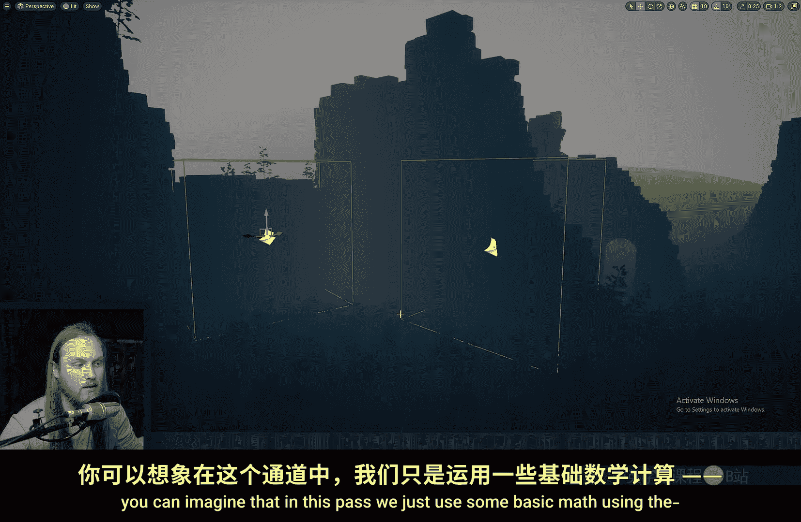
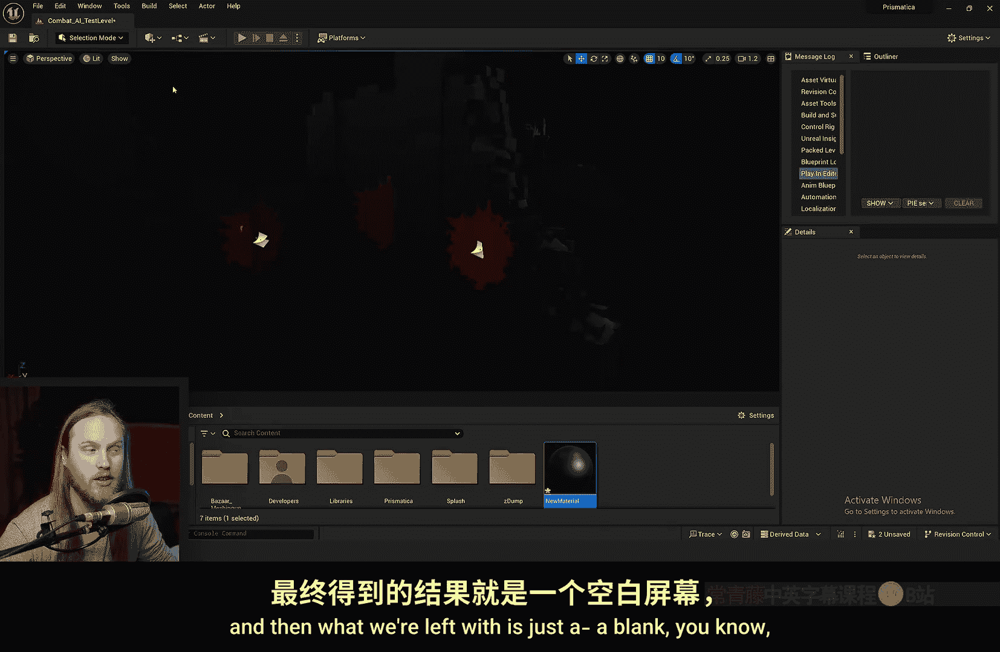
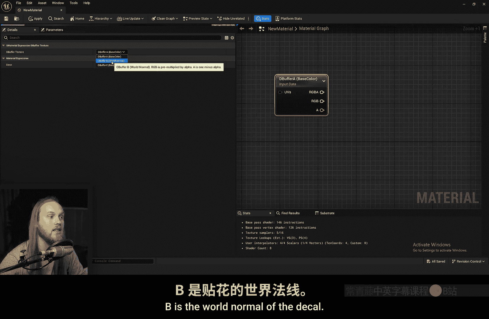
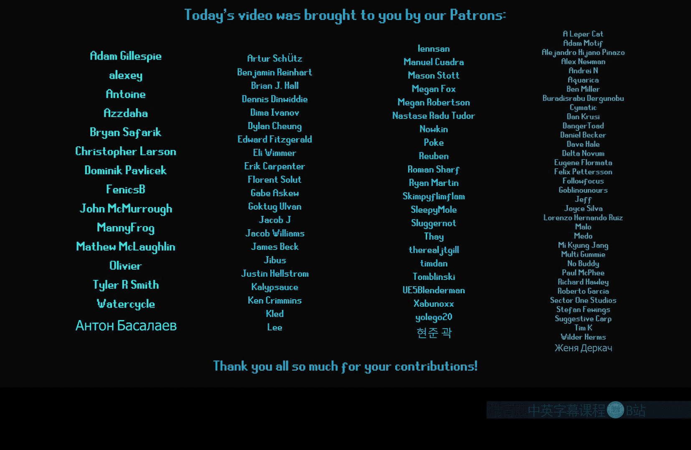

# 040：D-缓冲贴花深度解析 🎨






在本节课中，我们将深入探讨虚幻引擎中的D-缓冲贴花技术。这是一种强大的工具，它允许材质直接读取贴花数据，从而实现基于像素级别的复杂效果混合，例如程序化损伤、污渍等，其精度远超传统的顶点绘制。

---

## 贴花基础：深度缓冲与屏幕空间

上一节我们介绍了贴花的基本概念，本节中我们来看看D-缓冲贴花的工作原理。理解其核心，需要从深度缓冲开始。

深度缓冲本质上记录了场景中每个像素到摄像机的距离信息。


当我们在场景中放置一个贴花边界框时，引擎会利用摄像机在世界空间中的位置、边界框的位置和缩放信息，通过基础数学计算，在屏幕空间生成一个仅显示贴花细节的缓冲区。




随后，场景中的材质会读取这个屏幕空间缓冲区。


这样，材质上就呈现出了贴花效果。关键在于，材质本身并不知晓单个贴花的存在，它只是从一个全局的通道中读取信息。

D-缓冲贴花的主要优势在于，我们可以在**所有**材质中访问这个缓冲区。

---

## 核心应用：在材质中驱动效果 🔧

现在，让我们看看如何在材质中实际应用D-缓冲数据。

在材质图表中，我们可以添加一个 **`D Buffer Texture`** 节点。通过选择不同的通道（A、B、C），我们可以获取贴花的不同信息：
*   **A通道**：贴花的基础颜色。
*   **B通道**：贴花的**世界空间法线**。
*   **C通道**：包含粗糙度（R）、金属度（G）、高光度（B）。

例如，我们可以将A通道的Alpha值用于线性插值（Lerp），在材质原始纹理和贴花带来的颜色（比如蓝色）之间进行混合，并将结果输出到基础颜色。

```cpp
// 概念性伪代码：使用D缓冲Alpha进行混合
FinalColor = Lerp(OriginalTexture, DecalColor, DBufferA.a);
```

编译后，最初效果看起来和普通贴花一样。但如果我们进入材质实例，将 **`Decal Response`** 设置为 **`None`**，就会关闭引擎默认的贴花处理方式。此时，贴花效果完全由我们在材质图表中利用D缓冲数据自定义驱动。

这意味着我们可以用贴花来驱动程序化的损伤效果，这类似于顶点绘制的功能，但不受网格顶点密度的限制，几乎达到了像素级别的精度。

---

## 实战案例：建筑表面损伤效果 🏚️

让我们通过一个房屋部件的例子来实践。假设表面有三种材质：油漆木饰、原木和石膏灰泥。

我们的目标是为不同部分设置不同的损伤效果。以下是实现步骤：

1.  **设置材质混合**：为每个部分（石膏、原木）创建不同的纹理混合。例如，石膏可以混合成石墙纹理，原木可以混合成苔藓纹理。这通常使用 **`Lerp`** 节点完成，混合因子由我们后续控制。
2.  **引入D缓冲控制**：添加 **`D Buffer Texture`** 节点。在本例中，我们计划使用C通道的**粗糙度（R）** 作为驱动混合的数据通道。
3.  **实现高度混合**：为了获得更自然、基于表面凹凸的混合效果（例如污渍先渗入砖缝），我们使用**高度混合**技术。
    *   获取材质的高度图纹理，并对其减1：`HeightTexture - 1`
    *   获取D缓冲的Alpha值（代表贴花强度），并乘以2：`DBufferAlpha * 2`
    *   将两者相加：`(HeightTexture - 1) + (DBufferAlpha * 2)`
    *   使用 **`Contrast`** 节点增强对比度，得到最终的混合蒙版。
4.  **驱动混合**：用上一步计算出的高度混合蒙版，去驱动步骤1中为各个部分设置的 **`Lerp`** 节点。

完成材质设置后，将贴花Actor的 **`Decal Response`** 设为 **`None`**，并在贴花材质中，将其**粗糙度**通道输出设置为一个渐变遮罩（如球形渐变）。现在，贴花所到之处，石膏会变为石墙，原木会露出木质并附着苔藓，且混合效果精准地遵循表面的高度细节。

---

## 高级技巧与问题解决 ⚙️

在深入使用D-缓冲贴花时，你可能会遇到一些特定情况，以下是相应的解决方案。

### 1. 与高度图结合实现智能混合
即使使用贴花默认的输出方式，也可以结合高度图。在接收材质中，读取D缓冲的Alpha，与材质自身的高度图进行高度混合计算，然后用这个结果去插值材质原色和D缓冲的基础色。这样，贴花（如血迹）会优先填充砖缝等凹陷处，与场景融合得更自然。

### 2. 处理颜色预乘产生的暗边
当使用D缓冲颜色进行混合时，贴花边缘可能会出现不自然的暗色晕圈。这是因为RGB通道已被Alpha预乘。解决方法是对颜色进行“反预乘”：
```cpp
// 反预乘计算
InvertedAlpha = 1 - DBufferAlpha;
UnmultipliedColor = DBufferColor / InvertedAlpha;
UnmultipliedColor = Saturate(UnmultipliedColor); // 防止除零错误
```
使用反预乘后的颜色进行后续混合，即可消除暗边。

### 3. 正确处理法线
法线处理较为复杂，主要有两种方式：
*   **模拟默认贴花效果**：在材质中，将D缓冲B通道（世界法线）通过 **`Transform`** 节点从世界空间转换到切线空间。
    ```cpp
    Transform(WorldSpace, TangentSpace, DBufferB.rgb)
    ```
*   **使用切线空间法线**：在贴花材质中关闭 **`Tangent Space Normal`** 选项。此时，贴花输出的法线已经是接收表面的切线空间法线，无需转换。这种方式特别适合跨多个不同朝向表面放置的贴花，能保证法线一致性。但注意，你需要在所有接收材质中手动实现此法线混合逻辑。

**注意**：这两种法线处理方式只能选择一种，且如果材质使用了默认的 `Decal Response`，而贴花是切线空间法线，则会出现错误。

### 4. 利用辅助通道定义混合类型
我们可以将C通道的粗糙度和高光通道用作纯数据通道，来定义不同的混合风格。
1.  创建两种贴花材质：一种在粗糙度通道输出1，高光通道输出0；另一种相反。
2.  在接收材质中，分别读取D缓冲C通道的R（粗糙度）和B（高光）。
3.  用这两个数据通道分别驱动两套不同的混合逻辑（例如，一套是高度混合，另一套是柔和渐变混合）。
4.  通过调整贴花的 **`Sort Order`** 来控制它们重叠时的优先级。

这种方法允许材质根据贴花传递的数据类型（如“损伤”或“湿润”）来决定如何表现，实现了极大的灵活性。

---

## 总结 📝

本节课中我们一起学习了虚幻引擎D-缓冲贴花技术的核心原理与应用。关键点在于：
1.  D-缓冲贴花将贴花数据存入全局缓冲区，供所有材质读取。
2.  通过将材质实例的 **`Decal Response`** 设为 **`None`**，我们可以完全自定义贴花在材质上的表现。
3.  结合**高度混合**技术，可以实现基于表面几何的智能效果融合。
4.  该技术常用于实现**程序化损伤**、污渍等效果，其精度达到像素级别，突破了顶点绘制的限制。
5.  需要注意处理颜色预乘、法线转换等进阶问题，并可以巧妙利用辅助通道扩展功能。



虽然D-缓冲贴花设置稍显复杂，但它为高级贴花混合和基于像素的数据传递（如让材质智能响应通用损伤贴花）提供了强大可能，是提升场景细节表现力的重要工具。