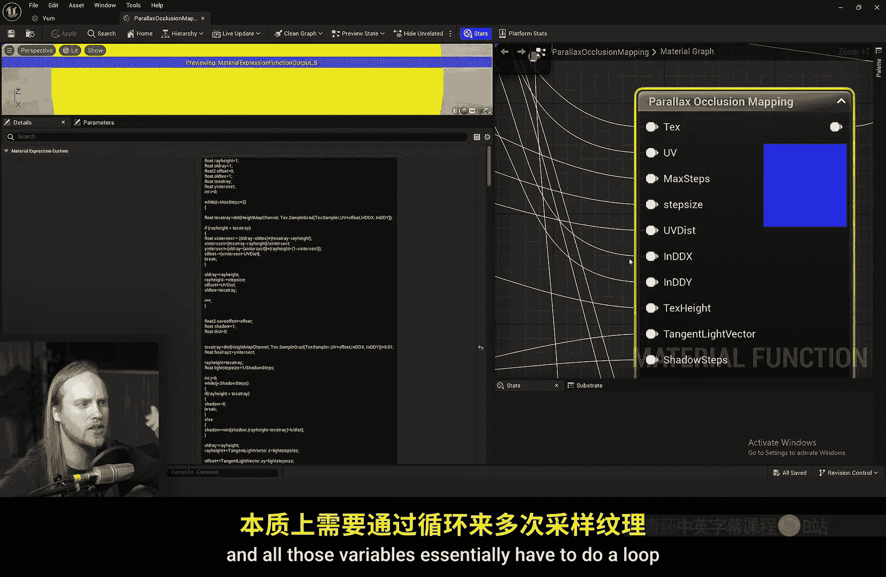
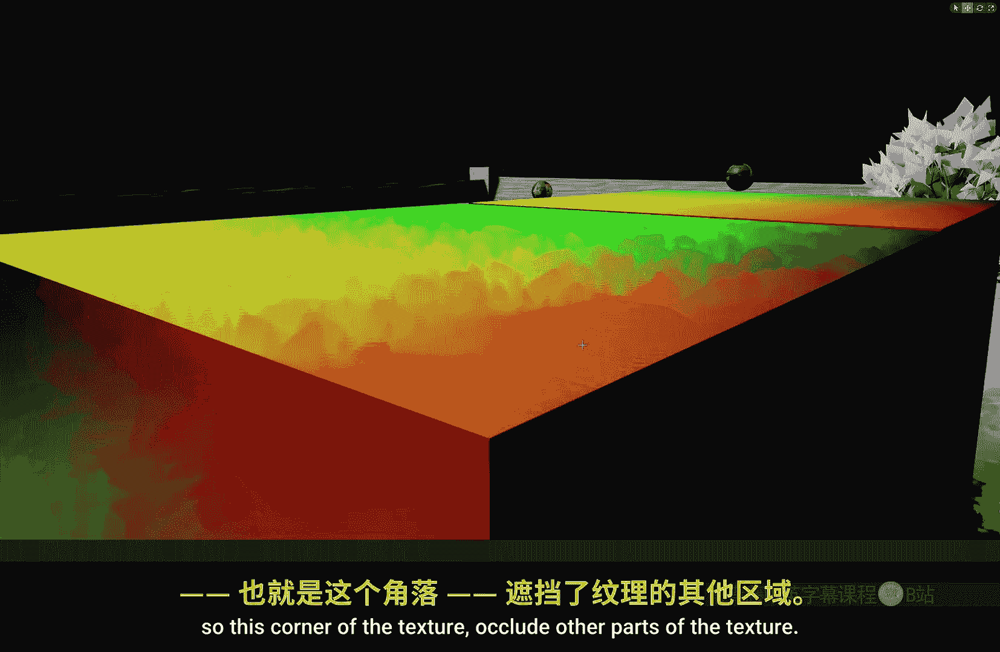
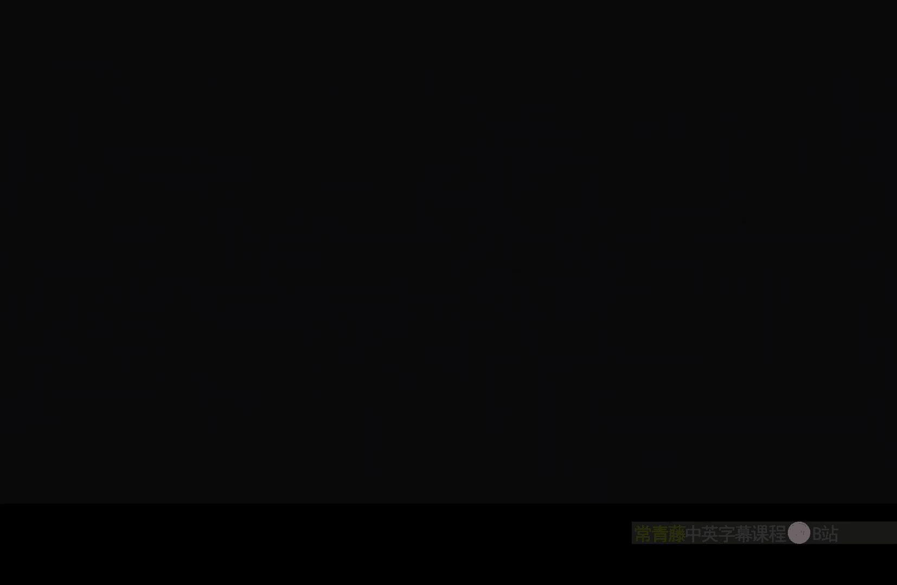

# 041：视差遮蔽映射 🧱

在本节课中，我们将学习视差遮蔽映射技术。我们将了解它的基本原理、如何在虚幻引擎中实现，并将其与更简单的凹凸偏移技术进行比较，帮助你理解何时该使用哪种方法。

## 概述

视差遮蔽映射是一种用于在平坦表面上模拟深度和体积感的高级技术。它通过根据高度图动态偏移纹理坐标，创造出比标准凹凸贴图更真实的3D视觉效果。本节我们将从基础开始，逐步构建一个使用此技术的材质。

## 从标准纹理映射开始

首先，我们创建一个新材质，命名为“POM_Material”，并将其应用到一个立方体上。在材质编辑器中，我们采样一张包含法线信息的纹理。



以下是基础的纹理采样和法线解包流程：
```cpp
// 采样基础纹理
TextureSample(Texture2D, UVs) -> BaseColor, NormalMap
// 解包法线贴图（可选，取决于纹理格式）
UnpackNormal(NormalMap) -> NormalVector
```

这是标准的纹理映射效果。虽然看起来不错，但从侧面观察时，表面缺乏真实的深度感。

## 引入凹凸偏移技术

为了解决深度问题，最经济的方法是使用“凹凸偏移”节点。它根据高度图（通常存储在纹理的Alpha通道中）和视角，对UV坐标进行简单的偏移。

以下是使用凹凸偏移的简化流程：
```cpp
// 使用凹凸偏移节点
BumpOffset(HeightMap, UVs, HeightRatio) -> OffsetUVs
// 使用偏移后的UV采样纹理
TextureSample(BaseTexture, OffsetUVs)
```

通过调整高度比例，我们可以夸大3D效果。然而，这种方法在浅角度观察时容易失真，且可调整的幅度有限。

## 升级至视差遮蔽映射

为了获得更佳、更稳定的深度效果，我们需要使用“视差遮蔽映射”。与简单的UV偏移不同，POM使用一种称为“光线步进”的技术，沿视角方向多次采样高度图，以更精确地确定表面应该出现的位置。

在虚幻引擎中，我们可以直接使用内置的“ParallaxOcclusionMapping”材质函数。其核心参数设置如下：
*   **高度图纹理**：提供深度信息的纹理。
*   **高度比例**：控制凹凸的强度。
*   **最小/最大步数**：控制光线步进的精度和性能开销。
*   **参考平面**：定义高度图的基准面（0为表面之上，1为表面之下，0.5为中间）。



我们将POM函数输出的“视差UV”连接到纹理采样节点的UV输入。这样，纹理就会根据复杂的视差计算进行采样，从而产生逼真的深度和遮挡效果。

## 高级参数与技巧

视差遮蔽映射函数提供了几个有用的输出和技巧：

**1. 参考平面的妙用**
参考平面参数不仅可以调整基准高度，还可以通过外部输入（如径向渐变或顶点色）动态控制变形。例如，将顶点色连接到参考平面，可以实现基于绘制的损伤效果。

**2. 像素深度偏移**
“像素深度偏移”输出可以连接到材质的同名输入。这会改变像素的渲染深度，让其他几何体能够正确地与POM产生的凹凸进行交叉遮挡。但请注意，这可能导致阴影异常。

**3. 处理阴影问题**
启用像素深度偏移可能导致阴影错误。一个变通方案是使用“Shadow Pass Switch”节点：在常规通道中使用POM的深度偏移，在阴影渲染通道中则使用一个固定的世界位置偏移（如将物体下移），以生成更正确的阴影。

**4. 内置软阴影**
POM函数还提供了一个“阴影”输出，它模拟了光线在凹凸表面形成的接触阴影。通常可以将其连接到环境遮蔽或自发光输入，以增强立体感。

## 性能与效果权衡

视差遮蔽映射能产生卓越的视觉效果，但性能开销远高于凹凸偏移。**最大步数**是影响性能的关键参数：步数越多，效果越精确（尤其在陡峭角度），但计算成本也越高。

对于只需要轻微深度感的表面，使用**凹凸偏移**是更高效的选择。而对于需要表现复杂、微小细节的深度和自遮挡的场景，**视差遮蔽映射**则是理想选择。此外，如果项目支持，**Nanite虚拟化几何体**或**曲面细分**能提供真正的几何轮廓变化，是另一种解决方案。

## 总结



本节课我们一起学习了视差遮蔽映射技术。我们从标准的纹理映射出发，先介绍了简单的凹凸偏移方法，然后深入讲解了更高级的视差遮蔽映射的原理与实现。我们探讨了如何在虚幻引擎中使用内置的POM函数，并了解了其各项参数和输出（如像素深度偏移和软阴影）的用途。最后，我们对比了POM与凹凸偏移在效果和性能上的差异，帮助你根据项目需求做出合适的选择。记住，在追求视觉效果的同时，务必关注性能开销，找到最佳的平衡点。