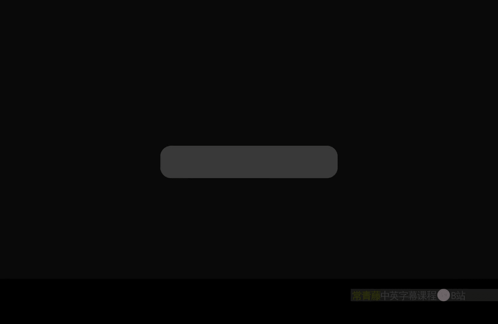
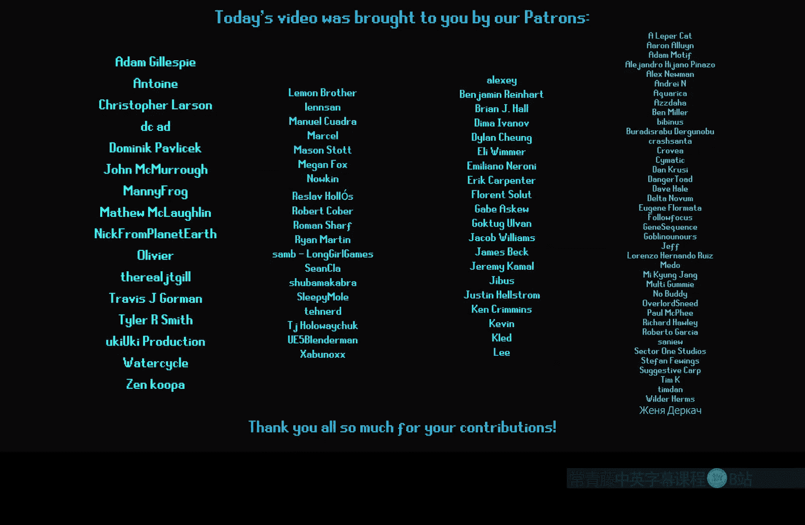
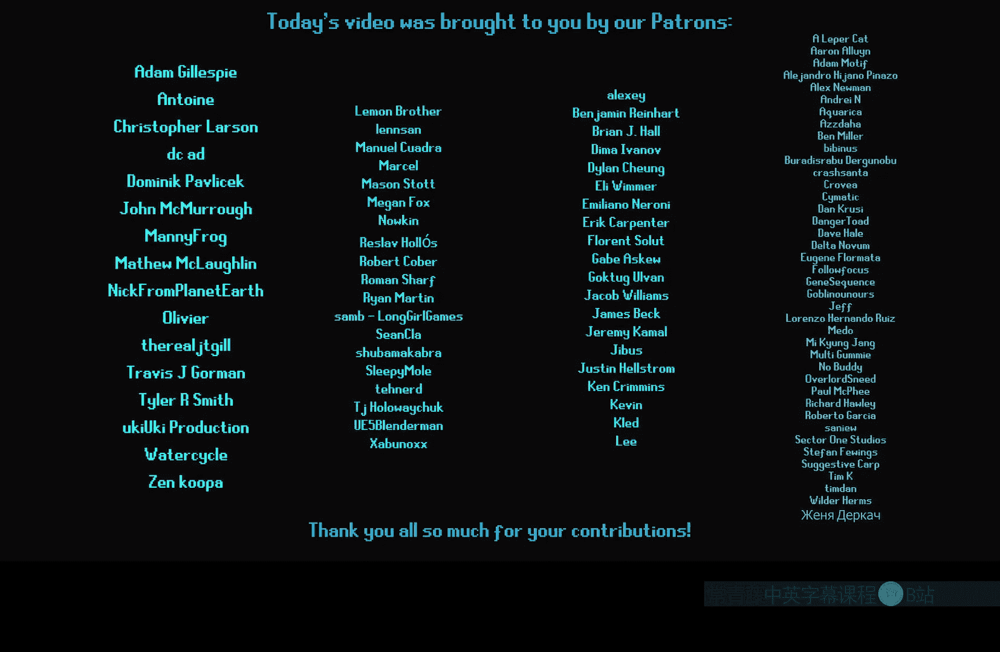

# 042：视差与凹凸贴图贴花



在本节课中，我们将学习如何在虚幻引擎的贴花材质中实现视差遮挡映射和凹凸偏移效果。这两种技术能为静态表面增添深度感，常用于制作弹孔、裂缝或传送门等效果。我们将重点解决在贴花中使用这些技术时，因空间转换问题导致的常见错误。

## 概述与问题分析

上一节我们介绍了贴花的基础知识。本节中，我们来看看如何在贴花中应用视差效果。

视差遮挡映射和凹凸偏移通常用于为平面纹理增添三维深度错觉。然而，当尝试在贴花材质中使用标准的视差函数时，会遇到一个典型问题。标准函数在切线空间下工作，而贴花输出的是世界空间法线。当贴花被旋转或放置在不同角度的表面上时，这种空间不匹配会导致视觉效果完全错误。

以下是问题表现的描述：
*   贴花在正面视角下可能看起来正常。
*   但当贴花被旋转或放置在非水平表面上时，视差效果会变得混乱且不准确。

## 解决方案：创建自定义视差函数

为了解决上述问题，我们需要创建一个自定义的视差遮挡映射函数。核心思路是转换摄像机和光源向量，使其与贴花的世界空间输出相匹配。

以下是创建自定义函数的步骤：

1.  **复制标准函数**：在内容浏览器中，找到引擎自带的“ParallaxOcclusionMapping”材质函数。将其复制到你的项目文件夹中，并重命名（例如“POM_NoSuck”）。
2.  **修改函数内部**：打开复制后的函数。我们需要修改摄像机和光源向量的输入。
3.  **转换摄像机向量**：
    *   添加一个“InverseTransformMatrix”节点。
    *   将原始的“CameraVector”输入连接到“Vector to Transform”引脚。
    *   我们需要构建一个转换矩阵。获取贴花Actor的负X向量、正Y向量和正Z向量（使用“Transform”节点，从本地空间转换到世界空间）。
    *   将这三个向量按以下顺序填入矩阵：X向量放入Z列，Y向量放入Y列，Z向量放入X列。这构成了从世界空间到贴花本地空间的逆转换矩阵。
    *   将“InverseTransformMatrix”节点的输出保存为一个重路由节点，命名为“CustomCameraVector”。
4.  **替换向量引用**：在函数内部，找到所有使用原始“CameraVector”的地方，将其替换为我们新建的“CustomCameraVector”。
5.  **（可选）转换光源向量**：如果你希望使用POM中的阴影渲染功能，需要对“LightVector”执行相同的转换操作，并在函数内替换对应的引用。
6.  **保存并使用**：保存自定义函数。在你的贴花材质中，用新的“POM_NoSuck”函数替换原来的视差遮挡映射节点。现在，贴花的视差效果在各种旋转角度下都应该能正确显示了。

**核心转换逻辑的伪代码描述**：
```
CustomCameraVector = InverseTransformMatrix(WorldToDecalLocalMatrix, CameraVector)
```
其中，`WorldToDecalLocalMatrix` 由贴花的本地轴向量构建。

## 在材质中应用与增强效果

创建好自定义函数后，我们可以在材质图中应用它。除了基础的视差，还可以通过一些技巧增强最终效果。

以下是常用的增强技巧：

*   **高度剥离蒙版**：使用视差生成的高度图，通过对比度调整后，连接到贴花材质的“Opacity”引脚。这可以使效果从边缘到中心逐渐显现，增加立体感。公式可简化为：`Opacity = Contrast(HeightMap)`。
*   **径向梯度参考面调整**：创建一个从贴花中心向外的径向梯度图。将此梯度图与视差的“Reference Plane”参数结合（例如，在默认值0.5上加上部分梯度值），可以改变深度错觉的中点。这能创造出中心下凹或凸起的效果，例如模拟一个碗状凹陷。

## 凹凸偏移贴花的实现

视差遮挡映射效果虽好，但性能开销较大。凹凸偏移是一种更廉价的替代方案，适用于需要轻微深度感的场合。

在贴花中使用标准“BumpOffset”节点同样会遇到空间问题。解决方法是使用“BumpOffsetAdvanced”节点，它允许我们手动输入向量。

以下是实现步骤：

1.  将我们之前为自定义POM函数计算的“CustomCameraVector”，连接到“BumpOffsetAdvanced”节点的“Camera Vector”输入。
2.  将贴花的UV和高度图等参数照常连接到该节点。
3.  将节点输出的偏移后UV连接到纹理采样器。
这样，我们就得到了一个能在各种角度下正常工作的、基于凹凸偏移的贴花效果。

## 总结

本节课中我们一起学习了如何在虚幻引擎贴花中修正和应用视差效果。

我们首先分析了标准视差函数在贴花中失效的原因——空间坐标系不匹配。接着，我们通过创建自定义的视差遮挡映射函数，转换摄像机和光源向量，解决了这个核心问题。我们还探讨了利用高度图控制透明度、调整参考平面来增强视觉效果的方法。最后，我们介绍了性能更优的凹凸偏移技术，并说明了其实现方式。





记住，你还可以将这些技巧与D缓冲贴花等技术结合，创造出更丰富的视觉效果。希望本教程能帮助你解决项目中的相关问题。