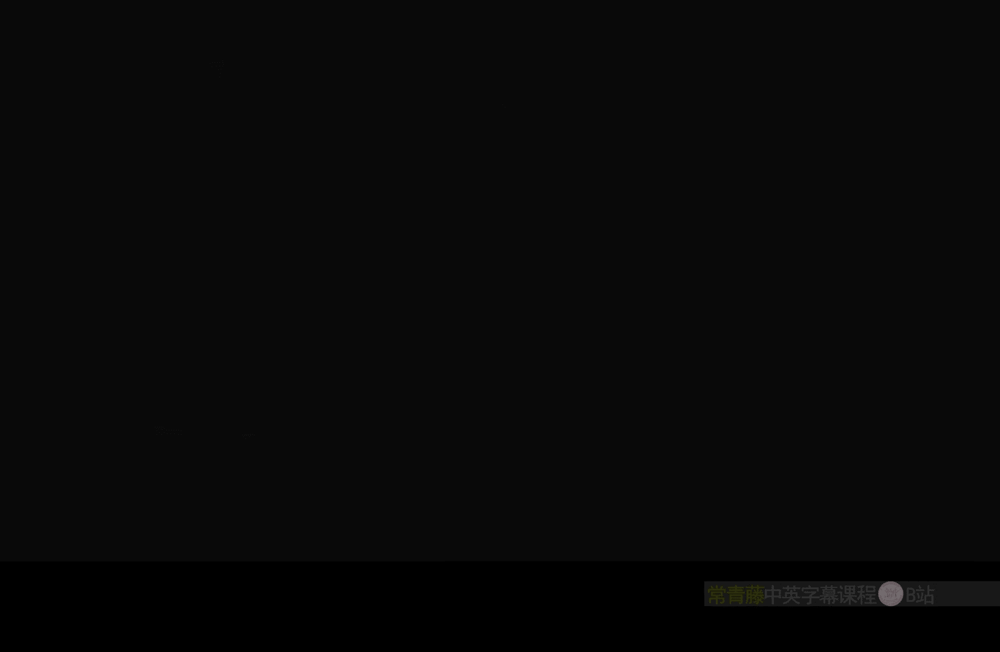
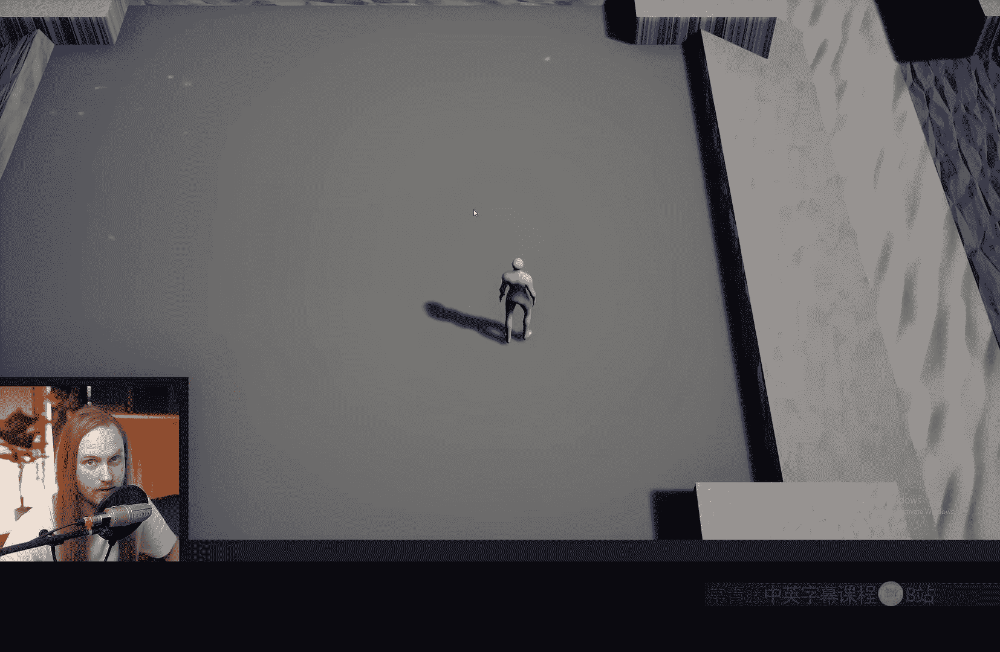
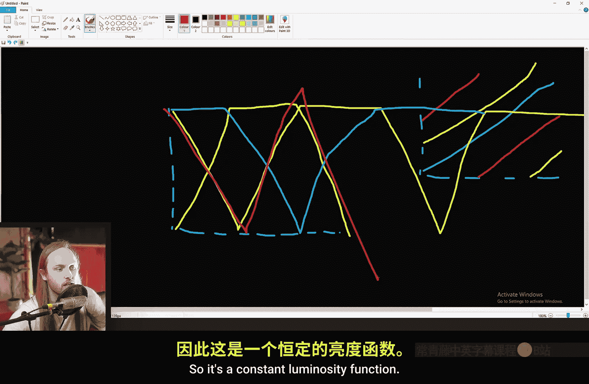
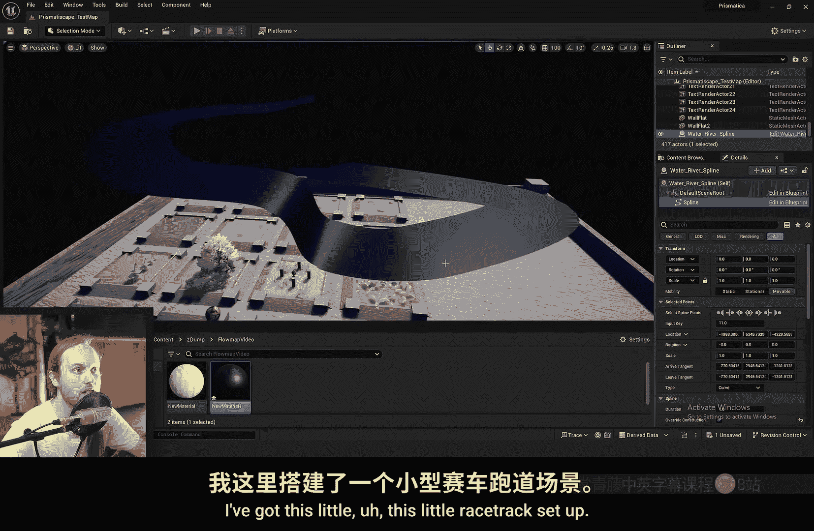
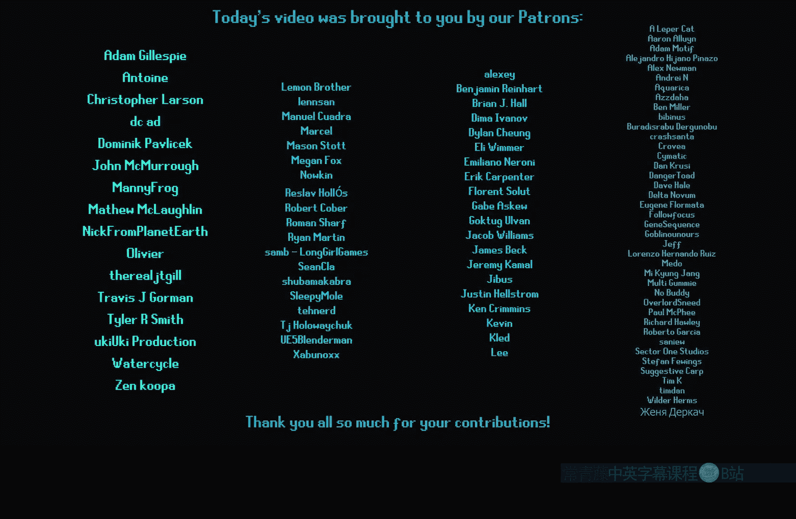

# 043：流图入门 🗺️





在本节课中，我们将要学习什么是流图，以及如何在虚幻引擎中使用流图来创建动态、流畅的材质效果。我们将探讨流图与平铺纹理的区别，理解其工作原理，并通过实例学习如何应用流图。

## 什么是流图？🤔

流图本质上是一张指示纹理流动方向的贴图。它定义了材质中某个部分（如水流、烟雾或泡沫）应该沿着哪个方向移动。


流图是一种非常实用的效果，常用于模拟风、河流、水体边缘的泡沫、物体表面滴落的水流等。它能确保流动方向自然地跟随表面的轮廓和缝隙。


## 为什么不用平铺纹理？🚫

在深入了解流图之前，我们先来看看为什么有时使用平铺纹理（Pan）不是一个好主意。

平铺纹理的工作原理是随时间对纹理坐标（UV）添加一个固定的偏移量。在材质蓝图中，这通常通过 **Panner** 节点实现。

```cpp
// 伪代码概念：平铺纹理的核心计算
NewUV = OriginalUV + (Time * Speed * Direction);
```

以下是平铺纹理的两个主要问题：

1.  **运行时动态改变方向或速度会导致跳跃**：如果你尝试在游戏过程中逐渐改变平铺的方向或速度，纹理会出现不连贯的跳跃和抖动。这是因为时间值是持续累加的，当速度或方向改变时，纹理会从一个“时间线”突然跳到另一个，破坏了视觉连续性。
2.  **无法让纹理的不同部分朝不同方向流动**：如果你尝试用一张噪声贴图来控制不同区域的平铺方向，最终结果会随着时间推移变得一团混乱，无法形成可控的、自然的流动图案。

## 流图的优势 ✨

上一节我们看到了平铺纹理的局限性，本节中我们来看看流图如何解决这些问题。

流图通过一种更聪明的方式来处理纹理的流动，核心在于它使用了**多重采样**和**淡入淡出**技术。它不是简单地对一张纹理进行偏移，而是同时处理多个（通常是2个或3个）纹理样本，让它们以略微错开的相位进行流动，并在它们之间平滑过渡。

这样做的好处是：

*   **支持运行时平滑改变方向和速度**：即使游戏运行了很长时间，你也可以平滑地调整流动参数，而不会出现跳跃现象。
*   **支持基于贴图的复杂流向**：你可以使用一张流图贴图（其RG通道编码了方向和速度）来驱动纹理，使得材质的不同区域能够按照贴图定义的复杂图案进行流动，效果自然且无缝。
*   **支持可变速度**：流图本身可以包含速度信息。例如，你可以让“河流”中心流得快，岸边流得慢。

## 流图的工作原理 ⚙️

理解了流图的优势后，我们来看看它是如何实现的。其核心思想围绕 `Frac` 节点和多重纹理采样。

`Frac` 节点会取输入值的小数部分，将任何值映射到 `[0, 1)` 的范围内。例如，时间值经过 `Frac` 后，会每秒钟循环一次。

流图算法会创建多个这样的循环（例如3个），但让它们的起始相位错开（例如0， 1/3， 2/3）。每个相位对应一个纹理样本。算法会计算一个权重函数（通常是一个梯形或三角形的波形），来控制每个样本在何时淡入和淡出。

**核心流程简述**：
1.  获取基于时间和流图向量的偏移量。
2.  生成多个相位错开的 `Frac` 循环值。
3.  用这些值分别偏移多个纹理样本的UV。
4.  用一个精心设计的权重函数混合这些样本，确保任何时候都至少有一个样本在淡入，一个在淡出，一个保持稳定。
5.  将混合后的结果输出。

这种“接力赛”式的混合方式，掩盖了单个样本重置（跳回起点）时的突兀感，从而实现了无限循环且平滑可变的流动效果。虚幻引擎内置了 `FlowMap` 函数，但它通常只使用两个样本混合，有时会产生明显的灰色过渡带。自定义的流图函数（例如使用三个样本）通常能获得更稳定、更不明显的结果。



## 实战：创建河流流图效果 🌊



现在我们已经掌握了流图的理论，本节我们将通过一个简单的河流例子来实践如何应用流图。

以下是创建一个基础河流流图效果的关键步骤：

1.  **定义流向**：我们需要确定河流的流动方向。一种方法是使用物体的切线空间到世界空间的转换。例如，我们可以用模型的一条UV通道（假设U方向沿河流长度）作为基础方向向量，并将其转换到世界空间。这样，无论河流网格如何弯曲，水流方向都能正确对应世界空间的方向。
    ```cpp
    // 伪代码：获取世界空间流向
    FlowDirection = TransformTangentToWorld(TangentFlowVector);
    FlowDirection.z = 0; // 通常忽略垂直分量
    FlowDirection = Normalize(FlowDirection);
    ```
2.  **应用流图函数**：将计算出的 `FlowDirection` 和纹理坐标输入到流图函数（如内置的 `FlowMap` 或自定义函数）中。函数会输出经过流动处理的纹理采样结果。
3.  **添加速度变化**：真实的河流中心流速快，岸边慢。我们可以通过顶点颜色或另一组UV来模拟。例如，用V坐标创建一个梯度，中心值大，两边值小，然后用它来缩放 `FlowDirection` 的长度（即速度）。
    ```cpp
    // 伪代码：模拟河中心快，岸边慢
    float SpeedGradient = 1 - 2 * abs(UV.v - 0.5); // 创建一个中心为1，两边为0的三角波
    FlowDirection *= SpeedGradient;
    ```
4.  **驱动视觉效果**：最后，用流图处理后的纹理来驱动你想要的效果。例如，将其输入到一个 **HeightLerp** 节点中，与泡沫纹理进行混合。流动强度（`FlowDirection` 的长度）可以作为混合因子，这样在流速快的地方（河中心）泡沫效果更明显。

你还可以结合距离场（Distance Field）来让水流绕开障碍物（如石头），只需用距离场信息去轻微扰动 `FlowDirection` 即可。

## 总结 📝

本节课中我们一起学习了流图在虚幻引擎材质中的应用。

*   **流图是什么**：一张指导纹理如何流动的方向/速度贴图。
*   **为何选择流图而非平铺**：流图支持运行时平滑参数变化和基于贴图的复杂流向，避免了平铺纹理的跳跃和混乱问题。
*   **流图如何工作**：通过多重采样和相位错开的淡入淡出混合，实现无缝循环流动。
*   **如何应用流图**：我们以河流为例，讲解了如何定义世界空间流向、添加速度变化，并用流图结果驱动最终的材质效果（如泡沫）。



流图是一个强大的工具，能够为你的材质带来高度的动态性和真实感，特别适用于水体、烟雾、魔法特效等需要表现自然流动的场景。