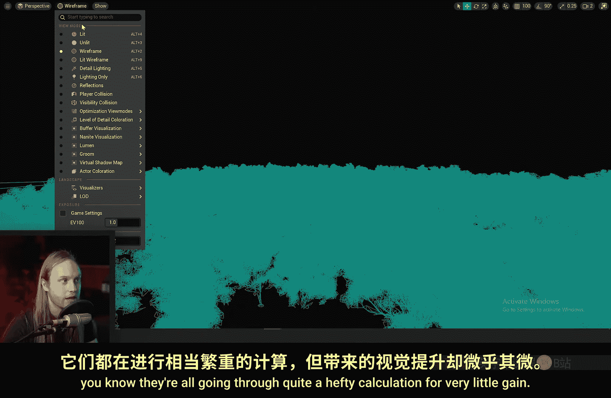
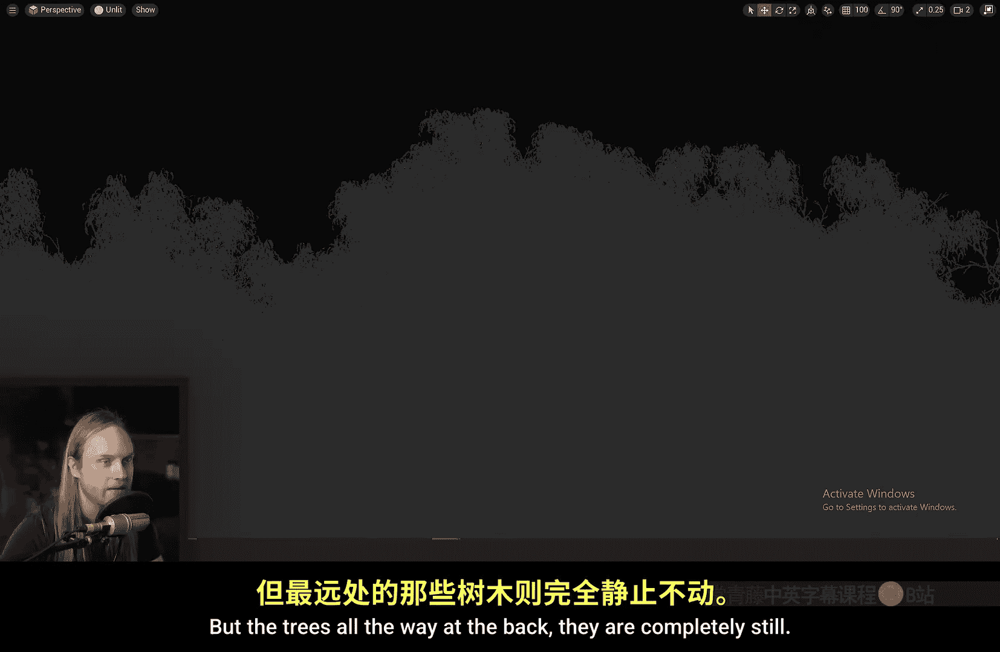
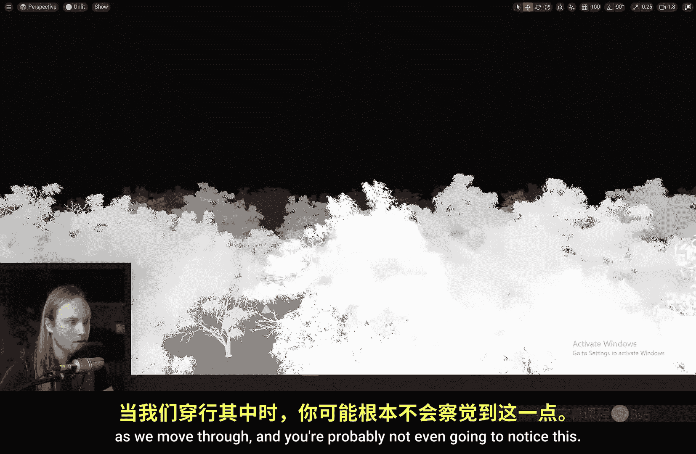
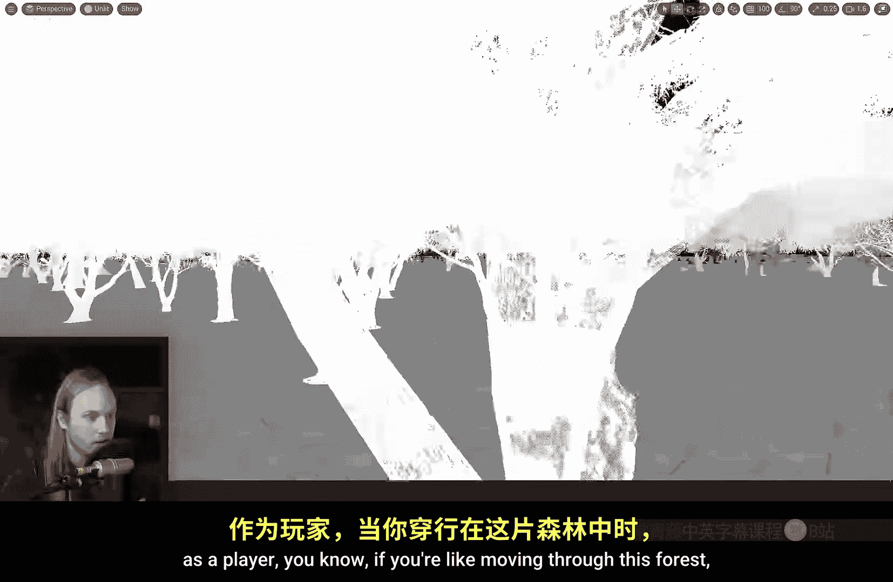
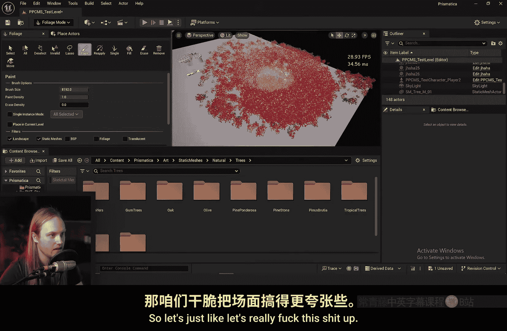
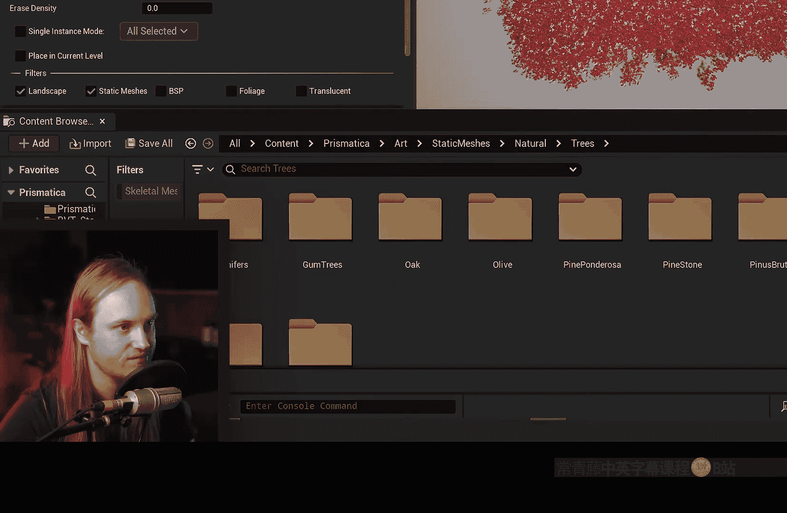
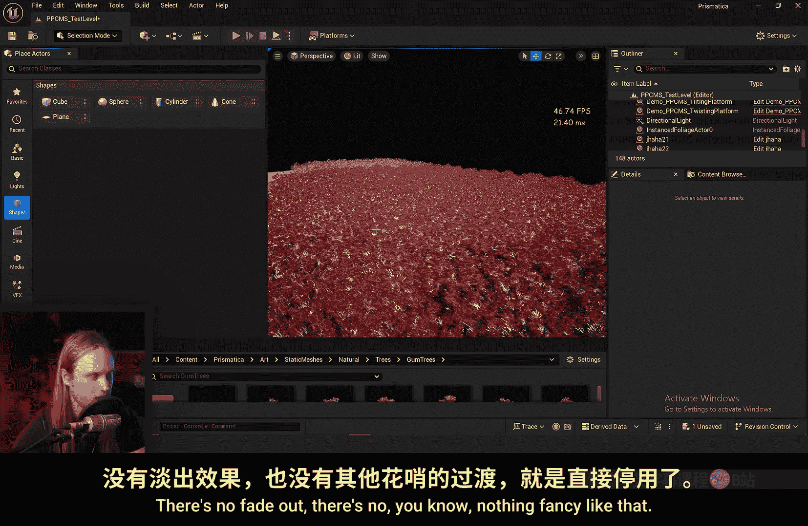
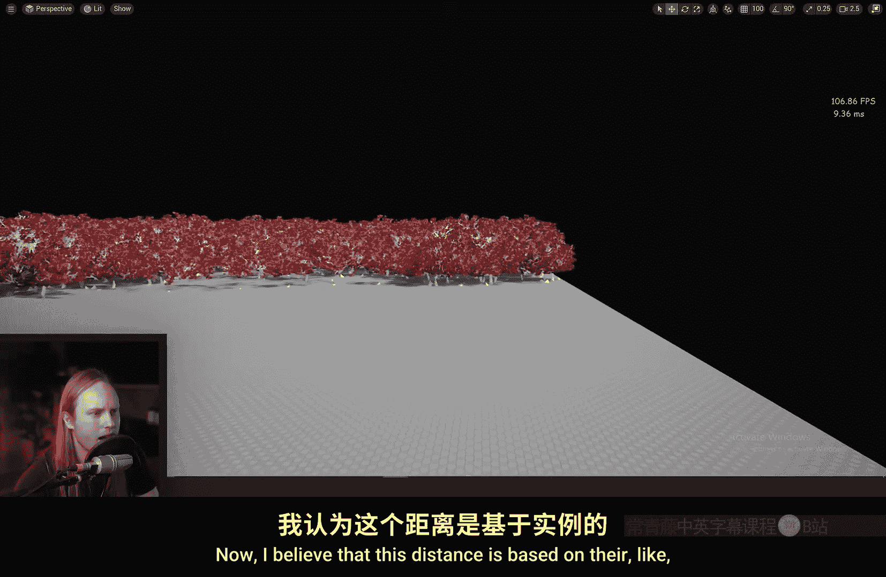

# 044：使用WPO禁用距离优化植被 🌳

在本节课中，我们将学习如何通过禁用远处植被的世界位置偏移（WPO）计算，来有效优化虚幻引擎项目的性能。我们将探讨一种常见的性能陷阱，并介绍引擎内置的解决方案。

## 概述

世界位置偏移（World Position Offset, WPO）常用于为植被（如树木、草丛）添加风吹摇摆等动画效果。然而，为场景中每一个顶点（包括远处的植被）都计算WPO会消耗大量不必要的GPU资源。本节课将指导你如何智能地禁用远处植被的WPO计算，从而显著提升帧率。

## 问题分析：不必要的远处计算

首先，我们来看一个典型的场景：一片由美丽的澳大利亚桉树组成的森林。正如你所见，这片森林规模可观。

你可能会注意到，即使是在最远处的树木，引擎仍在计算它们的WPO动画（如树干摇摆、树叶飘动）。从玩家视角看，根本不会注意到这些远处物体的细微运动，但这部分计算却消耗着宝贵的性能资源。

因为WPO是**按顶点**计算的，场景中每一片树叶、每一段树干的所有顶点都在进行着繁重的运算，而带来的视觉收益却微乎其微。

## 初级方案：视觉屏蔽及其局限

一个直观的想法是：根据顶点与摄像机的距离，将WPO效果逐渐减弱至零。以下是实现思路：

1.  获取顶点的世界位置和摄像机位置。
2.  计算两者之间的距离。
3.  设定一个“渐变起始距离”，当距离大于此值时开始减弱效果。
4.  通过一个公式计算衰减系数（从1到0的渐变），并乘以WPO输出。

核心公式可以表示为：
`衰减系数 = Saturate(1 - (距离 - 起始距离) / 渐变长度)`
`最终WPO = 原始WPO * 衰减系数`

我们可以将衰减系数连接到基础颜色上，以便可视化效果开关区域。如下图所示，近处的树木显示为白色且正常运动，而远处的树木则完全静止。

随着摄像机移动，不同区域的树木会逐渐“苏醒”或“沉睡”。

然而，这个方案存在一个关键的性能问题：**它并没有真正节省性能**。WPO的所有计算仍然在着色器中执行，只是在最后一步将结果乘以了零。这就像完成了所有复杂的数学运算，却在最后把答案扔进了垃圾桶——计算成本丝毫没有减少。

## 终极方案：使用引擎内置的禁用功能

理想的解决方案是在着色器层面就完全跳过WPO的计算。幸运的是，虚幻引擎为我们内置了这个功能。

我们可以在植被实例的设置中找到它。以下是操作步骤：

1.  在植被绘制工具中，选中所有树木实例。
2.  在“实例设置”中，找到“高级”部分。
3.  启用 **“World Position Offset Disable Distance”** 选项。
4.  设置一个禁用距离（例如20000单位）。

完成设置后，超出设定距离的植被实例将完全不会进行WPO计算。性能测试表明，在相同场景下，使用此功能可以显著提升帧率（例如从30帧提升到40帧），因为它真正减少了GPU需要执行的指令数量。

## 平滑过渡：消除视觉“弹出”感

直接禁用WPO会导致一个视觉问题：当摄像机移动时，树木会在特定距离上突然“弹出”开始运动，看起来很不自然。

这是因为禁用判断是基于实例的**枢轴点（Pivot Point）** 与摄像机的距离。我们可以利用这一点，在材质中创建一个平滑的过渡区域来掩盖这个“弹出”效果。

思路是结合两种方法：
1.  在材质中，我们使用**物体枢轴点**（通过 `Mesh Particle Pivot Location` 节点获取）到摄像机的距离，来计算一个渐变系数。
2.  将这个系数乘以WPO输出。
3.  将引擎的“WPO禁用距离”设置为略大于材质中渐变完成的距离。

例如，在材质中设置：渐变起始距离 = 5000，渐变长度 = 15000，则总影响距离为20000。然后将引擎的“WPO禁用距离”也设为20000。这样，在距离摄像机20000单位处，WPO在材质中已渐变为零，随后才被引擎完全禁用，实现了无缝过渡。

## 扩展应用与注意事项

这个技术不仅适用于植被实例，也可以用于静态网格体。在静态网格体组件的细节面板中搜索“disable”，也能找到相应的世界位置偏移禁用距离设置。

需要特别注意的一点是：材质中的渐变总距离（起始距离+渐变长度）**必须小于或等于**在实例或组件上设置的“WPO禁用距离”。否则，在渐变完成前WPO就被强制禁用，仍然会出现“弹出”。

目前，引擎没有提供像“每实例淡化量”那样可以直接在着色器中读取“WPO禁用距离”值的节点。因此，你需要手动管理每个材质或每种植被的禁用距离参数，确保它们匹配。

## 针对骨骼动画植被的特殊处理

对于使用骨骼驱动动画的植被（虽然不常见），还有一个小技巧。你可以使用 `PreSkinnedLocalPosition` 节点。

1.  获取顶点在蒙皮动画**之前**的本地位置。
2.  减去顶点当前（应用动画后）的位置，得到一个偏移向量。
3.  这个偏移向量就是将顶点移回其静止状态的WPO。
4.  同样地，用基于距离的渐变系数乘以这个偏移，就可以在着色器层面逐渐“冻结”骨骼动画，然后再让引擎在更远处完全禁用WPO计算。

## 总结

本节课我们一起学习了如何优化植被的WPO性能。

1.  **识别问题**：为远处植被计算WPO是浪费性能的。
2.  **避免陷阱**：仅在材质输出端将WPO乘以零，并不能节省计算开销。
3.  **正确方案**：使用虚幻引擎内置的 **“World Position Offset Disable Distance”** 功能，从根源上禁用远处实例的WPO计算。
4.  **优化体验**：在材质中基于物体枢轴点距离创建平滑过渡，以消除视觉上的“弹出”感。
5.  **扩展应用**：该功能也适用于静态网格体，对于骨骼动画植被需使用 `PreSkinnedLocalPosition` 进行特殊处理。

记住关键原则：**真正的性能优化在于减少需要执行的指令，而不仅仅是隐藏它们的结果**。合理运用此技术，可以为你的大型开放世界项目带来可观的性能提升。

