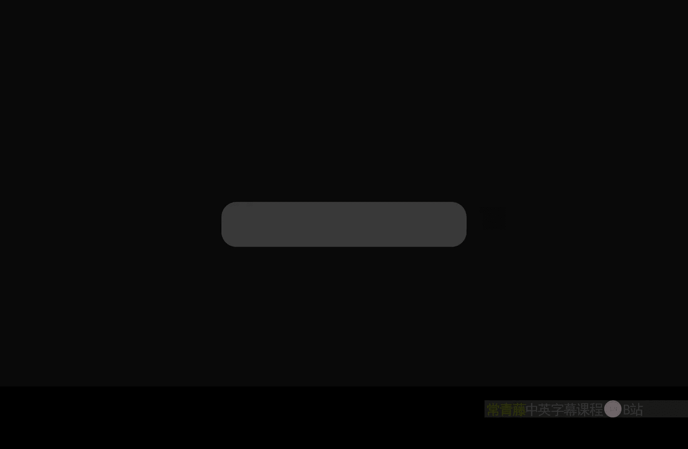
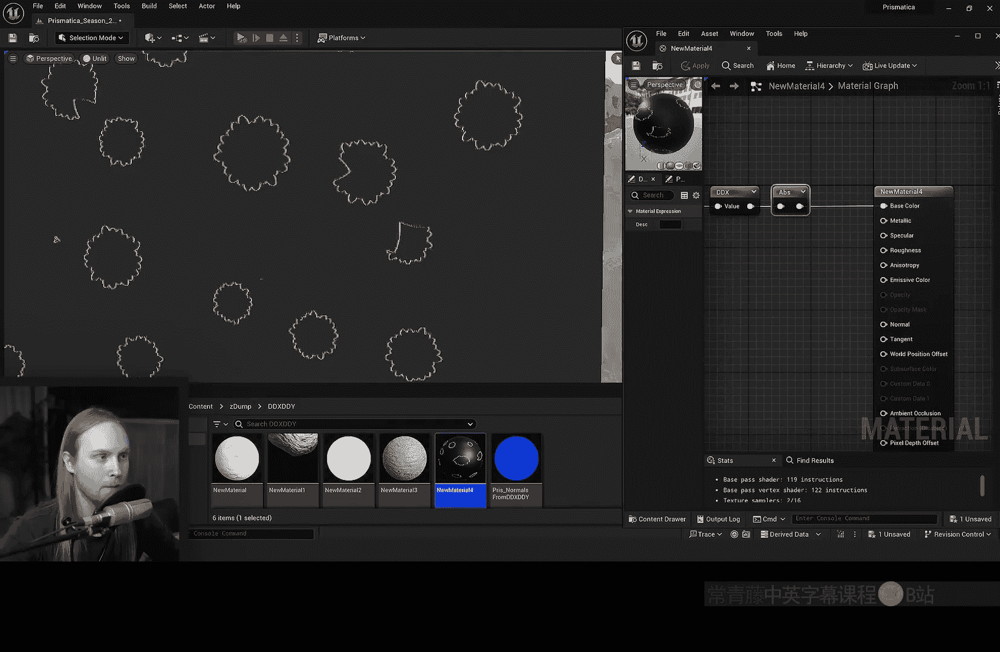
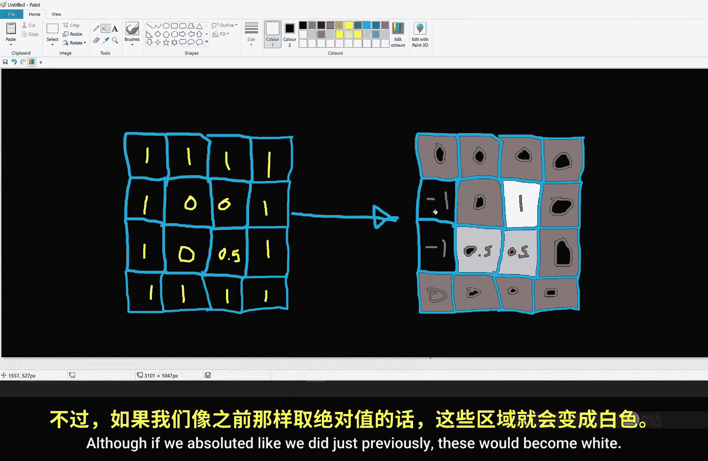
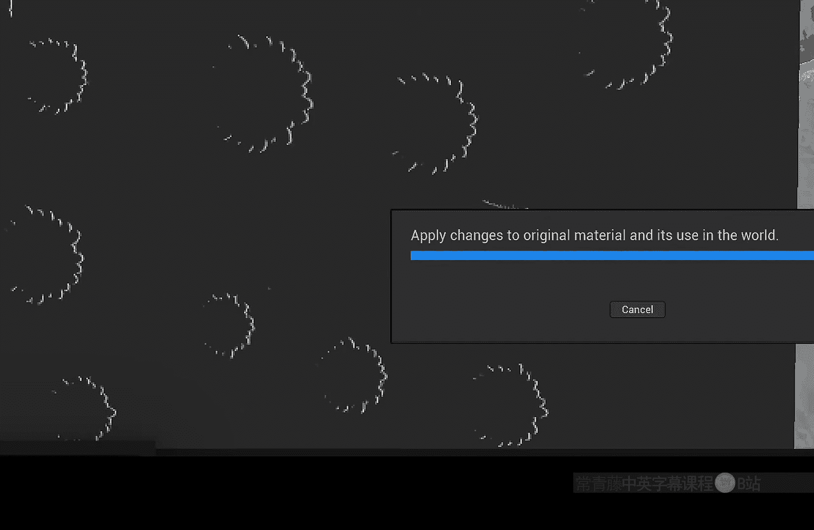
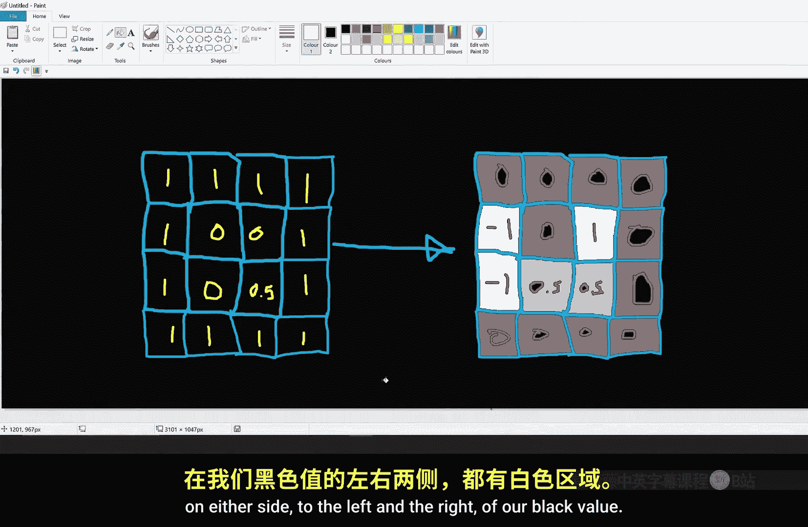
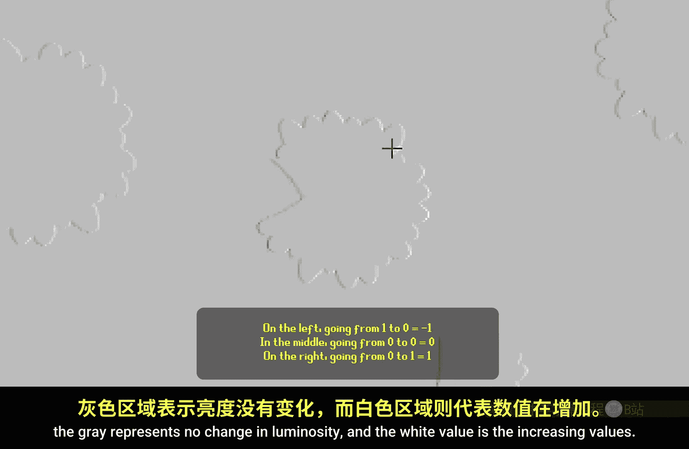
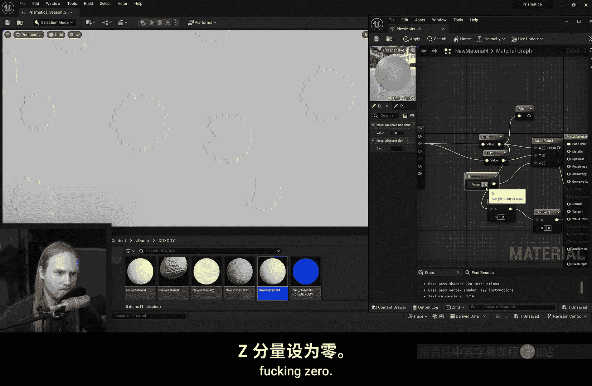
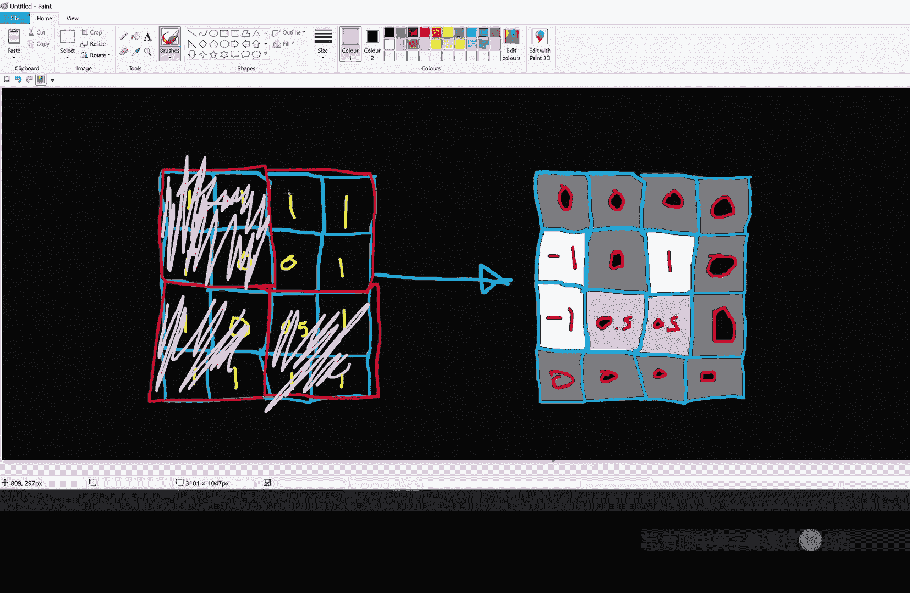
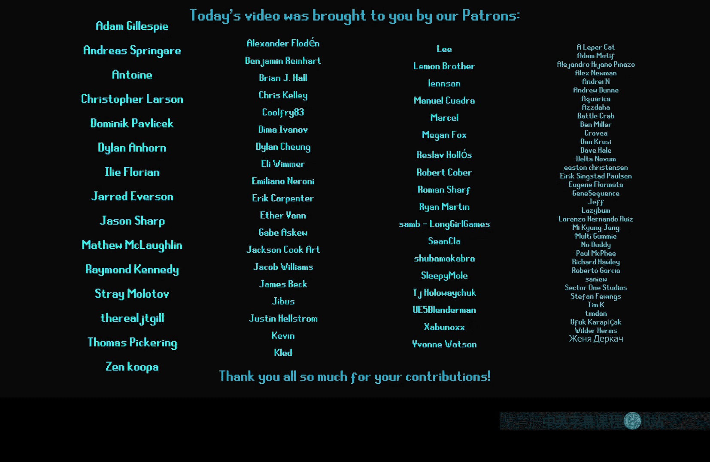

# 045：使用DDX与DDY节点生成程序化法线（及更多应用）



在本节课中，我们将深入探讨虚幻引擎材质编辑器中的两个特殊节点：`DDX`和`DDY`。我们将学习它们的工作原理，并演示如何利用它们从黑白纹理或程序化结果中生成法线贴图，以及进行边缘检测等实用技巧。



## 概述：什么是DDX与DDY？

`DDX`和`DDY`节点用于计算屏幕空间中像素值的**偏导数**。简单来说：
*   `DDX`计算当前像素与其**右侧**像素在某个通道（如颜色亮度）上的**差值**。
*   `DDY`计算当前像素与其**下方**像素在某个通道上的**差值**。





这两个节点输出的不是颜色，而是数值的变化率。这个核心概念是本节课所有应用的基础。







## 核心原理：DDX节点如何工作？

让我们通过一个简单的例子来理解`DDX`。假设我们有一个黑白花瓣纹理，白色背景（值为1），黑色花瓣（值为0）。




如果我们将这个纹理直接连接到`Base Color`，会看到正常的黑白图案。但如果将其连接到`DDX`节点，结果会变得有趣：在黑色花瓣的**右侧边缘**会出现白色轮廓。

这是因为`DDX`计算的是从左到右的亮度变化。从黑色（0）突变到白色（1）时，差值为**+1**（显示为白色）。而从白色（1）突变到黑色（0）时，差值为**-1**。为了同时看到正负变化，我们可以使用`Absolute`（绝对值）节点，这样两侧边缘都会显示为白色。


为了更直观地可视化变化方向，我们可以用以下公式处理`DDX`的输出：
```
(DDX(Texture) + 1) / 2
```
这样，负值变为深色，零值变为中灰色，正值变为白色，形成一个类似“边缘检测”的视图。

## 生成法线贴图

上一节我们看到了`DDX`能检测水平边缘。如果我们同时使用`DDX`和`DDY`，就能获得水平和垂直两个方向的变化信息，这恰好可以用来构造法线向量。

**以下是生成法线贴图的核心步骤：**

1.  **获取变化量**：使用`DDX`和`DDY`节点处理你的黑白输入（高度图或遮罩）。
2.  **构造向量**：使用`Append`节点将`DDX`和`DDY`的结果组合成一个二维向量 `(X, Y)`。这个向量描述了屏幕空间中的“坡度”。
3.  **转换到切线空间**：直接得到的向量位于屏幕空间。为了用作法线，需要转换到模型的切线空间。一个有效的方法是：
    *   将二维向量扩展为三维向量 `(X, Y, 0)`。
    *   使用`Transform`节点，将向量从**视图空间（View Space）** 转换到**切线空间（Tangent Space）**。
    *   由于我们人为设置了Z分量为0，转换后的Z分量可能不正确。我们需要用正确的Z分量重建法线。通常，在转换后，我们丢弃原有的Z值，并手动附加一个新的Z分量（例如1），然后对最终向量进行归一化（`Normalize`）。
4.  **处理X轴翻转**：根据UV坐标方向，有时需要将X分量取反（乘以-1）以获得正确的光照方向。

完成这些步骤后，你就得到了一个从黑白信息动态生成的切线空间法线贴图。


## 解决距离依赖性与像素化问题

使用`DDX`/`DDY`生成法线时，会遇到两个典型问题：**效果强度随摄像机距离变化**和**结果看起来有像素块**。

**问题1：距离依赖性**
因为计算基于屏幕像素，当摄像机拉远时，相同的世界空间高度变化会跨越更多像素，导致`DDX`/`DDY`计算出的差值变小，法线效果减弱甚至消失。

**解决方案**：引入一个基于摄像机距离的缩放因子。
```
强度缩放因子 = 1 / (0.1 + 摄像机到表面的距离 / 100)
```
将`DDX`/`DDY`的结果乘以上述因子。这样，距离越远，为了补偿屏幕空间计算带来的削弱，我们会适当增强原始差值，从而使法线效果在不同距离上保持相对稳定。

**问题2：像素化（Quad着色）**
现代GPU以2x2像素块（称为Quad）为单位进行着色器计算。`DDX`和`DDY`实际上是在Quad内部进行计算（例如，`DDX`比较Quad内左上和右上像素）。因此，同一个Quad内的所有像素会获得相同的`DDX`/`DDY`值，导致输出看起来像是分辨率减半，产生块状感。

**注意事项**：此现象是硬件层面的限制。在正常的延迟着色光照模式下，引擎的**时间性抗锯齿（TAA）** 等技术会帮助平滑这种块状感，使其在最终画面中不那么明显。

## 高级应用与替代方案

掌握了基础法线生成后，我们来看看`DDX`/`DDY`的更多用途和一些内置的替代方案。

**应用1：程序化纹理的法线**
这是`DDX`/`DDY`最大的优势之一。你可以为任何程序化生成的灰度图案实时生成法线，而无需预设法线贴图。
*   **示例**：使用`Sine`波节点驱动UV偏移，产生波纹图案，然后通过上述流程生成水波法线。

**应用2：修复世界位置偏移（WPO）的法线**
当使用材质进行顶点动画（如模拟波浪）时，移动的是顶点位置，但模型默认的法线不会自动更新，导致光照错误。我们可以用`DDX`/`DDY`计算WPO值的变化来生成正确的法线。
*   **方法**：将对顶点进行WPO操作的**同一数值**（如Z轴偏移量），输入到`DDX`/`DDY`法线生成流程中。这样生成的法线反映了顶点移动后的表面朝向。
*   **限制**：此方法最适合WPO方向与顶点法线方向一致的情况（例如，平面仅上下移动）。对于复杂变形，精度可能不足。

**内置函数**：虚幻引擎提供了`PerturbNormalHQ`和`PerturbNormal`节点，它们内部也使用`DDX`/`DDY`，但包含了更复杂的校正计算，通常能产生更精确的结果（尤其是对于WPO），但指令消耗也更高。

**应用3：快速边缘检测（磨损效果）**
利用`DDX`/`DDY`检测法线或颜色的突变，可以模拟模型边缘的磨损、污渍效果。
*   **思路**：对`World Normal`或`Pixel Normal`应用`DDX`和`DDY`，取绝对值后相加，得到边缘强度图。强度大的地方（如折角、缝隙）就是需要添加磨损效果的区域。
*   **处理**：用此强度图去混合两种颜色（如基础色和磨损色），再叠加一些噪波纹理打破规律性，就能快速得到程序化的边缘磨损效果。这种方法无需为每个模型烘焙贴图，但效果相对基础，可能有些闪烁。



## 总结

本节课我们一起学习了`DDX`和`DDY`节点的强大功能。

*   **核心**：它们计算屏幕空间像素间的差值，是偏导数在图形学中的实现。
*   **主要应用**：
    1.  **从灰度图生成法线贴图**：成本低廉，适用于程序化内容或纹理混合后的结果。
    2.  **校正WPO动画的法线**：为顶点动画提供匹配的光照信息。
    3.  **快速边缘检测**：用于生成程序化的边缘磨损、污渍等效果。
*   **注意事项**：需要注意其屏幕空间特性带来的距离依赖性和像素块化问题，并了解通过距离缩放和利用引擎后处理来缓解。
*   **选择**：对于简单纹理法线，自定义的`DDX`/`DDY`流程可能更高效；对于高质量的WPO法线校正，则推荐使用内置的`PerturbNormalHQ`节点。


希望本教程能帮助你理解并开始运用这两个强大的工具，为你的材质创作增添更多动态和程序化的可能性。