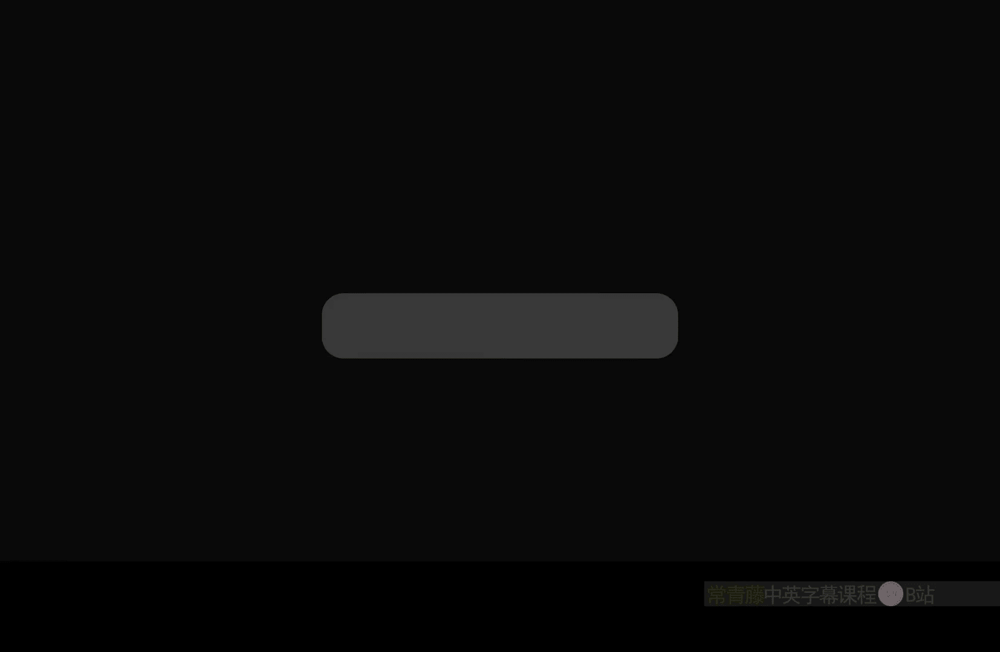
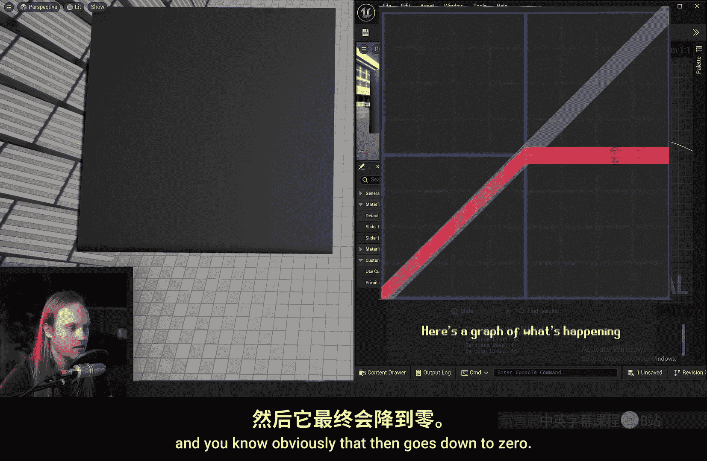
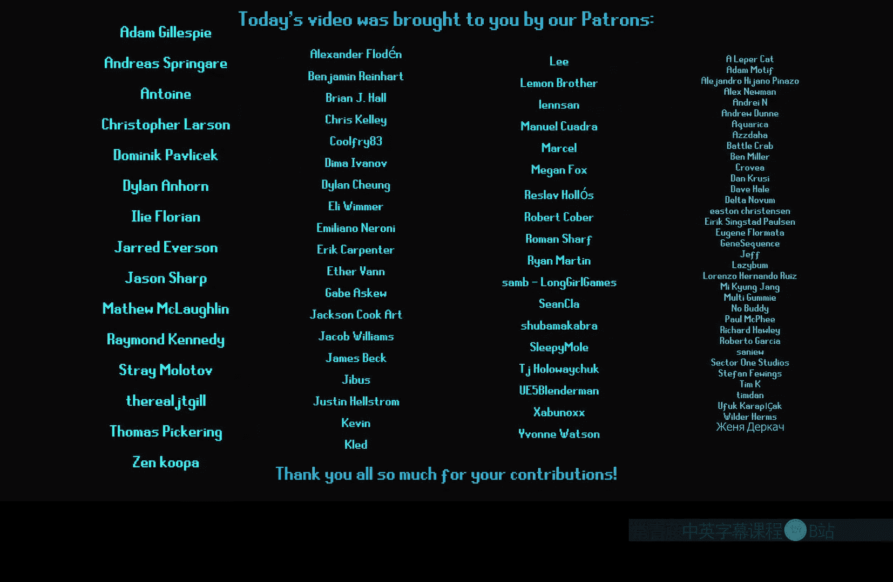

# 046：最小值与最大值节点详解 🎨

在本节课中，我们将学习虚幻引擎材质编辑器中的两个核心节点：**Min（最小值）** 和 **Max（最大值）** 节点。我们将了解它们的功能、工作原理以及在实际材质制作中的应用场景。

## 节点功能概述

Min 和 Max 节点各有**两个输入**。它们的功能非常直接：
*   **Min 节点**：比较两个输入值，并输出其中**较低**的那个值。
*   **Max 节点**：比较两个输入值，并输出其中**较高**的那个值。

例如，如果将数值 **0** 和 **1** 分别输入：
*   在 **Max** 节点中，输出为 **1**（白色）。
*   在 **Min** 节点中，输出为 **0**（黑色）。

## 作为“单向限制器”使用

上一节我们介绍了节点的基本功能，本节中我们来看看它们的一个常见用途：充当“单向限制器”。

如果你熟悉 **Clamp（限制）** 节点或 **Saturate（饱和）** 节点（后者本质上是固定范围为0到1的Clamp），那么可以将Min和Max节点理解为“单向”的Clamp。

假设我们有一个数值范围很大的输入（例如从-100到1000的世界位置坐标），而我们只想**剔除所有负值**。虽然可以使用Clamp节点并将上限设得极高，但这会浪费计算资源。

此时，使用 **Max** 节点配合一个最小值（如0）是更高效的方法。它会将任何低于0的值提升到0，而高于0的值则保持不变，实现了仅在一侧进行限制的效果。

## 模拟Photoshop混合模式

除了作为限制器，Min和Max节点也常用于模拟图像处理中的混合效果。

如果你熟悉Photoshop的图层混合模式，那么：
*   **Max 节点** 的功能类似于 **“变亮”** 模式。
*   **Min 节点** 的功能类似于 **“变暗”** 模式。

以下是具体操作方式：
1.  准备两个渐变纹理，例如一个从左（黑）到右（白）的渐变，和一个从上（黑）到下（白）的渐变。
2.  使用 **Max** 节点合并它们，它会为每个像素选择两个渐变中**亮度更高的值**作为输出。
3.  使用 **Min** 节点合并它们，它会为每个像素选择两个渐变中**亮度更低的值**作为输出。

这与 **Multiply（相乘）** 节点不同。相乘是进行数值乘法运算（例如0.5 * 0.5 = 0.25），会导致区域变暗；而Min/Max是进行数值比较和选择。

## 处理纹理与颜色

Min和Max节点同样可以处理纹理和颜色值。

当输入是RGB颜色值时，节点会**分别对R、G、B三个通道**执行最小值或最大值比较，然后将结果重新组合成颜色输出。这与某些图像软件先去饱和度再处理的方式有所不同。

以下是纹理处理的应用示例：
*   将一个渐变纹理与一个噪波纹理相连。
*   使用 **Multiply** 节点，噪波会整体使渐变变暗。
*   使用 **Min** 节点，它会为每个像素选择噪波和渐变中**更暗的值**，产生不同的混合效果。
*   使用 **Max** 节点则效果相反，会选择**更亮的值**。

## 合并多个蒙版

在复杂的材质制作中，例如制作水体泡沫效果时，经常需要组合多个蒙版（Mask）。

以下是合并多个蒙版的实用技巧：
*   如果你有多个取值范围在0到1之间的蒙版，并且希望将它们合并，同时确保最终值**不会超过1**，可以使用 **Max** 节点链。
*   将多个蒙版依次用Max节点连接起来，对于每个像素，系统会自动选择所有输入蒙版中的**最高值**作为输出。
*   这种方法避免了简单**相加（Add）** 可能导致数值累加超过1的问题，是一种安全高效的蒙版合成方式。

## 课程总结

本节课中我们一起学习了虚幻引擎材质编辑器中的 **Min（最小值）** 和 **Max（最大值）** 节点。

我们掌握了它们的核心功能是**比较并选择**输入值中的较小者或较大者。探讨了它们作为“单向限制器”的优化用途，以及如何模拟“变亮/变暗”混合模式来处理渐变和纹理。最后，我们还了解了使用Max节点链来安全合并多个蒙版的实用技巧。

这两个节点虽然简单，但在材质创作中非常实用和高效。