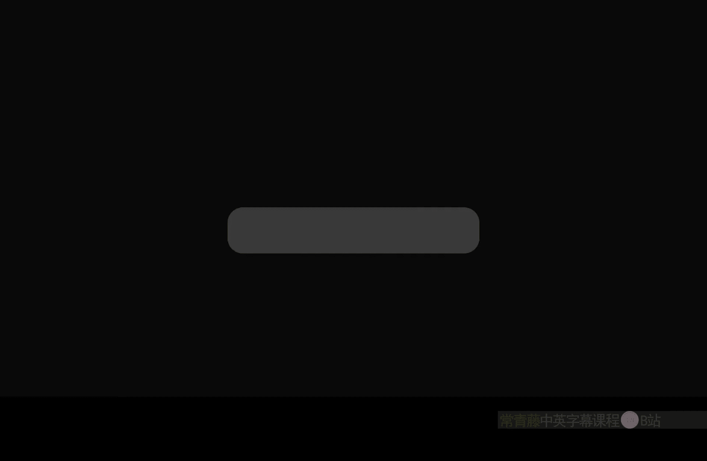
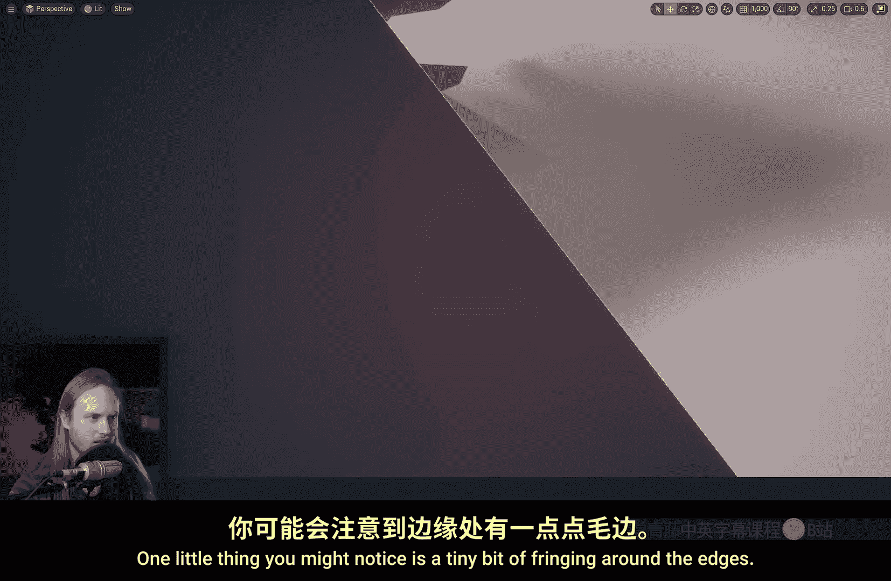
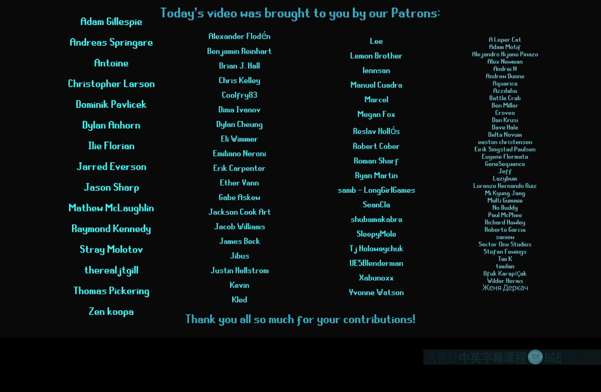

# 047：贴花遮罩技术详解

在本节课中，我们将学习虚幻引擎5中的贴花遮罩技术。贴花遮罩允许我们精确控制贴花在场景中的哪些物体上显示或不显示，这对于创建复杂的视觉效果至关重要。我们将探讨两种主要方法：自定义深度/模板遮罩和世界法线遮罩。

## 概述

贴花遮罩的核心目标是选择性渲染。例如，你可能希望地面裂缝贴花出现在地形上，但不要出现在角色的鞋子上。或者，你可能希望涂鸦只出现在墙壁的正面，而不是背面。通过使用遮罩技术，我们可以实现这些精细的控制。

## 创建基础贴花材质

首先，我们需要创建一个基础的贴花材质。

1.  创建一个新材质。
2.  在材质细节面板中，将 **材质域** 设置为 **延迟贴花**。
3.  将 **混合模式** 设置为 **半透明**。
4.  将一张纹理（例如人脸图片）连接到 **不透明度** 引脚。

现在，将这个材质应用到场景中的一个贴花Actor上。默认情况下，贴花会投射到其边界框内的所有表面上。

## 自定义深度与模板遮罩

上一节我们创建了基础贴花，本节中我们来看看如何通过自定义深度和模板缓冲区来实现选择性遮罩。这是最精确的遮罩方法。

在贴花材质中，我们可以访问特定的场景纹理。在材质图表中搜索“SceneTexture”节点，你会发现贴花材质只能访问：场景深度、自定义深度、自定义模板和世界法线。

以下是实现自定义模板遮罩的步骤：

1.  在材质图表中添加 **SceneTexture** 节点，并选择 **Custom Stencil**。
2.  添加一个 **StencilMaskCompare** 节点。此节点本质上执行比较：如果输入A等于输入B，则输出1（显示），否则输出0（不显示）。
    *   **公式/逻辑**：`Output = (A == B) ? 1 : 0`
3.  将 **Custom Stencil** 值连接到 `A` 引脚，将一个标量参数（例如 `Stencil ID`）连接到 `B` 引脚。
4.  将 **StencilMaskCompare** 节点的输出与你原始的不透明度纹理进行 **乘法** 操作。
5.  在场景中，为你不希望显示此贴花的物体（如一个立方体）启用 **渲染自定义深度通道**，并设置一个特定的 **自定义深度模板值**（例如 3）。

现在，贴花将只在模板值匹配的物体上渲染。这是一种“包含”遮罩。

### 排除遮罩与深度处理

通常，我们更希望使用“排除”遮罩，即贴花出现在大多数物体上，但排除特定物体（如角色）。这比让大量物体渲染到自定义深度通道性能更好。

1.  将上述遮罩逻辑修改为“排除”模式。使用 **OneMinus** 节点对 `StencilMaskCompare` 的输出取反。
    *   **公式**：`FinalMask = 1 - StencilMaskCompare(CustomStencil, TargetID)`
2.  为需要排除的物体（如角色网格体）启用自定义深度并设置模板值（例如 3）。

此时你可能会发现，模板遮罩不考虑深度，导致遮罩“穿透”物体。为了解决这个问题，我们需要结合场景深度。

以下是结合深度检测的完整排除遮罩设置：

1.  获取 **SceneDepth** 和 **CustomDepth**。
2.  计算深度差：`CustomDepth - SceneDepth`。
3.  添加一个小的安全偏移（如 -5），以避免Z冲突。这表示“仅当自定义深度物体在场景深度前方一定距离内时才应用遮罩”。
    *   **核心逻辑**：`DepthTest = (CustomDepth - SceneDepth + Offset) > 0`
4.  将 `StencilMaskCompare` 的输出与这个深度测试结果进行 **乘法** 操作。
5.  最后再用 **OneMinus** 取反，得到排除遮罩。

这样，贴花就不会“穿透”被排除的物体了。

### 使用模板范围

你可以进一步扩展，使用模板值范围而非单个值进行遮罩。这需要一些数学计算。

1.  设置一个最小模板值（`Min`）和最大模板值（`Max`）。
2.  计算范围：`Range = Max - Min + 1`（+1是为了包含边界）。
3.  计算标准化值：`((CustomStencil - Min) / Range)`。
4.  使用 **Floor** 和 **Abs** 节点，将范围内的值转换为0，范围外的值转换为正数。
5.  最后用 **Saturate** 和 **OneMinus** 得到遮罩：范围内为1（显示），范围外为0（不显示）。
    *   **简化公式思路**：创建一个函数，当 `CustomStencil` 在 `[Min, Max]` 区间内时输出1。

这允许你为整组物体（如所有植被，分配模板值2-5）统一设置遮罩规则。

## 世界法线遮罩

上一节我们介绍了基于物体的模板遮罩，本节中我们来看看另一种基于表面角度的遮罩方法：世界法线遮罩。这常用于防止贴花出现在表面的背面或特定角度的面上。

例如，你希望涂鸦只出现在墙壁的正面。

以下是实现步骤：

1.  获取 **SceneTexture** 节点并选择 **WorldNormal**。这提供了每个像素的世界空间法线向量。
2.  获取贴花自身的朝向。使用 **Transform** 节点，将向量 `(-1, 0, 0)`（假设贴花沿X轴负方向投射）从局部空间转换到世界空间。这代表了贴花投射的“正面”方向。
3.  使用 **Dot Product** 节点，计算世界法线与贴花正面方向之间的点积。
    *   **公式**：`Dot = WorldNormal · DecalForward`
    *   点积结果为1表示法线完全对齐（正面），0表示垂直，-1表示完全相反（背面）。
4.  对点积结果进行处理。通常先 **Saturate**（钳制到0-1），然后可以乘以一个系数（如2）再 **Saturate** 一次，以调整衰减硬度，使接近正面的区域更完全显示。
5.  将此结果与原始不透明度进行 **乘法** 操作。

现在，当你看墙壁的背面时，贴花将完全消失。当视角与墙壁法线成一定角度时，贴花会平滑淡出。这种方法非常适合处理地形上的大型贴花，避免其出现在垂直的建筑物墙面上。

## 总结

在本节课中，我们一起学习了虚幻引擎5中两种强大的贴花遮罩技术。

*   **自定义深度/模板遮罩**：通过物体的渲染通道和模板值进行精确控制，可以实现包含或排除特定物体的效果。我们学习了如何结合深度测试来避免遮罩穿透，以及如何使用模板值范围。
*   **世界法线遮罩**：基于表面法线方向进行过滤，确保贴花只出现在特定角度的表面上，例如防止贴花出现在墙壁背面。

掌握这些技术可以极大地提升场景视觉效果的品质和性能，让你能够更精细地管理贴花的渲染行为。