# 001：五分钟开启Python编程之旅 🚀

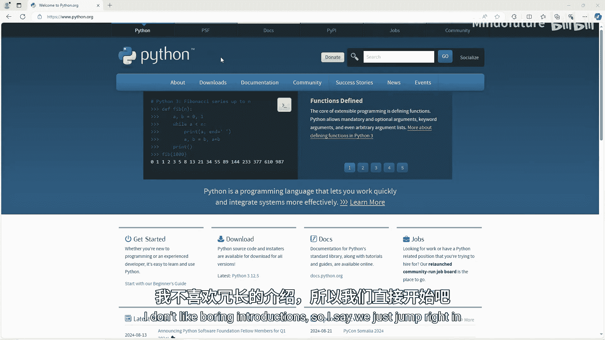

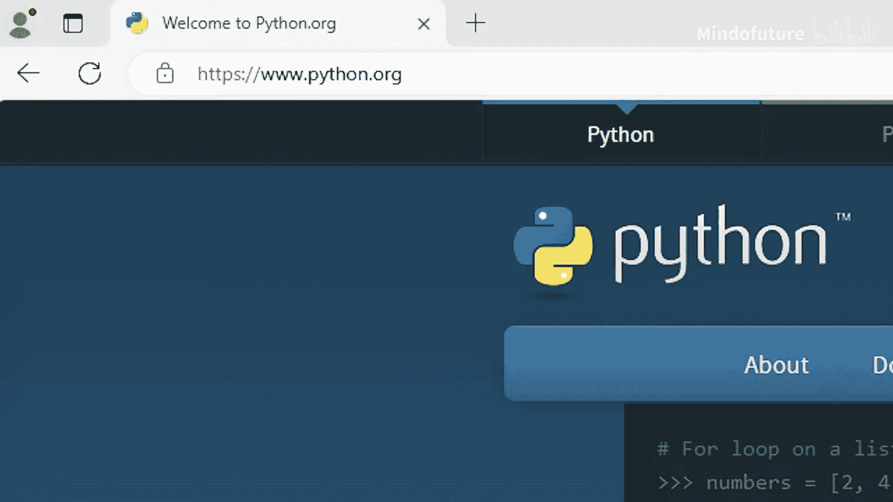

在本节课中，我们将学习如何快速搭建Python开发环境，并编写你的第一个Python程序。整个过程非常简单，即使你从未接触过编程也能轻松跟上。

## 下载Python解释器

首先，我们需要下载Python解释器。它的作用是将我们编写的代码转换为计算机能够理解的机器码。

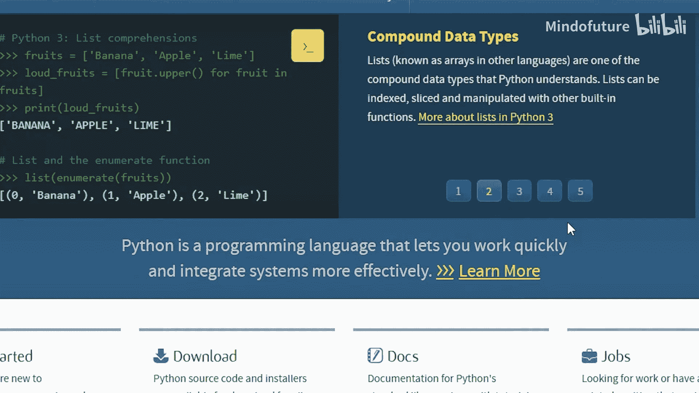

1.  访问官方网站 [Python.org](https://www.python.org)。
2.  点击“Downloads”菜单。
3.  下载最新版本的Python安装程序。

对于Windows用户，在运行安装程序时，请务必勾选“Add Python.exe to PATH”选项，然后点击“Install Now”进行安装。安装成功后，Python解释器就准备就绪了。

## 下载集成开发环境（IDE）


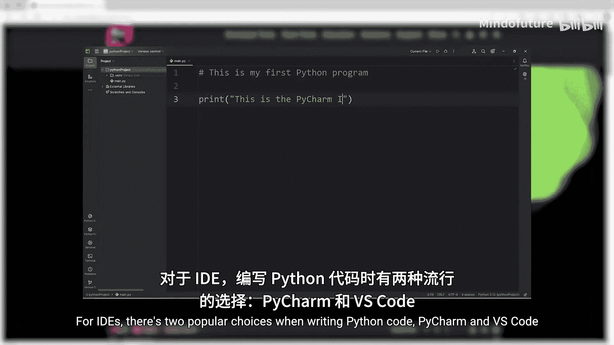

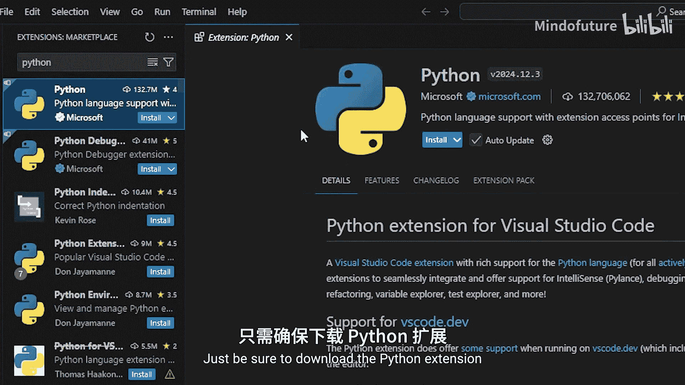

接下来，我们需要一个集成开发环境（IDE），这是一个让我们编写代码的软件。对于Python开发，有两个流行的选择：PyCharm和VS Code。

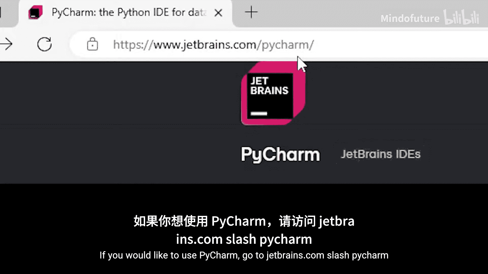

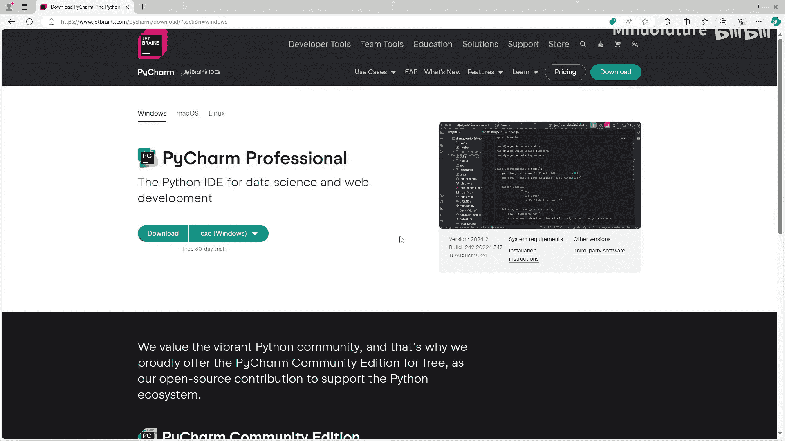

如果你已经在使用VS Code，可以继续使用它，只需确保安装了Python扩展插件即可。对于编程新手，我个人认为PyCharm更友好。

如果你想使用PyCharm，请按以下步骤操作：

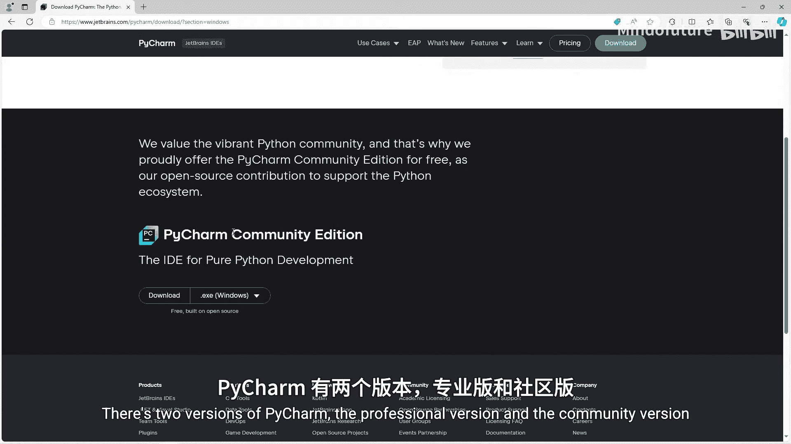

1.  访问 [jetbrains.com/pycharm](https://www.jetbrains.com/pycharm)。
2.  点击绿色的“Download”按钮。
3.  选择“Community”（社区版），这是一个免费版本，功能对于初学者来说完全足够。
4.  根据你的操作系统（如Windows、macOS）选择对应的安装包进行下载。
5.  运行下载的安装程序，按照提示完成安装。你可以选择创建桌面快捷方式。

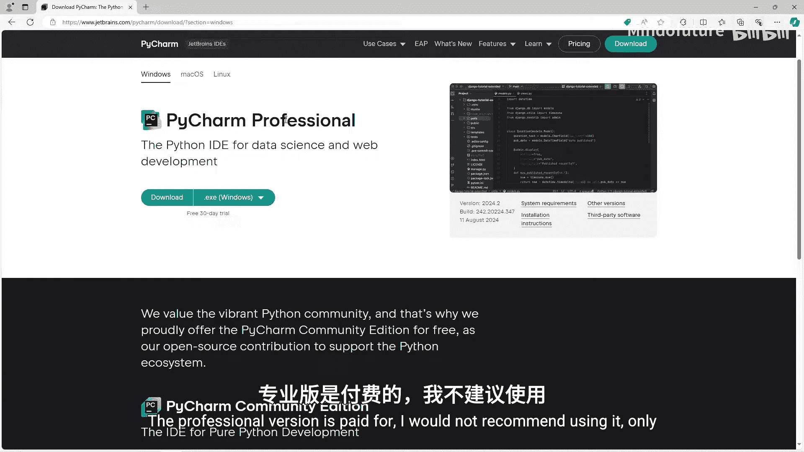

安装完成后，运行PyCharm。

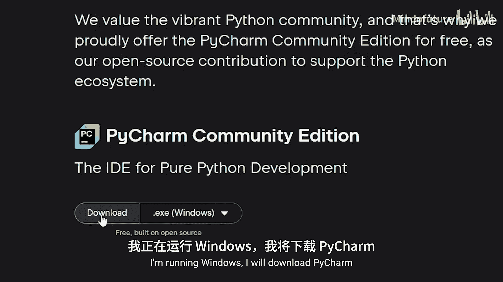

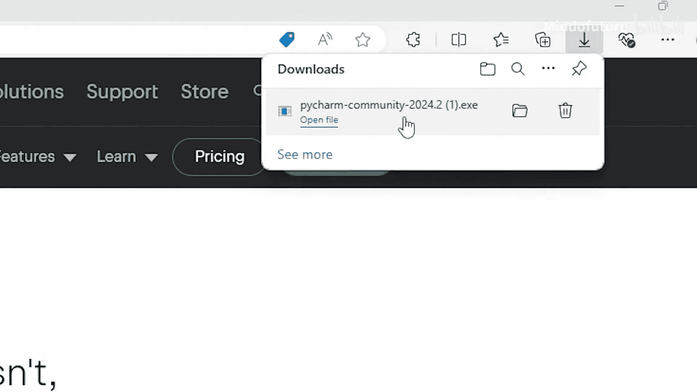

## 创建你的第一个Python项目

打开PyCharm后，让我们开始创建第一个项目。

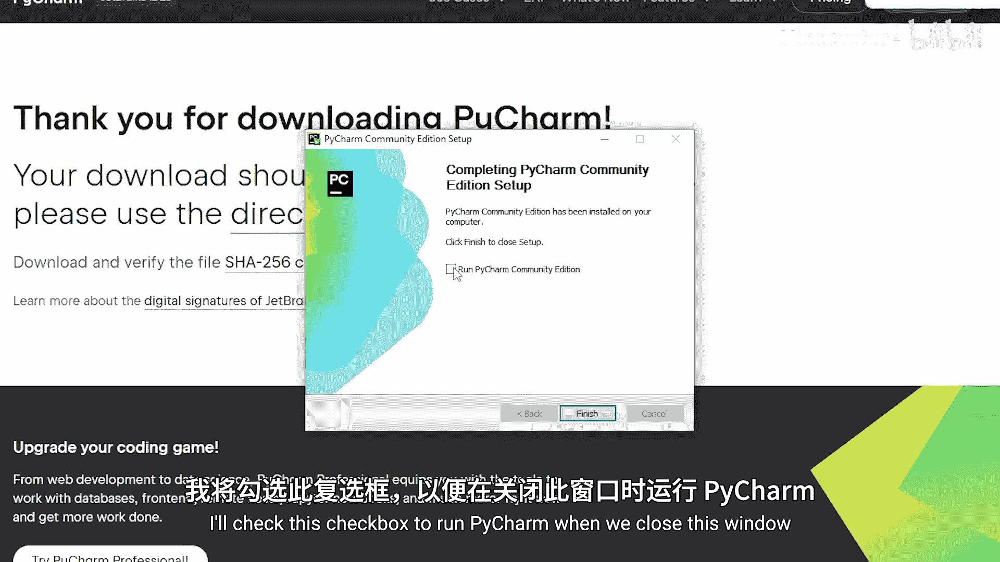

1.  点击“New Project”。
2.  你可以为项目命名，并选择保存位置。这里我们保持默认设置即可。
3.  在“Python Interpreter”部分，确保选择了我们刚才安装的最新版Python。
4.  点击“Create”创建项目。

项目创建好后，我们需要在项目中创建一个Python文件。

1.  在左侧的项目文件区域右键，选择 **New -> Python File**。
2.  将文件命名为 `main.py`（或其他你喜欢的名字）。Python文件的后缀是 `.py`。

现在，我们可以在 `main.py` 文件中开始编写代码了。

## 编写并运行代码

我们将学习一个最基本的函数：`print()`，它的作用是将内容输出到控制台。

在 `main.py` 文件中，输入以下代码：
```python
print("我喜欢披萨")
```
要运行这段程序，点击PyCharm右上角的绿色三角形运行按钮。你会在下方的控制台窗口中看到输出结果：“我喜欢披萨”。

你可以添加更多的 `print` 语句来输出多行内容。例如：
```python
print("我喜欢披萨")
print("它非常美味")
```
再次运行程序，控制台会依次显示这两行文字。

## 使用代码注释

在编程中，注释是用来为自己或他人解释代码的笔记，Python解释器会忽略它们，不会输出。

在Python中，使用井号 `#` 来添加单行注释。
```python
# 这是我的第一个Python程序
print("我喜欢披萨")
print("它非常美味")
```
当你运行包含注释的代码时，注释部分不会显示在输出中。

## 总结

本节课我们一起学习了如何搭建Python开发环境。我们完成了两个关键软件的下载与安装：**Python解释器**和**PyCharm IDE**。接着，我们创建了第一个Python项目，并编写了简单的 `print()` 语句来向控制台输出信息。最后，我们还了解了如何使用 `#` 符号添加代码注释。

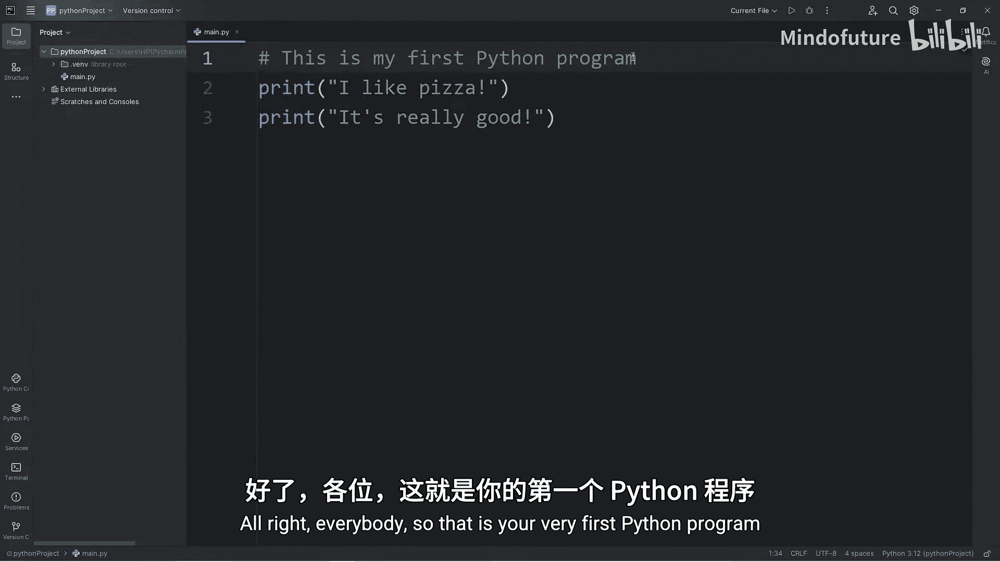

恭喜你！你已经成功迈出了Python编程的第一步。在下一个主题中，我们将探讨一个更核心的概念：**变量**。