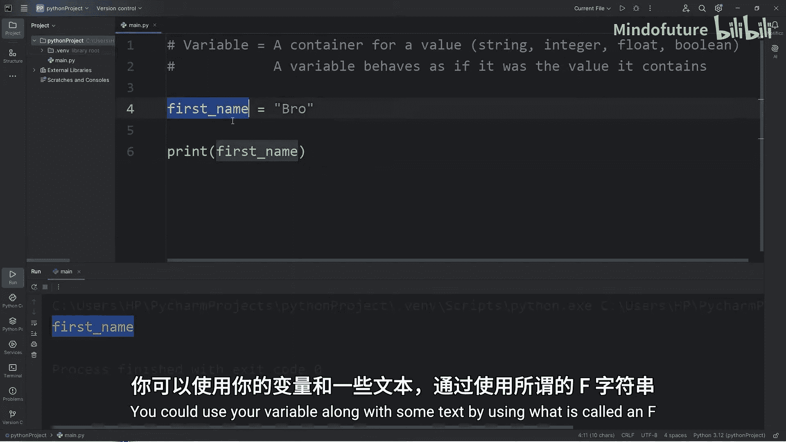
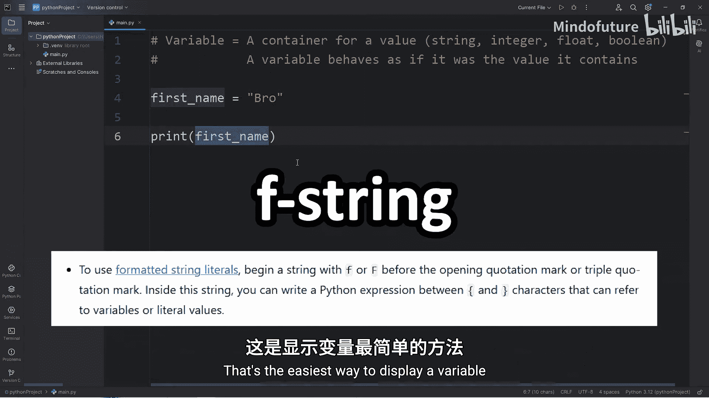
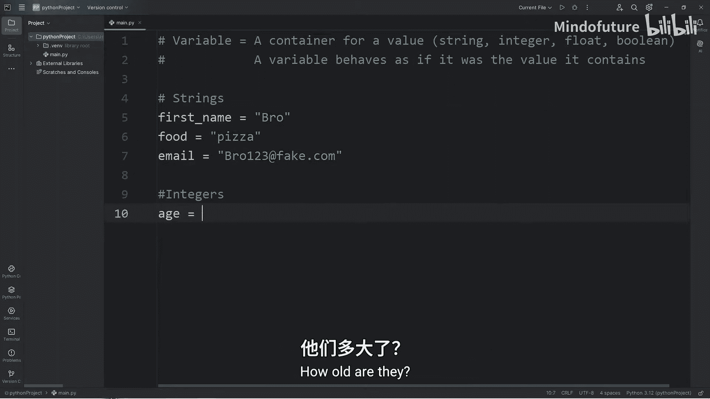
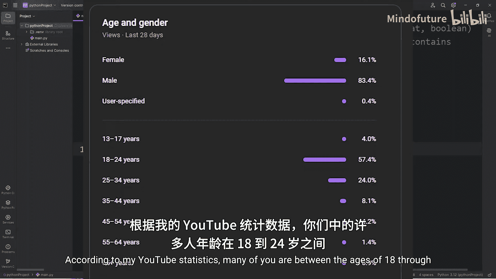
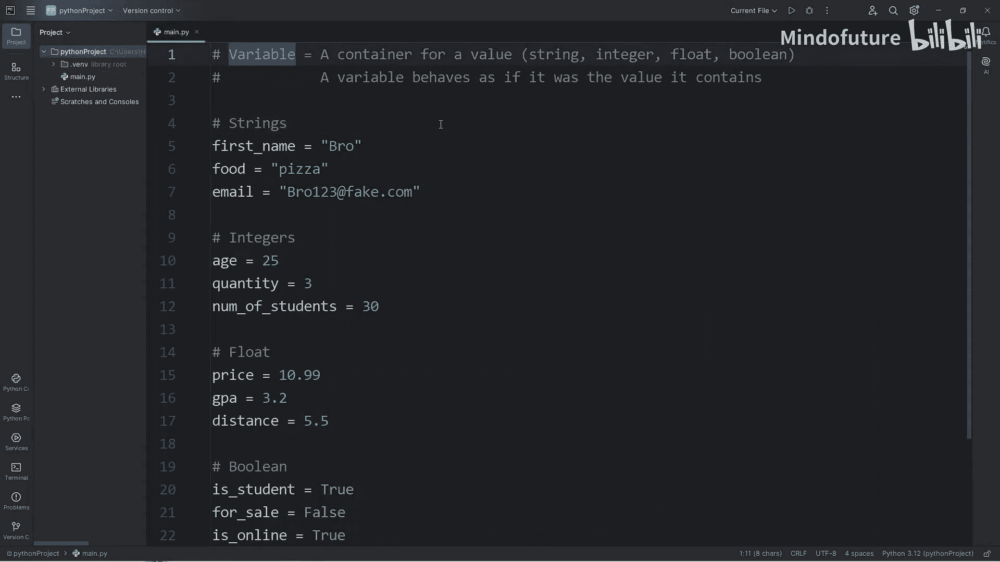

# 002：变量

在本节课中，我们将要学习Python编程中的核心概念之一：变量。我们将了解什么是变量，以及四种基本的数据类型：字符串、整数、浮点数和布尔值。

## 什么是变量？🤔

变量是一个用于存储值的容器。变量的行为就像它包含的那个值一样。每个变量都应该有一个唯一的名称。



## 字符串（String）📝



字符串是由一系列文本字符组成的数据类型。它可以用双引号或单引号表示。

以下是创建和使用字符串变量的步骤：

1.  **赋值**：使用等号（`=`）为变量赋值。
    ```python
    first_name = "Bro"
    ```
2.  **打印变量**：在`print`语句中直接使用变量名（不加引号）来输出其值。
    ```python
    print(first_name)  # 输出：Bro
    ```
3.  **使用F-String格式化**：F-String（格式化字符串）是一种便捷的将变量插入文本的方法。在字符串前加上字母`f`，然后在字符串内部用花括号`{}`包裹变量名。
    ```python
    print(f"Hello, {first_name}")  # 输出：Hello, Bro
    ```

让我们创建更多字符串变量来巩固理解：

```python
food = "pizza"
email = "bro123@fake.com"
print(f"You like {food}")  # 输出：You like pizza
print(f"Your email is {email}")  # 输出：Your email is bro123@fake.com
```



## 整数（Integer）🔢



整数是不带小数部分的数字。它们可以用于算术运算。

上一节我们介绍了文本数据，本节中我们来看看数字数据。以下是创建整数变量的例子：

```python
age = 25
quantity = 3
num_of_students = 30
print(f"You are {age} years old.")  # 输出：You are 25 years old.
print(f"You are buying {quantity} items.")  # 输出：You are buying 3 items.
print(f"Your class has {num_of_students} students.")  # 输出：Your class has 30 students.
```

**重要提示**：定义整数时，**不要**加引号，否则它会被当作字符串处理。

## 浮点数（Float）⚖️

浮点数是包含小数部分的数字。

了解了整数之后，我们来看看更精确的数字表示方式。以下是浮点数变量的例子：

```python
price = 10.99
gpa = 3.2
distance = 5.5
print(f"The price is ${price}")  # 输出：The price is $10.99
print(f"Your GPA is {gpa}")  # 输出：Your GPA is 3.2
print(f"You ran {distance} km")  # 输出：You ran 5.5 km
```

## 布尔值（Boolean）✅❌

布尔值是一种逻辑数据类型，只有两个可能的值：`True`（真）或`False`（假）。注意首字母必须大写。

布尔值通常不直接输出，而是用于程序内部的逻辑判断，比如`if`语句。

以下是布尔值变量的例子：

```python
is_student = True
for_sale = True
is_online = True
```

现在，我们来看看如何将布尔值与`if`语句结合使用：

```python
if is_student:
    print("You are a student.")
else:
    print("You are not a student.")
# 输出：You are a student.

if for_sale:
    print("That item is for sale.")
else:
    print("That item is not available.")
# 输出：That item is for sale.

if is_online:
    print("You are online.")
else:
    print("You are offline.")
# 输出：You are online.
```

## 总结📚

本节课中我们一起学习了Python中的变量。我们了解到：

*   **变量**是一个可重复使用的、用于存储值的容器。
*   我们探讨了四种基本数据类型：
    *   **字符串（String）**：一系列文本字符。
    *   **整数（Integer）**：不带小数部分的数字。
    *   **浮点数（Float）**：包含小数部分的数字。
    *   **布尔值（Boolean）**：逻辑值，只能是`True`或`False`。



**课后练习**：在评论区尝试创建并分享四个变量，分别是一个字符串、一个整数、一个浮点数和一个布尔值，并尽量想出独特的例子。