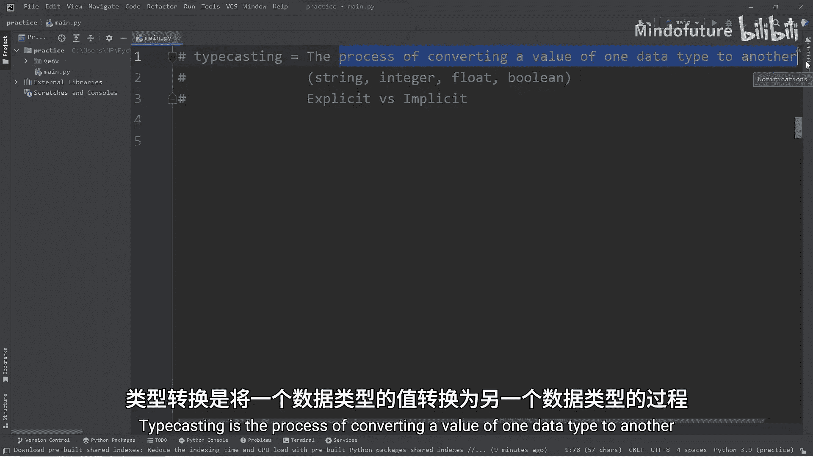
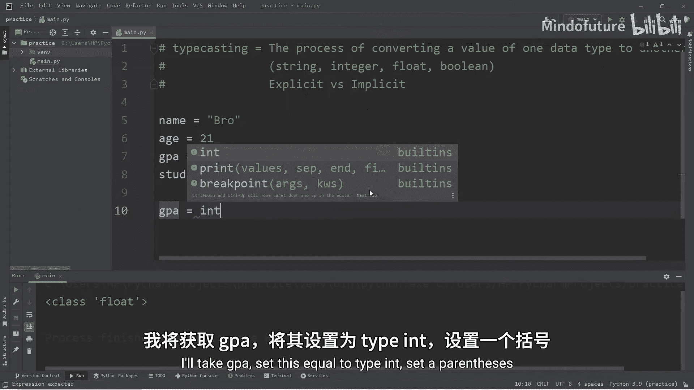
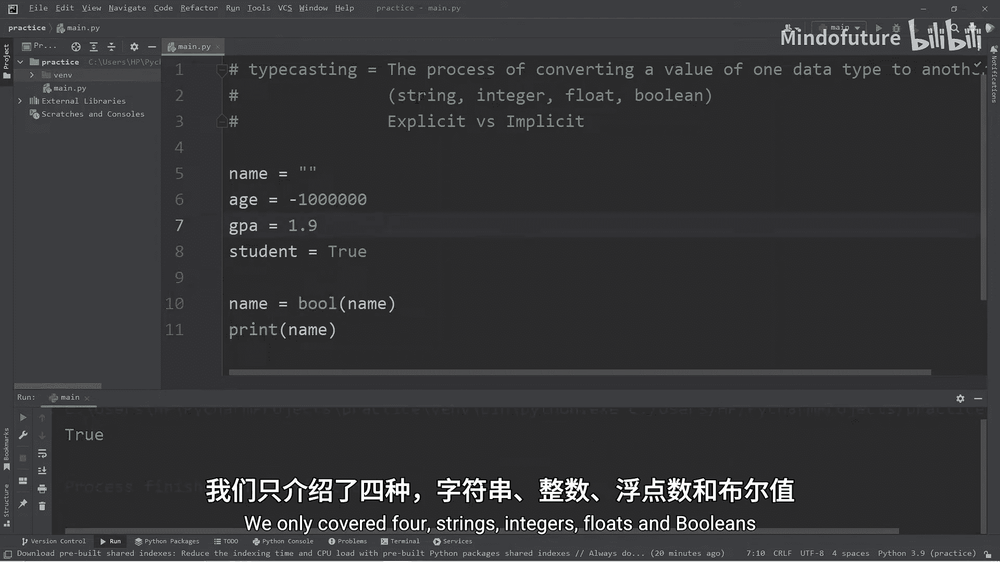
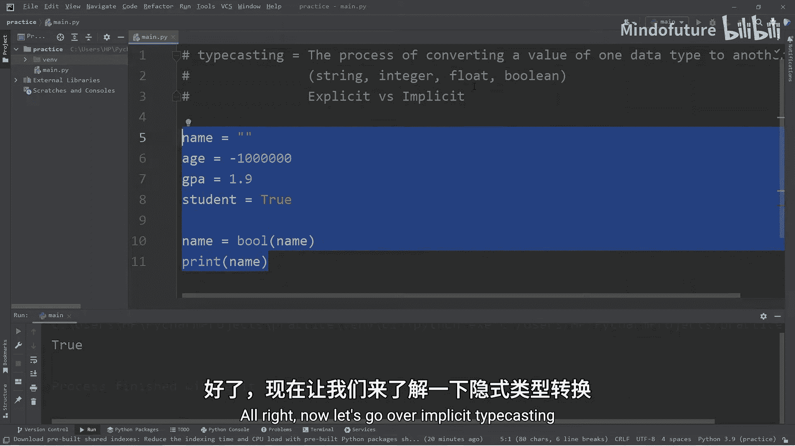
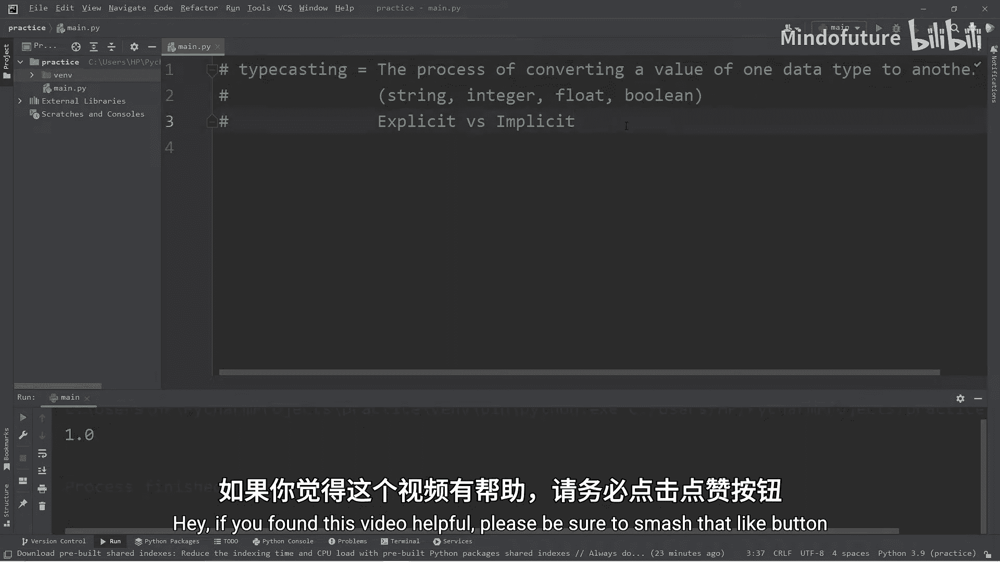

# 003：Python中的类型转换

在本节课中，我们将要学习Python中的类型转换。类型转换是将一个数据类型的值转换为另一个数据类型的过程。理解这个概念对于处理用户输入、进行数学运算以及在不同数据类型间传递数据至关重要。

## 概述：什么是类型转换？🤔

类型转换，也称为类型铸造，是编程中一个基础且重要的概念。它允许我们将一种数据类型的值转换为另一种数据类型。例如，我们可以将整数转换为浮点数，将字符串转换为布尔值，或者将浮点数转换为字符串。

上一节我们介绍了Python的基本数据类型，本节中我们来看看如何在这些类型之间进行转换。



## 为什么需要类型转换？💡

在实际编程中，类型转换非常有用。主要有以下几个原因：

1.  **处理用户输入**：当使用 `input()` 函数获取用户输入时，无论用户输入什么，程序都会将其视为字符串。如果我们需要对输入的数字进行数学计算，就必须先将字符串转换为整数或浮点数。
2.  **数据格式化与处理**：例如，我们有一个浮点数，但只需要它的整数部分。一种方法就是将其转换为整数类型，这会自动截断小数部分。
3.  **逻辑判断**：有时我们需要根据一个值是否存在（比如用户是否输入了名字）来进行判断，这时可以将字符串转换为布尔值。

## 显式类型转换 ✍️

显式类型转换需要我们手动使用Python内置的函数来指定转换的目标类型。这是最常用和最清晰的方式。

以下是Python中用于显式类型转换的四个核心函数：

*   `int()`：将值转换为整数。
*   `float()`：将值转换为浮点数。
*   `str()`：将值转换为字符串。
*   `bool()`：将值转换为布尔值。

为了演示，我们先创建几个不同数据类型的变量：

```python
name = “小明”    # 字符串
age = 21         # 整数
gpa = 1.9        # 浮点数
student = True   # 布尔值
```

我们可以使用 `type()` 函数来查看任何变量的数据类型：

```python
print(type(name))   # 输出：<class ‘str’>
print(type(age))    # 输出：<class ‘int’>
print(type(gpa))    # 输出：<class ‘float’>
print(type(student))# 输出：<class ‘bool’>
```

现在，让我们开始进行显式转换的练习。

**1. 转换为浮点数**
我们可以将整数 `age` 转换为浮点数：



```python
age = float(age)
print(age)         # 输出：21.0
print(type(age))   # 输出：<class ‘float’>
```

**2. 转换为整数**
我们可以将浮点数 `gpa` 转换为整数。注意，转换会直接截断小数部分，而不是四舍五入：

```python
gpa = int(gpa)
print(gpa)         # 输出：1
print(type(gpa))   # 输出：<class ‘int’>
```

**3. 转换为字符串**
我们可以将布尔值 `student` 转换为字符串：

```python
student = str(student)
print(student)      # 输出：True
print(type(student))# 输出：<class ‘str’>
```

**4. 转换为布尔值**
将其他类型转换为布尔值遵循一些特定规则：
*   数字：**0** 转换为 `False`，**任何非零值**（正数、负数）都转换为 `True`。
*   字符串：**空字符串 `“”`** 转换为 `False`，**任何非空字符串**（包括只包含空格的字符串）都转换为 `True`。

```python
# 转换数字
age = 21
age = bool(age)
print(age) # 输出：True

age = 0
age = bool(age)
print(age) # 输出：False

# 转换字符串
name = “小明”
name = bool(name)
print(name) # 输出：True

name = “”
name = bool(name)
print(name) # 输出：False
```

布尔转换在检查用户是否输入了内容时非常有用。

## 隐式类型转换 🤖

隐式类型转换由Python解释器自动完成，通常发生在不同数据类型的值进行混合运算时。

最常见的例子是整数和浮点数之间的运算：

```python
x = 2    # 整数
y = 2.0  # 浮点数



# 整数除以浮点数，结果会自动提升为精度更高的浮点数类型
x = x / y
print(x)         # 输出：1.0
print(type(x))   # 输出：<class ‘float’>
```



在这个例子中，Python自动将整数 `2` 隐式转换为浮点数 `2.0` 以执行除法，最终结果也是浮点数。

## 总结 📚

本节课中我们一起学习了Python中的类型转换。

*   **类型转换**是将一种数据类型的值转换为另一种数据类型的过程。
*   **显式转换**使用内置函数（`int()`, `float()`, `str()`, `bool()`）手动进行，代码意图清晰。
*   **隐式转换**由Python在执行表达式（如整数与浮点数运算）时自动完成。
*   掌握类型转换对于处理用户输入、数据计算和程序逻辑控制至关重要。



记住核心的转换函数，并在需要明确控制数据类型时主动使用它们，这将帮助你写出更健壮、更少错误的代码。