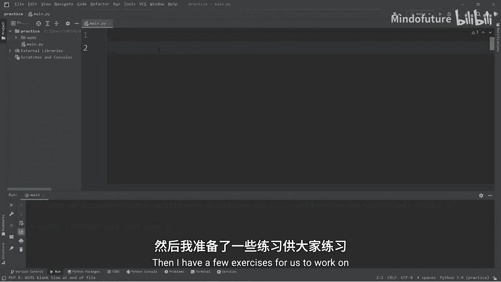
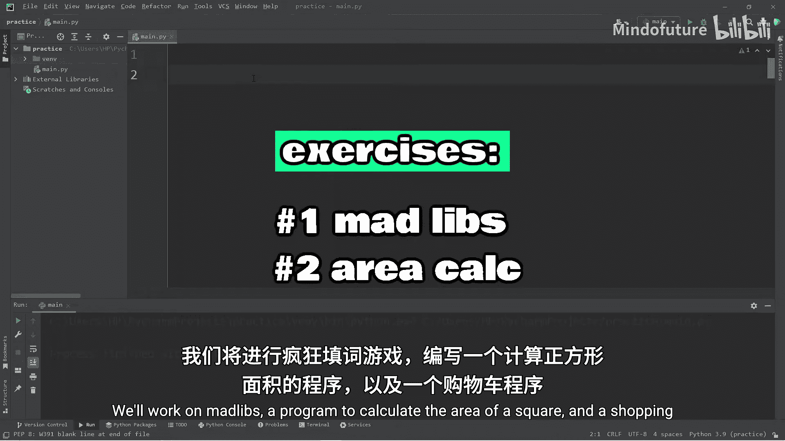
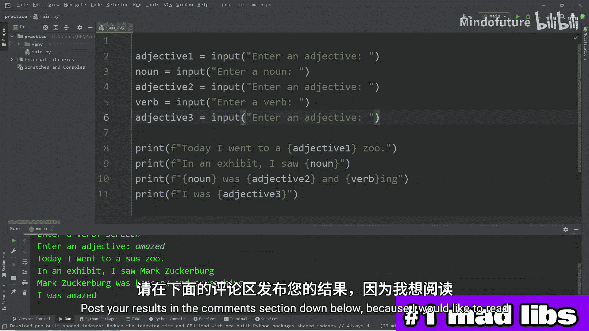
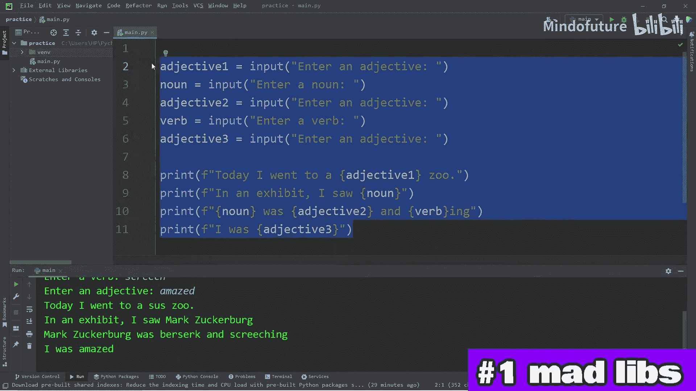
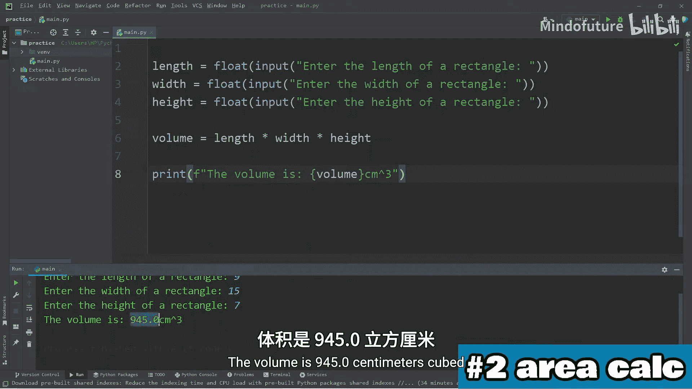
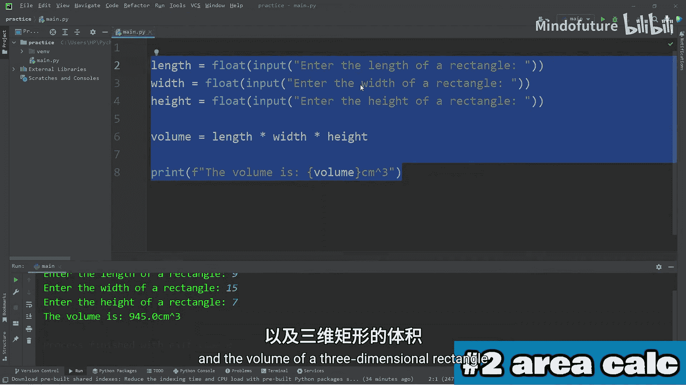
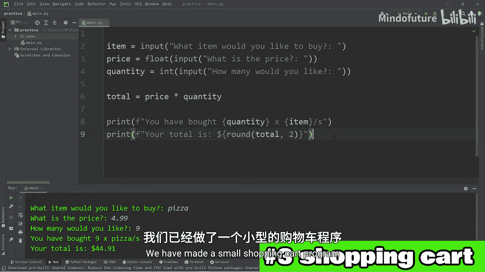

Python入门教程：P04：用户输入与练习

在本节课中，我们将学习如何在Python中接收用户输入。我们将通过`input()`函数从控制台获取信息，并学习如何将输入的数据转换为合适的类型（如整数或浮点数）以便进行计算。课程包含三个实践练习：创建一个“疯狂填词”游戏、计算矩形面积以及制作一个简易购物车程序。

---





### 用户输入基础

上一节我们介绍了变量的概念，本节中我们来看看如何从用户那里获取信息并存储到变量中。

在Python中，我们使用`input()`函数来接收用户输入。该函数会暂停程序运行，等待用户在控制台输入内容并按回车键。输入的内容会以字符串的形式返回。

以下是一个基本示例，询问用户姓名：

```python
name = input("Enter your name: ")
print(f"Hello, {name}!")
```

运行此程序时，控制台会显示提示“Enter your name:”，等待你输入姓名。输入后，程序会打印问候语。

---

### 输入数据的类型转换

当我们接受用户输入时，输入的数据**总是字符串类型**。如果我们需要将其用于数学运算，就必须进行类型转换。

例如，如果我们询问年龄并想将其加1：

```python
age = input("Enter your age: ")
# 直接加1会导致错误，因为 age 是字符串
# age = age + 1  # 错误！
```

为了进行运算，我们需要使用`int()`或`float()`函数将字符串转换为数字：

```python
age = int(input("Enter your age: "))
age = age + 1
print(f"Next year you will be {age} years old.")
```

我们也可以在一行代码中完成输入和类型转换，这更为简洁。

---

### 练习一：创建“疯狂填词”游戏 🎭

现在，让我们应用所学知识来创建一个“疯狂填词”游戏。在这个游戏中，用户需要提供一些词语（如名词、动词、形容词），程序会将这些词语填入一个预设的故事模板中，生成一个有趣的故事。

以下是创建游戏的步骤：

1.  设计一个故事模板，其中留出空白让用户填写。
2.  使用`input()`函数提示用户输入不同类型的词语。
3.  将用户输入存储到变量中。
4.  使用f-string将变量填入故事模板并打印结果。

示例代码：

```python
# 请求用户输入
adjective1 = input("Enter an adjective: ")
noun = input("Enter a noun: ")
adjective2 = input("Enter an adjective: ")
verb = input("Enter a verb: ")
adjective3 = input("Enter an adjective: ")

# 使用f-string填充故事
story = f"Today I went to a {adjective1} zoo. In an exhibit, I saw a {noun}. The {noun} was {adjective2} and {verb}ing. I was {adjective3}!"
print(story)
```

运行程序，根据提示输入词语，看看会生成什么有趣的故事吧！你可以在评论区分享你的故事。

---



### 练习二：计算矩形面积 📐



上一节我们创建了一个文字游戏，本节中我们来看看一个更实用的例子：计算几何图形的面积。

在这个练习中，我们将编写一个程序，接收用户输入的矩形长度和宽度，然后计算并输出其面积。如果需要，我们还可以扩展程序来计算三维长方体的体积。

以下是实现步骤：

1.  使用`input()`获取长度和宽度，并立即用`float()`转换为浮点数。
2.  使用公式 **面积 = 长度 × 宽度** 进行计算。
3.  将结果打印给用户。

示例代码：

```python
# 获取用户输入并转换为数字
length = float(input("Enter the length of the rectangle (cm): "))
width = float(input("Enter the width of the rectangle (cm): "))

# 计算面积
area = length * width
print(f"The area is {area} cm².")

# 扩展：计算长方体体积
height = float(input("Enter the height of the rectangle (cm): "))
volume = length * width * height
print(f"The volume is {volume} cm³.")
```



尝试运行程序并输入不同的数值，验证计算结果。



---

### 练习三：制作购物车程序 🛒

最后，我们来制作一个简易的购物车程序。这个程序将演示如何处理多个输入并进行简单的财务计算。

程序需要完成以下功能：
1.  询问用户想购买的商品名称、单价和数量。
2.  根据公式 **总价 = 单价 × 数量** 计算总金额。
3.  使用`round()`函数将总价格式化为两位小数。
4.  向用户显示清晰的订单摘要。

以下是实现代码：

```python
# 获取商品信息
item = input("What item would you like to buy? ")
price = float(input("What is the price of the item? $"))
quantity = int(input("How many would you like? "))

# 计算总价
total = price * quantity

# 格式化输出，保留两位小数
print(f"You have bought {quantity} {item}(s).")
print(f"Your total is: ${round(total, 2)}")
```

运行程序，模拟购买几件商品，检查总价计算是否正确。

---

### 总结



本节课中我们一起学习了Python中用户输入的核心知识。我们掌握了使用`input()`函数获取用户输入，理解了输入数据默认为字符串类型，并学会了使用`int()`和`float()`进行类型转换以用于计算。通过三个循序渐进的练习——“疯狂填词”游戏、矩形面积计算器和购物车程序——我们巩固了这些概念，并看到了它们在实际小程序中的应用。记住，接收和处理用户输入是与程序交互的基础，是构建更复杂应用的第一步。