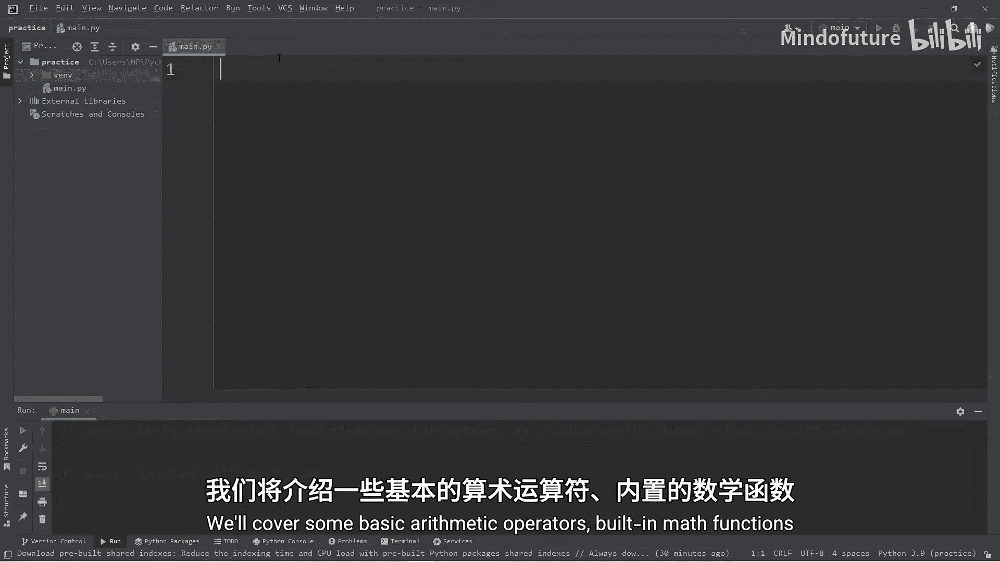
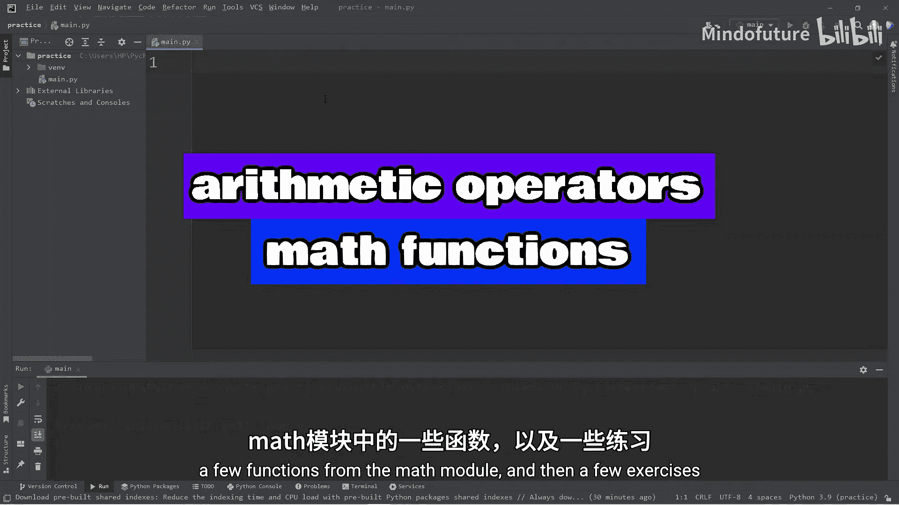
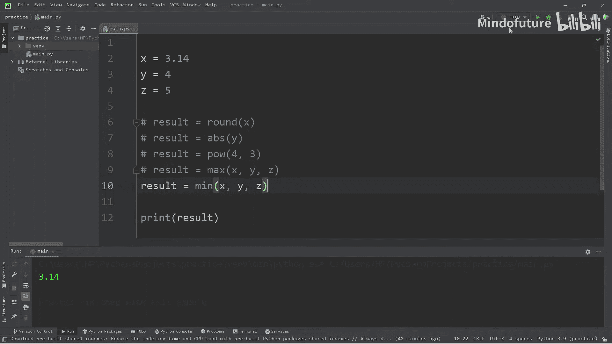
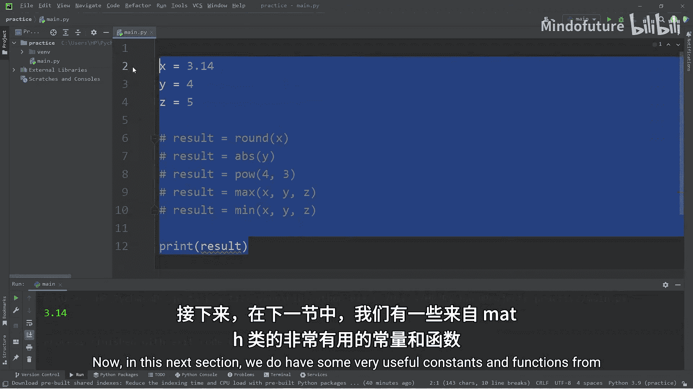
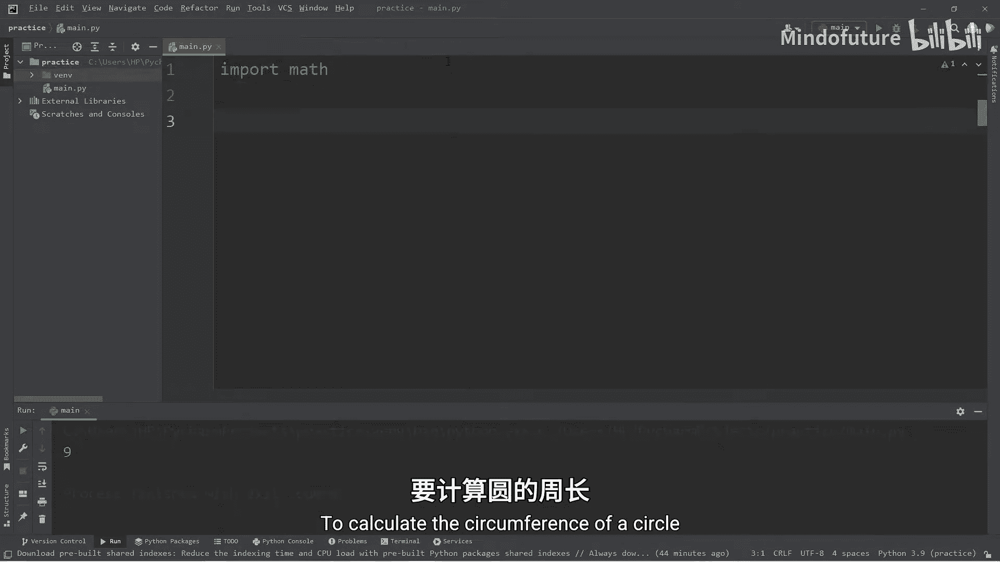
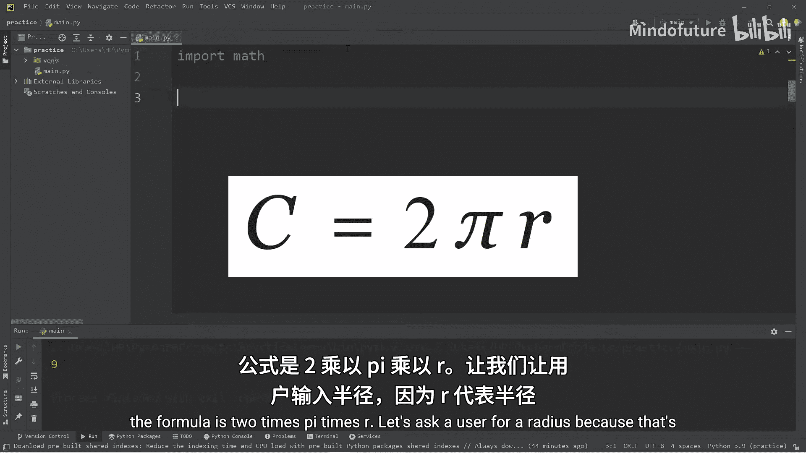
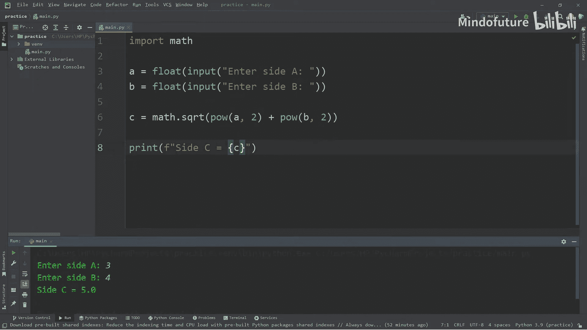

# 005：Python中的数学运算与练习 🧮

在本节课中，我们将学习Python中所有必要的数学运算知识。内容涵盖基础算术运算符、内置数学函数、`math`模块中的函数，并通过几个练习来巩固所学。课程内容较多，我们将分节进行讲解。



## 基础算术运算符



上一节我们介绍了课程概述，本节中我们来看看最基础的算术运算符。假设我们有一个变量 `friends`，初始值为0。

```python
friends = 0
```

以下是Python中常用的算术运算符及其用法：

*   **加法运算符 (`+`)**: 用于将变量增加1。
    ```python
    friends = friends + 1
    ```
    可以使用**增强赋值运算符** `+=` 来简化：
    ```python
    friends += 1
    ```
    打印 `friends` 将得到结果 `1`。

*   **减法运算符 (`-`)**: 用于减少变量的值。
    ```python
    friends = friends - 2
    ```
    其增强赋值运算符版本为：
    ```python
    friends -= 2
    ```

*   **乘法运算符 (`*`)**: 用于将变量乘以一个数。
    ```python
    friends = friends * 3
    ```
    其增强赋值运算符版本为：
    ```python
    friends *= 3
    ```

*   **除法运算符 (`/`)**: 用于将变量除以一个数。
    ```python
    friends = friends / 2
    ```
    其增强赋值运算符版本为：
    ```python
    friends /= 2
    ```

*   **指数运算符 (`**`)**: 用于计算一个数的幂。
    ```python
    friends = friends ** 2
    ```
    其增强赋值运算符版本为：
    ```python
    friends **= 2
    ```

*   **取模运算符 (`%`)**: 用于获取除法运算的余数。例如，`10 % 3` 的结果是 `1`，因为10除以3余1。这个运算符常用来判断一个数是奇数还是偶数（偶数除以2的余数为0，奇数则为1）。
    ```python
    remainder = friends % 3
    ```

## 内置数学函数

了解了基础运算符后，我们来看看Python内置的一些实用数学函数。假设我们有三个变量：

```python
x = 3.14
y = -4
z = 5
```

以下是几个常用的内置函数：

*   **`round()` 函数**: 用于对数字进行四舍五入。
    ```python
    result = round(x)  # 结果为 3
    ```

*   **`abs()` 函数**: 用于获取数字的绝对值（即该数到0的距离）。
    ```python
    result = abs(y)    # 结果为 4
    ```

*   **`pow()` 函数**: 用于计算一个数的幂。`pow(4, 3)` 表示4的3次方。
    ```python
    result = pow(4, 3) # 结果为 64
    ```

*   **`max()` 函数**: 用于找出多个值中的最大值。
    ```python
    result = max(x, y, z) # 结果为 5
    ```

*   **`min()` 函数**: 用于找出多个值中的最小值。
    ```python
    result = min(x, y, z) # 结果为 -4
    ```

## math模块中的函数与常量

对于更高级的数学运算，我们需要导入Python的 `math` 模块。首先在代码开头添加：

```python
import math
```



导入模块后，就可以使用其中的函数和常量了：



*   **常量 `math.pi`**: 提供圆周率π的近似值。
    ```python
    print(math.pi) # 输出 3.141592653589793
    ```

*   **常量 `math.e`**: 提供自然常数e的近似值。
    ```python
    print(math.e)  # 输出 2.718281828459045
    ```

*   **`math.sqrt()` 函数**: 用于计算一个数的平方根。
    ```python
    x = 9
    result = math.sqrt(x) # 结果为 3.0
    ```

*   **`math.ceil()` 函数**: 用于将一个浮点数向上取整（向正无穷方向）。
    ```python
    x = 9.1
    result = math.ceil(x) # 结果为 10
    ```

*   **`math.floor()` 函数**: 用于将一个浮点数向下取整（向负无穷方向）。
    ```python
    x = 9.9
    result = math.floor(x) # 结果为 9
    ```

## 练习：运用数学知识解决问题

理论需要结合实践，下面我们通过几个练习来运用刚才学到的知识。





### 练习1：计算圆的周长 🥧

圆的周长公式为：**C = 2 * π * r**。我们将编写程序让用户输入半径，然后计算并输出周长。

```python
import math

radius = float(input("请输入圆的半径："))
circumference = 2 * math.pi * radius
print(f"圆的周长为：{round(circumference, 2)} cm")
```

### 练习2：计算圆的面积 🔵

圆的面积公式为：**A = π * r²**。这个练习与上一个类似。

```python
import math

radius = float(input("请输入圆的半径："))
area = math.pi * pow(radius, 2)
print(f"圆的面积为：{round(area, 2)} cm²")
```

### 练习3：计算直角三角形斜边 📐

根据勾股定理，直角三角形斜边c的长度公式为：**c = √(a² + b²)**。

```python
import math

a = float(input("请输入直角边A的长度："))
b = float(input("请输入直角边B的长度："))
c = math.sqrt(pow(a, 2) + pow(b, 2))
print(f"斜边C的长度为：{c}")
```

## 总结



本节课中我们一起学习了Python中的核心数学运算。我们从最基础的加减乘除、指数和取模运算符开始，然后探索了Python内置的 `round()`, `abs()`, `pow()`, `max()`, `min()` 等函数。接着，我们引入了 `math` 模块，学习了如何使用 `math.pi`, `math.sqrt()`, `math.ceil()`, `math.floor()` 等工具来处理更复杂的数学计算。最后，我们通过计算圆的周长与面积、求解直角三角形斜边三个练习，巩固了所有这些知识。掌握这些数学工具，将为后续的编程学习打下坚实的基础。在下一节课中，我们将学习字符串格式化的相关内容。