# 008：体重转换器练习 🏋️‍♂️

在本节课中，我们将要学习如何使用Python的`if`语句来创建一个体重单位转换器程序。该程序能够根据用户的选择，将体重在磅（pounds）和公斤（kilograms）之间进行转换。

## 概述

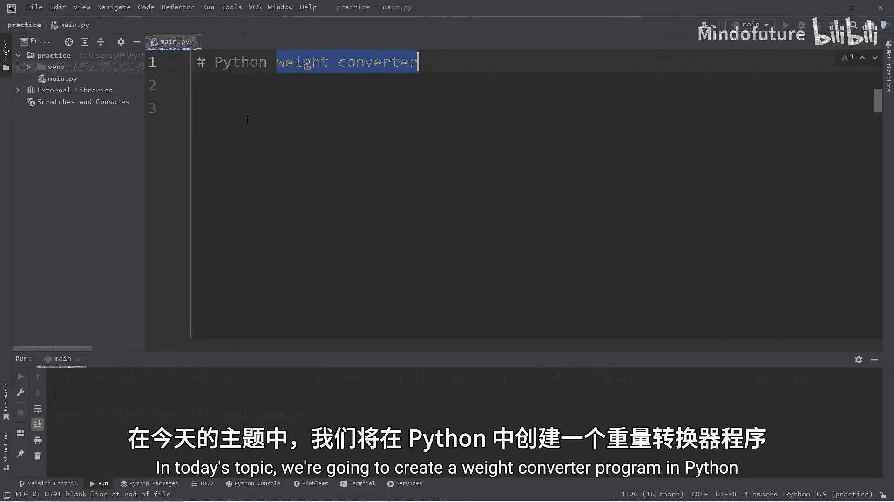

我们将创建一个交互式程序，其核心逻辑是：
1.  获取用户输入的体重数值。
2.  获取用户输入的体重单位（公斤`K`或磅`L`）。
3.  使用`if`语句判断单位，并进行相应的换算。
4.  输出转换后的结果。

上一节我们介绍了`if`语句的基本用法，本节中我们来看看如何将其应用到一个实际的编程练习中。

## 程序构建步骤

以下是构建体重转换器程序的具体步骤。

### 第一步：获取用户输入

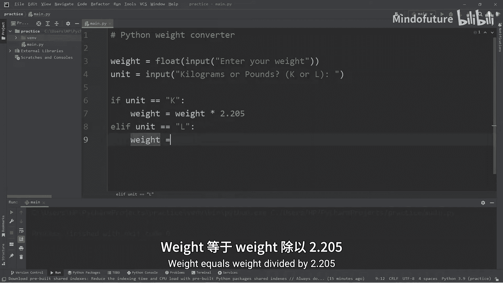

首先，我们需要获取用户输入的体重数值和单位。

```python
weight = float(input("请输入您的体重："))
unit = input("请输入单位（K 代表公斤， L 代表磅）：")
```
*   `input()`函数用于获取用户输入。
*   `float()`函数将输入的字符串转换为浮点数，以便进行数学计算。

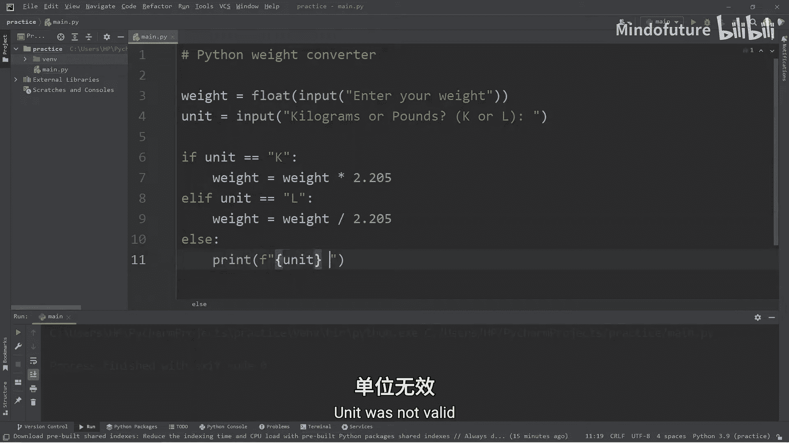

### 第二步：使用if语句进行判断和转换

接下来，我们使用`if-elif-else`语句来判断用户输入的单位，并执行相应的换算。

```python
if unit == "K":
    # 将公斤转换为磅
    weight = weight * 2.205
    unit = "LBS"
elif unit == "L":
    # 将磅转换为公斤
    weight = weight / 2.205
    unit = "KGS"
else:
    # 处理无效输入
    print(f"您输入的单位 ‘{unit}’ 无效。")
```
*   **核心公式**：
    *   公斤转磅：`weight_in_pounds = weight_in_kilograms * 2.205`
    *   磅转公斤：`weight_in_kilograms = weight_in_pounds / 2.205`
*   在转换的同时，我们也更新`unit`变量的值，以便在输出时显示正确的单位。

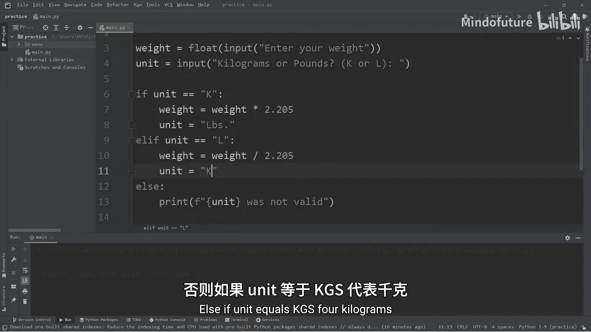

### 第三步：格式化并输出结果

最后，我们需要输出转换后的结果。为了提升可读性，我们使用`round()`函数对结果进行四舍五入，并保留一位小数。

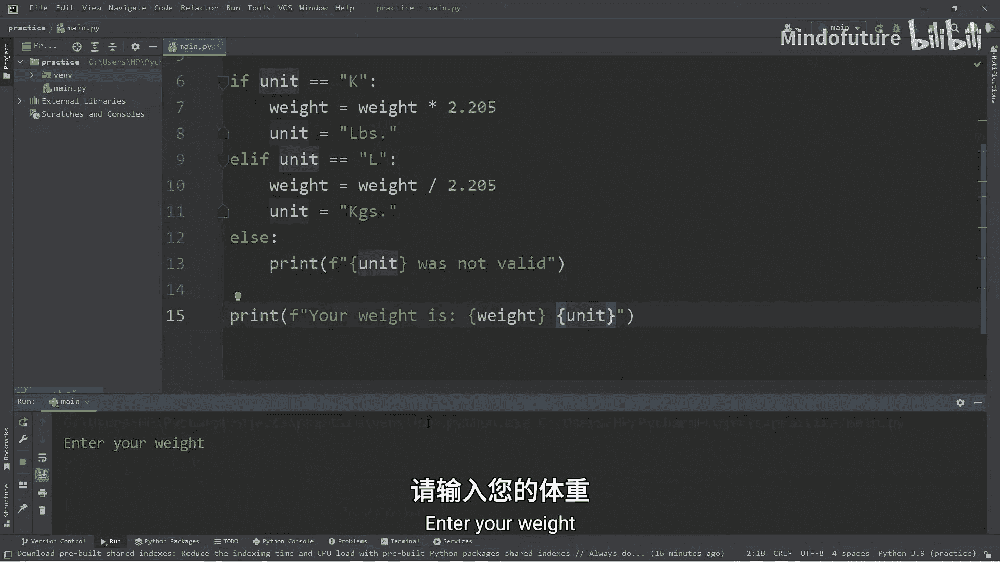

```python
if unit == "LBS" or unit == "KGS":
    print(f"您的体重是 {round(weight, 1)} {unit}。")
```
*   `round(weight, 1)`：将`weight`变量的值四舍五入到小数点后一位。
*   注意，输出语句被放在了`if`条件内，只有当用户输入了有效的单位（`K`或`L`）时才会执行，避免了在输入无效时也打印结果。

## 完整程序代码

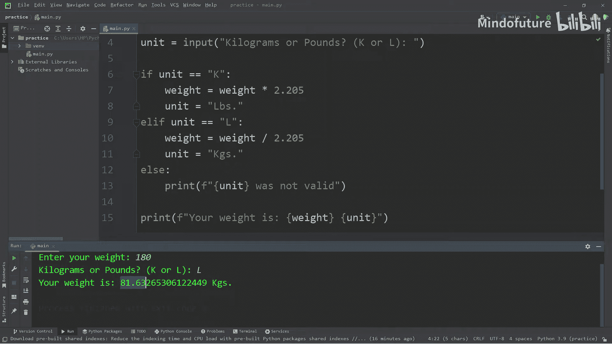

将以上所有步骤组合起来，就得到了完整的体重转换器程序。

```python
# 获取用户输入
weight = float(input("请输入您的体重："))
unit = input("请输入单位（K 代表公斤， L 代表磅）：")

# 判断单位并进行转换
if unit == "K":
    weight = weight * 2.205
    unit = "LBS"
elif unit == "L":
    weight = weight / 2.205
    unit = "KGS"
else:
    print(f"您输入的单位 ‘{unit}’ 无效。")

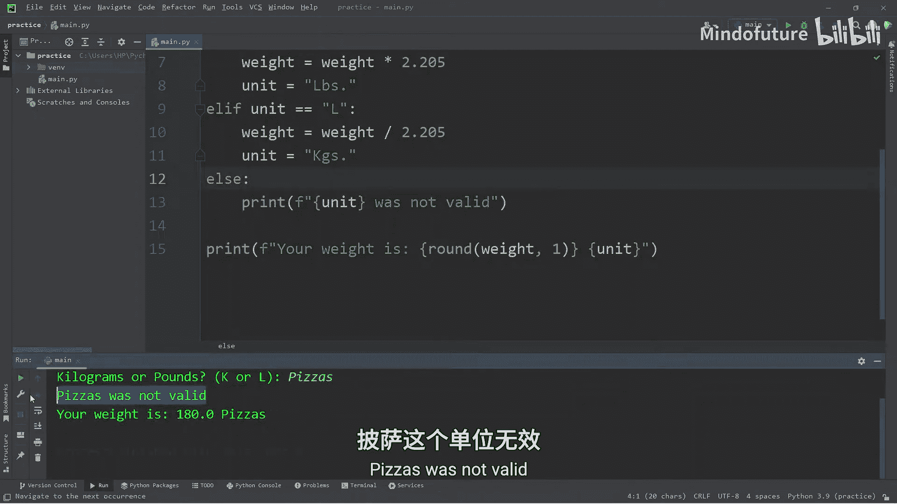

# 输出转换结果
if unit == "LBS" or unit == "KGS":
    print(f"您的体重是 {round(weight, 1)} {unit}。")
```

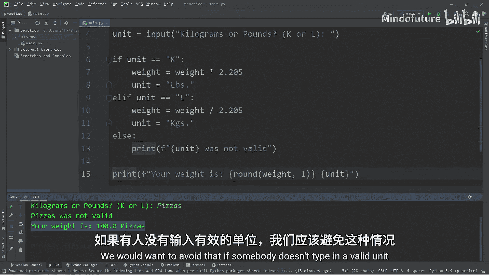

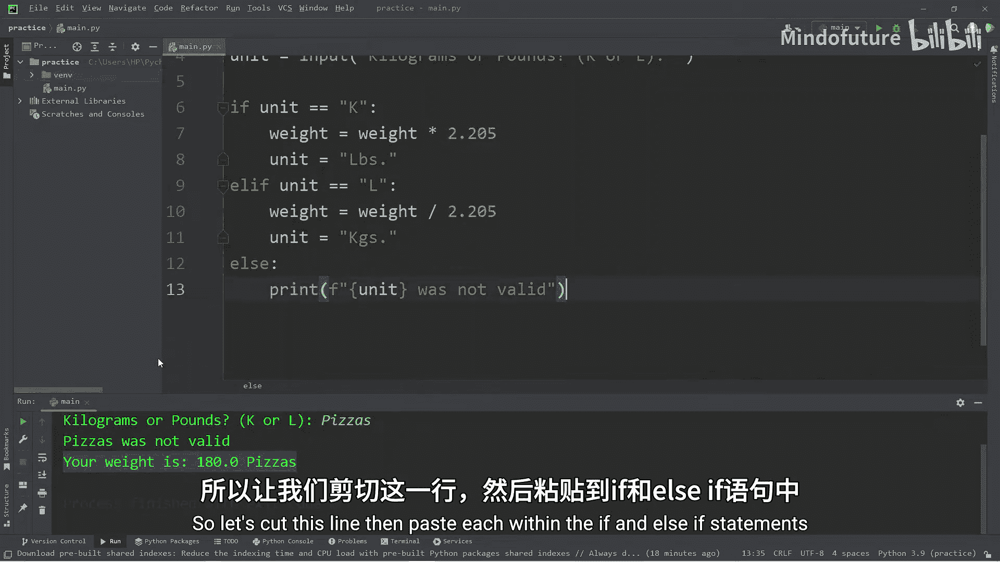

## 程序运行示例

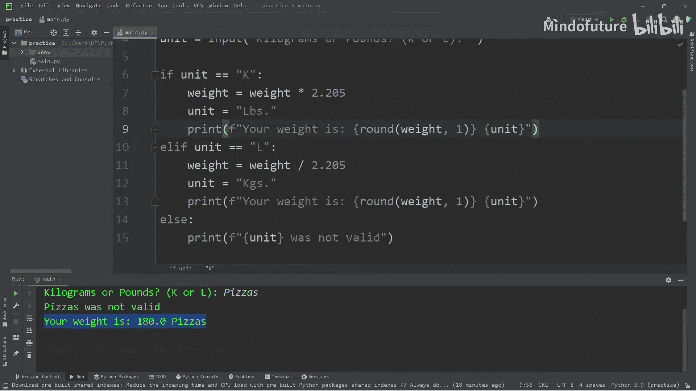

让我们看看程序运行时的效果。

**示例 1：将公斤转换为磅**
```
请输入您的体重：81
请输入单位（K 代表公斤， L 代表磅）：K
您的体重是 178.6 LBS。
```

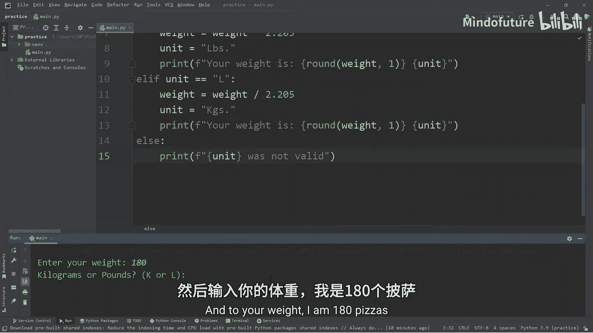

**示例 2：将磅转换为公斤**
```
请输入您的体重：180
请输入单位（K 代表公斤， L 代表磅）：L
您的体重是 81.6 KGS。
```

**示例 3：输入无效单位**
```
请输入您的体重：150
请输入单位（K 代表公斤， L 代表磅）：Pizza
您输入的单位 ‘Pizza’ 无效。
```

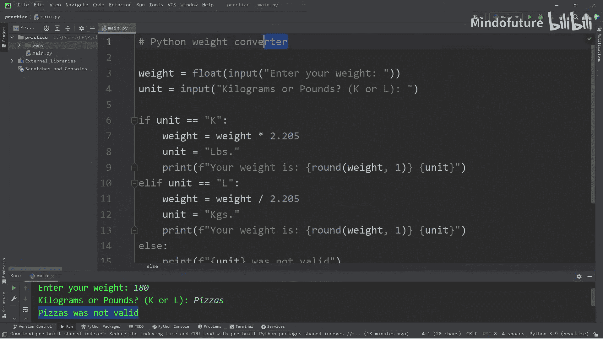

## 总结

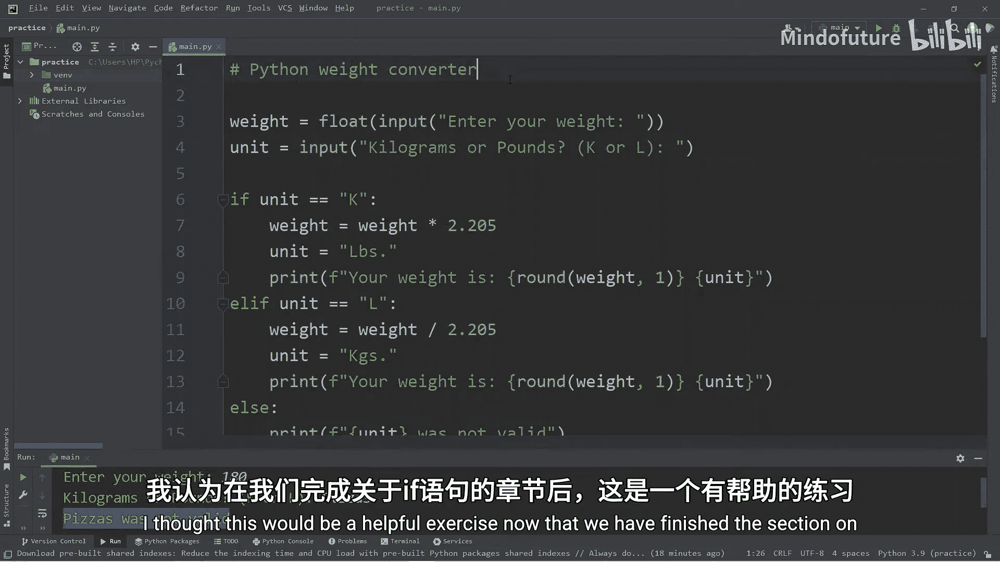

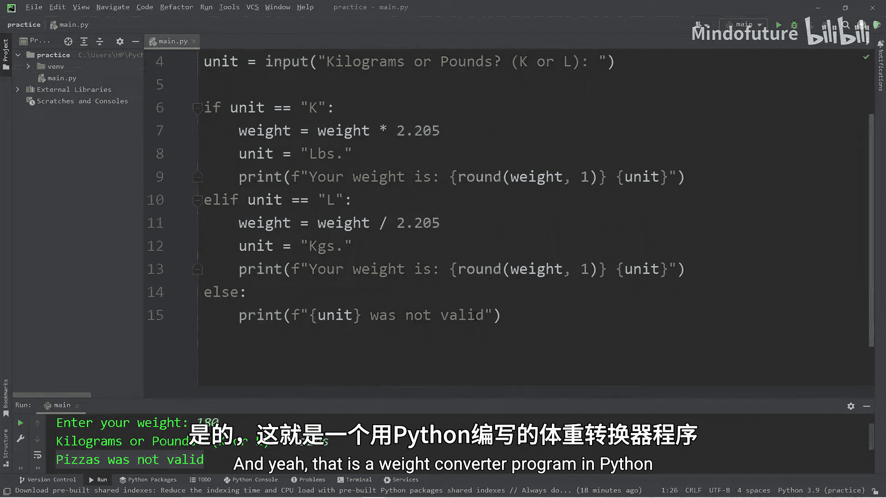

本节课中我们一起学习了如何综合运用`input()`、`float()`类型转换、`if-elif-else`条件判断以及`round()`函数，构建了一个实用的体重单位转换器。这个练习巩固了`if`语句的用法，并展示了如何将基本语法组合起来解决实际问题。你可以尝试修改这个程序，例如增加更多单位（如斤、盎司）的转换功能。