Python超全入门教程：P09：温度转换程序

在本节课中，我们将创建一个温度转换程序作为练习。我们将学习如何接收用户输入，使用条件判断语句，以及应用数学公式进行单位转换。

---

### 程序结构与用户输入

首先，我们需要询问用户当前的温度单位。我们将使用 `input()` 函数来获取输入，并将其存储在一个变量中。

以下是程序初始化的步骤：

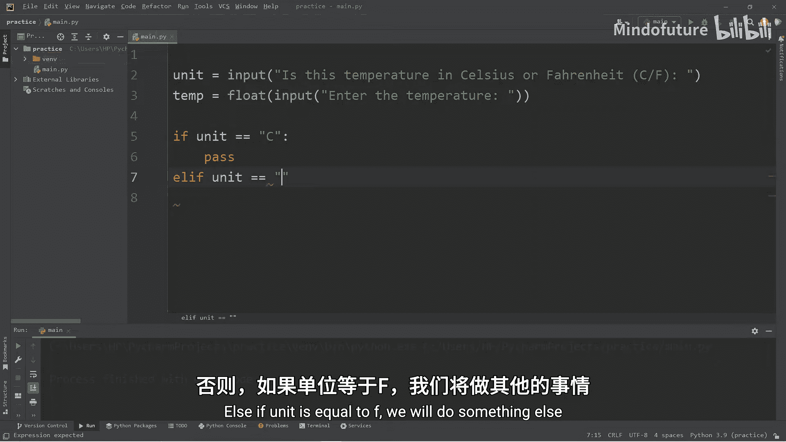

1.  询问温度单位。
2.  询问温度数值。
3.  将温度数值转换为浮点数以便计算。

```python
unit = input("当前温度单位是摄氏度还是华氏度？ (C/F): ")
temp = float(input("请输入温度值: "))
```

---

### 使用条件判断进行逻辑分支

上一节我们获取了用户输入，本节中我们来看看如何根据不同的单位执行不同的转换逻辑。我们将使用 `if-elif-else` 语句来处理三种情况：摄氏度转华氏度、华氏度转摄氏度以及无效的单位输入。

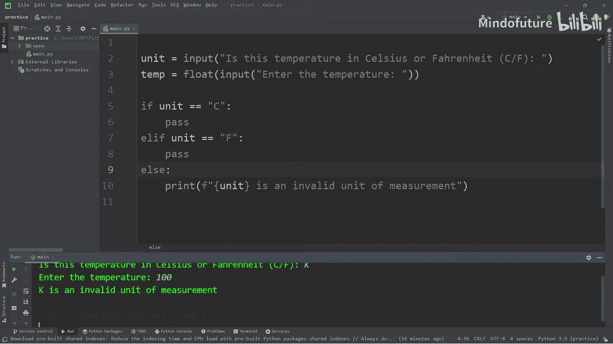

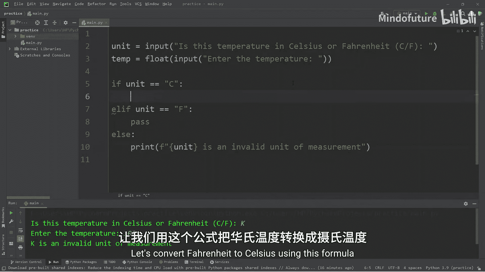

以下是核心的条件判断结构：

```python
if unit == "C" or unit == "c":
    # 摄氏度转华氏度的代码
    pass
elif unit == "F" or unit == "f":
    # 华氏度转摄氏度的代码
    pass
else:
    # 处理无效输入
    print(f"‘{unit}’ 不是一个有效的温度单位。")
```

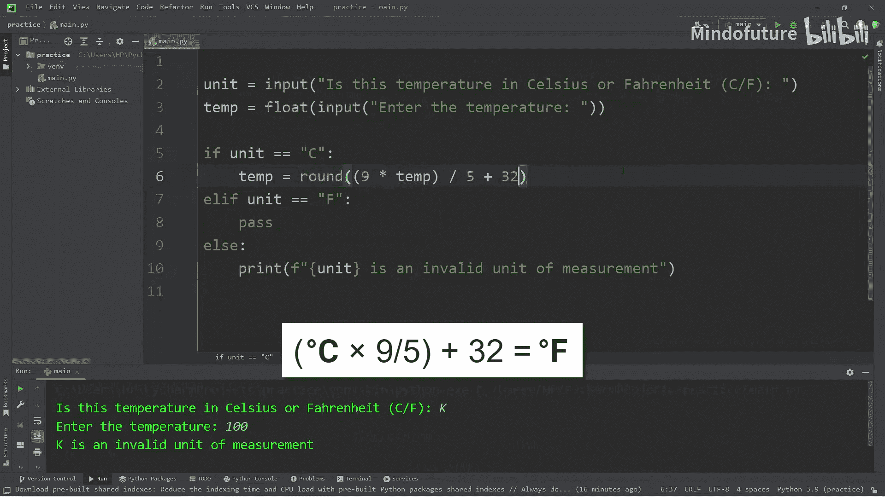

---

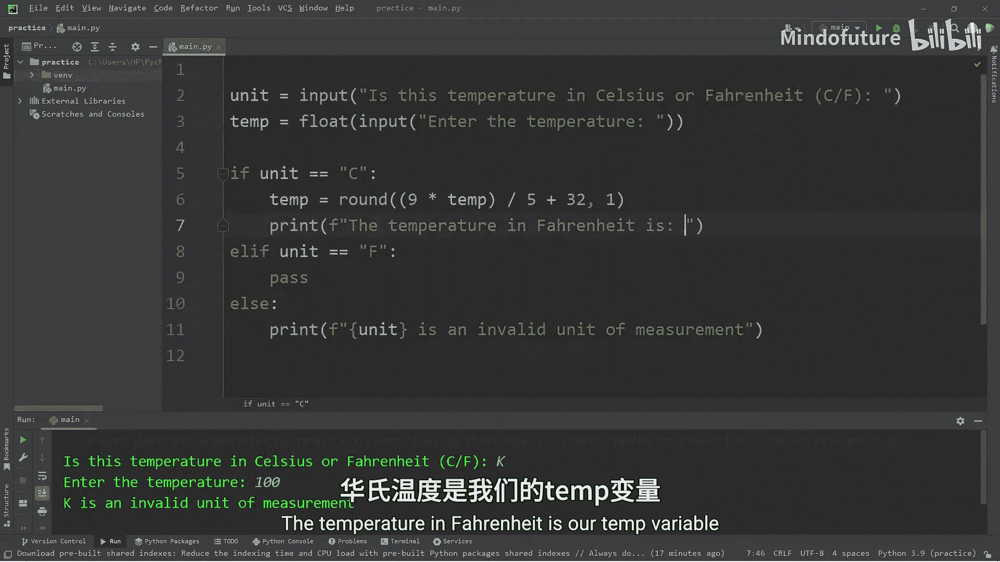

### 摄氏度转华氏度

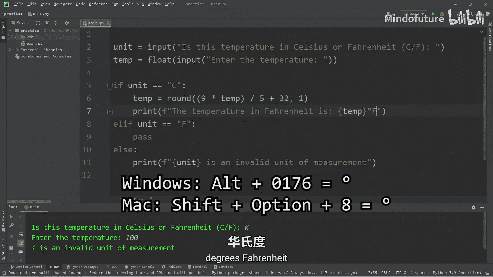

如果用户输入的单位是摄氏度（‘C‘），我们需要将其转换为华氏度。转换公式如下：

**公式：** `华氏度 = (摄氏度 × 9/5) + 32`

在代码中，我们使用这个公式进行计算，并使用 `round()` 函数将结果四舍五入到一位小数，使输出更整洁。

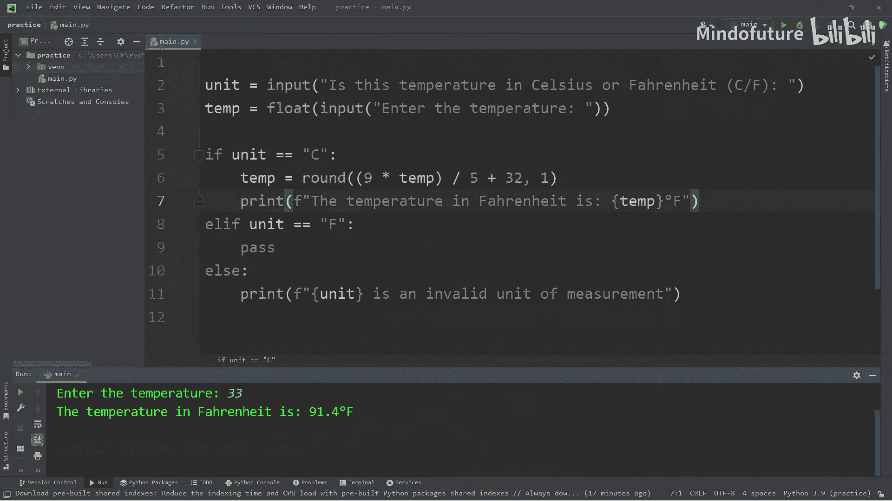

```python
if unit == "C" or unit == "c":
    converted_temp = round((temp * 9 / 5) + 32, 1)
    print(f"温度为 {converted_temp} 华氏度。")
```

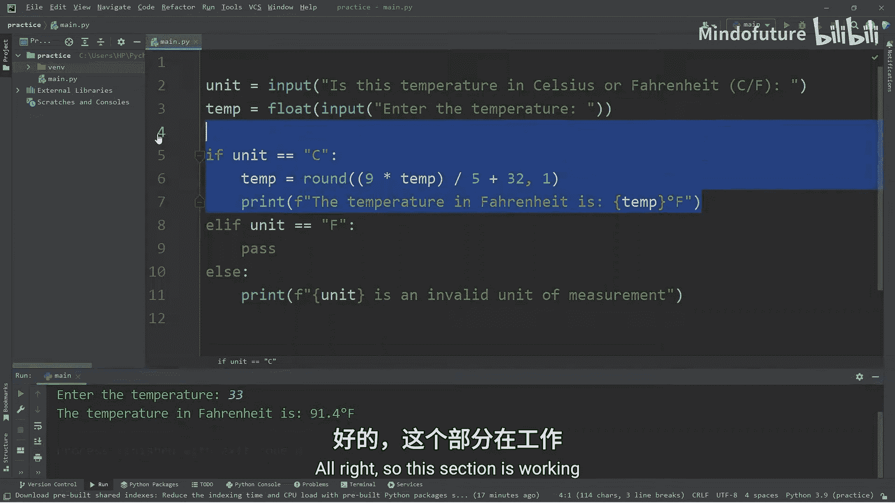

---

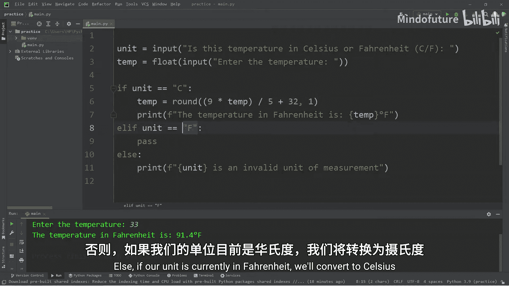

### 华氏度转摄氏度

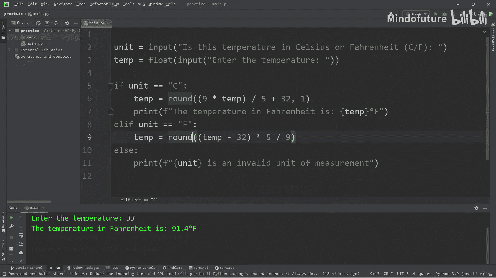

如果用户输入的单位是华氏度（‘F‘），我们则执行相反的转换。转换公式如下：

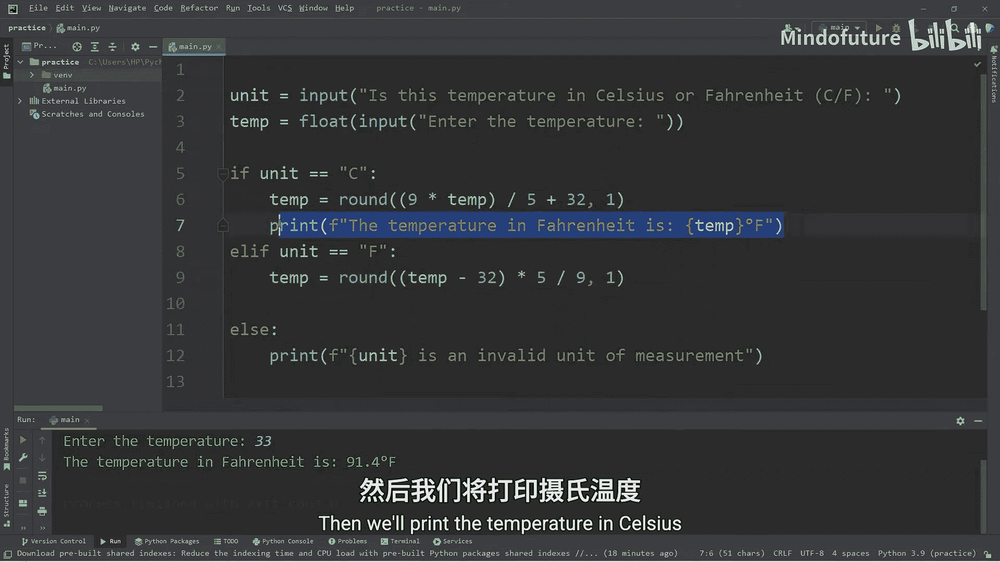

**公式：** `摄氏度 = (华氏度 - 32) × 5/9`

同样地，我们应用公式并格式化输出。

```python
elif unit == "F" or unit == "f":
    converted_temp = round((temp - 32) * 5 / 9, 1)
    print(f"温度为 {converted_temp} 摄氏度。")
```

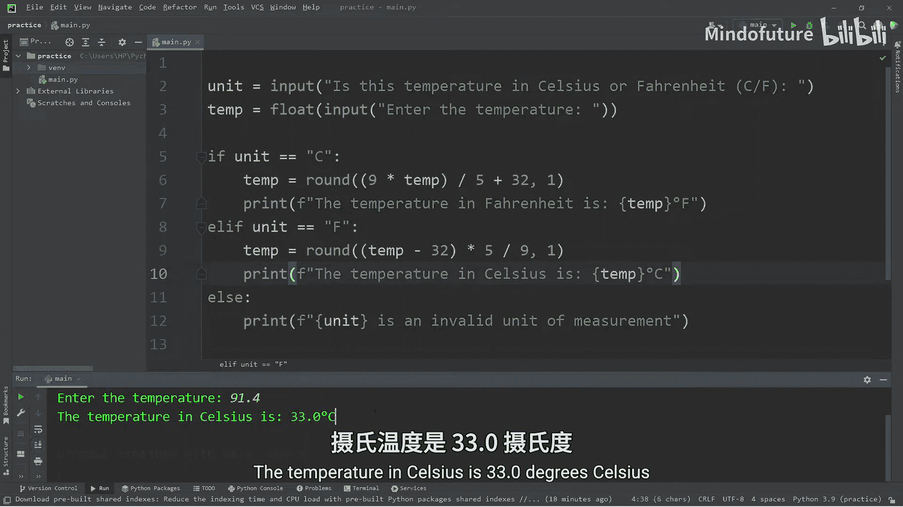

---

### 总结

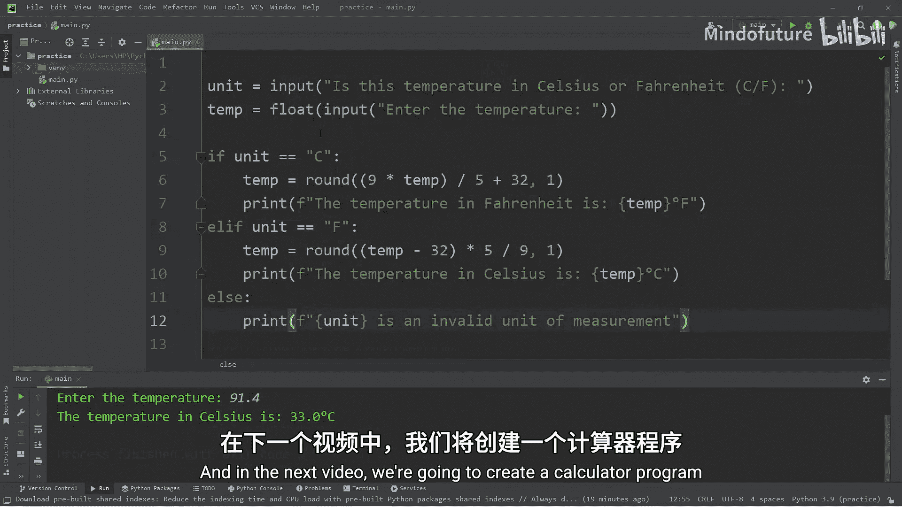

本节课中我们一起学习了如何构建一个完整的温度转换程序。我们实践了从用户获取输入、使用 `if-elif-else` 进行条件分支、应用数学公式进行计算，以及格式化输出结果。这个程序很好地结合了输入、处理和输出这三个基本编程步骤。在下一节课中，我们将尝试创建一个功能更丰富的计算器程序。