Python超全入门教程：P12：Python字符串方法详解 🧵

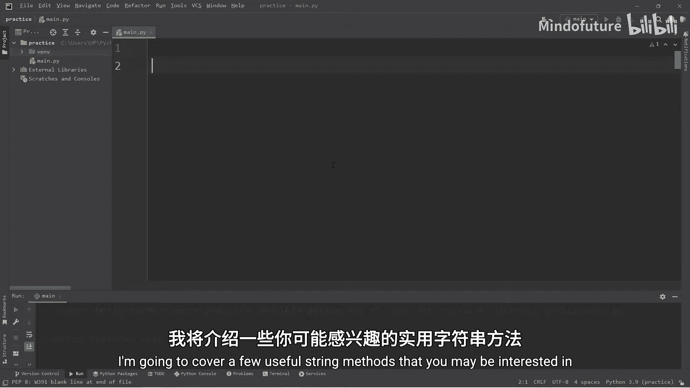

在本节课中，我们将学习Python中一些实用的字符串方法。字符串本质上是一系列字符的集合。掌握这些方法能帮助我们更高效地处理和验证文本数据。课程最后，我们将通过一个验证用户输入的小练习来巩固所学知识。

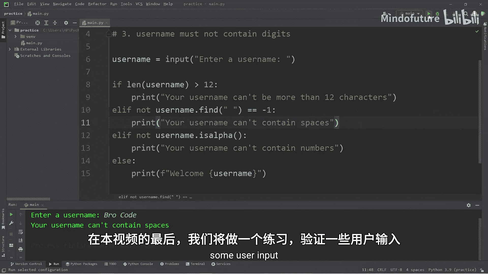

---

### 获取字符串长度

首先，我们来看如何获取字符串的长度。这可以通过内置的 `len()` 函数实现，它会返回字符串包含的字符总数（包括空格）。

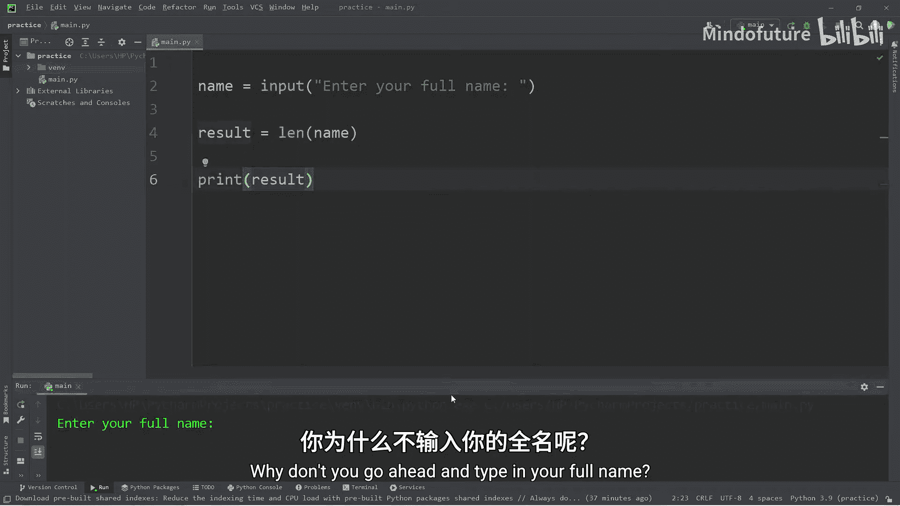

以下是具体步骤：
1.  使用 `input()` 函数获取用户输入的全名。
2.  使用 `len()` 函数计算该字符串的长度。
3.  将结果存储在一个变量中并打印出来。

```python
name = input("Enter your full name: ")
result = len(name)
print(result)
```
例如，输入 “Bro Code”，`len()` 函数将返回 `8`。

---

### 查找字符位置

上一节我们介绍了如何获取字符串长度，本节中我们来看看如何查找特定字符在字符串中的位置。

我们可以使用 `.find()` 方法来定位某个字符**首次**出现的位置。索引从 `0` 开始计数。

以下是具体步骤：
1.  在字符串变量后使用 `.find()` 方法，并在括号内指定要查找的字符。
2.  该方法返回一个整数，代表字符的索引位置。
3.  如果未找到字符，则返回 `-1`。

```python
name = "Bro Code"
result = name.find(" ")
print(result)  # 输出: 3
result = name.find("B")
print(result)  # 输出: 0
result = name.find("q")
print(result)  # 输出: -1
```

若要查找字符**最后**一次出现的位置，可以使用 `.rfind()` 方法。

```python
result = name.rfind("o")
print(result)  # 输出: 5
```

---

### 修改字符串大小写

字符串提供了几种方法来改变其字符的大小写。

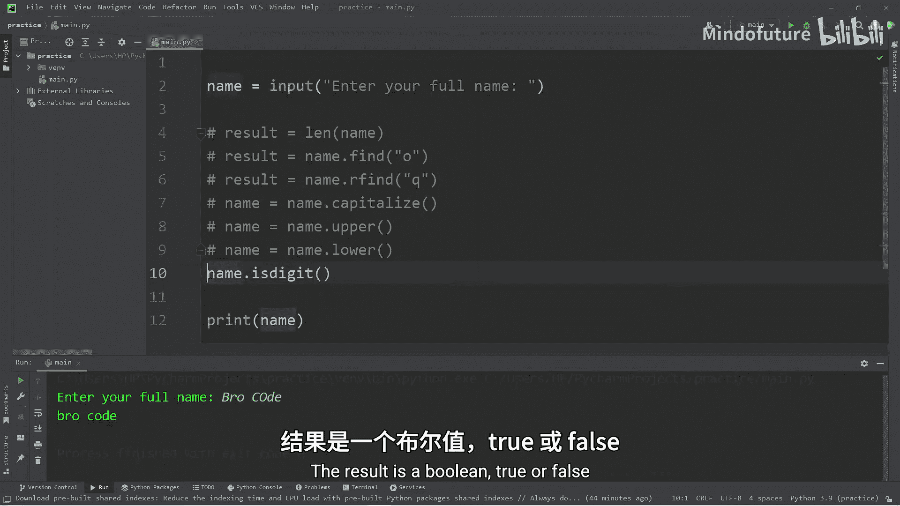

以下是具体方法：
*   **`.capitalize()`**: 将字符串的**第一个**字符转换为大写，其余字符转换为小写。
*   **`.upper()`**: 将字符串中的所有字符转换为大写。
*   **`.lower()`**: 将字符串中的所有字符转换为小写。

这些方法会返回一个新的字符串，不会修改原始字符串。

```python
name = "bro code"
name = name.capitalize()
print(name)  # 输出: Bro code

name = name.upper()
print(name)  # 输出: BRO CODE

name = name.lower()
print(name)  # 输出: bro code
```

---

### 检查字符串内容

有时我们需要检查字符串是否只包含特定类型的字符。

以下是两个常用的检查方法：
*   **`.isdigit()`**: 如果字符串**只包含数字**，则返回 `True`，否则返回 `False`。
*   **`.isalpha()`**: 如果字符串**只包含字母**（不包含空格、数字等），则返回 `True`，否则返回 `False`。

```python
name = "Bro123"
print(name.isdigit())  # 输出: False
print(name.isalpha())  # 输出: False

num = "123"
print(num.isdigit())   # 输出: True

letters = "BroCode"
print(letters.isalpha()) # 输出: True
```

---

### 统计与替换字符

接下来，我们学习如何统计特定字符的出现次数，以及如何替换字符串中的部分内容。

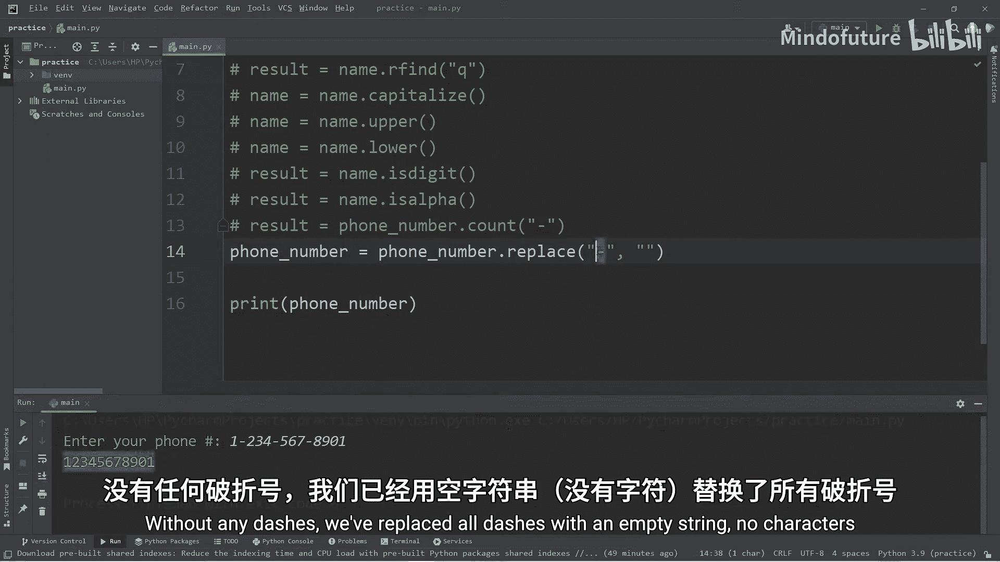

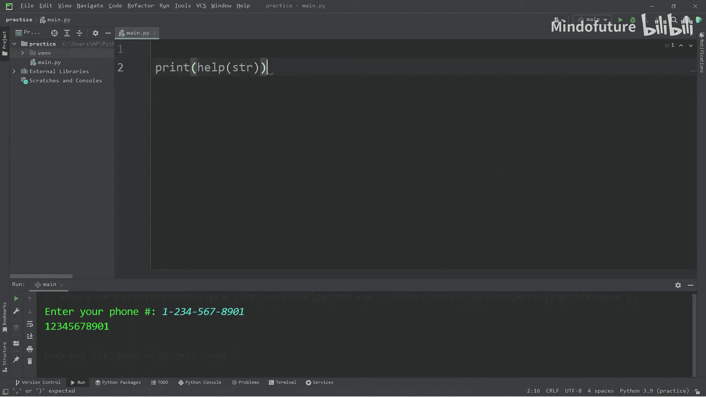

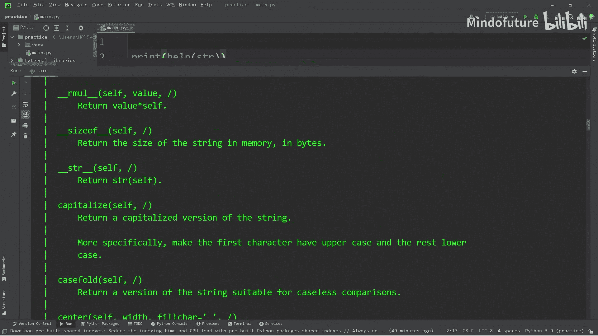

以下是具体方法：
*   **`.count()`**: 统计某个字符或子字符串在字符串中出现的次数。
*   **`.replace()`**: 将字符串中所有的指定字符替换为另一个字符。这是最实用的字符串方法之一。

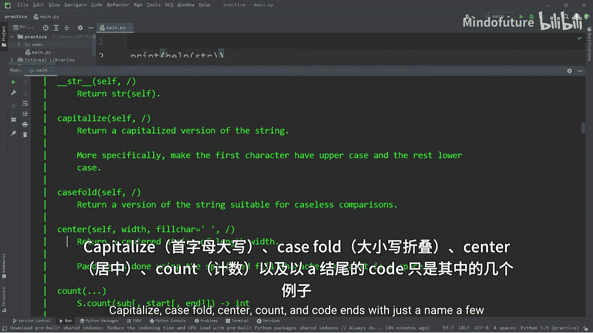

```python
phone_number = "123-456-7890"
# 统计短横线 '-' 的数量
dash_count = phone_number.count("-")
print(dash_count)  # 输出: 2

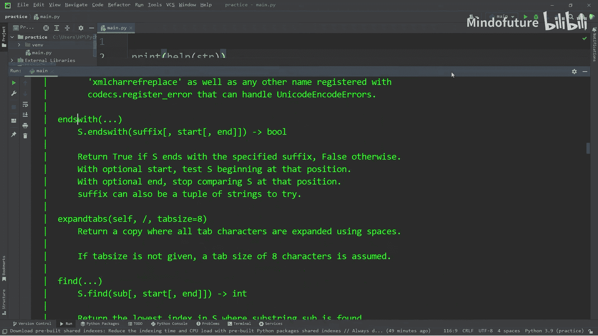

# 将短横线替换为空格
new_number = phone_number.replace("-", " ")
print(new_number)  # 输出: 123 456 7890

# 移除所有短横线（替换为空字符串）
new_number = phone_number.replace("-", "")
print(new_number)  # 输出: 1234567890
```

---

### 探索更多字符串方法

Python 提供了丰富的字符串方法。如果你想查看完整列表，可以使用 `help()` 函数。

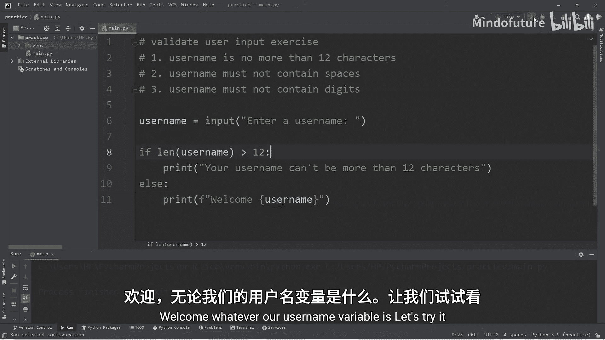

```python
print(help(str))
```
这将打印出所有可用的字符串方法及其简要说明，例如 `capitalize`, `casefold`, `center`, `count`, `encode`, `endswith` 等。

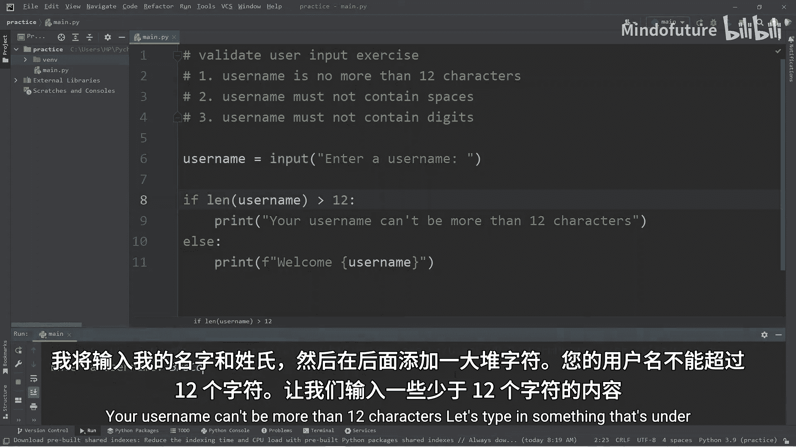

---

### 实践练习：验证用户名输入

现在，让我们运用所学的字符串方法来完成一个练习：验证用户输入的用户名是否符合规则。

规则如下：
1.  用户名长度不能超过12个字符。
2.  用户名不能包含空格。
3.  用户名不能包含数字。

我们将分步实现这些验证。

```python
username = input("Enter a username: ")

# 规则1：检查长度
if len(username) > 12:
    print("Your username can't be more than 12 characters.")
# 规则2：检查是否包含空格
elif username.find(" ") != -1:  # 如果找到空格，find() 返回值不是 -1
    print("Your username can't contain spaces.")
# 规则3：检查是否只包含字母
elif not username.isalpha():    # 如果不是纯字母
    print("Your username can't contain numbers.")
else:
    print(f"Welcome {username}!")
```

---

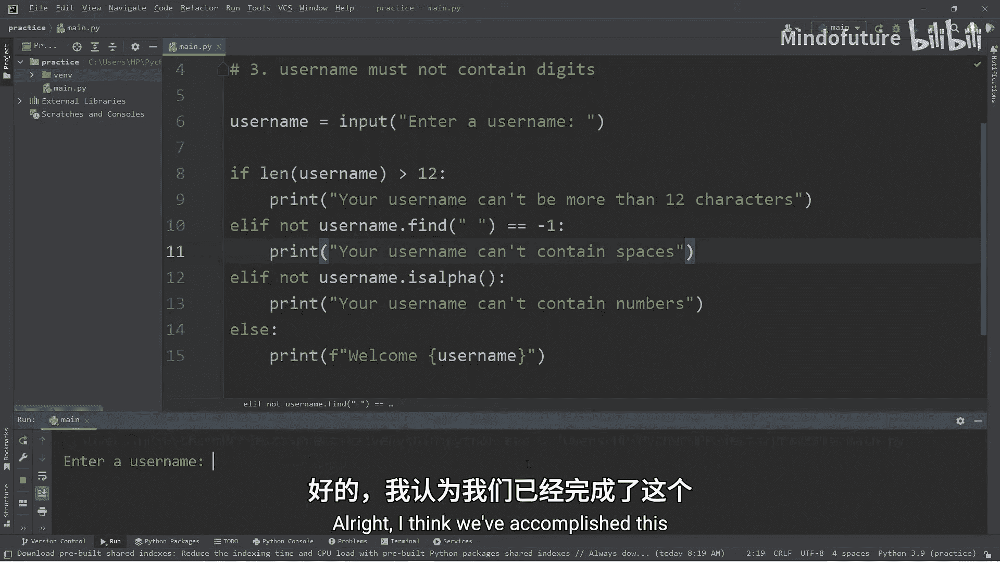

### 总结

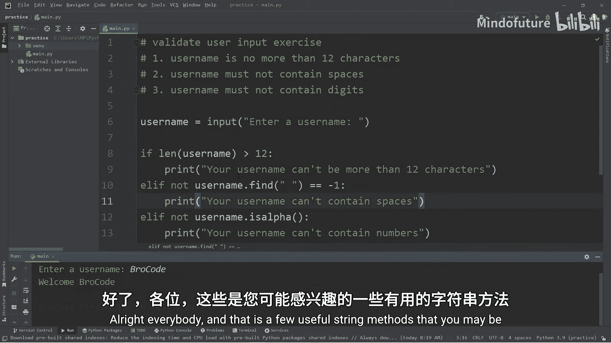

本节课中我们一起学习了Python中多个核心的字符串方法。我们掌握了如何获取字符串长度（`len()`）、查找字符位置（`.find()`, `.rfind()`）、修改大小写（`.capitalize()`, `.upper()`, `.lower()`）、检查内容（`.isdigit()`, `.isalpha()`）以及统计和替换字符（`.count()`, `.replace()`）。最后，我们通过一个验证用户名的综合练习，将这些方法应用到了实际场景中。熟练掌握这些方法将极大地提升你处理文本数据的能力。