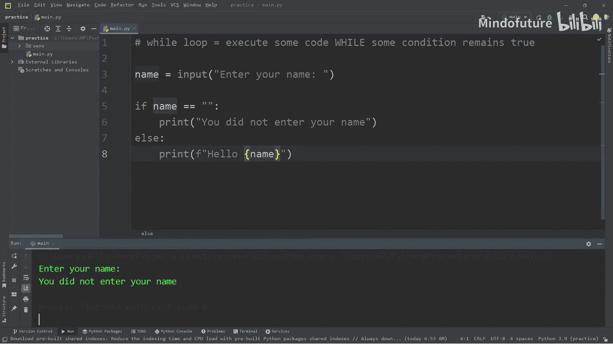
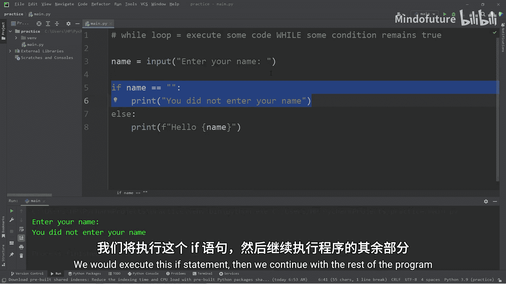
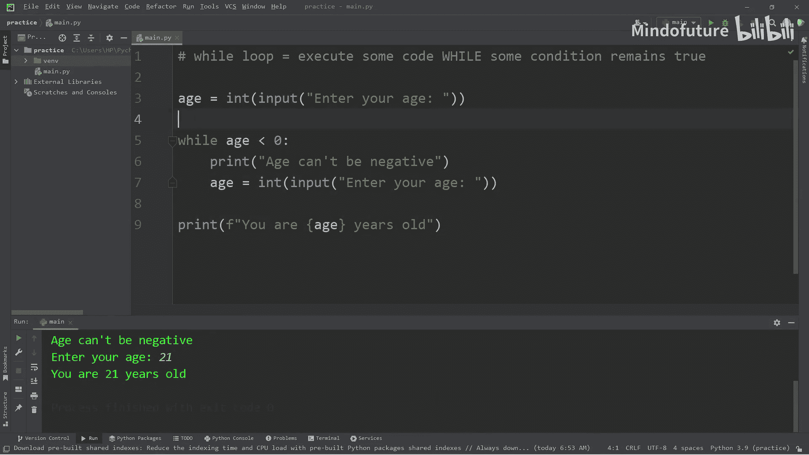
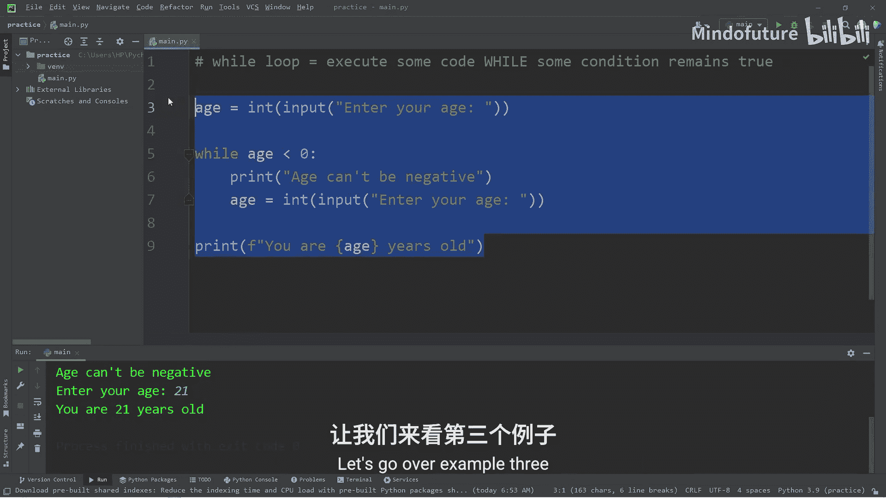
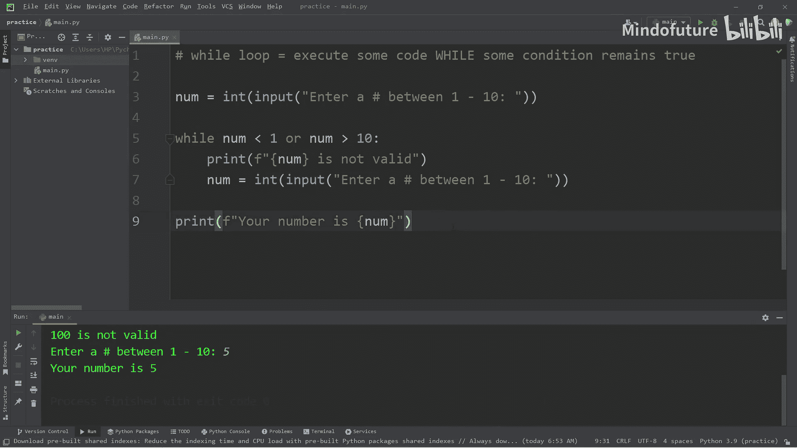

# 016：While循环详解 🔄

在本节课中，我们将要学习Python中的`while`循环。`while`循环是一种控制流语句，它允许我们重复执行一段代码，只要指定的条件保持为真。这对于处理需要持续验证或重复的任务非常有用，例如验证用户输入。

---

## 什么是While循环？ 🤔

`while`循环会在某个条件保持为真时，重复执行其内部的代码块。它的基本结构如下：



```python
while condition:
    # 要执行的代码
```

当`condition`（条件）评估为`True`时，循环体内的代码就会执行。执行完毕后，程序会再次检查条件。如果条件仍为`True`，则再次执行循环体；如果条件变为`False`，则退出循环，继续执行循环之后的代码。

---



## 示例一：验证用户姓名输入

上一节我们介绍了`while`循环的基本概念，本节中我们来看看一个具体的应用：确保用户输入了有效的姓名。

我们将创建一个程序，持续要求用户输入姓名，直到他们输入了非空的内容为止。

```python
name = input("Enter your name: ")

while name == "":
    print("You did not enter your name.")
    name = input("Enter your name: ")

print(f"Hello {name}")
```

**代码解释：**
1.  首先，我们使用`input()`函数获取用户的姓名。
2.  然后，`while`循环检查`name`变量是否等于空字符串`""`。
3.  如果条件为真（即用户没有输入任何内容），则执行循环体：打印一条消息，并再次提示用户输入。
4.  这个过程会一直重复，直到用户输入了内容（使`name != ""`），此时循环条件变为假，程序退出循环。
5.  最后，打印问候语。

**运行示例：**
```
Enter your name: （用户直接按回车）
You did not enter your name.
Enter your name: （用户再次直接按回车）
You did not enter your name.
Enter your name: Alex
Hello Alex
```

这个例子展示了`while`循环的核心优势：它允许我们持续执行代码，直到满足某个退出条件。

---

## 示例二：验证年龄为正数

理解了基本循环后，我们来看另一个常见场景：确保用户输入的数字是有效的，例如年龄必须为正数。

以下是实现此功能的步骤：

1.  获取用户输入的年龄，并将其转换为整数。
2.  使用`while`循环检查年龄是否小于0。
3.  如果条件为真（年龄为负），则提示用户并重新获取输入。
4.  当用户输入有效的年龄（>=0）后，退出循环并显示结果。

```python
age = int(input("Enter your age: "))

while age < 0:
    print("Age can't be negative.")
    age = int(input("Enter your age: "))

print(f"You are {age} years old.")
```

**运行示例：**
```
Enter your age: -5
Age can't be negative.
Enter your age: -1
Age can't be negative.
Enter your age: 25
You are 25 years old.
```

---

## 避免无限循环 ⚠️

在使用`while`循环时，必须确保循环最终有办法停止，否则会陷入**无限循环**。例如，下面的代码就会导致无限循环，因为循环体内没有改变`name`变量的值，条件`name == ""`永远为真。

```python
name = ""
while name == "":
    print("You did not enter your name.")
# 缺少重新为 name 赋值的代码，循环无法退出！
```





因此，在循环体内提供一种改变条件状态的“退出策略”至关重要，通常是通过重新获取用户输入或更新某个变量来实现。

---

## 示例三：使用逻辑运算符 `not`

`while`循环的条件可以结合逻辑运算符来构建更复杂的逻辑。例如，我们可以让程序持续运行，直到用户输入特定的退出指令（如字母‘Q’）。

以下是实现一个简单“食物喜好收集器”的步骤：

1.  提示用户输入一种喜欢的食物。
2.  使用`while not (food == "q")`作为条件，意思是“当食物不是‘q’时继续循环”。
3.  在循环内，打印用户喜欢的食物，并提示输入下一种。
4.  当用户输入‘q’时，条件变为假，退出循环。

```python
food = input("Enter a food you like (q to quit): ")

while not food == "q":
    print(f"You like {food}")
    food = input("Enter another food you like (q to quit): ")

print("Bye")
```

**运行示例：**
```
Enter a food you like (q to quit): pizza
You like pizza
Enter another food you like (q to quit): sushi
You like sushi
Enter another food you like (q to quit): ramen
You like ramen
Enter another food you like (q to quit): q
Bye
```

---

## 示例四：使用逻辑运算符 `or`

我们还可以使用`or`运算符来检查多个条件。只要其中一个条件为真，整个循环条件就为真。

让我们创建一个程序，要求用户输入一个1到10之间的数字。

以下是实现逻辑的步骤：
1.  获取用户输入并转换为整数。
2.  使用`while`循环，条件是`number < 1` **或** `number > 10`。这意味着输入的数字只要不在1-10范围内，循环就会继续。
3.  在循环内，提示输入无效并重新获取数字。
4.  输入有效后，退出循环并显示数字。

```python
number = int(input("Enter a number between 1 through 10: "))

while number < 1 or number > 10:
    print(f"{number} is not valid.")
    number = int(input("Enter a number between 1 through 10: "))

print(f"Your number is {number}")
```

**运行示例：**
```
Enter a number between 1 through 10: 0
0 is not valid.
Enter a number between 1 through 10: 15
15 is not valid.
Enter a number between 1 through 10: 5
Your number is 5
```

---

## 总结 📝

本节课中我们一起学习了Python的`while`循环。

*   **核心概念**：`while`循环用于在指定条件保持为真时重复执行代码块。其基本结构为：
    ```python
    while condition:
        # 循环体
    ```
*   **主要用途**：非常适合用于**验证用户输入**，确保输入符合要求，也适用于许多需要重复执行直到满足特定条件的场景。
*   **关键要点**：
    1.  必须在循环体内提供改变循环条件的逻辑，否则可能导致**无限循环**。
    2.  可以配合逻辑运算符（如`not`、`or`、`and`）来构建更复杂的循环条件。
    3.  当条件变为`False`时，程序会退出循环，继续执行后续代码。



通过以上示例，你应该已经掌握了`while`循环的基本用法和常见模式。在实践中多加练习，你会更熟练地运用它来控制程序的流程。