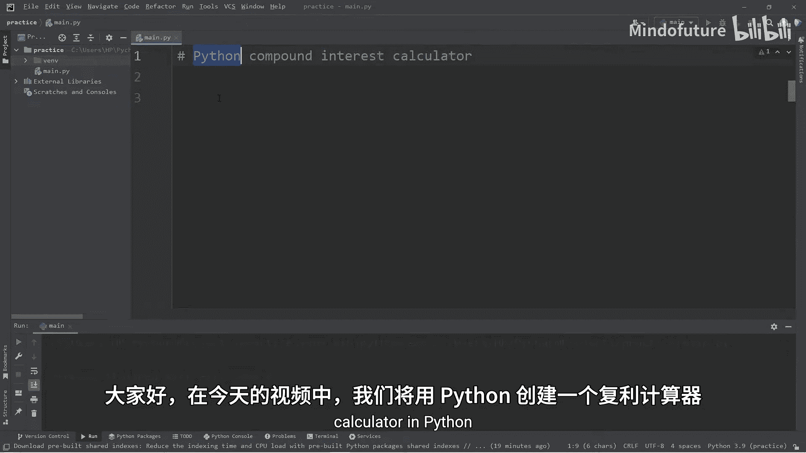
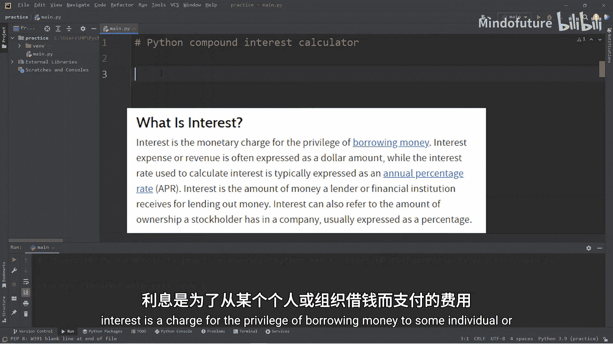
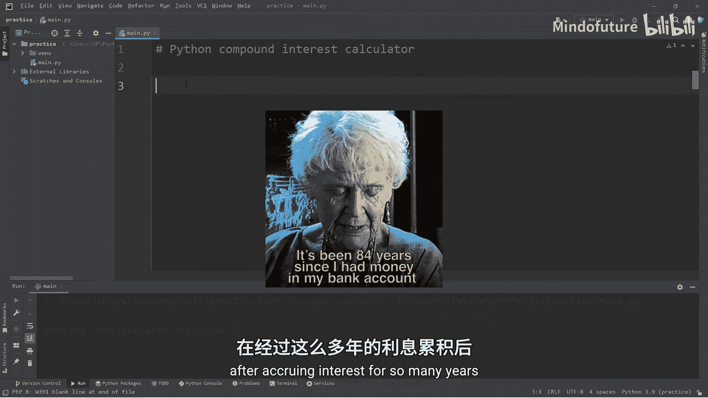
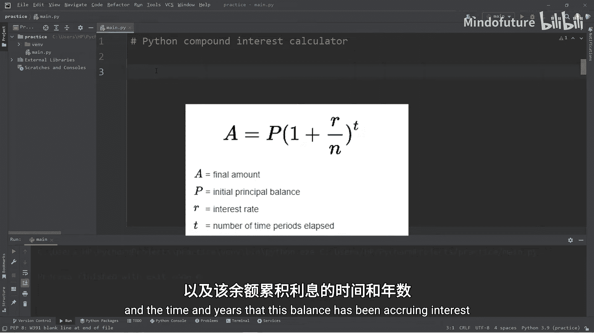
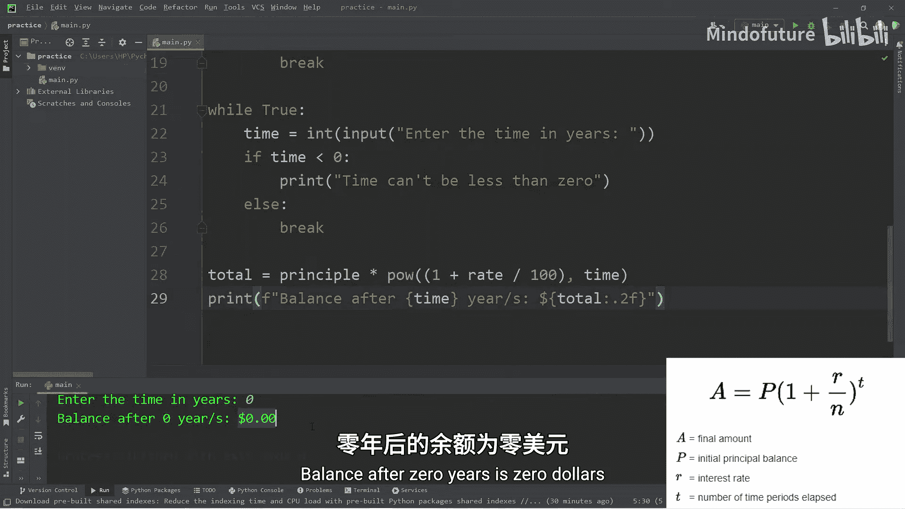
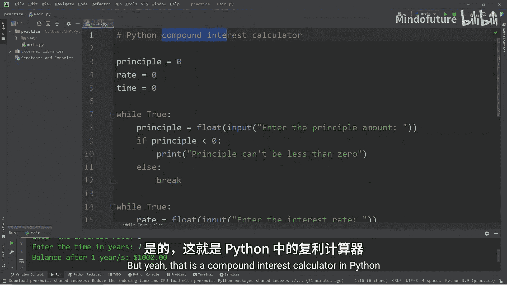

Python入门教程：P17：复利计算器 💰

在本节课中，我们将学习如何使用Python创建一个复利计算器。我们将从用户那里获取初始本金、利率和时间，然后计算并显示最终的账户余额。过程中，我们会运用`while`循环来确保用户输入有效的数值。

---

### 概述

复利是金融中的一个核心概念，指利息不仅基于初始本金计算，还基于之前累积的利息计算。本节课，我们将编写一个程序，根据用户输入的本金、年利率和投资年限，计算复利增长后的总金额。





---





### 获取用户输入

首先，我们需要从用户那里获取三个关键数据：本金、利率和时间。我们将使用`while`循环来确保用户输入的值是有效的（例如，不能为负数）。

以下是获取本金、利率和时间的步骤：

1.  **获取本金**：提示用户输入初始投资金额，并确保该值大于0。
2.  **获取利率**：提示用户输入年利率，并确保该值大于0。
3.  **获取时间**：提示用户输入投资年限，并确保该值大于0。

我们将使用`while`循环持续提示用户，直到输入有效的数值为止。

```python
# 获取本金
principle = float(input("请输入本金金额："))
while principle <= 0:
    print("本金不能小于或等于0。")
    principle = float(input("请输入本金金额："))

# 获取利率
rate = float(input("请输入年利率（百分比）："))
while rate <= 0:
    print("利率不能小于或等于0。")
    rate = float(input("请输入年利率（百分比）："))

# 获取时间
time = int(input("请输入投资年限（整数）："))
while time <= 0:
    print("时间不能小于或等于0。")
    time = int(input("请输入投资年限（整数）："))
```

---

### 计算复利

在获取了所有必要的输入后，下一步是计算复利。复利的计算公式如下：

**总金额 = 本金 × (1 + 利率/100) ^ 时间**

在Python中，我们可以使用幂运算符 `**` 来实现这个计算。

```python
# 计算复利
total = principle * (1 + rate / 100) ** time
```

---

### 显示结果

计算完成后，我们需要将结果以清晰、易读的格式展示给用户。我们将使用格式化字符串来确保金额显示为两位小数。

```python
# 显示结果
print(f"经过 {time} 年后的余额为：${total:.2f}")
```

---

### 完整代码示例

将以上所有步骤组合起来，就得到了完整的复利计算器程序。

```python
# 获取本金
principle = float(input("请输入本金金额："))
while principle <= 0:
    print("本金不能小于或等于0。")
    principle = float(input("请输入本金金额："))

# 获取利率
rate = float(input("请输入年利率（百分比）："))
while rate <= 0:
    print("利率不能小于或等于0。")
    rate = float(input("请输入年利率（百分比）："))

# 获取时间
time = int(input("请输入投资年限（整数）："))
while time <= 0:
    print("时间不能小于或等于0。")
    time = int(input("请输入投资年限（整数）："))

# 计算复利
total = principle * (1 + rate / 100) ** time

# 显示结果
print(f"经过 {time} 年后的余额为：${total:.2f}")
```

---

### 另一种循环实现方式

除了使用带条件的`while`循环，我们还可以使用`while True`循环配合`break`语句来实现相同的输入验证逻辑。这种方式允许用户输入0值（如果业务逻辑允许的话）。

以下是使用`while True`循环的代码片段：

```python
# 获取本金（允许0值）
while True:
    principle = float(input("请输入本金金额："))
    if principle < 0:
        print("本金不能小于0。")
    else:
        break

# 获取利率（允许0值）
while True:
    rate = float(input("请输入年利率（百分比）："))
    if rate < 0:
        print("利率不能小于0。")
    else:
        break



# 获取时间（允许0值）
while True:
    time = int(input("请输入投资年限（整数）："))
    if time < 0:
        print("时间不能小于0。")
    else:
        break
```

---

### 总结

在本节课中，我们一起学习了如何创建一个Python复利计算器。我们掌握了以下关键点：

1.  使用`while`循环进行输入验证，确保用户提供有效的本金、利率和时间。
2.  应用复利公式 **总金额 = 本金 × (1 + 利率/100) ^ 时间** 进行计算。
3.  使用格式化字符串来美观地输出结果。
4.  了解了`while True`循环与`break`语句结合使用的另一种输入验证模式。



通过这个项目，你不仅练习了基础数学运算在编程中的应用，还加强了对循环控制流的理解。你可以尝试修改程序，例如增加计算每月复利或显示每年余额明细的功能。