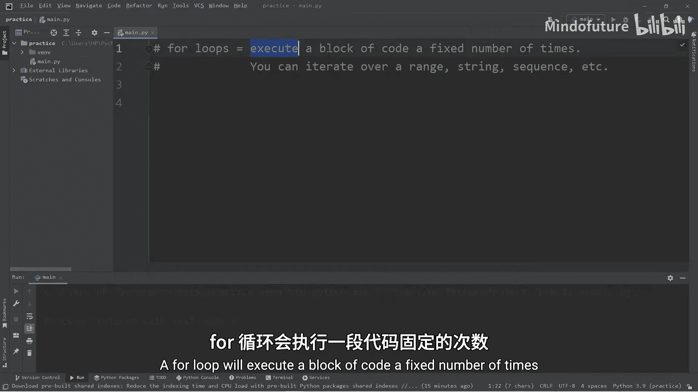
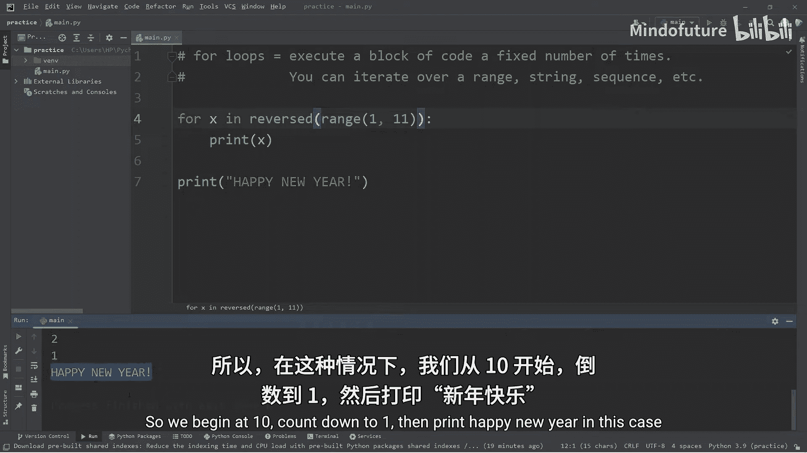
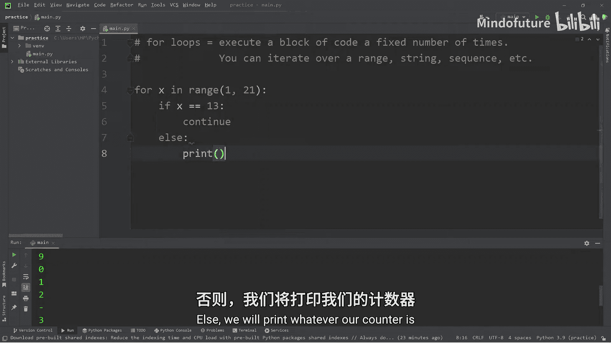
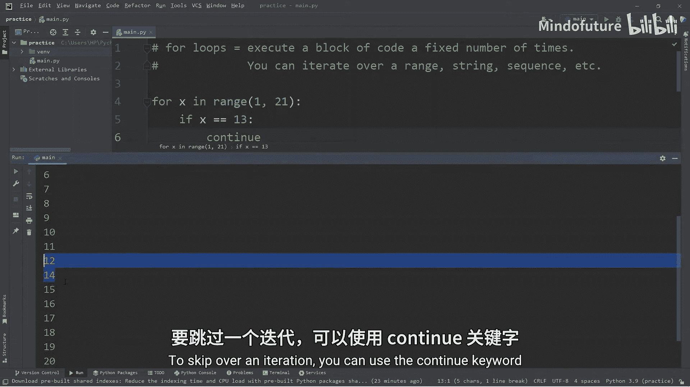
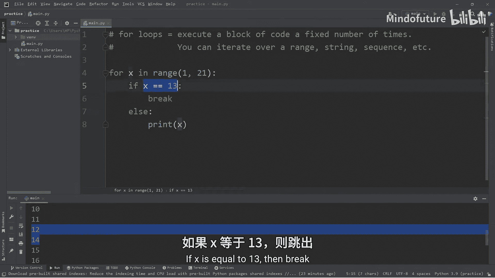
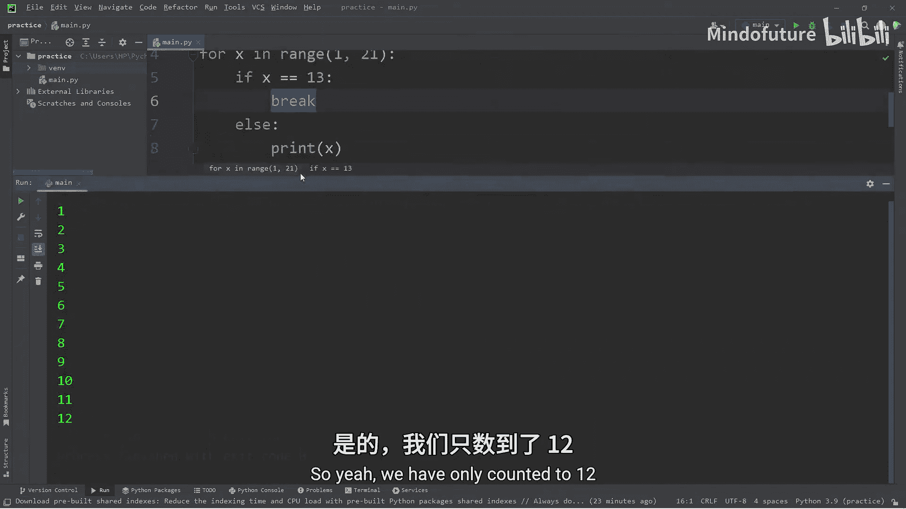
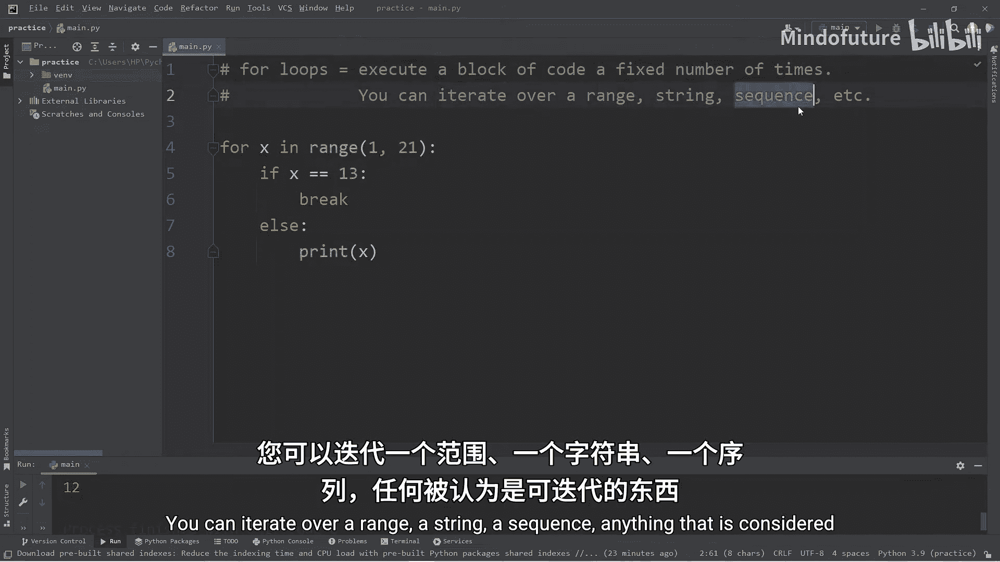
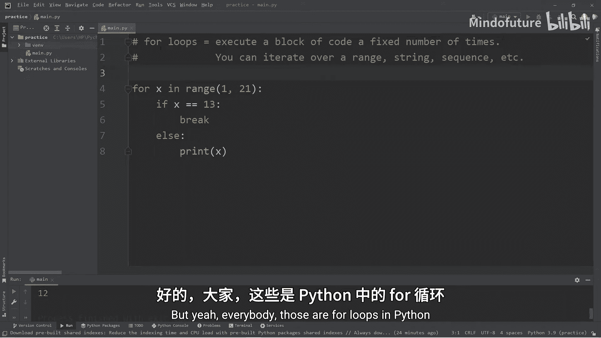

# 018：Python中的For循环

在本节课中，我们将要学习Python中的`for`循环。`for`循环用于执行固定次数的代码块，它可以遍历一个范围、一个字符串、一个序列或任何可迭代的对象。与`while`循环相比，`for`循环更适合在需要执行固定次数操作的情况下使用。



## 基础语法与遍历数字范围

上一节我们介绍了`for`循环的基本概念，本节中我们来看看它的基础语法。`for`循环的基本结构是：`for 变量 in 可迭代对象:`，然后缩进编写需要重复执行的代码块。

以下是使用`for`循环和`range()`函数计数的基本示例：
```python
for x in range(1, 11):
    print(x)
```
*   `for x in range(1, 11):`：这行代码创建了一个循环。`x`是循环变量，在每次迭代中，它会依次被赋值为`range(1, 11)`生成的数字。`range(1, 11)`生成从1开始到10结束（不包含11）的数字序列。
*   `print(x)`：这是循环体，会为序列中的每个数字执行一次，打印出当前的`x`值。

运行这段代码，会依次打印出数字1到10。

## 反向遍历与步长控制

了解了正向计数后，我们来看看如何反向计数以及控制计数的步长。



要反向计数，可以将`range()`函数嵌套在`reversed()`函数中：
```python
for i in reversed(range(1, 11)):
    print(i)
print("Happy New Year!")
```
这段代码会从10倒数到1，然后打印“Happy New Year!”。

`range()`函数还可以接受第三个参数，用于指定步长。以下是按步长为2进行计数的示例：
```python
for x in range(1, 11, 2):
    print(x)
```
*   `range(1, 11, 2)`：生成从1开始、小于11、步长为2的序列，即 `[1, 3, 5, 7, 9]`。
如果将步长改为3，则会按3计数：`[1, 4, 7, 10]`。

## 遍历字符串

`for`循环不仅可以遍历数字范围，还可以遍历字符串等任何可迭代对象。

以下是一个遍历信用卡号字符串的示例：
```python
credit_card = "1234-5678-9012-3456"
for x in credit_card:
    print(x)
```
在这个例子中，循环变量`x`会依次代表字符串中的每一个字符，包括数字和短横线“-”，并逐个打印出来。

## 循环控制：continue与break



在循环中，有两个重要的关键字可以控制流程：`continue`和`break`。它们同样适用于`while`循环。





`continue`语句用于跳过当前循环的剩余语句，直接进入下一次迭代。例如，我们希望跳过不吉利的数字13：
```python
for x in range(1, 21):
    if x == 13:
        continue
    print(x)
```
当`x`等于13时，`continue`语句被执行，`print(x)`被跳过，循环直接进入下一次迭代（`x=14`），因此输出中不会出现13。



`break`语句用于立即终止整个循环。例如，我们希望在遇到13时停止计数：
```python
for x in range(1, 21):
    if x == 13:
        break
    print(x)
```
当`x`等于13时，`break`语句被执行，整个`for`循环被立即终止，因此输出只到12为止。

## 总结





本节课中我们一起学习了Python中的`for`循环。我们了解到：
*   `for`循环用于对可迭代对象进行遍历，执行固定次数的操作。
*   可以使用`range()`函数生成数字序列进行遍历，并可以通过参数控制起始值、结束值和步长。
*   `for`循环可以遍历字符串，逐个处理其中的字符。
*   使用`continue`关键字可以跳过当前迭代，使用`break`关键字可以提前终止整个循环。
*   在需要执行不确定次数（如等待用户输入）时，`while`循环更合适；而在需要遍历已知序列或执行固定次数操作时，`for`循环通常是更好的选择。