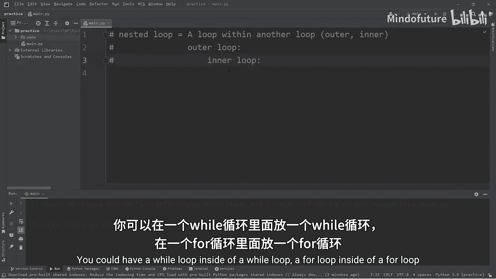
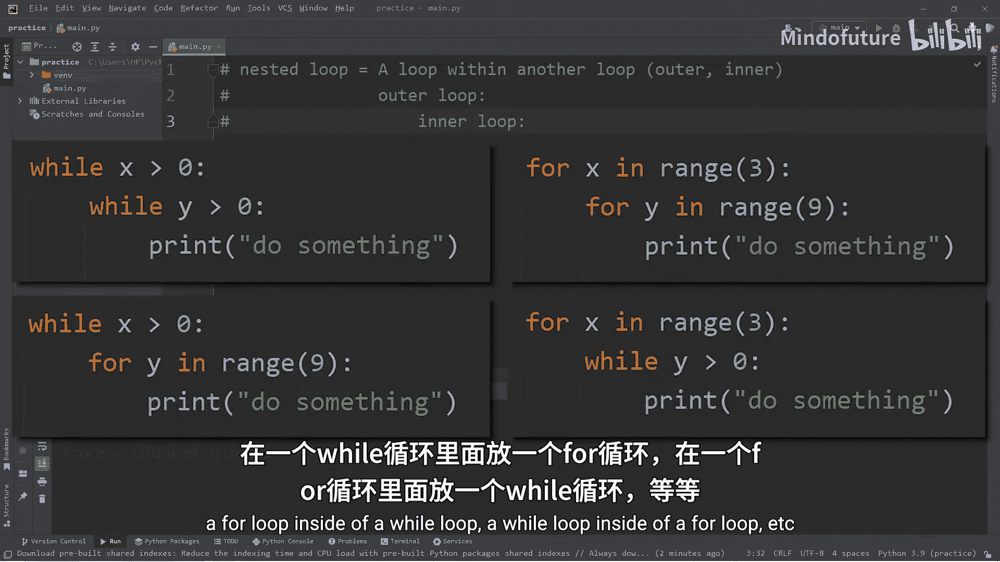
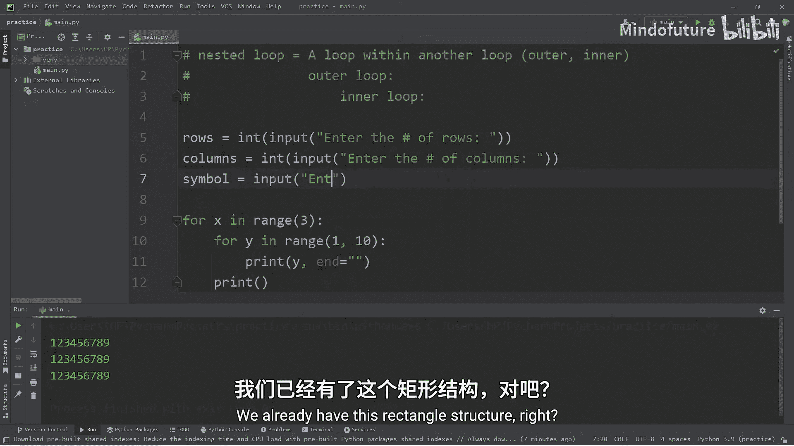
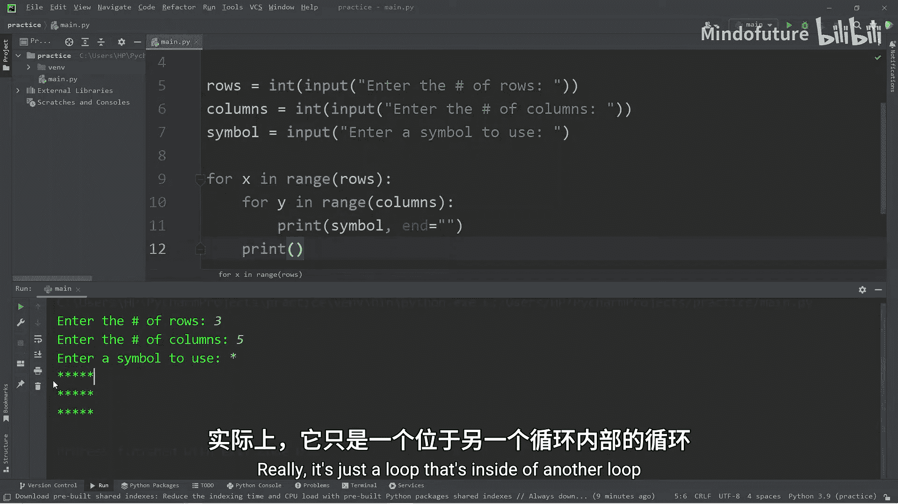
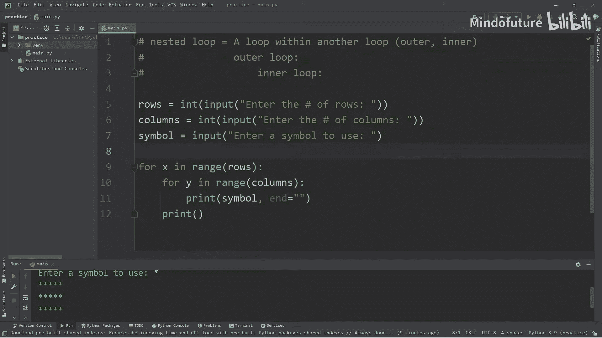

Python入门教程：P19：嵌套循环详解 🔄

在本节课中，我们将要学习Python中的嵌套循环。嵌套循环是指一个循环结构位于另一个循环结构的代码块内部。通过掌握嵌套循环，你可以处理更复杂的数据遍历和模式生成任务。

---

### 嵌套循环的基本概念



上一节我们介绍了单层循环，本节中我们来看看嵌套循环。嵌套循环可以理解为“循环中的循环”。外部的循环称为**外层循环**，内部的循环称为**内层循环**。



以下是嵌套循环的几种常见组合形式：
*   `while` 循环内部嵌套另一个 `while` 循环。
*   `for` 循环内部嵌套另一个 `for` 循环。
*   `for` 循环内部嵌套 `while` 循环。
*   `while` 循环内部嵌套 `for` 循环。

具体使用哪种组合取决于实际需求。

---

### 第一个示例：重复打印数字序列

让我们从一个简单的例子开始：打印数字1到9。我们将使用一个 `for` 循环来实现。

```python
for x in range(1, 10):
    print(x, end=' ')
```
**代码解释**：`range(1, 10)` 生成从1到9的数字序列。`print(x, end=' ')` 中的 `end=' '` 参数让每次打印后以空格结尾，而不是默认的换行，从而使所有数字打印在同一行。

运行上述代码，输出结果为：
```
1 2 3 4 5 6 7 8 9
```

现在，如果我们想将这个打印1到9的过程重复三次，该怎么办呢？我们可以创建另一个循环来包裹住现有的循环。

```python
for x in range(3):
    for y in range(1, 10):
        print(y, end=' ')
    print()
```
**代码解释**：
1.  外层循环 `for x in range(3):` 会执行3次。
2.  内层循环 `for y in range(1, 10):` 在每次外层循环执行时，都会完整地打印数字1到9。
3.  内层循环结束后，`print()` 会输出一个换行，这样每次打印的1-9序列就会单独成行。

运行这段代码，输出结果为：
```
1 2 3 4 5 6 7 8 9
1 2 3 4 5 6 7 8 9
1 2 3 4 5 6 7 8 9
```
这就是一个典型的嵌套循环结构。外层循环控制重复的次数，内层循环执行具体的重复任务。

---

### 实战项目：打印自定义矩形

理解了基本原理后，我们来创建一个更有趣的项目：根据用户输入的行数、列数和符号，打印一个矩形图案。

我们将复用之前的代码结构，但使其动态化。

```python
# 获取用户输入
rows = int(input("请输入行数："))
columns = int(input("请输入列数："))
symbol = input("请输入要使用的符号：")

# 使用嵌套循环打印矩形
for x in range(rows):
    for y in range(columns):
        print(symbol, end='')
    print()
```
**代码解释**：
1.  使用 `input()` 获取用户输入，并用 `int()` 将行数和列数转换为整数。
2.  外层循环 `for x in range(rows):` 控制矩形的行数。
3.  内层循环 `for y in range(columns):` 控制每一行中符号的个数（列数）。
4.  `print(symbol, end='')` 打印用户指定的符号，并且不换行。
5.  内层循环结束后，`print()` 输出换行，切换到下一行。



**运行示例1**：
```
请输入行数：4
请输入列数：10
请输入要使用的符号：$
$$$$$$$$$$
$$$$$$$$$$
$$$$$$$$$$
$$$$$$$$$$
```

**运行示例2**：
```
请输入行数：3
请输入列数：5
请输入要使用的符号：*
*****
*****
*****
```

---



### 总结

本节课中我们一起学习了Python的嵌套循环。
*   **核心概念**：嵌套循环是一个循环结构内包含另一个循环结构。外层循环每执行一次，内层循环会完整地执行其所有迭代。
*   **关键点**：循环的类型（`for` 或 `while`）可以任意组合，内层循环的代码必须正确缩进。
*   **应用**：嵌套循环非常适合处理需要多重遍历的任务，例如生成二维图案（如矩形、三角形）、遍历二维列表（矩阵）或进行组合计算。



通过理解和练习嵌套循环，你将能够解决更多复杂的编程问题。