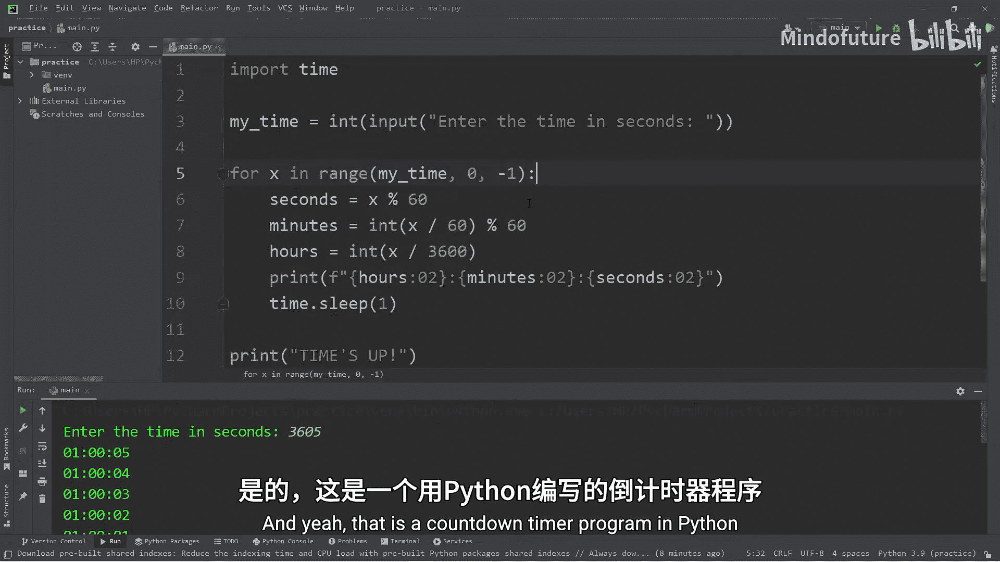

# 020：用Python创建倒计时器


在本节课中，我们将学习如何使用Python创建一个倒计时器程序。我们将运用之前学过的循环、输入处理和`time`模块等知识，最终实现一个可以显示小时、分钟和秒的数字时钟式倒计时器。

## 导入时间模块

首先，我们需要导入Python的`time`模块。这个模块包含一个非常有用的函数。

以下是`time`模块中`sleep`函数的使用方法：
```python
time.sleep()
```
在括号内指定秒数，程序就会“休眠”相应的时间。例如，`time.sleep(3)`会让程序暂停3秒，然后继续执行后续代码。

## 获取用户输入

接下来，我们需要询问用户希望设置多长的倒计时时间。

我们将创建一个变量`my_time`来存储用户输入的秒数。通过`input`函数获取输入，并使用`int()`进行类型转换，确保它是一个整数。
```python
my_time = int(input("请输入倒计时时间（秒）："))
```

## 构建倒计时循环

为了创建倒计时，我们需要一个循环。虽然`while`循环和`for`循环都可以实现，但这里我们选择使用`for`循环。

我们将使用`range()`函数生成一个数字序列。为了让倒计时从大到小进行，我们需要让`range`从`my_time`开始，到0结束，并且步长为-1。
```python
for x in range(my_time, 0, -1):
    time.sleep(1)
    print(x)
print("时间到！")
```
这段代码会每秒打印一个递减的数字，直到0时打印“时间到！”。

## 格式化为数字时钟

上一节我们实现了一个基本的倒计时。本节中，我们来看看如何将其格式化为更易读的“时:分:秒”数字时钟格式。

我们需要从总秒数`x`中分别计算出小时、分钟和秒。

以下是计算各时间单位的公式：
*   **秒**：`seconds = x % 60`
*   **分**：`minutes = int(x / 60) % 60`
*   **时**：`hours = int(x / 3600)`

我们使用模运算`%`来确保分钟和秒数不会超过60。计算完成后，使用f-string和格式说明符`02d`来确保每个单位都显示为两位数字（例如“05”秒）。

整合后的循环部分代码如下：
```python
for x in range(my_time, 0, -1):
    seconds = x % 60
    minutes = int(x / 60) % 60
    hours = int(x / 3600)
    print(f"{hours:02d}:{minutes:02d}:{seconds:02d}")
    time.sleep(1)
print("时间到！")
```

## 完整代码示例

以下是倒计时器程序的完整代码：
```python
import time

my_time = int(input("请输入倒计时时间（秒）："))

for x in range(my_time, 0, -1):
    seconds = x % 60
    minutes = int(x / 60) % 60
    hours = int(x / 3600)
    print(f"{hours:02d}:{minutes:02d}:{seconds:02d}")
    time.sleep(1)

print("时间到！")
```

## 总结



本节课中我们一起学习了如何用Python创建一个倒计时器。我们回顾并应用了多个核心概念：使用`time.sleep()`函数控制程序暂停，通过`input()`获取用户输入，利用`for`循环和`range()`函数实现递减计数，并运用模运算`%`和格式化字符串将总秒数转换为标准的“时:分:秒”格式。这个练习很好地融合了循环、数学运算和输入/输出处理，是巩固基础知识的优秀实践。