Python入门教程：P21：Python列表、集合与元组详解 🍎

在本节课中，我们将要学习Python中三种核心的集合类型：列表、集合和元组。集合可以被视为一个用于存储多个值的“单一变量”。我们将逐一探讨它们的特点、创建方法以及基本操作。

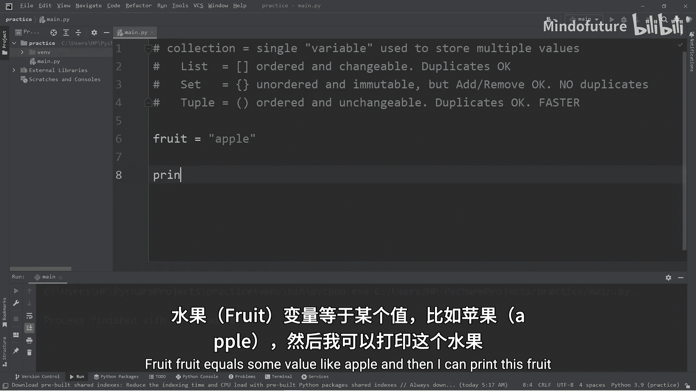

---

### 列表：有序且可变

列表是Python中最常用的集合类型。它使用方括号 `[]` 来创建，其中的元素是有序的，并且可以被修改。

**创建列表的公式如下：**
```python
fruits = ["apple", "orange", "banana", "coconut"]
```

列表是有序的，这意味着元素的位置是固定的。我们可以通过索引来访问列表中的元素，索引从0开始。

**访问列表元素的代码示例：**
```python
print(fruits[0])  # 输出: apple
print(fruits[1])  # 输出: orange
```

如果尝试访问不存在的索引，Python会抛出 `IndexError` 错误。

我们还可以使用切片操作来获取列表的一部分。

**切片操作的代码示例：**
```python
print(fruits[0:3])   # 输出: ['apple', 'orange', 'banana']
print(fruits[::2])   # 输出: ['apple', 'banana']
print(fruits[::-1])  # 输出: ['coconut', 'banana', 'orange', 'apple']
```

列表是可迭代的，这意味着我们可以使用 `for` 循环来遍历其中的每一个元素。

**遍历列表的代码示例：**
```python
for fruit in fruits:
    print(fruit)
```

以下是列表常用方法的简介：

*   **`append()`**: 在列表末尾添加一个元素。
    ```python
    fruits.append("pineapple")
    ```
*   **`remove()`**: 移除列表中第一个匹配的元素。
    ```python
    fruits.remove("apple")
    ```
*   **`insert()`**: 在指定索引位置插入一个元素。
    ```python
    fruits.insert(0, "pineapple")
    ```
*   **`sort()`**: 对列表进行升序排序。
    ```python
    fruits.sort()
    ```
*   **`reverse()`**: 反转列表中元素的顺序。
    ```python
    fruits.reverse()
    ```
*   **`clear()`**: 清空列表中的所有元素。
    ```python
    fruits.clear()
    ```
*   **`index()`**: 返回指定元素第一次出现的索引。
    ```python
    print(fruits.index("apple"))
    ```
*   **`count()`**: 统计指定元素在列表中出现的次数。
    ```python
    print(fruits.count("banana"))
    ```

要查看列表的所有可用方法，可以使用 `dir()` 函数。要了解某个方法的具体功能，可以使用 `help()` 函数。

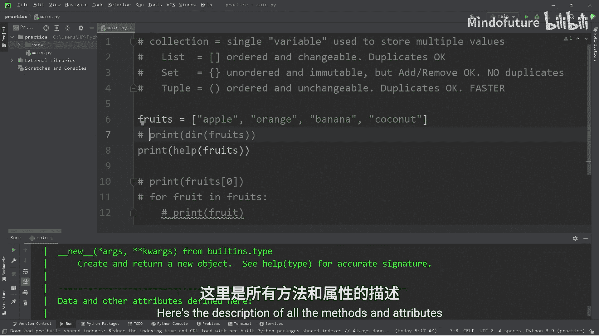

**查看列表方法的代码示例：**
```python
print(dir(fruits))
print(help(fruits))
```

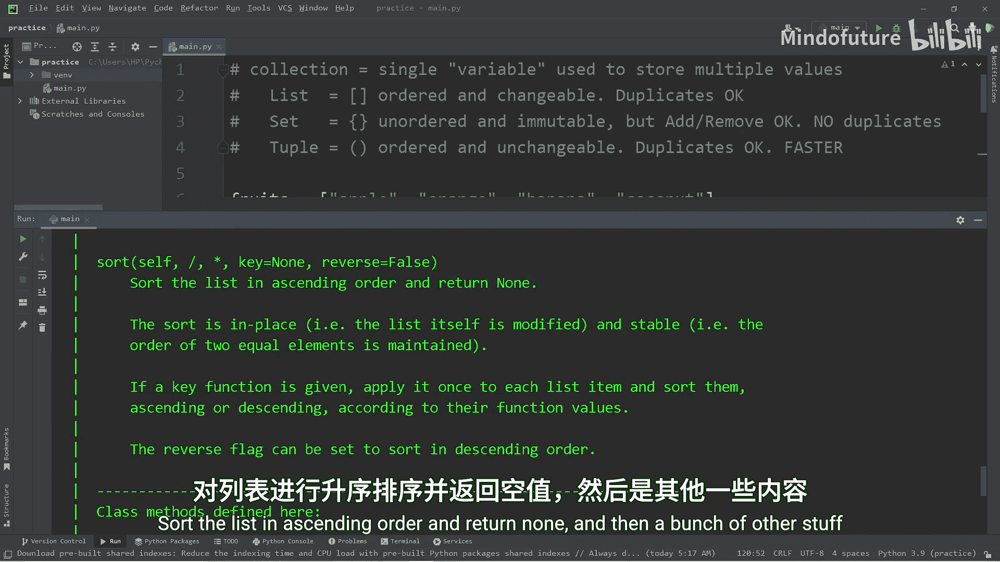

此外，我们可以使用 `len()` 函数获取列表的长度，使用 `in` 操作符检查某个值是否存在于列表中。

**获取长度和成员检查的代码示例：**
```python
print(len(fruits))          # 输出列表长度
print("apple" in fruits)    # 输出: True
print("pineapple" in fruits) # 输出: False
```

---

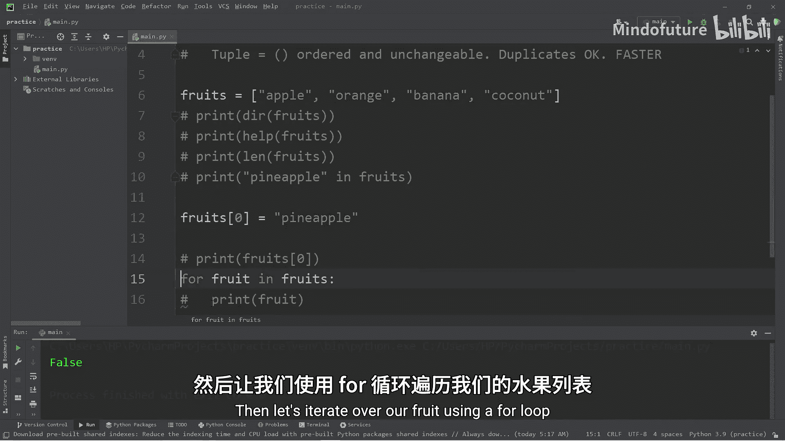

上一节我们介绍了有序且可变的列表，本节中我们来看看另一种集合类型：集合。

### 集合：无序且元素唯一

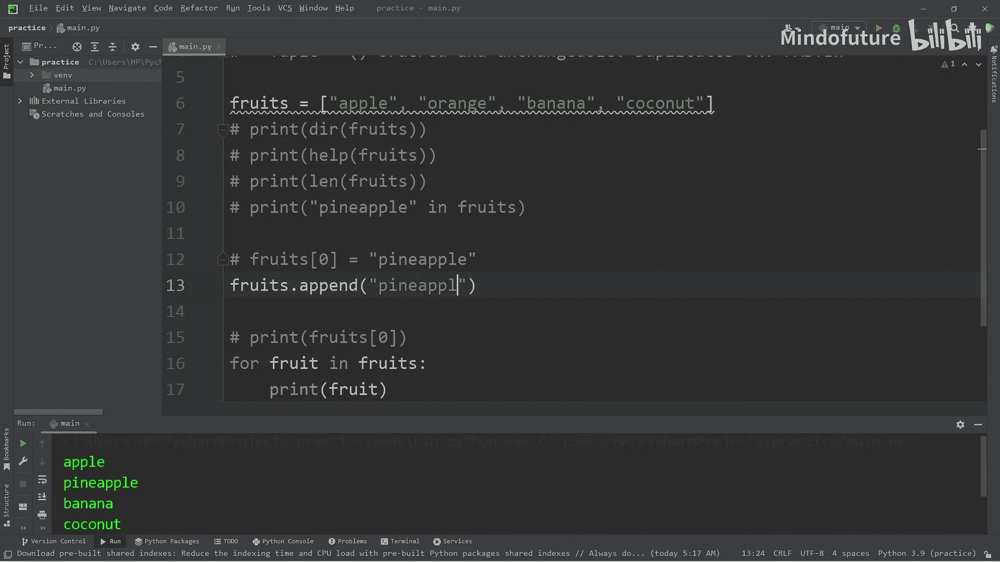

集合使用花括号 `{}` 来创建。它的主要特点是元素**无序**且**不允许重复**。

**创建集合的公式如下：**
```python
fruits = {"apple", "orange", "banana", "coconut"}
```

集合是无序的，这意味着每次打印时元素的顺序可能不同，并且不能通过索引来访问元素。尝试使用索引会导致 `TypeError`。

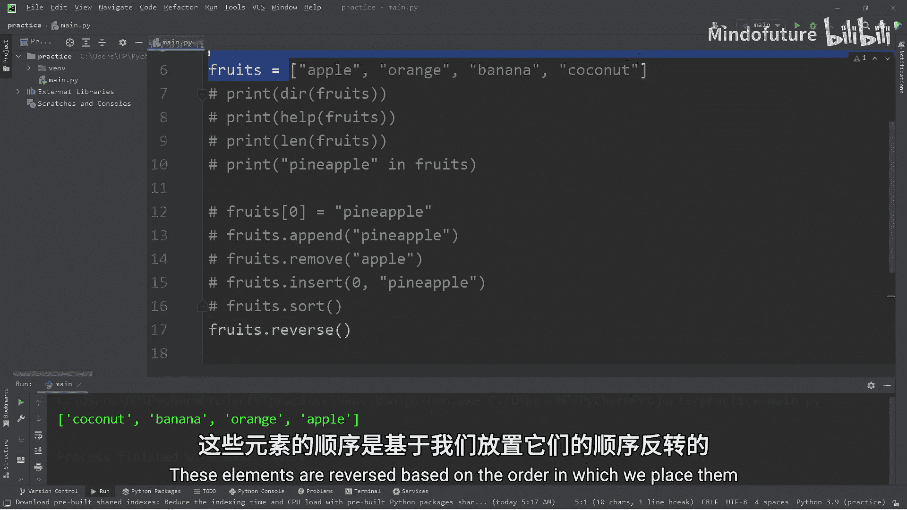

虽然集合中的元素本身不可变（不能通过索引修改），但我们可以向集合中添加或移除元素。

以下是集合的一些常用方法：

*   **`add()`**: 向集合中添加一个元素。
    ```python
    fruits.add("pineapple")
    ```
*   **`remove()`**: 从集合中移除一个指定元素。如果元素不存在会报错。
    ```python
    fruits.remove("apple")
    ```
*   **`pop()`**: 随机移除并返回集合中的一个元素。
    ```python
    removed_fruit = fruits.pop()
    ```
*   **`clear()`**: 清空集合中的所有元素。
    ```python
    fruits.clear()
    ```

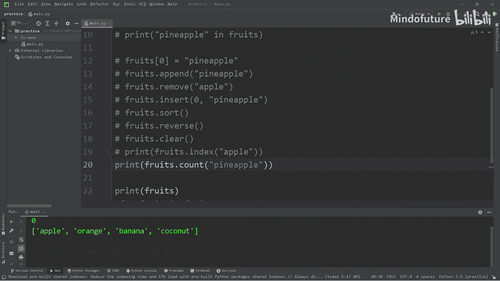

与列表类似，我们可以使用 `len()` 函数获取集合的大小，使用 `in` 操作符检查成员关系。

**集合操作的代码示例：**
```python
print(len(fruits))
print("apple" in fruits)
```

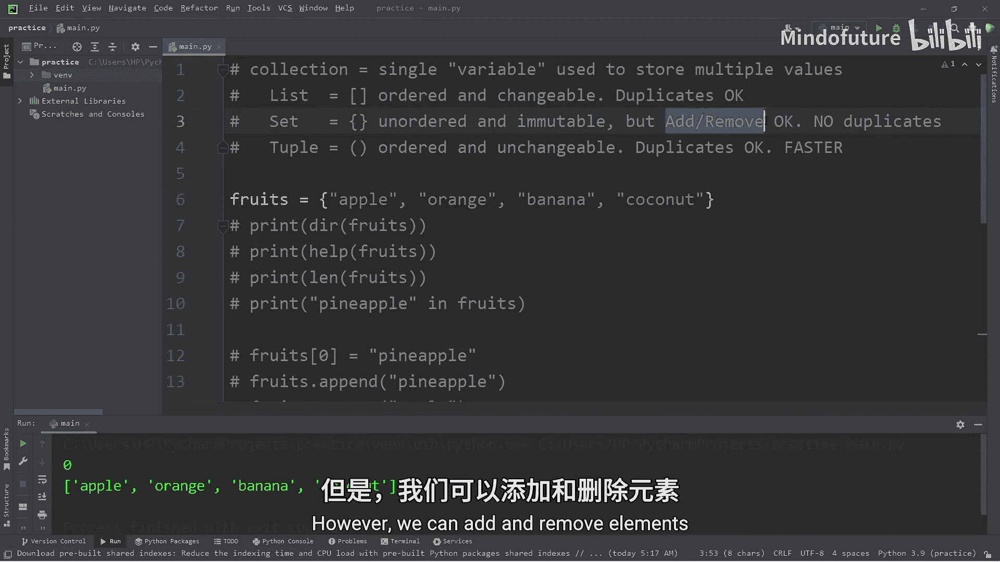

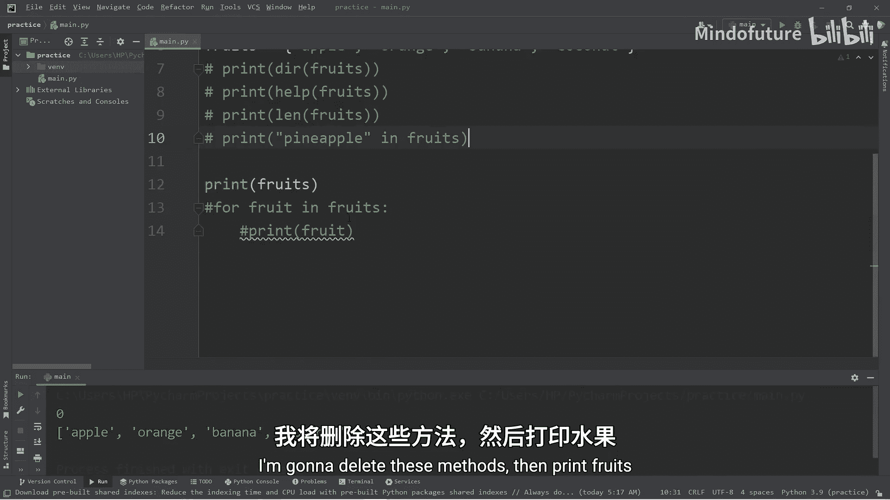

由于集合自动去重，它非常适合用于检查成员资格或消除重复项。

---

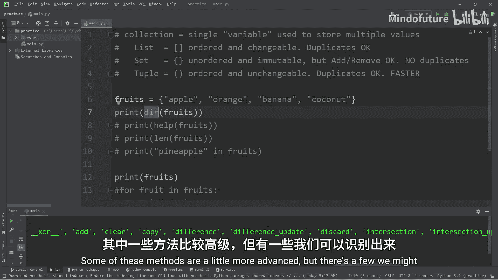

了解了列表和集合之后，我们来看最后一种基础集合类型：元组。

### 元组：有序且不可变

元组使用圆括号 `()` 来创建。它与列表类似，都是有序的，但关键区别在于元组是**不可变**的，创建后不能修改其中的元素。

**创建元组的公式如下：**
```python
fruits = ("apple", "orange", "banana", "coconut", "coconut")
```

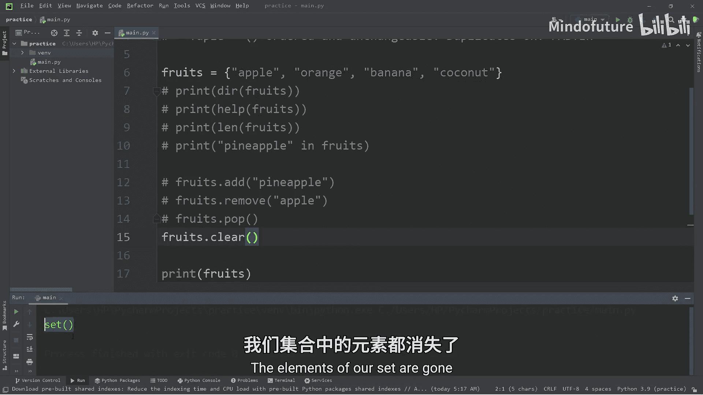

元组的不可变性带来了一个优点：**执行速度比列表更快**。因此，如果你需要存储一组不需要修改的数据，使用元组是更高效的选择。

由于不可变，元组的方法比列表少得多，主要有两个：

*   **`index()`**: 返回指定元素第一次出现的索引。
    ```python
    print(fruits.index("apple"))
    ```
*   **`count()`**: 统计指定元素在元组中出现的次数。
    ```python
    print(fruits.count("coconut")) # 输出: 2
    ```

同样，我们可以使用 `len()`、`in` 操作符和 `for` 循环来处理元组。

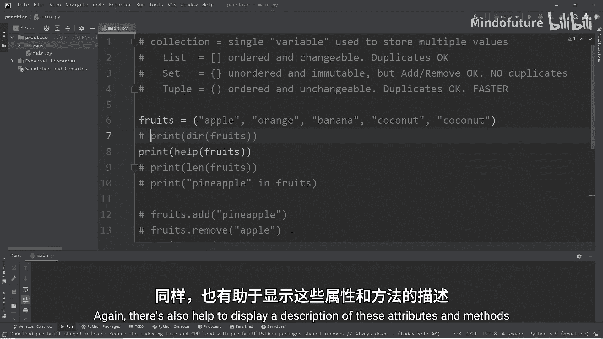

**元组基本操作的代码示例：**
```python
print(len(fruits))
print("pineapple" in fruits)
for fruit in fruits:
    print(fruit)
```

---

### 总结 🎯

本节课中我们一起学习了Python中三种基础的集合类型：

1.  **列表 `[]`**: **有序**且**可变**，允许重复元素。功能最丰富，是最通用的集合。
2.  **集合 `{}`**: **无序**且元素**唯一**，不允许重复。主要用于成员测试和去重。
3.  **元组 `()`**: **有序**且**不可变**，允许重复元素。因为不可变，所以处理速度比列表快，适用于存储不应更改的数据。

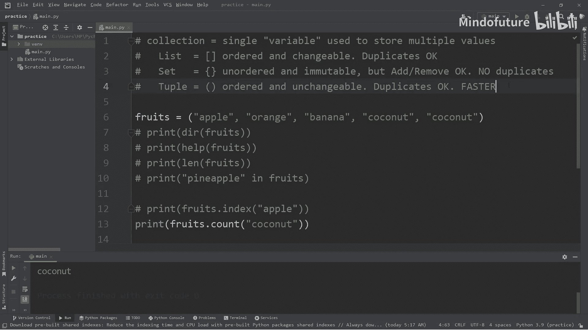

记住，集合是用于存储多个值的单一变量。根据你的需求——是否需要顺序、是否允许修改、是否允许重复——来选择最合适的类型。在接下来的课程中，我们将探讨另一种强大的集合：字典。