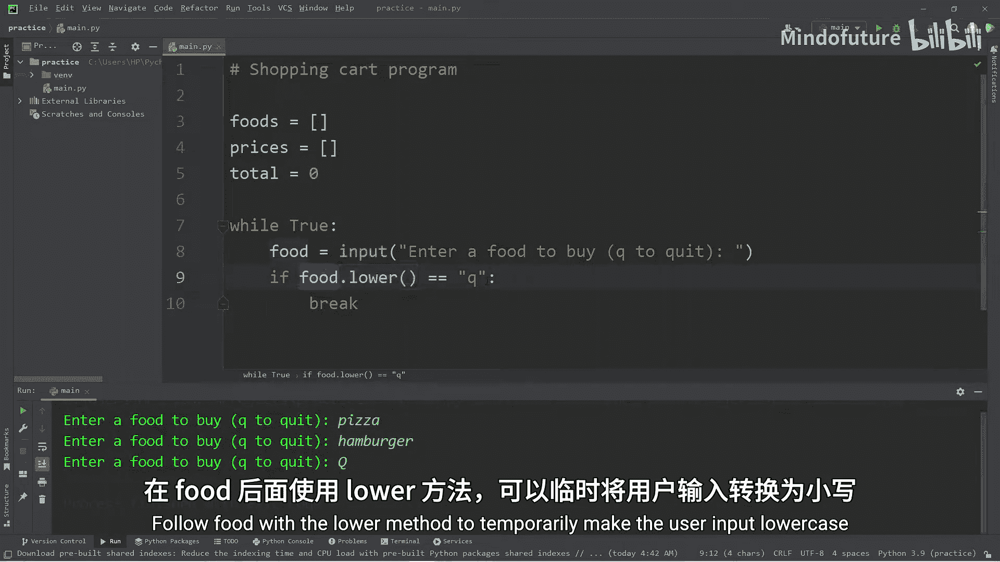
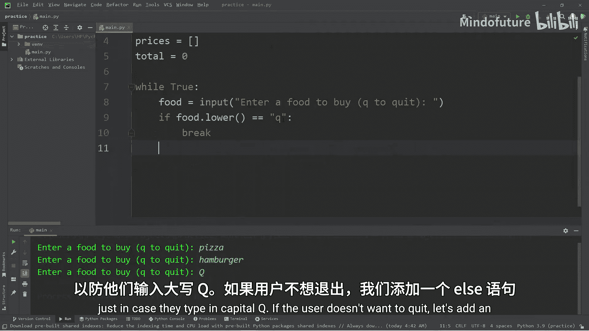
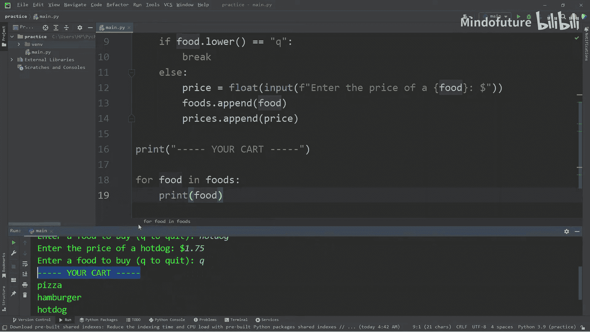
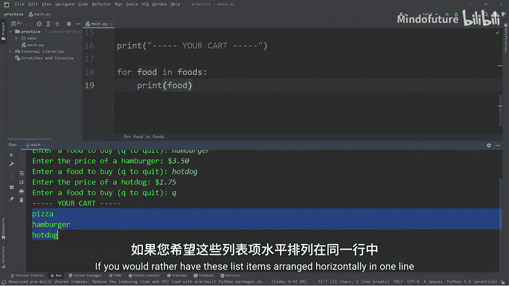
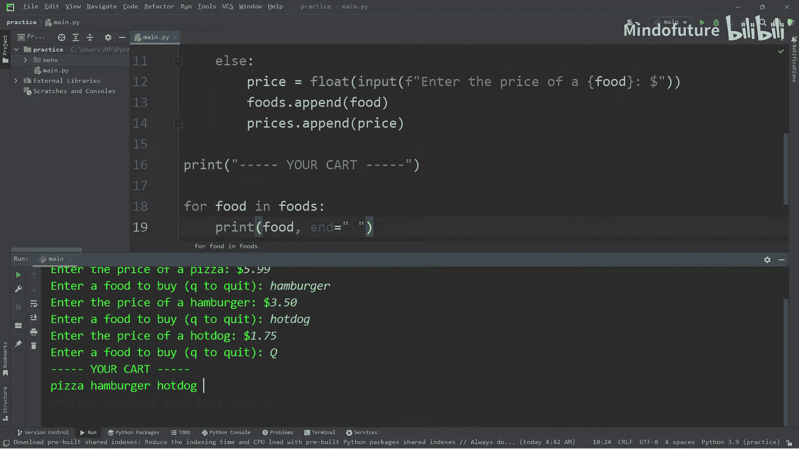
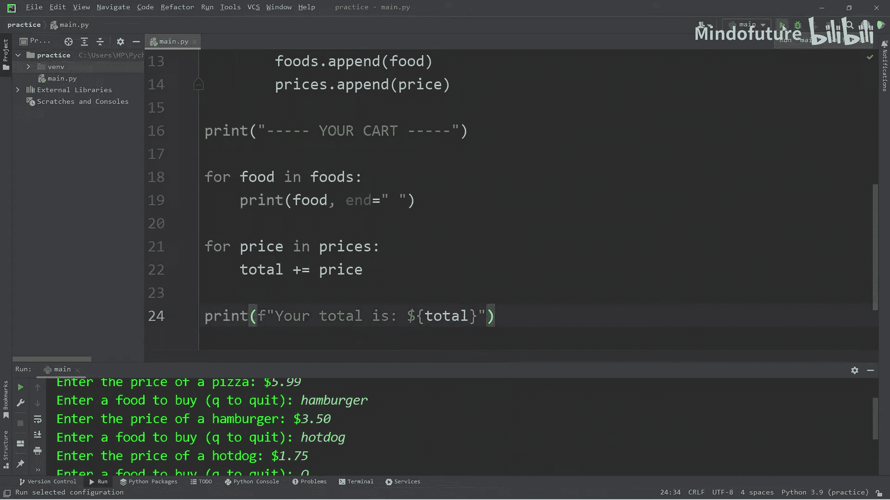
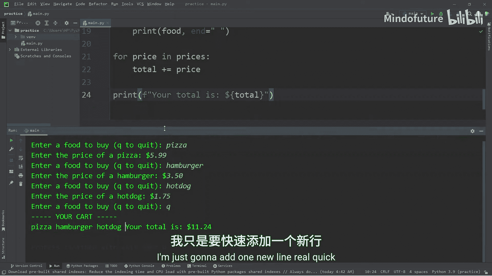
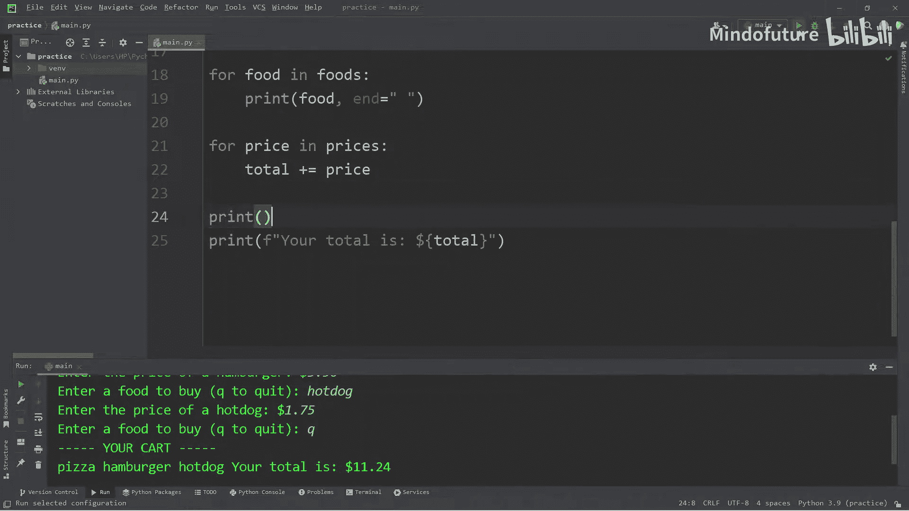
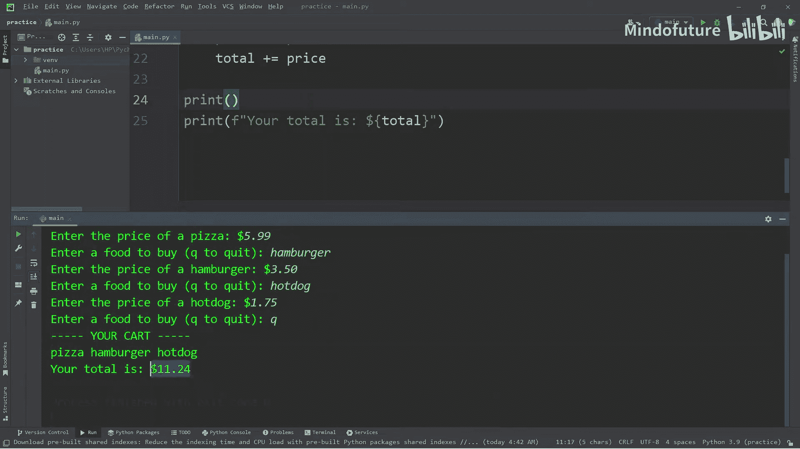
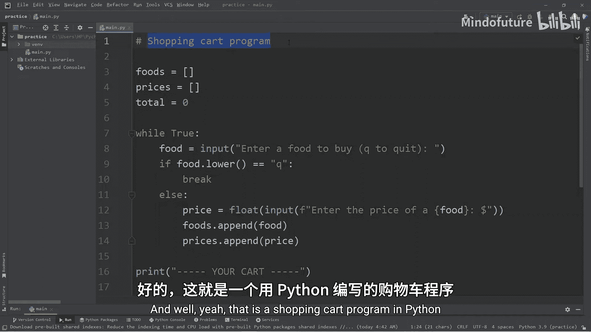

# 022：购物车程序 🛒

在本节课中，我们将创建一个购物车程序。这是一个练习项目，旨在巩固上一节关于列表、集合和元组的知识。通过实践操作这些集合类型，我们能更好地掌握它们的用法。因此，在继续深入学习之前，我们通过这个练习来熟悉它们。

我们将使用两个列表来分别存储商品和价格，并计算总价。

## 程序结构概述

我们将创建两个空列表：一个用于存储商品名称，另一个用于存储对应的价格。同时，我们还需要一个变量来累计总价。程序的核心是一个`while`循环，它会持续询问用户想要购买的商品，直到用户选择退出。最后，程序会显示购物车内的所有商品及其总价。

## 初始化变量

首先，我们声明两个空列表和一个总价变量。

```python
foods = []
prices = []
total = 0
```

我们选择使用列表而非元组，是因为元组不可变，而我们需要向购物车中添加商品。我们也没有使用集合，因为集合是无序的，而我们需要按顺序显示购物车内容。

## 构建主循环

我们将使用一个`while True`循环来持续接收用户输入。循环内部需要包含一个退出机制。

```python
while True:
```

在循环中，我们首先询问用户想要购买什么商品。



```python
    food = input(“请输入要购买的商品（输入‘q’退出）：”)
```



为了允许用户输入大写或小写的‘Q’来退出，我们使用`.lower()`方法将输入转换为小写后再进行比较。

```python
    if food.lower() == “q”:
        break
```

如果用户输入的不是退出指令，我们就将商品添加到`foods`列表中，并询问该商品的价格。

```python
    else:
        foods.append(food)
        price = float(input(f”请输入 {food} 的价格：”))
        prices.append(price)
```

注意，我们使用`float()`函数将价格输入转换为浮点数，以便后续进行数学计算。

## 显示购物车内容

退出循环后，我们需要显示用户购物车中的所有商品。

```python
print(“-” * 5 + “您的购物车” + “-” * 5)
for food in foods:
    print(food, end=“ ”)
print()
```

这里，`print(food, end=“ ”)`中的`end=“ ”`参数将默认的换行符替换为空格，使得所有商品名称在同一行水平显示。如果你希望垂直显示，可以移除`end`参数。

## 计算并显示总价



接下来，我们遍历`prices`列表，将所有价格相加得到总价。

```python
for price in prices:
    total += price
```



最后，我们打印出总金额。

```python
print()
print(f“总价为：${total:.2f}”)
```

## 完整代码与运行示例

将以上所有部分组合起来，就得到了完整的购物车程序。



```python
foods = []
prices = []
total = 0

while True:
    food = input(“请输入要购买的商品（输入‘q’退出）：”)
    if food.lower() == “q”:
        break
    else:
        foods.append(food)
        price = float(input(f”请输入 {food} 的价格：”))
        prices.append(price)

print(“-” * 5 + “您的购物车” + “-” * 5)
for food in foods:
    print(food, end=“ ”)
print()



for price in prices:
    total += price

print()
print(f“总价为：${total:.2f}”)
```





**运行示例：**
```
请输入要购买的商品（输入‘q’退出）：披萨
请输入 披萨 的价格：5.99
请输入要购买的商品（输入‘q’退出）：汉堡
请输入 汉堡 的价格：3.50
请输入要购买的商品（输入‘q’退出）：热狗
请输入 热狗 的价格：1.75
请输入要购买的商品（输入‘q’退出）：q
-----您的购物车-----
披萨 汉堡 热狗



总价为：$11.24
```

## 总结



本节课中，我们一起学习了如何创建一个简单的购物车程序。我们实践了使用列表来存储动态数据，利用`while`循环处理持续的用户输入，并通过条件判断（检查用户是否输入‘q’）来控制循环的退出。这个练习巩固了对列表、循环和条件语句的理解，是迈向更复杂Python编程的坚实一步。