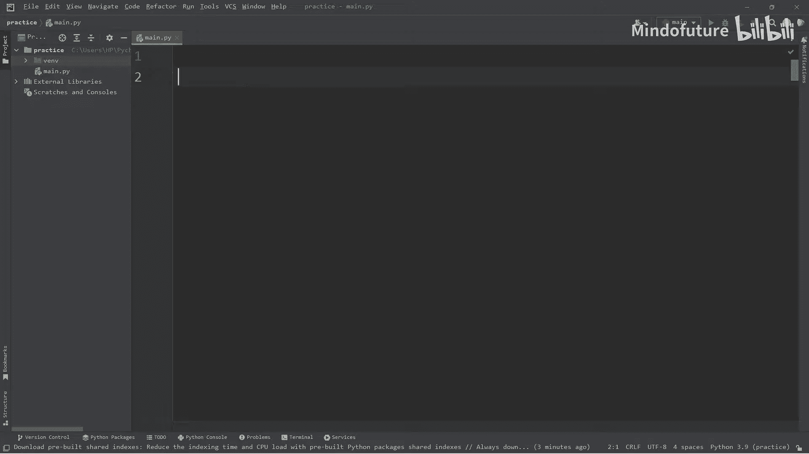
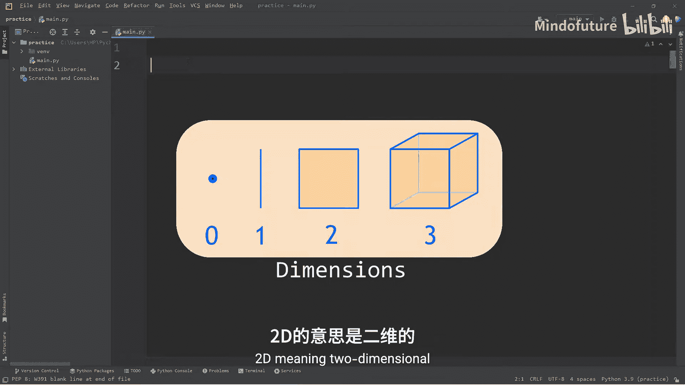
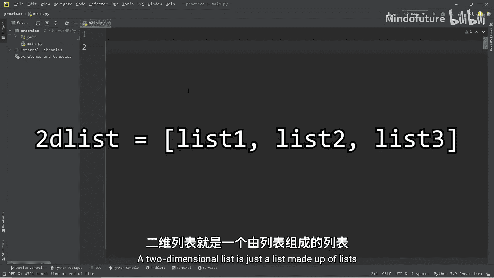
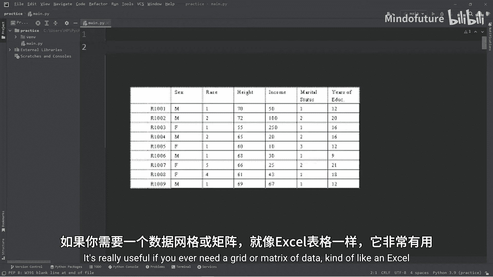
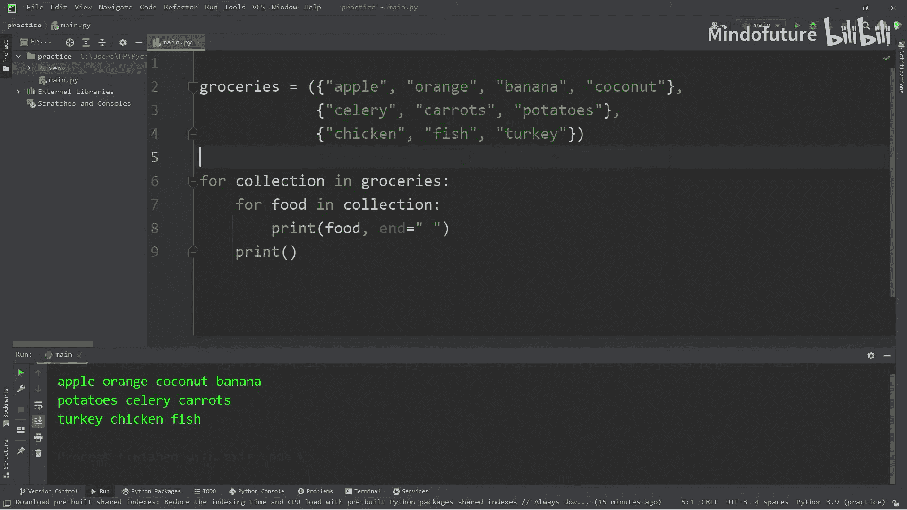
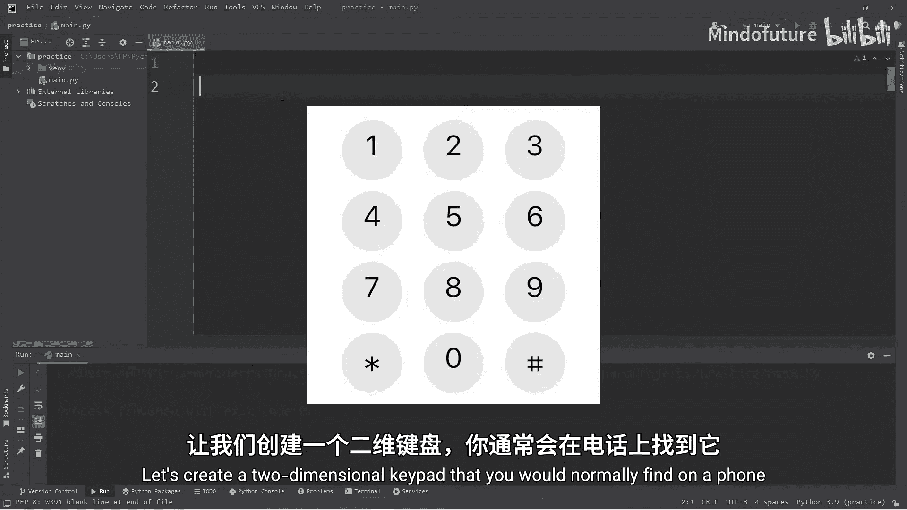
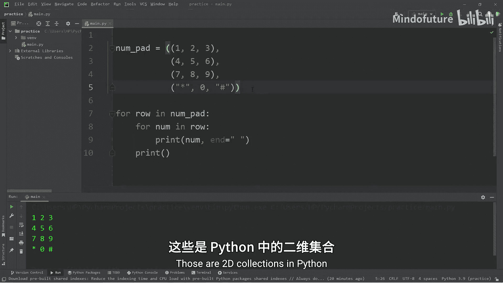

# 023：二维集合详解 📚

在本节课中，我们将要学习Python中的二维集合。二维集合，即由集合（如列表、元组）构成的集合，非常适合用来表示网格或矩阵形式的数据，类似于Excel电子表格。



## 什么是二维集合？ 🤔







一个二维列表本质上就是一个由列表组成的列表。它非常灵活，可以用来创建数据网格。除了列表，你也可以创建二维元组或由其他集合构成的二维集合。

## 创建二维列表 🛠️

首先，我们创建三个一维列表作为示例：

```python
fruits = ["苹果", "橙子", "香蕉", "椰子"]
vegetables = ["芹菜", "胡萝卜", "土豆"]
meats = ["鸡肉", "鱼肉", "火鸡肉"]
```

接下来，我们将这三个列表组合成一个二维列表：

```python
groceries = [fruits, vegetables, meats]
```

或者，你也可以不预先命名内部列表，直接创建二维列表：

```python
groceries = [
    ["苹果", "橙子", "香蕉", "椰子"],
    ["芹菜", "胡萝卜", "土豆"],
    ["鸡肉", "鱼肉", "火鸡肉"]
]
```

## 访问二维列表元素 🔍

访问二维列表的元素与访问一维列表略有不同。如果只使用一个索引，你将得到整个“行”（即一个内部列表）。

```python
print(groceries[0])  # 输出：['苹果', '橙子', '香蕉', '椰子']
```

要访问具体的元素，你需要使用两个索引，类似于坐标系统：第一个索引代表行，第二个索引代表列。

```python
print(groceries[0][0])  # 输出：苹果 (第0行，第0列)
print(groceries[1][1])  # 输出：胡萝卜 (第1行，第1列)
```

以下是访问所有元素的示例：

*   `groceries[0][0]` = 苹果
*   `groceries[0][1]` = 橙子
*   `groceries[0][2]` = 香蕉
*   `groceries[1][0]` = 芹菜
*   `groceries[1][1]` = 胡萝卜
*   `groceries[1][2]` = 土豆
*   `groceries[2][0]` = 鸡肉
*   `groceries[2][1]` = 鱼肉
*   `groceries[2][2]` = 火鸡肉

## 遍历二维列表 🔄

要遍历二维列表中的所有元素，可以使用嵌套循环。

使用单层循环只能遍历每一行：

```python
for collection in groceries:
    print(collection)
```

使用嵌套循环则可以遍历每一个具体的元素：

```python
for row in groceries:
    for food in row:
        print(food, end=" ")  # 使用空格代替换行
    print()  # 每行结束后换行
```

## 其他类型的二维集合 📦

二维集合不限于列表。你可以根据需求选择不同的数据结构。

*   **列表的元组**：外部是元组，内部是列表。元组不可变，但内部的列表可变。
    ```python
    mixed_collection = (["a", "b"], ["c", "d"])
    ```
*   **元组的元组**：外部和内部都是元组。完全不可变，访问速度快。
    ```python
    tuple_2d = (("a", "b"), ("c", "d"))
    ```
*   **集合的元组**：外部是元组，内部是集合。注意，集合是无序的。
    ```python
    set_tuple = ({"a", "b"}, {"c", "d"})
    ```



## 实践练习：创建电话键盘 ⌨️



现在，让我们通过一个练习来巩固所学知识：创建一个模拟电话键盘的二维集合。

由于键盘数字顺序固定且不需要修改，我们选择使用**二维元组**，因为它有序且不可变，性能更好。

```python
numpad = (
    ("1", "2", "3"),
    ("4", "5", "6"),
    ("7", "8", "9"),
    ("*", "0", "#")
)
```

使用嵌套循环来打印这个键盘布局：

```python
for row in numpad:
    for num in row:
        print(num, end=" ")
    print()
```

输出结果将是一个整齐的网格：
```
1 2 3
4 5 6
7 8 9
* 0 #
```

## 总结 📝

本节课中我们一起学习了Python中的二维集合。我们了解到：

1.  二维集合是由集合（列表、元组等）构成的集合，用于表示网格数据。
2.  访问元素需要使用两个索引：`[行][列]`。
3.  遍历二维集合通常需要嵌套循环。
4.  可以根据数据的特性（是否需要有序、是否可变）选择列表、元组或集合来构建二维结构。
5.  通过创建电话键盘的练习，我们实践了如何应用二维元组来解决实际问题。



当你需要处理表格、矩阵或任何网格状数据时，二维集合是一个非常实用的工具。