# 024：使用Python创建问答游戏 🎮

在本节课中，我们将学习如何使用Python创建一个简单的问答游戏。我们将通过定义问题、选项、答案，并处理用户输入和计分，来构建一个完整的交互式程序。

---

## 定义数据与变量 📝

首先，我们需要声明游戏所需的所有集合和变量。我们将使用元组存储问题和选项，使用列表存储用户的猜测，并使用变量来跟踪分数和当前问题编号。

以下是游戏所需的核心数据结构：

```python
questions = (
    "How many elements are in the periodic table?",
    "Which animal lays the largest eggs?",
    "What is the most abundant gas in Earth's atmosphere?",
    "How many bones are in the human body?",
    "Which planet in the solar system is the hottest?"
)

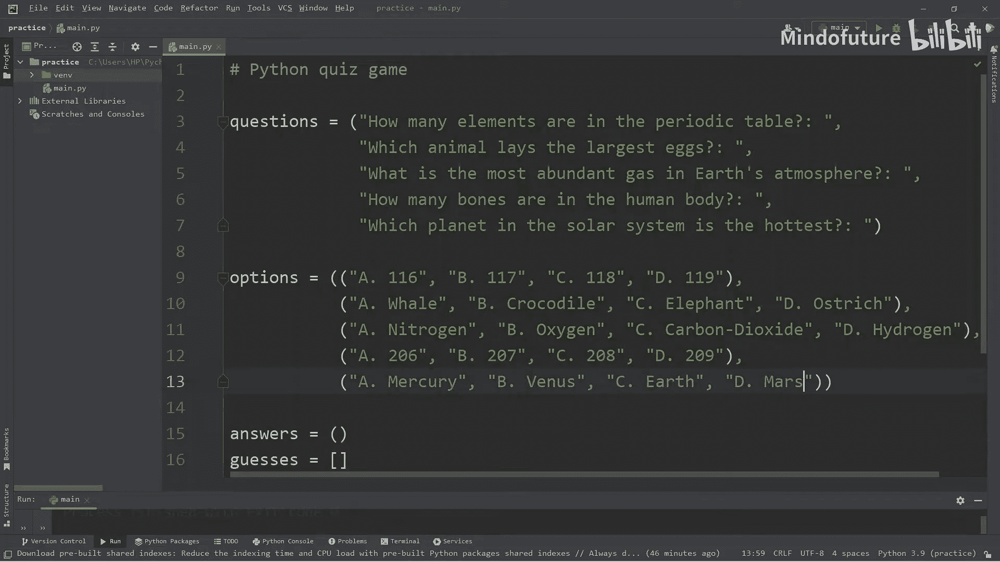

options = (
    ("A. 116", "B. 117", "C. 118", "D. 119"),
    ("A. Whale", "B. Crocodile", "C. Elephant", "D. Ostrich"),
    ("A. Oxygen", "B. Nitrogen", "C. Carbon Dioxide", "D. Hydrogen"),
    ("A. 206", "B. 207", "C. 208", "D. 209"),
    ("A. Mercury", "B. Venus", "C. Earth", "D. Mars")
)

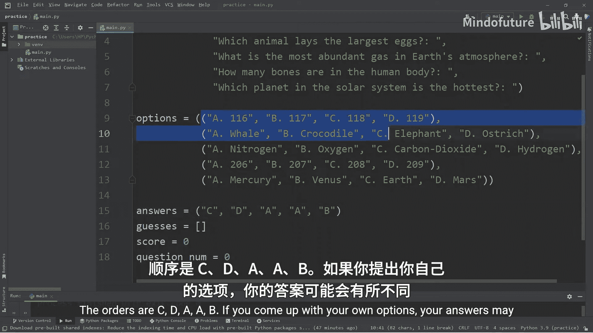

answers = ("C", "D", "A", "A", "B")
guesses = []
score = 0
question_num = 0
```

---

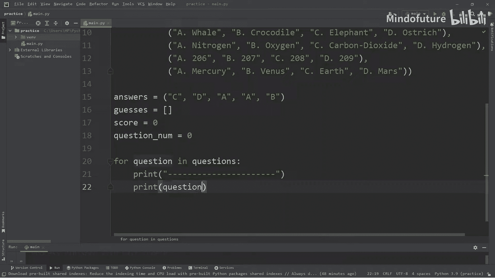

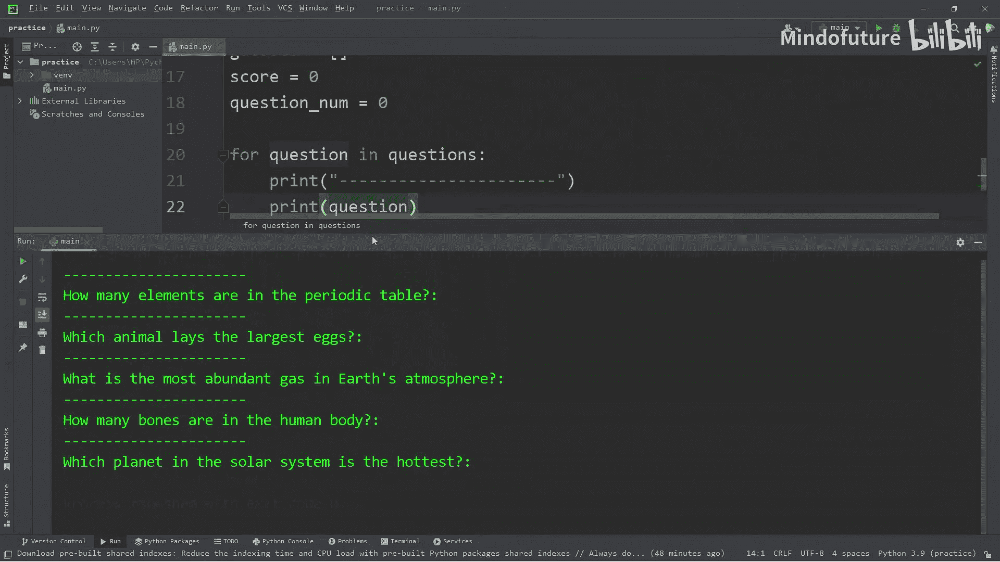

## 显示问题与选项 💬

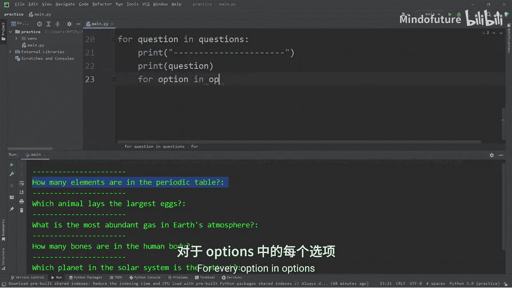

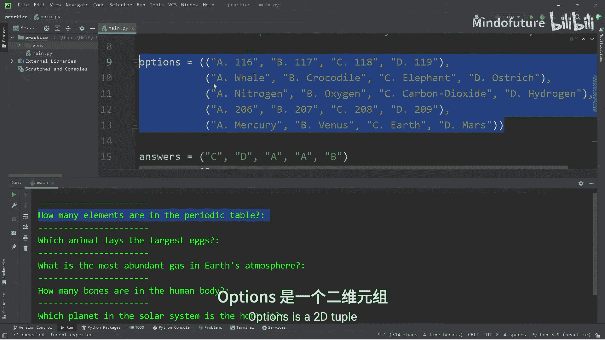

上一节我们定义了游戏的数据。本节中，我们来看看如何将这些数据显示给用户。我们将遍历问题列表，并同时显示对应的问题和选项。

以下是显示逻辑的核心代码：

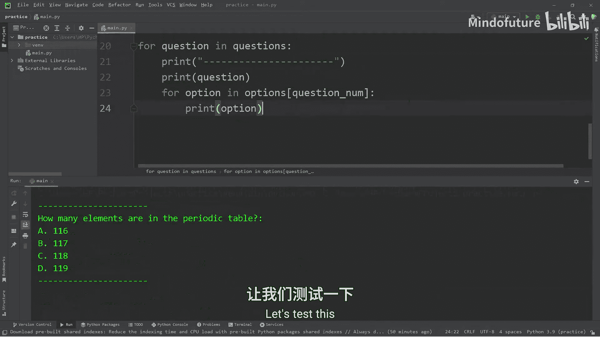

```python
for question in questions:
    print("----------------------")
    print(question)
    for option in options[question_num]:
        print(option)
    # ... 后续将在此处添加用户输入和判断逻辑
    question_num += 1
```

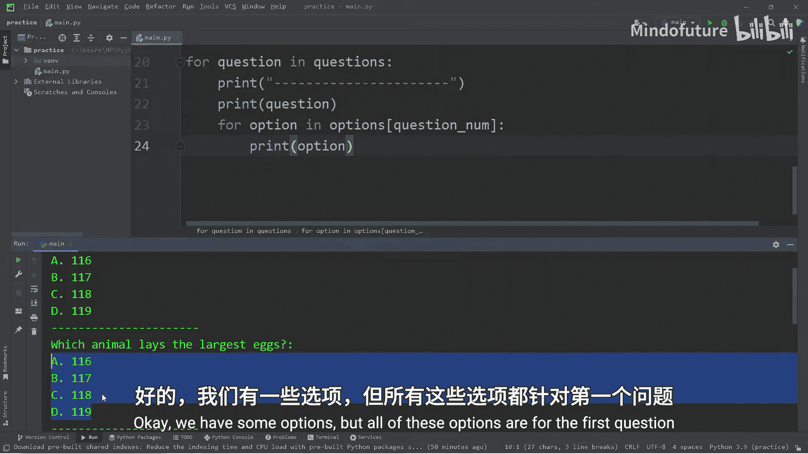

---

## 处理用户输入与判断答案 ✅

在显示了问题和选项之后，程序需要接收用户的答案，并判断其是否正确。我们将使用 `input()` 函数获取输入，并将其与正确答案进行比较。

以下是处理用户输入和计分的步骤：

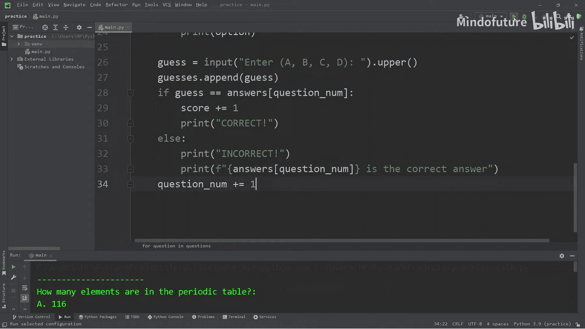

1.  获取用户输入并将其转换为大写。
2.  将用户的猜测添加到 `guesses` 列表中。
3.  判断猜测是否正确，并更新分数。

```python
    guess = input("Enter (A, B, C, D): ").upper()
    guesses.append(guess)

    if guess == answers[question_num]:
        score += 1
        print("CORRECT!")
    else:
        print("INCORRECT!")
        print(f"{answers[question_num]} is the correct answer.")
```

---

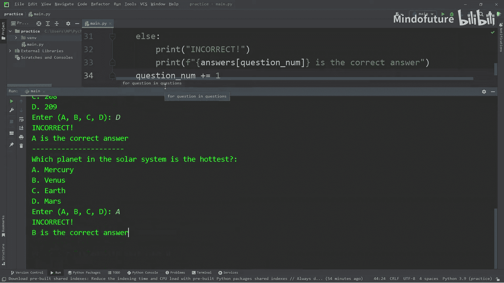

## 显示最终结果 📊

当所有问题都回答完毕后，我们需要向用户展示最终结果，包括正确答案、用户的答案以及最终得分百分比。

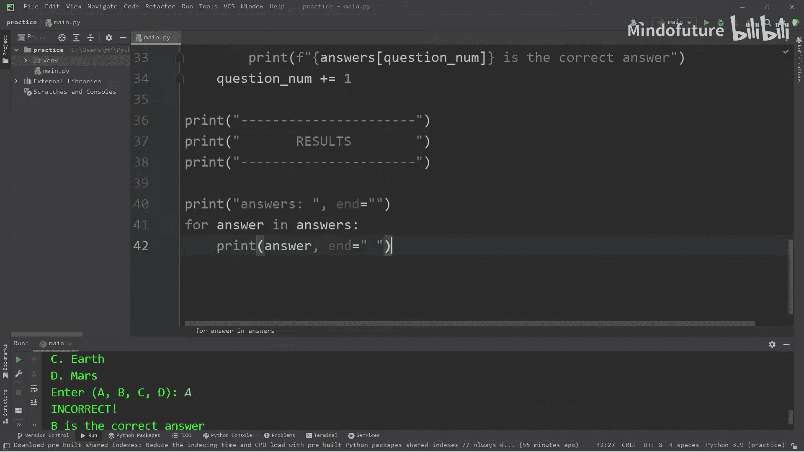

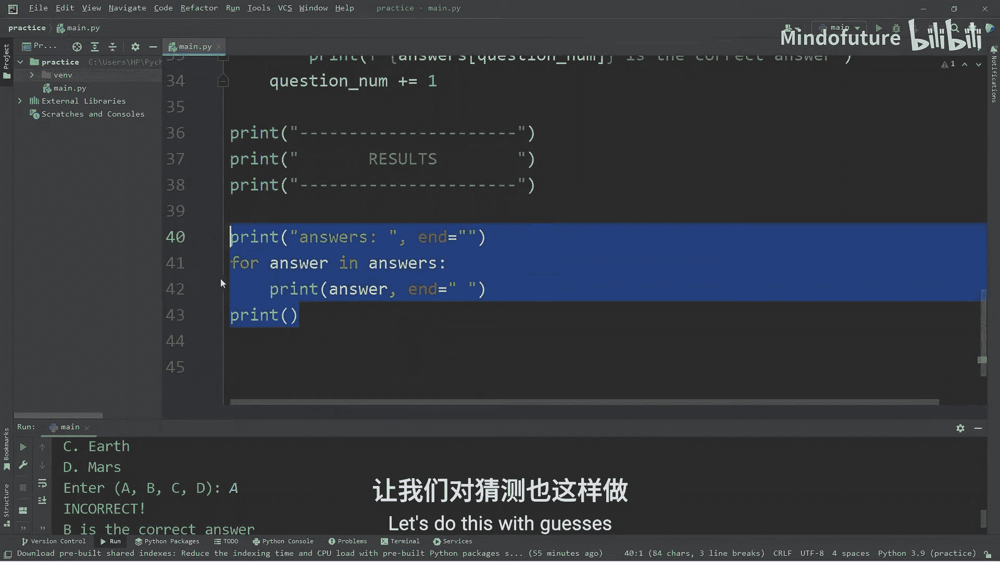

以下是显示结果的代码：

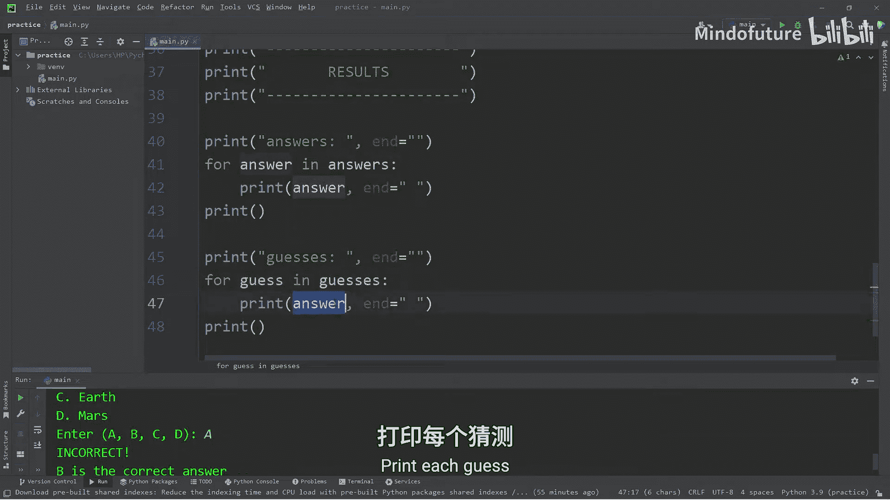

```python
print("----------------------")
print("       RESULTS        ")
print("----------------------")

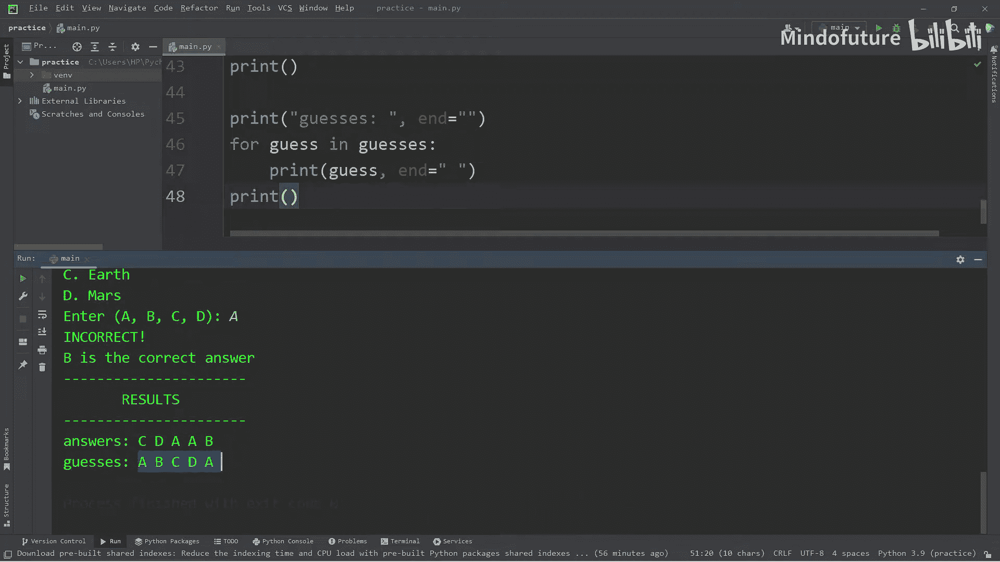

print("answers: ", end="")
for answer in answers:
    print(answer, end=" ")
print()

print("guesses: ", end="")
for guess in guesses:
    print(guess, end=" ")
print()

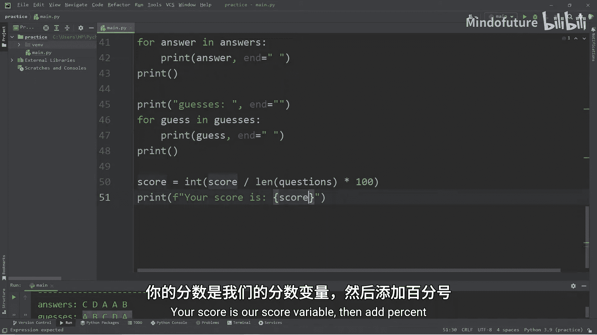

score = int(score / len(questions) * 100)
print(f"Your score is: {score}%")
```

---

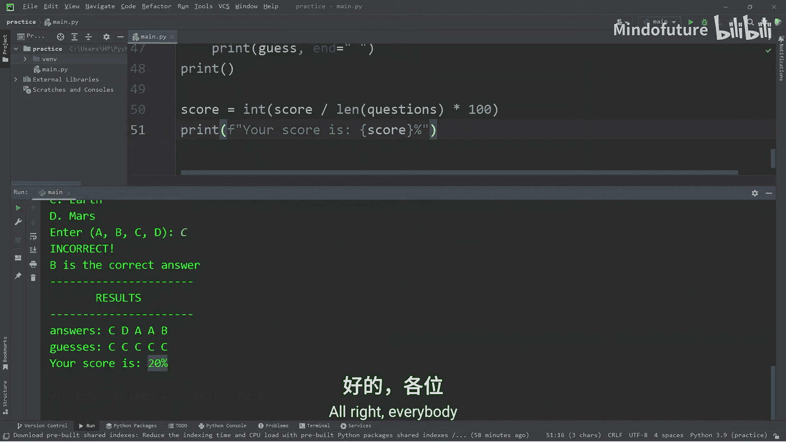

## 总结 🎉

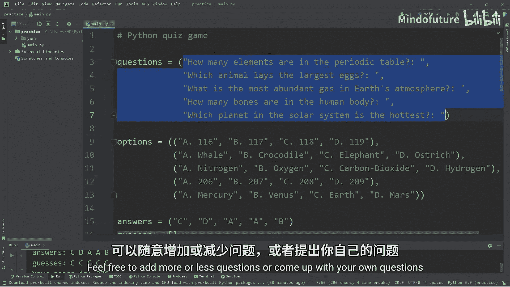

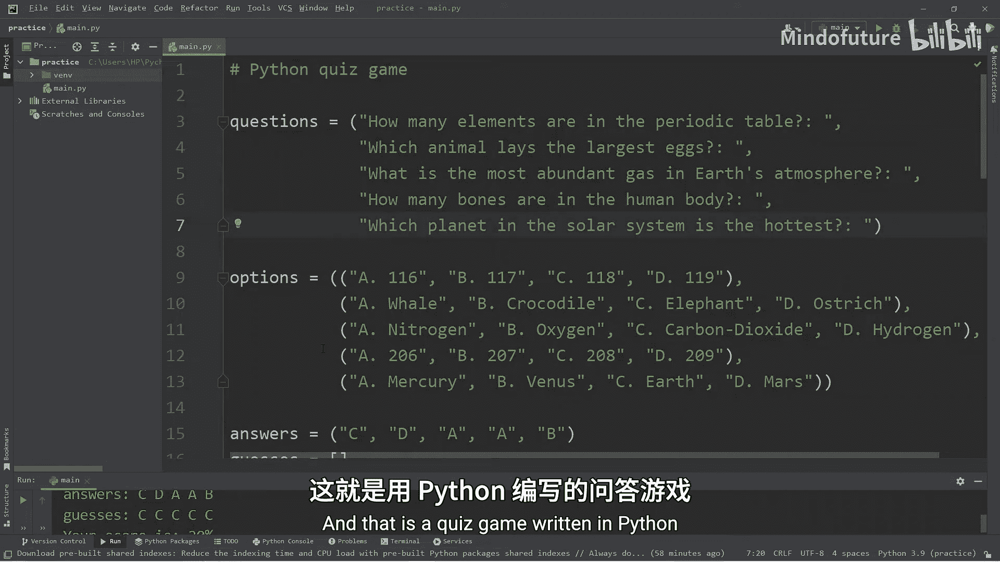

本节课中我们一起学习了如何使用Python创建一个基础的问答游戏。我们掌握了如何组织数据（使用元组和列表）、如何通过循环遍历和显示内容、如何处理用户输入并进行逻辑判断，以及如何计算和展示最终结果。你可以尝试修改问题、选项和答案来创建属于自己的个性化问答游戏。