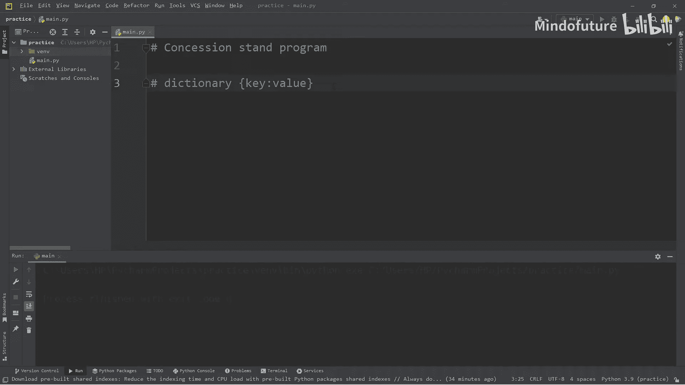
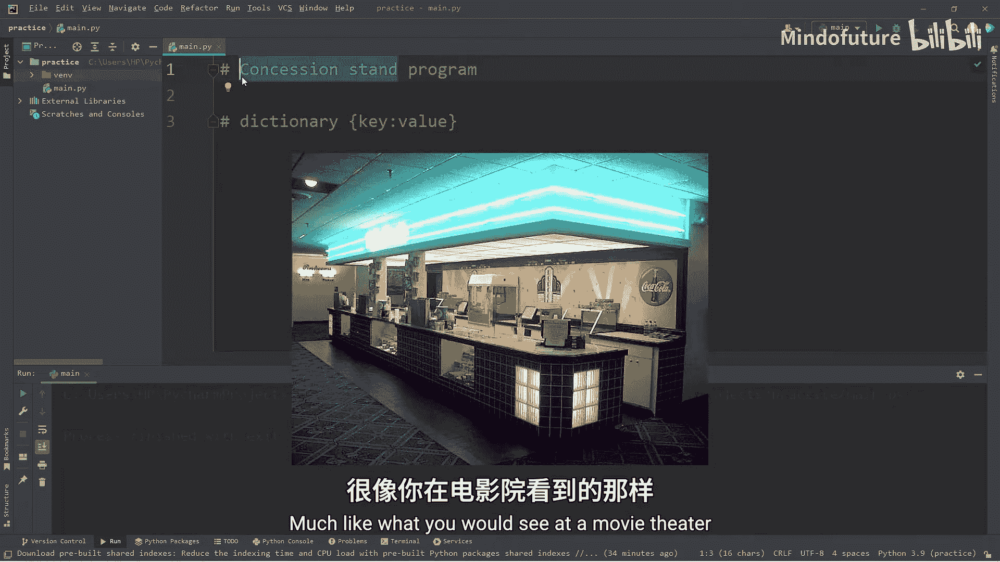
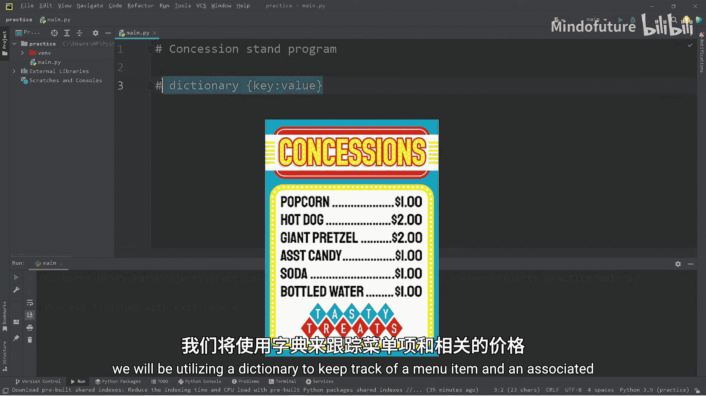
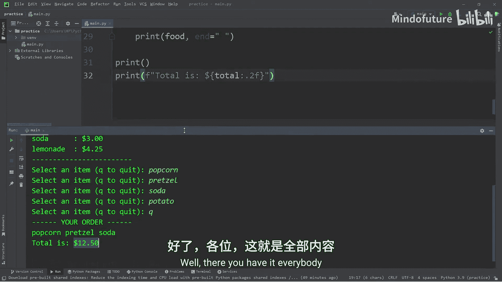
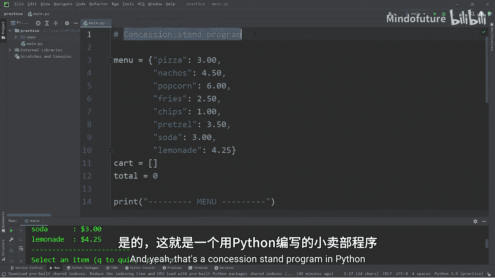

Python入门教程：P26：创建小卖部程序 🍿

在本节课中，我们将创建一个模拟电影院小卖部功能的程序。我们将使用**字典**来管理菜单项及其价格，并通过这个程序来熟悉字典的基本操作。

---







### 创建菜单字典

首先，我们需要创建一个名为 `menu` 的字典，用于存储商品名称（键）和对应的价格（值）。

```python
menu = {
    "pizza": 3.00,
    "nachos": 4.50,
    "popcorn": 6.00,
    "fries": 2.50,
    "chips": 1.00,
    "soft pretzel": 2.00,
    "soda": 1.50,
    "lemonade": 1.25
}
```

---

### 初始化购物车和总价

为了记录用户选择的商品和计算总价，我们需要初始化一个空的购物车列表和一个总价变量。

```python
cart = []
total = 0.0
```

---

### 向用户展示菜单

为了让用户看到所有选项，我们需要将字典的内容格式化输出。我们可以使用字典的 `.items()` 方法来遍历所有键值对。

以下是展示菜单的代码：

```python
print("MENU")
for key, value in menu.items():
    print(f"{key:10} : ${value:.2f}")
print("-" * 20)
```

这段代码会整齐地列出所有商品及其价格。

---

### 获取用户输入

接下来，我们需要一个循环来持续询问用户想要购买什么商品，直到用户选择退出。

```python
while True:
    food = input("Select an item (Q to quit): ").lower()
    if food == "q":
        break
    elif menu.get(food) is not None:
        cart.append(food)
    else:
        print(f"Item '{food}' is not on the menu.")
```

在这段代码中：
*   我们使用 `.lower()` 方法确保输入统一为小写，方便比较。
*   使用字典的 `.get()` 方法检查输入的商品是否在菜单中。如果不在，则返回 `None`。
*   如果商品有效，就将其添加到购物车 `cart` 列表中。

---

### 计算总价并输出结果

当用户完成选择后，我们需要遍历购物车，根据菜单字典查找每个商品的价格，并累加计算出总价。

以下是计算和输出总价的代码：

```python
print("YOUR CART")
for food in cart:
    print(food, end=" ")
    total += menu.get(food)

print()
print("-" * 20)
print(f"Total: ${total:.2f}")
```

这段代码会先列出购物车中的所有商品，然后显示最终的总金额。

---

### 程序完整代码

将以上所有部分组合起来，就得到了完整的小卖部程序：

```python
menu = {
    "pizza": 3.00,
    "nachos": 4.50,
    "popcorn": 6.00,
    "fries": 2.50,
    "chips": 1.00,
    "soft pretzel": 2.00,
    "soda": 1.50,
    "lemonade": 1.25
}

cart = []
total = 0.0

print("MENU")
for key, value in menu.items():
    print(f"{key:10} : ${value:.2f}")
print("-" * 20)

while True:
    food = input("Select an item (Q to quit): ").lower()
    if food == "q":
        break
    elif menu.get(food) is not None:
        cart.append(food)
    else:
        print(f"Item '{food}' is not on the menu.")

print("YOUR CART")
for food in cart:
    print(food, end=" ")
    total += menu.get(food)

print()
print("-" * 20)
print(f"Total: ${total:.2f}")
```

---

### 总结





本节课中，我们一起学习了如何创建一个模拟小卖部功能的Python程序。我们主要运用了**字典**这一数据结构来存储和管理商品与价格，并通过循环和条件判断实现了用户交互、商品选择及总价计算。这个程序的核心目的是帮助初学者熟悉字典的基本操作，包括创建、遍历、使用 `.get()` 方法安全地访问值等。