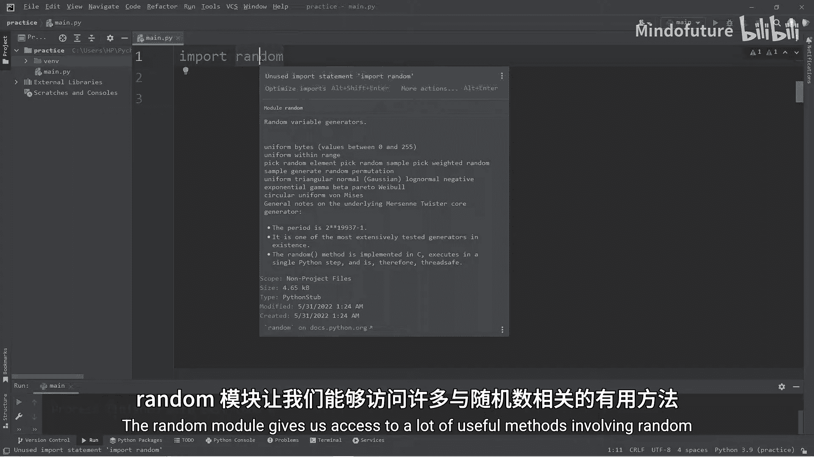
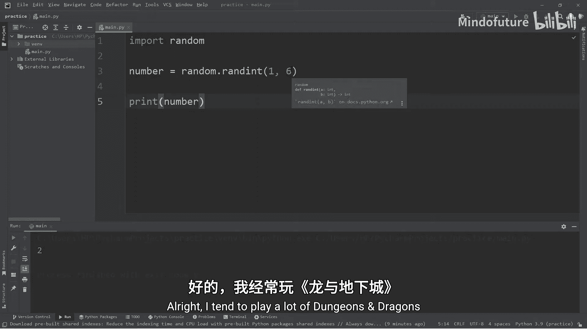
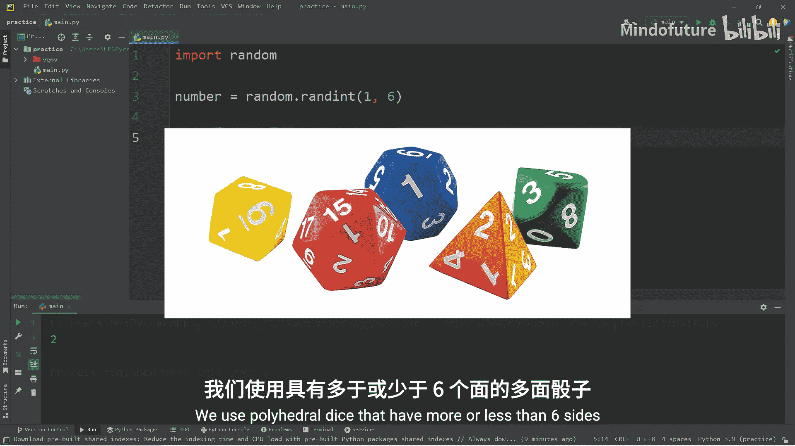
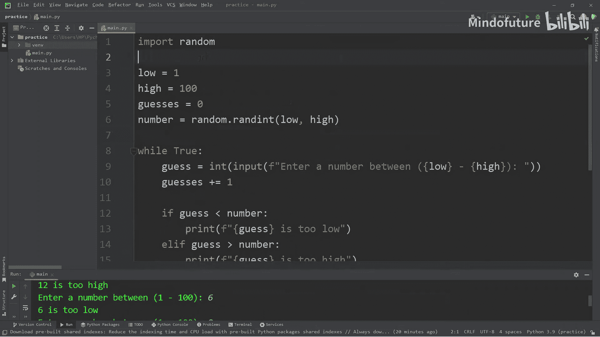

# 027：在Python中生成随机数

在本节课中，我们将学习如何在Python中生成随机数。我们将介绍`random`模块的几个核心方法，并通过创建一个数字猜谜游戏来巩固所学知识。

## 导入模块

首先，我们需要导入Python内置的`random`模块。这个模块提供了许多与随机数相关的有用方法。



```python
import random
```

要查看`random`模块提供的所有方法，可以使用`help()`函数。

```python
print(help(random))
```

## 生成随机整数

上一节我们介绍了如何导入模块，本节中我们来看看如何生成随机整数。`randint()`方法可以生成指定范围内的随机整数。



以下是使用`randint()`生成随机整数的步骤：



1.  调用`random.randint(a, b)`方法。
2.  参数`a`和`b`定义了随机数的范围，包含两端。
3.  将结果赋值给一个变量。

例如，模拟掷一个六面骰子：

```python
dice_roll = random.randint(1, 6)
print(f"骰子点数是：{dice_roll}")
```

模拟掷一个二十面骰子：

```python
d20_roll = random.randint(1, 20)
print(f"二十面骰子点数是：{d20_roll}")
```

你也可以使用变量来定义范围：

```python
low = 1
high = 100
random_number = random.randint(low, high)
print(f"1到100之间的随机数是：{random_number}")
```

## 生成随机浮点数

除了整数，我们还可以生成随机浮点数。`random()`方法会返回一个范围在[0.0, 1.0)之间的随机浮点数。

```python
float_number = random.random()
print(f"0到1之间的随机浮点数是：{float_number}")
```

## 从序列中随机选择

在未来的课程中，我们会创建石头剪刀布游戏，这时就需要从一组选项中随机选择一个。`choice()`方法可以做到这一点。

以下是使用`choice()`从列表中随机选取一个元素的步骤：

1.  准备一个包含多个选项的序列（如列表）。
2.  调用`random.choice(sequence)`方法。
3.  该方法会返回序列中的一个随机元素。

```python
options = ["石头", "剪刀", "布"]
computer_choice = random.choice(options)
print(f"电脑选择了：{computer_choice}")
```

## 打乱序列顺序

如果你需要打乱一个序列（如洗牌），可以使用`shuffle()`方法。它会直接修改原序列的顺序。

```python
cards = ["红桃A", "方块2", "黑桃10", "梅花K", "大王"]
random.shuffle(cards)
print(f"洗牌后的顺序是：{cards}")
```

## 实践：数字猜谜游戏

现在，让我们运用所学的知识来创建一个数字猜谜游戏。这个游戏会生成一个随机数，然后让用户来猜，直到猜对为止。

```python
import random

# 设置数字范围
low = 1
high = 100

# 初始化猜测次数
guesses = 0

# 生成目标随机数
number = random.randint(low, high)

print(f"游戏开始！数字范围是 {low} 到 {high}。")

while True:
    # 获取用户输入
    guess = int(input(f"请输入一个 {low} 到 {high} 之间的数字："))
    guesses += 1  # 猜测次数加1

    # 判断猜测结果
    if guess < number:
        print("猜小了！")
    elif guess > number:
        print("猜大了！")
    else:
        print(f"恭喜你，猜对了！数字就是 {number}。")
        break  # 猜对后退出循环

print(f"本轮游戏你总共猜了 {guesses} 次。")
```

**游戏运行示例：**
```
游戏开始！数字范围是 1 到 100。
请输入一个 1 到 100 之间的数字：50
猜大了！
请输入一个 1 到 100 之间的数字：25
猜小了！
请输入一个 1 到 100 之间的数字：37
猜对了！数字就是 37。
本轮游戏你总共猜了 3 次。
```

## 总结



本节课中我们一起学习了Python中`random`模块的核心用法。我们掌握了如何使用`randint()`生成随机整数，使用`random()`生成随机浮点数，使用`choice()`从序列中随机选取元素，以及使用`shuffle()`打乱序列顺序。最后，我们通过创建一个完整的数字猜谜游戏，将这些知识点融会贯通。在未来的课程中，我们会在更多游戏项目中运用随机数来增加趣味性和不确定性。