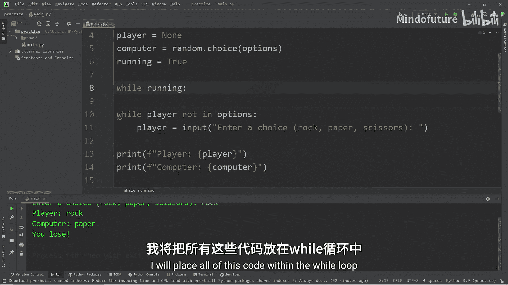
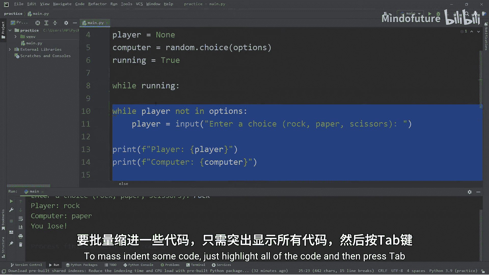
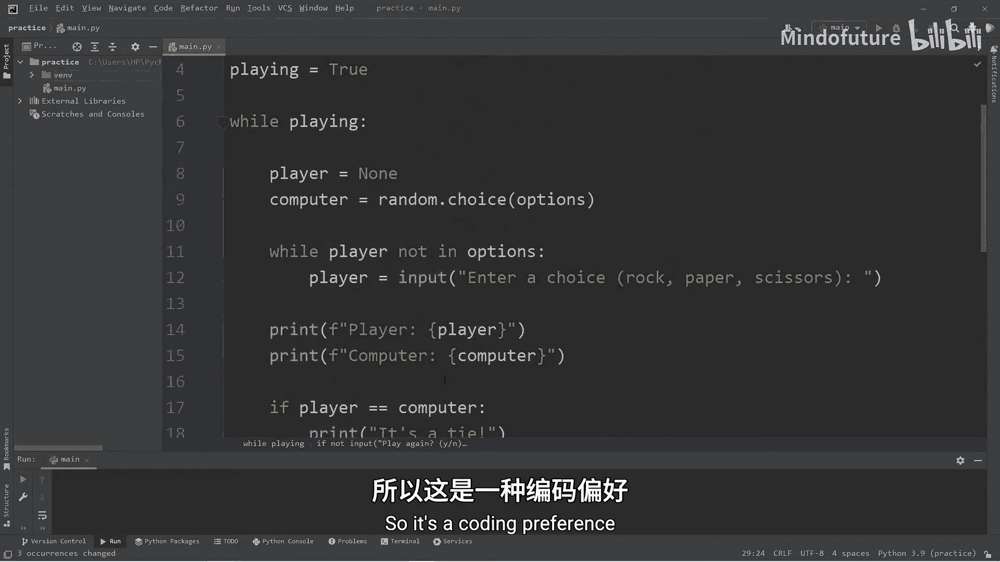
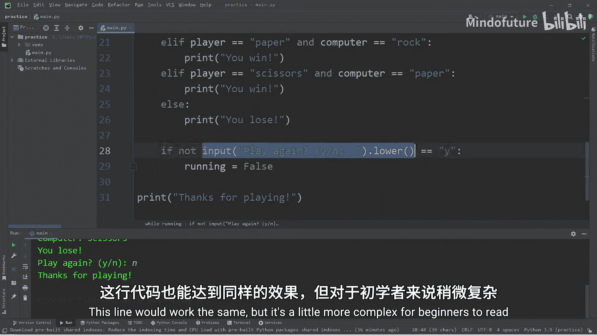
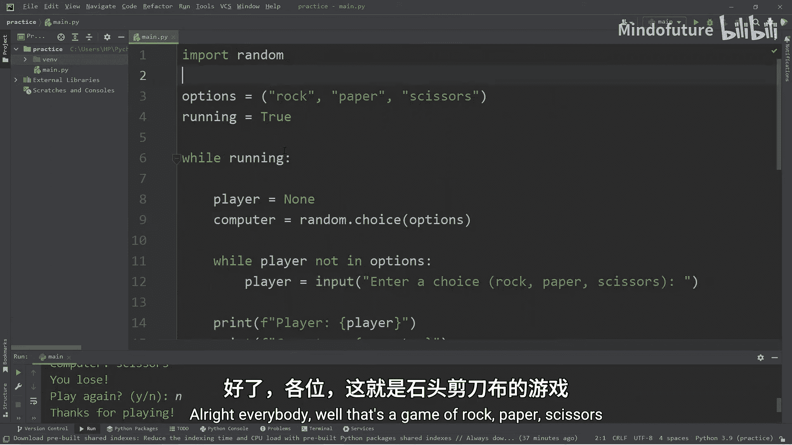

# 029：用Python实现石头剪刀布游戏 🎮

在本节课中，我们将学习如何使用Python创建一个经典的“石头剪刀布”游戏。我们将运用之前学过的`random`模块、循环和条件判断等知识，构建一个可以反复游玩的完整游戏程序。

---

## 导入模块与定义选项

首先，我们需要导入`random`模块，以便让计算机能够随机选择。

```python
import random
```

接下来，我们定义游戏的可选动作。由于这些选项在游戏过程中不会改变，我们使用元组来存储它们。

```python
options = ("rock", "paper", "scissors")
```

---

## 获取玩家与电脑的选择

我们将创建两个变量来分别存储玩家和电脑的选择。初始时，玩家的选择设为`None`。

```python
player = None
computer = random.choice(options)
```

为了获取玩家的选择，我们使用`input()`函数。但玩家可能会输入无效选项，因此我们需要一个循环来确保输入有效。

以下是获取有效玩家输入的代码：

```python
while player not in options:
    player = input("Enter a choice (rock, paper, scissors): ").lower()
```

这段代码会持续循环，直到玩家输入的内容在`options`元组中为止。

---

## 显示选择与判断胜负





在获取双方选择后，我们先将其显示出来。

```python
print(f"Player: {player}")
print(f"Computer: {computer}")
```

现在进入游戏的核心逻辑——判断胜负。胜负规则如下：
*   平局：玩家与电脑选择相同。
*   玩家获胜：`(player == "rock" and computer == "scissors")` 或 `(player == "paper" and computer == "rock")` 或 `(player == "scissors" and computer == "paper")`。
*   其他情况均为玩家失败。

以下是实现此逻辑的代码：

```python
if player == computer:
    print("It's a tie!")
elif (player == "rock" and computer == "scissors") or \
     (player == "paper" and computer == "rock") or \
     (player == "scissors" and computer == "paper"):
    print("You win!")
else:
    print("You lose!")
```



---

## 实现游戏循环与重玩功能

为了让玩家可以多次游戏，我们需要将上述所有代码放入一个主循环中。我们使用一个布尔变量`playing`来控制循环。

```python
playing = True

while playing:
    # 重置玩家和电脑的选择
    player = None
    computer = random.choice(options)

    # 获取玩家有效输入
    while player not in options:
        player = input("Enter a choice (rock, paper, scissors): ").lower()

    # 显示选择
    print(f"Player: {player}")
    print(f"Computer: {computer}")

    # 判断胜负
    if player == computer:
        print("It's a tie!")
    elif (player == "rock" and computer == "scissors") or \
         (player == "paper" and computer == "rock") or \
         (player == "scissors" and computer == "paper"):
        print("You win!")
    else:
        print("You lose!")

    # 询问是否再玩一次
    if not input("Play again? (y/n): ").lower() == "y":
        playing = False

print("Thanks for playing!")
```

在每一轮游戏结束后，程序会询问玩家是否继续。如果输入的不是“y”，则将`playing`变量设为`False`，从而退出主循环，游戏结束。

---

## 总结

本节课中，我们一起学习了如何用Python构建一个“石头剪刀布”游戏。我们综合运用了以下知识点：
1.  使用`random.choice()`让电脑随机选择。
2.  使用`while`循环确保玩家输入有效。
3.  使用`if-elif-else`语句实现游戏的胜负逻辑。
4.  使用一个由布尔变量控制的`while`循环来实现游戏的重复进行。





通过这个项目，你将更深入地理解条件判断、循环和基本输入/输出在具体程序中的应用。