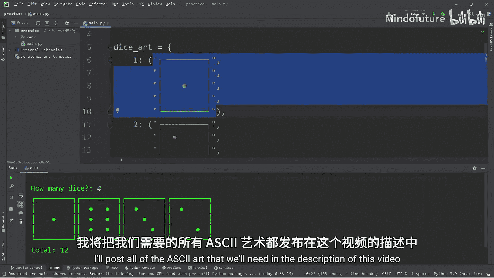
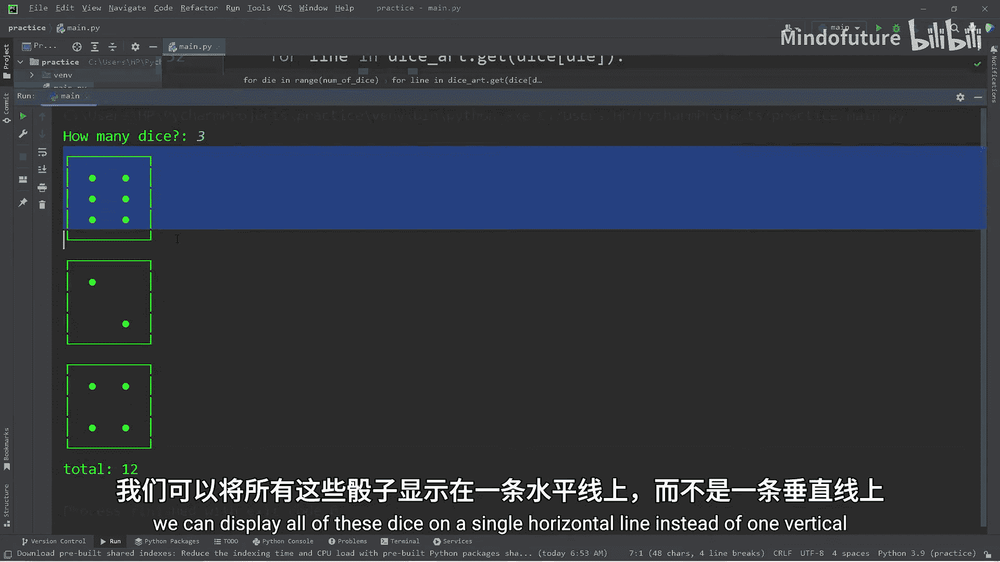
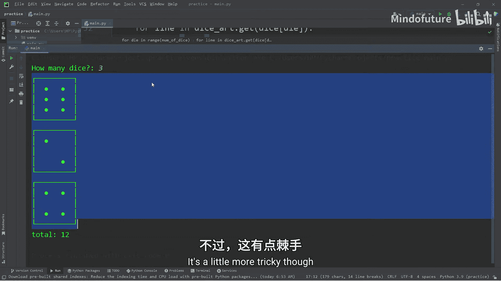
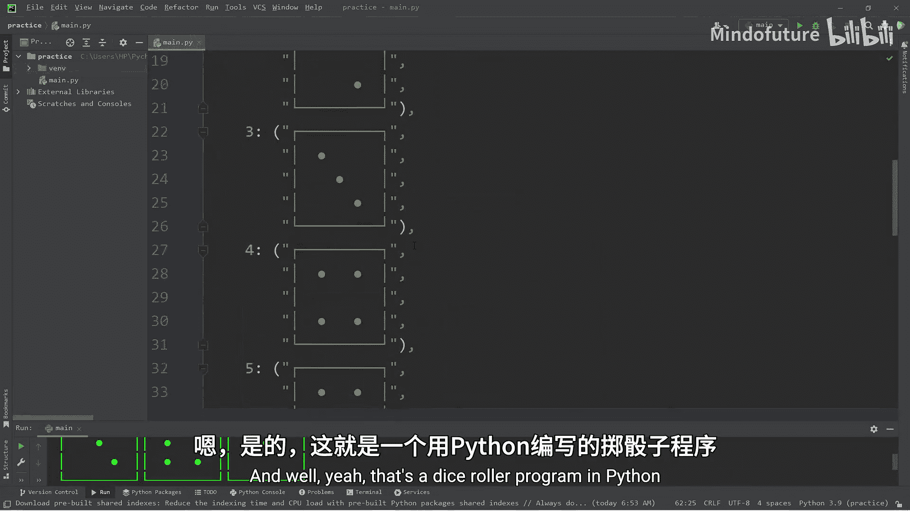

Python入门教程：P30：Python骰子模拟器程序

在本节课中，我们将学习如何使用Python创建一个骰子模拟器程序。我们将使用ASCII艺术来图形化地展示骰子，并学习如何随机生成数字、处理用户输入以及格式化输出。

---

### 导入模块与准备字符



首先，我们需要导入`random`模块，因为程序需要随机生成1到6之间的数字来模拟掷骰子。

```python
import random
```

为了构建骰子的图形，我们需要使用一些Unicode字符。以下是构建骰子所需的字符代码，你可以直接复制使用。

```
┌─────────┐
│         │
│    ●    │
│         │
└─────────┘
```

这些字符将组合成骰子的五个行，构成一个完整的骰子面。

---

### 构建骰子图形字典

上一节我们准备了基础字符，本节中我们来看看如何将它们组织起来。我们将创建一个字典，其中键是数字1到6，值是一个由字符串组成的元组，每个字符串代表骰子图形的一行。

以下是构建该字典的代码：

```python
dice_art = {
    1: ("┌─────────┐",
        "│         │",
        "│    ●    │",
        "│         │",
        "└─────────┘"),
    2: ("┌─────────┐",
        "│  ●      │",
        "│         │",
        "│      ●  │",
        "└─────────┘"),
    3: ("┌─────────┐",
        "│  ●      │",
        "│    ●    │",
        "│      ●  │",
        "└─────────┘"),
    4: ("┌─────────┐",
        "│  ●   ●  │",
        "│         │",
        "│  ●   ●  │",
        "└─────────┘"),
    5: ("┌─────────┐",
        "│  ●   ●  │",
        "│    ●    │",
        "│  ●   ●  │",
        "└─────────┘"),
    6: ("┌─────────┐",
        "│  ●   ●  │",
        "│  ●   ●  │",
        "│  ●   ●  │",
        "└─────────┘")
}
```

这样，我们就有了一个将数字映射到对应ASCII图形的数据结构。

---

### 获取用户输入与生成随机数

现在，我们需要让用户决定掷多少个骰子，并根据输入生成相应数量的随机数。

以下是实现此功能的步骤：

1.  创建一个空列表`dice`来存储每次掷骰的结果。
2.  初始化一个变量`total`为0，用于计算总和。
3.  使用`input()`函数获取用户输入的骰子数量，并将其转换为整数。
4.  使用`for`循环和`random.randint(1, 6)`生成指定数量的随机数，并添加到`dice`列表中。
5.  遍历`dice`列表，累加所有值以计算总和。

```python
dice = []
total = 0

num_of_dice = int(input("How many dice? "))

for die in range(num_of_dice):
    dice.append(random.randint(1, 6))

for die in dice:
    total += die

print(f"Total: {total}")
```

---

### 垂直显示骰子图形

有了随机数列表和图形字典，我们现在可以将骰子图形垂直打印出来。这可以通过嵌套循环实现：外层循环遍历每个骰子，内层循环打印该骰子图形的每一行。





```python
for die in range(num_of_dice):
    for line in dice_art.get(dice[die]):
        print(line)
```

这种方法会将每个骰子完整地打印在下一个骰子的上方。

---

### 水平显示骰子图形（进阶）

如果你希望所有骰子在同一行水平排列，逻辑会稍微复杂一些。我们需要先打印所有骰子的第一行，然后是所有骰子的第二行，依此类推。

以下是实现水平显示的方法：

1.  外层循环迭代5次（对应骰子图形的5行）。
2.  内层循环遍历`dice`列表中的每个骰子数字。
3.  对于每个骰子，通过`dice_art.get(die)[line]`获取当前行的字符串并打印，同时设置`end=""`以避免换行。
4.  内层循环结束后，打印一个空行以实现换行，开始下一行的打印。

```python
for line in range(5):
    for die in dice:
        print(dice_art.get(die)[line], end="")
    print()
```

这种方法将所有骰子图形并排显示，视觉效果更紧凑。

---

### 课程总结



本节课中我们一起学习了如何创建一个完整的Python骰子模拟器程序。我们涵盖了以下核心知识点：导入`random`模块生成随机数，使用字典数据结构映射数字与多行ASCII图形，通过嵌套循环控制图形的垂直与水平打印格式，以及处理用户输入并计算总和。这个项目综合运用了Python的基础语法，是巩固所学知识的良好练习。