# 031：Python中的替换密码加密程序

在本节课中，我们将要学习如何编写一个替换密码加密程序。我们将通过随机替换字符的方式来加密信息，并使用相同的密钥进行解密。这是一个适合初学者的网络安全基础练习。

## 概述

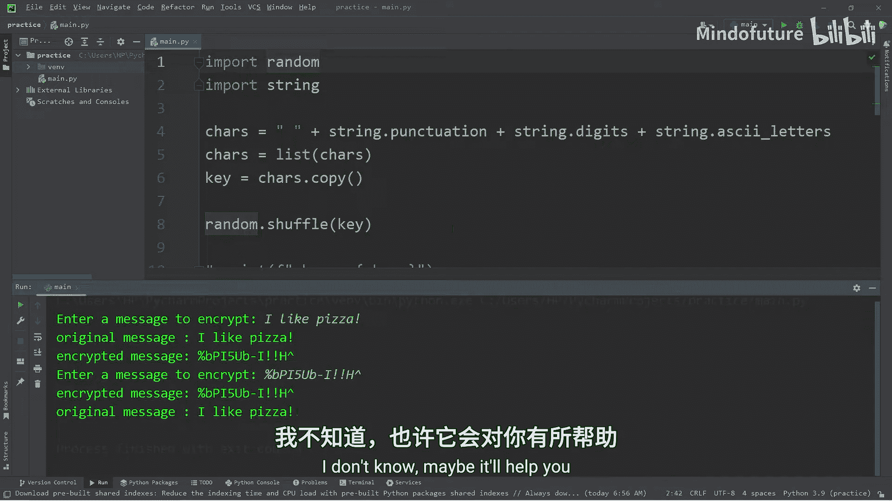

替换密码是一种基础的加密技术。其核心思想是建立一个字符映射表，将明文中的每个字符替换为另一个字符，从而生成密文。解密时，使用相同的映射表进行反向替换即可恢复原文。

## 准备字符集

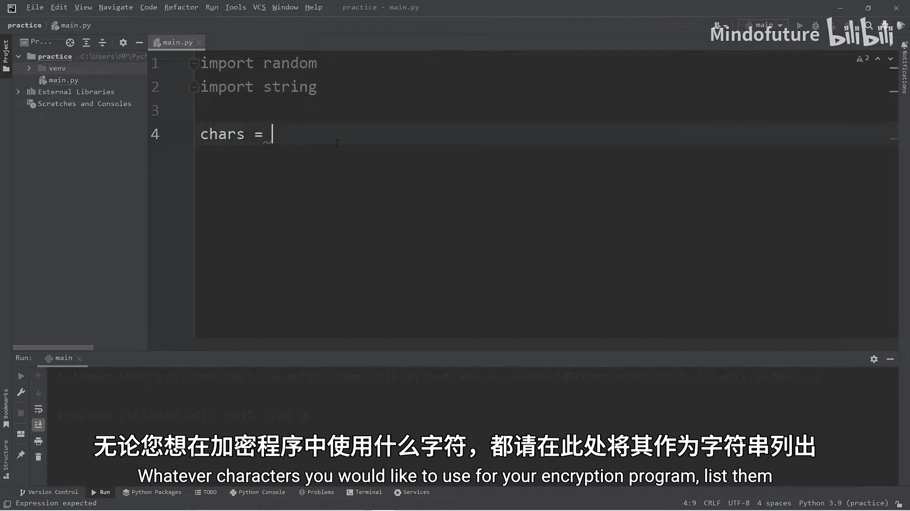

首先，我们需要导入必要的模块并定义用于加密的字符集。

```python
import random
import string

# 定义字符集，包括标点符号、数字和字母
chars = string.punctuation + string.digits + string.ascii_letters + " "
```

我们使用 `string` 模块的常量来方便地获取标点符号、数字和字母。为了避免换行符等特殊空白字符，我们手动添加了一个空格字符。

接下来，我们将这个字符串转换为列表，以便后续操作。

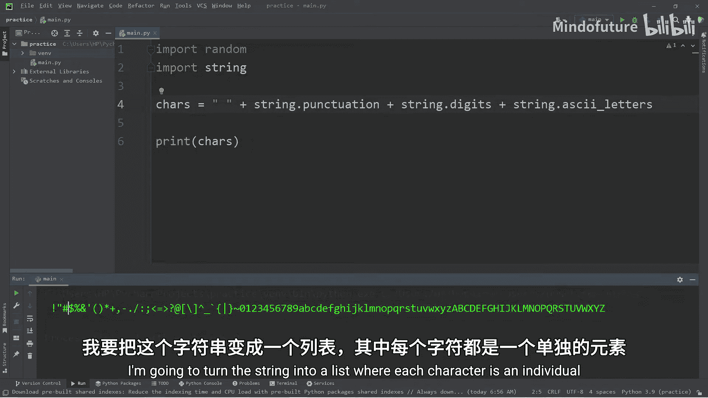

```python
chars = list(chars)
```

## 生成随机密钥

密钥是字符集的一个随机排列。我们将创建原始字符集的一个副本，然后将其打乱顺序。

```python
key = chars.copy()
random.shuffle(key)
```

这样，我们就得到了两个列表：`chars` 是原始顺序，`key` 是随机顺序。它们将构成我们的加密映射关系。

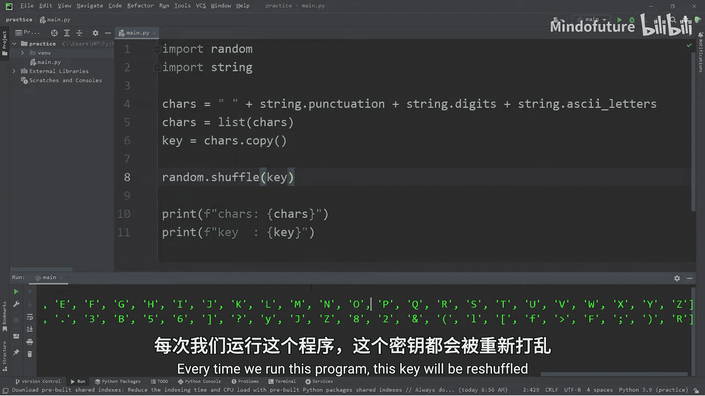

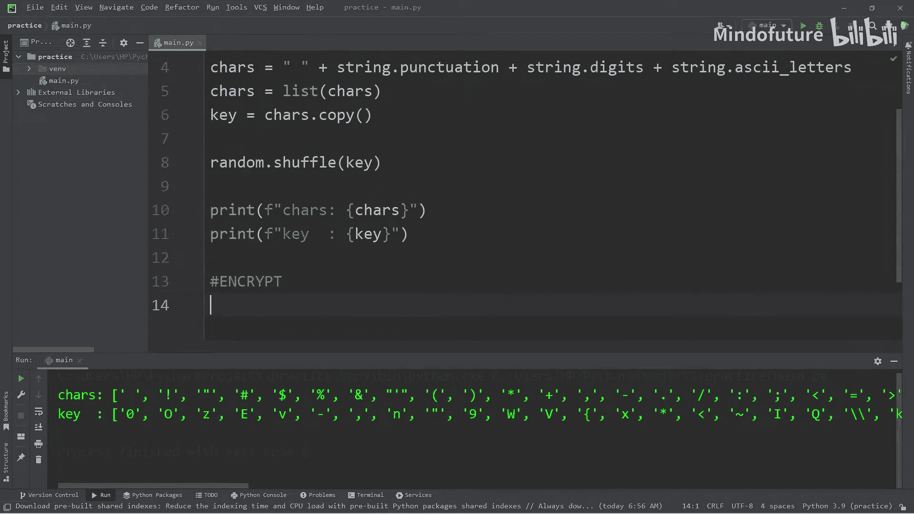

## 加密过程

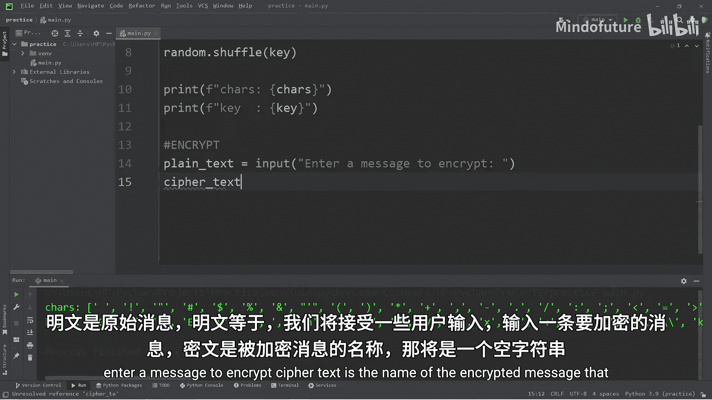

现在，我们来实现加密功能。程序会请求用户输入明文，然后根据映射关系将其转换为密文。

```python
plain_text = input("请输入要加密的消息：")
cipher_text = ""

for letter in plain_text:
    index = chars.index(letter)
    cipher_text += key[index]

print(f"原始消息：{plain_text}")
print(f"加密消息：{cipher_text}")
```

以下是加密过程的步骤说明：

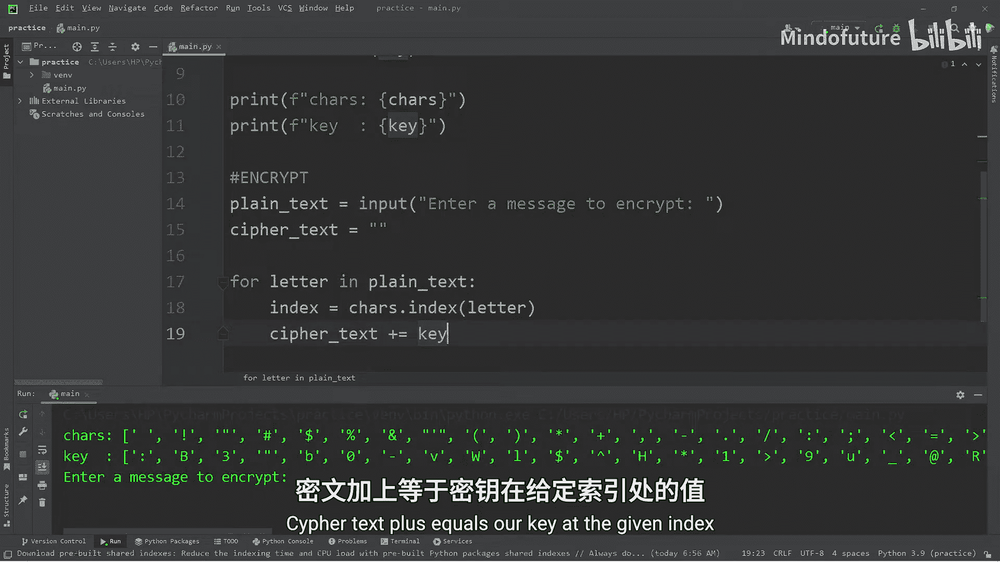

1.  **遍历明文**：使用 `for` 循环逐个处理明文中的字符。
2.  **查找索引**：对于每个字符，在 `chars` 列表中查找其对应的索引位置。
3.  **替换字符**：根据找到的索引，从 `key` 列表中获取对应的替换字符，并将其添加到密文字符串中。

## 解密过程

解密是加密的逆过程。我们需要使用相同的 `key` 和 `chars` 列表来还原信息。

```python
cipher_text = input("请输入要解密的消息：")
plain_text = ""

for letter in cipher_text:
    index = key.index(letter)
    plain_text += chars[index]

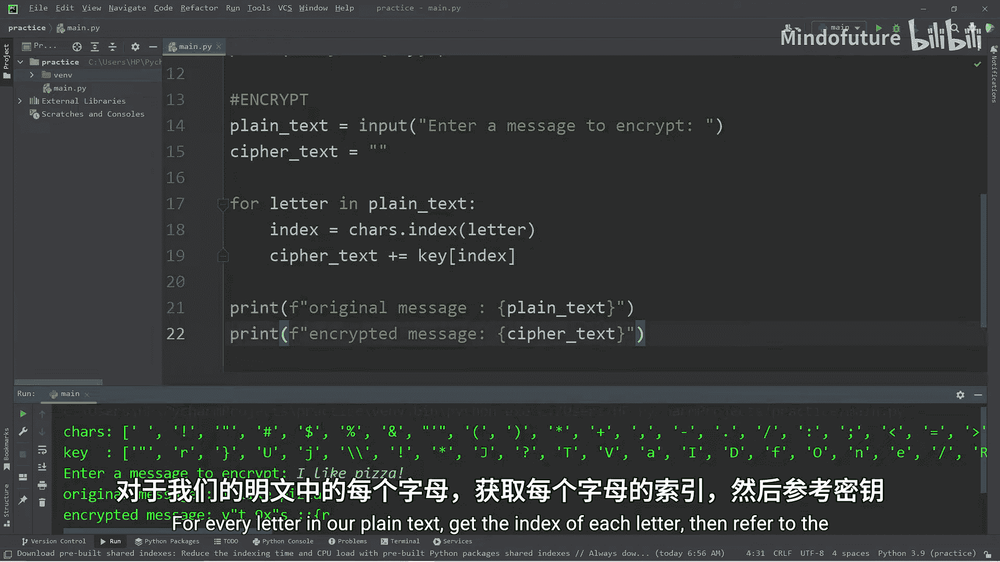

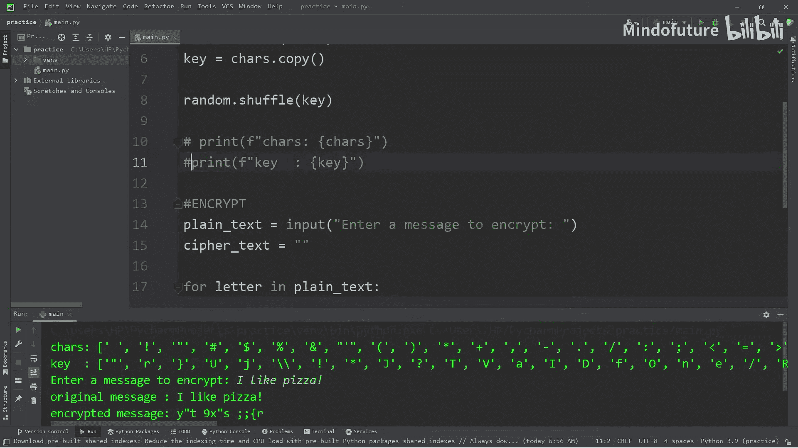

print(f"加密消息：{cipher_text}")
print(f"解密消息：{plain_text}")
```

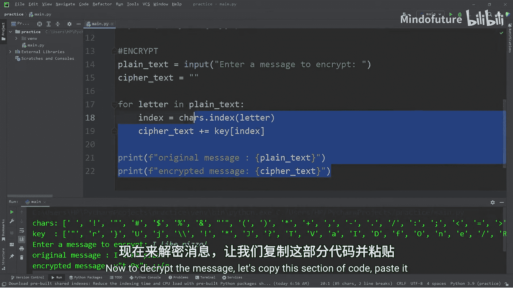

以下是解密过程的步骤说明：

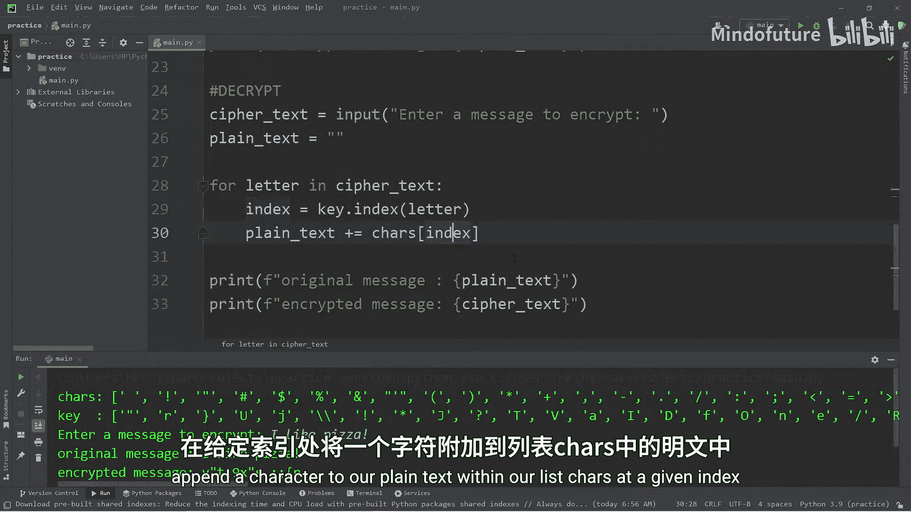

1.  **遍历密文**：使用 `for` 循环逐个处理密文中的字符。
2.  **查找索引**：对于每个字符，在 `key` 列表中查找其对应的索引位置。
3.  **还原字符**：根据找到的索引，从 `chars` 列表中获取原始字符，并将其添加到明文字符串中。

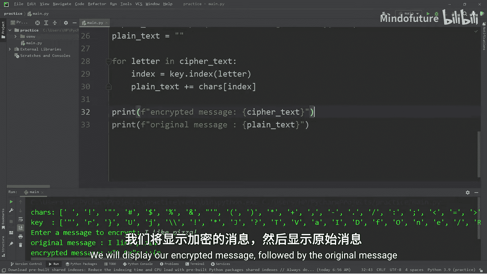

## 总结

本节课中我们一起学习了如何用Python实现一个简单的替换密码程序。我们掌握了以下核心概念：

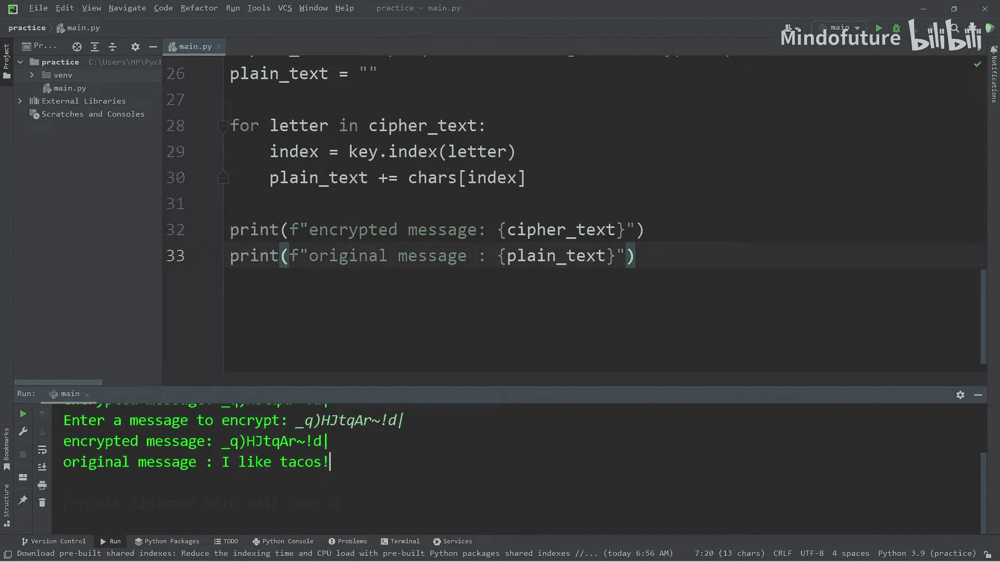

*   **字符映射**：通过 `chars` 和 `key` 两个列表建立加密与解密的对应关系。
*   **加密算法**：`cipher_text += key[chars.index(letter)]`
*   **解密算法**：`plain_text += chars[key.index(letter)]`

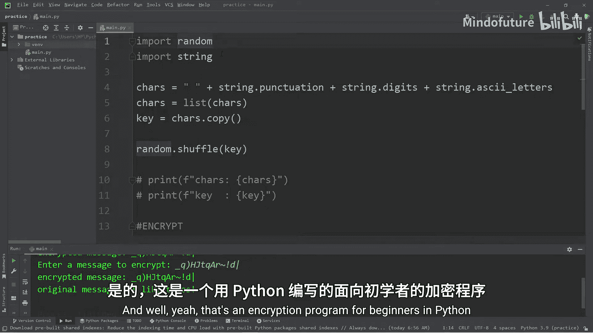

这个程序每次运行时都会生成一个新的随机密钥，因此相同的明文每次加密的结果都不同。要成功解密，必须使用加密时生成的同一套 `chars` 和 `key`。这是一个理解古典密码学和基础编程逻辑的优秀实践。