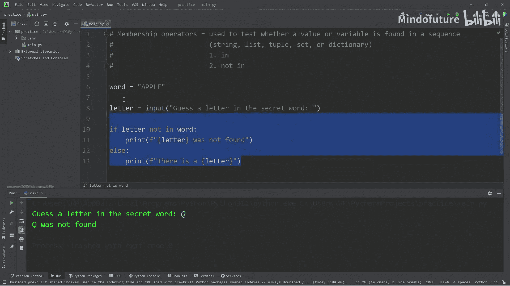
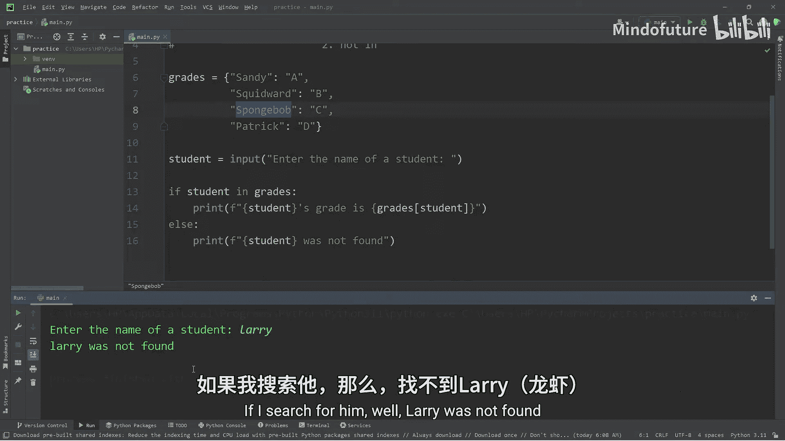
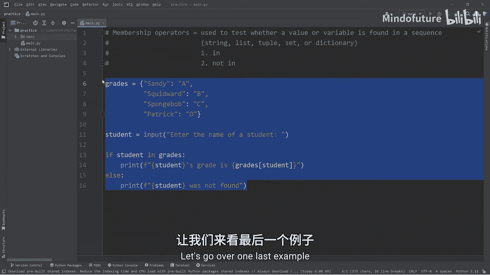
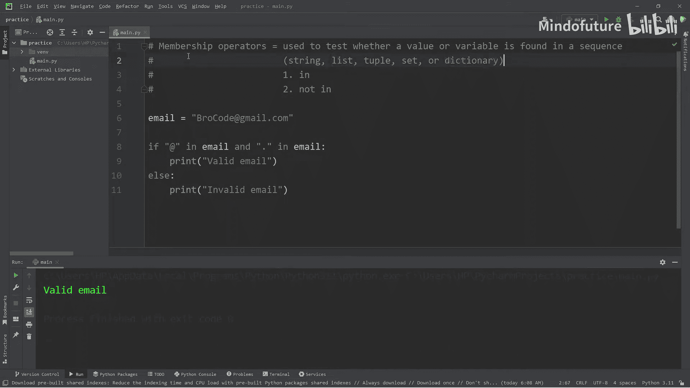

# 037：成员运算符

在本节课中，我们将要学习Python中的成员运算符。成员运算符用于检查一个值或变量是否存在于某个序列（如字符串、列表、元组、集合或字典）中。它们是编写条件判断时非常有用的工具。

## 成员运算符简介

成员运算符包括 `in` 和 `not in`。它们会返回一个布尔值（`True` 或 `False`），表示检查的结果。

*   `in`：如果指定的值在序列中找到，则返回 `True`，否则返回 `False`。
*   `not in`：如果指定的值不在序列中找到，则返回 `True`，否则返回 `False`。它是 `in` 的反向操作。

## 在字符串中使用成员运算符

让我们从一个简单的猜字母游戏开始，看看如何在字符串中使用成员运算符。

首先，我们设定一个秘密单词，然后让用户猜一个字母。程序需要判断用户猜的字母是否存在于这个单词中。

以下是实现这个逻辑的代码：

```python
secret_word = "APPLE"
guess = input("Guess a letter in the secret word: ")

if guess in secret_word:
    print(f"There is a {guess}.")
else:
    print(f"{guess} was not found.")
```

在这段代码中，`guess in secret_word` 就是一个成员运算。如果 `guess` 是 `secret_word` 中的一个字符，表达式结果为 `True`，程序会打印“There is a...”；否则结果为 `False`，程序会打印“… was not found”。



我们也可以使用 `not in` 来实现相同的逻辑，只是需要调换 `if` 和 `else` 后面的语句块。

```python
if guess not in secret_word:
    print(f"{guess} was not found.")
else:
    print(f"There is a {guess}.")
```

## 在列表、元组和集合中使用成员运算符

上一节我们介绍了如何在字符串中使用成员运算符。本节中我们来看看如何在其他序列类型（如列表、元组和集合）中使用它。它们的用法与字符串类似。

以下是一个在学生集合中查找姓名的例子：

```python
students = {"Spongebob", "Patrick", "Sandy"}
search_name = input("Enter the name of a student: ")

if search_name in students:
    print(f"{search_name} is a student.")
else:
    print(f"{search_name} was not found.")
```

在这个例子中，`students` 是一个集合。`search_name in students` 会检查输入的名字是否是集合中的一个元素。

## 在字典中使用成员运算符

在字典中使用成员运算符时，默认检查的是**键（Key）**，而不是值（Value）。

让我们创建一个学生成绩字典，然后根据学生姓名（键）来查找其成绩（值）。

```python
grades = {
    "Sandy": "A",
    "Squidward": "B",
    "Spongebob": "C",
    "Patrick": "D"
}

student = input("Enter the name of a student: ")

if student in grades:
    # 如果找到该学生（键），则通过键获取对应的值（成绩）
    student_grade = grades[student]
    print(f"{student}'s grade is {student_grade}.")
else:
    print(f"{student} was not found.")
```

代码 `student in grades` 检查输入的姓名是否是字典 `grades` 中的一个键。如果是，我们使用 `grades[student]` 来获取该键对应的值，即学生的成绩。

## 综合应用示例：验证邮箱地址



最后，我们来看一个稍微复杂一点的例子，它结合了多个成员运算和逻辑运算符。我们将编写一个简单的程序来验证一个邮箱地址是否有效（这里仅做简单演示，检查是否包含“@”和“.”）。



以下是验证逻辑：

```python
email = input("Enter your email: ")

if "@" in email and "." in email:
    print("Valid email.")
else:
    print("Invalid email.")
```

在这段代码中，我们使用了 `and` 逻辑运算符来连接两个条件：`"@" in email` 和 `"." in email`。只有当邮箱中同时包含“@”符号和“.”时，整个条件才为 `True`，程序才会判定为有效邮箱。

## 总结

本节课中我们一起学习了Python的成员运算符 `in` 和 `not in`。

*   它们用于判断一个值或变量是否存在于指定的序列中。
*   可以应用的序列类型包括字符串、列表、元组、集合和字典（检查键）。
*   它们返回布尔值 `True` 或 `False`，非常适合在 `if` 条件语句中使用。
*   通过组合逻辑运算符（如 `and`），可以构建更复杂的检查条件。



掌握成员运算符能帮助你更高效地处理数据集合和进行条件判断。