Python超全入门教程：P38：列表推导式

在本节课中，我们将要学习Python中的列表推导式。这是一种创建列表的简洁方法，比传统的循环更紧凑、更易读。

列表推导式遵循一个基本公式：`[expression for item in iterable if condition]`。其中，`expression`是对每个元素进行的操作，`item`是迭代变量，`iterable`是可迭代对象（如列表、元组、字符串或range对象），`if condition`是可选的筛选条件。

上一节我们介绍了列表推导式的基本概念，本节中我们来看看如何通过具体示例来掌握它。

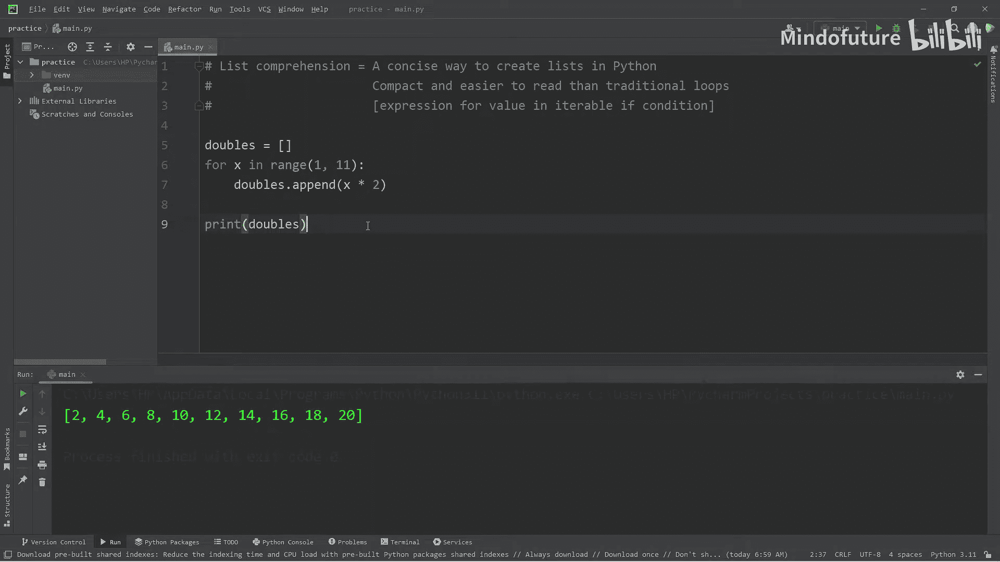

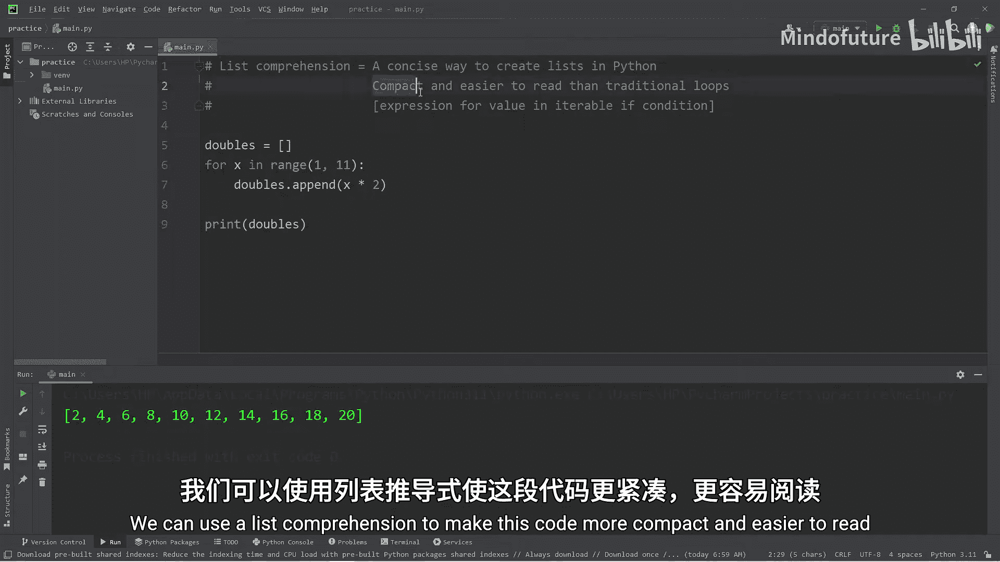

### 从传统循环到列表推导式

首先，我们通过一个传统循环的例子来理解列表推导式的优势。假设我们要创建一个列表，包含数字1到10的2倍。

以下是使用传统`for`循环的实现方式：
```python
doubles = []
for x in range(1, 11):
    doubles.append(x * 2)
print(doubles)  # 输出: [2, 4, 6, 8, 10, 12, 14, 16, 18, 20]
```

这段代码虽然功能正确，但略显冗长。现在，我们使用列表推导式来实现相同的功能：
```python
doubles = [x * 2 for x in range(1, 11)]
print(doubles)  # 输出: [2, 4, 6, 8, 10, 12, 14, 16, 18, 20]
```

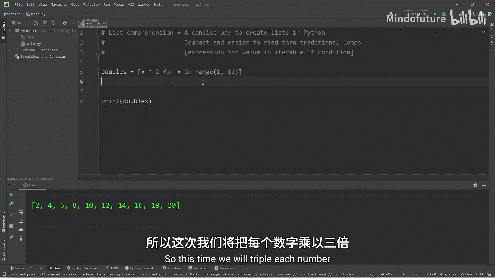

可以看到，列表推导式将多行代码压缩为一行，逻辑更清晰。

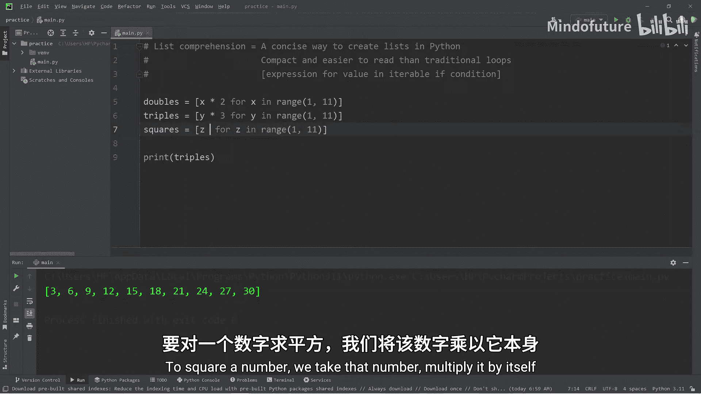

### 基础练习

接下来，我们通过几个基础练习来熟悉列表推导式的语法。

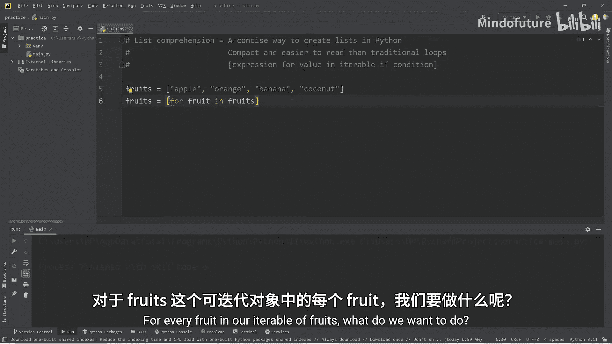

**练习1：创建数字的三倍列表**
```python
triples = [y * 3 for y in range(1, 11)]
print(triples)  # 输出: [3, 6, 9, 12, 15, 18, 21, 24, 27, 30]
```

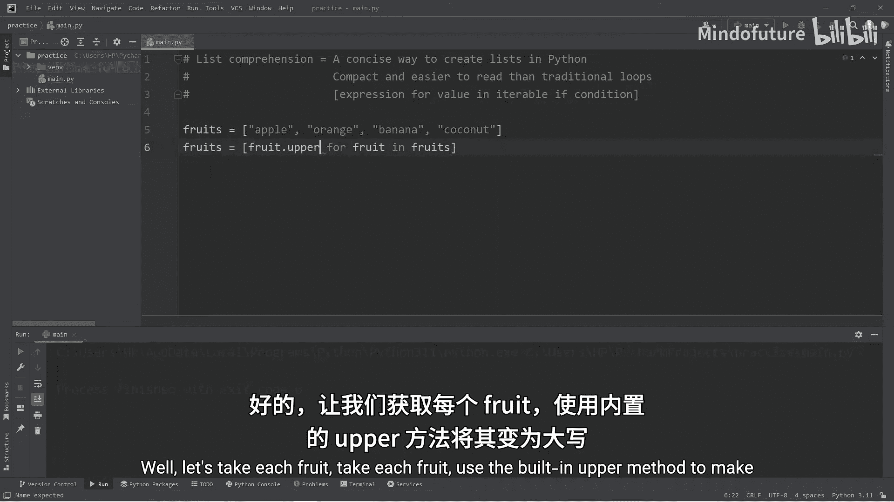

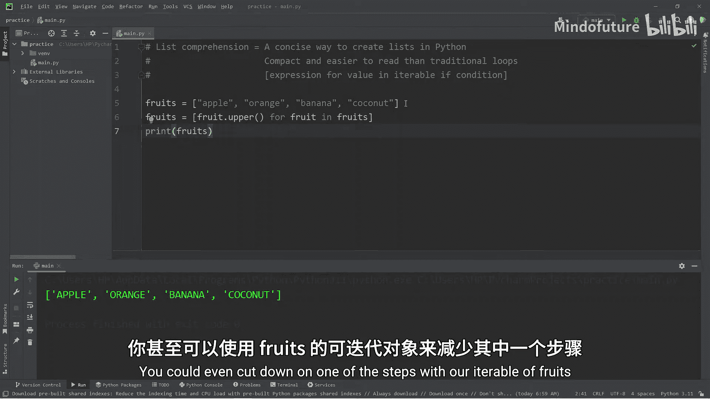

**练习2：创建数字的平方列表**
```python
squares = [z * z for z in range(1, 11)]
print(squares)  # 输出: [1, 4, 9, 16, 25, 36, 49, 64, 81, 100]
```

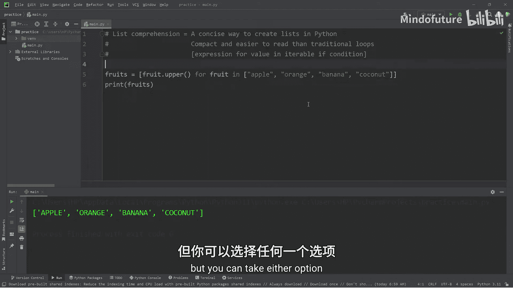

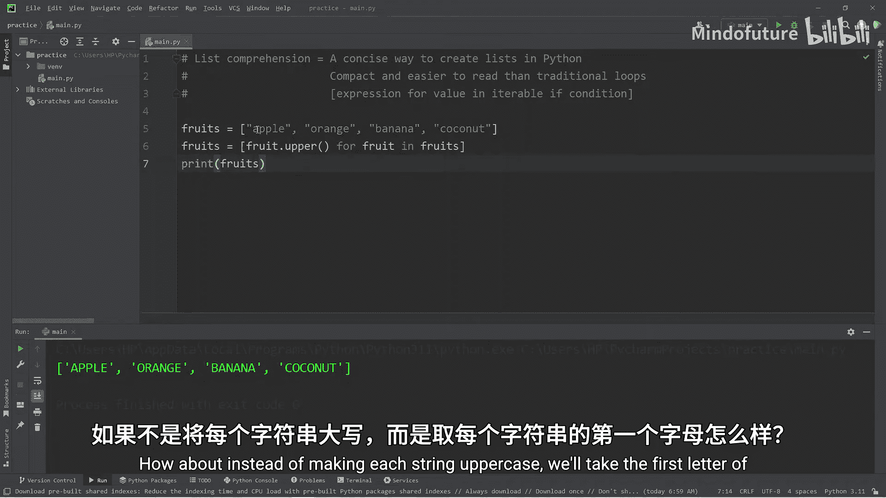

### 处理字符串列表

列表推导式同样适用于处理字符串列表。

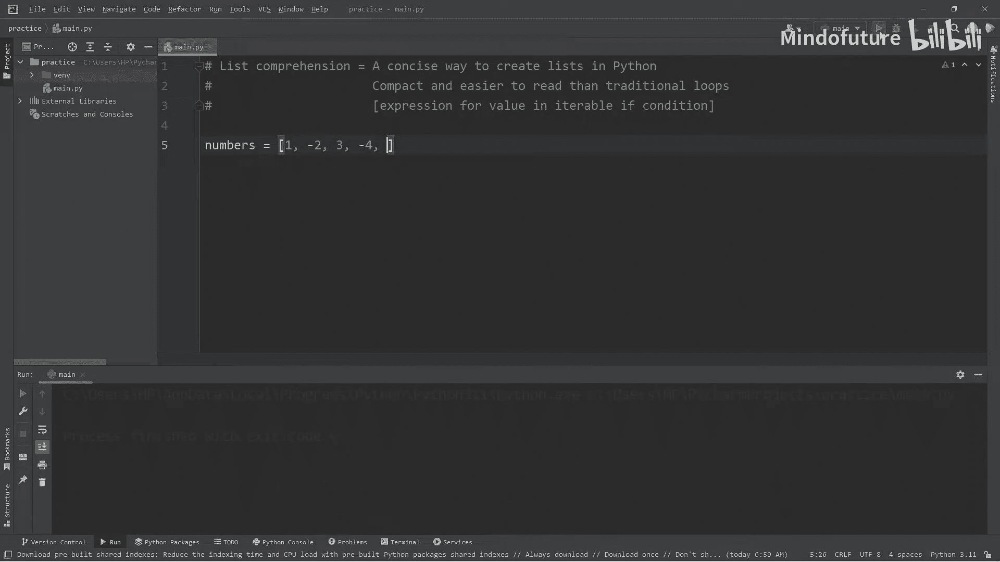

**练习3：将水果名称转换为大写**
```python
fruits = ['apple', 'orange', 'banana', 'coconut']
uppercase_fruits = [fruit.upper() for fruit in fruits]
print(uppercase_fruits)  # 输出: ['APPLE', 'ORANGE', 'BANANA', 'COCONUT']
```

**练习4：提取每个水果名称的首字母**
```python
fruit_chars = [fruit[0] for fruit in fruits]
print(fruit_chars)  # 输出: ['a', 'o', 'b', 'c']
```

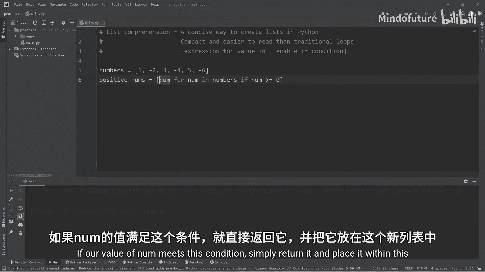

### 使用条件筛选

列表推导式最强大的功能之一是能够结合条件进行筛选。我们可以在`for`循环后添加`if`语句。

**练习5：从混合列表中筛选正数**
```python
numbers = [1, -2, 3, -4, 5, -6]
positive_nums = [num for num in numbers if num >= 0]
print(positive_nums)  # 输出: [1, 3, 5]
```

**练习6：从混合列表中筛选负数**
```python
negative_nums = [num for num in numbers if num < 0]
print(negative_nums)  # 输出: [-2, -4, -6]
```

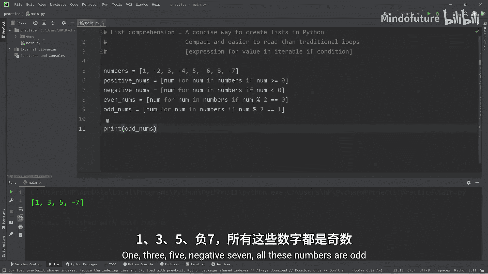

**练习7：筛选偶数**
```python
numbers = [1, -2, 3, -4, 5, -6, 8, -7]
even_nums = [num for num in numbers if num % 2 == 0]
print(even_nums)  # 输出: [-2, -4, -6, 8]
```

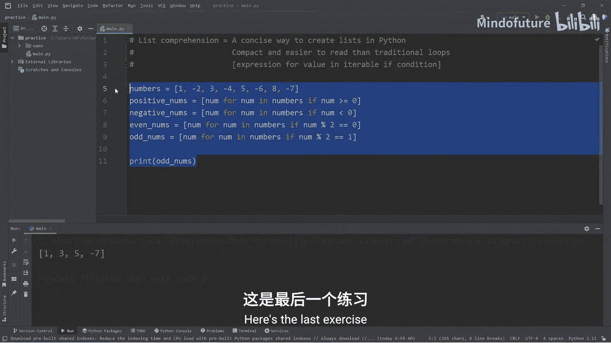

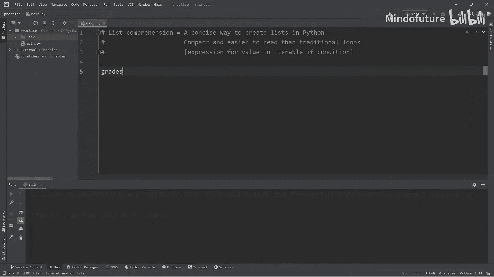

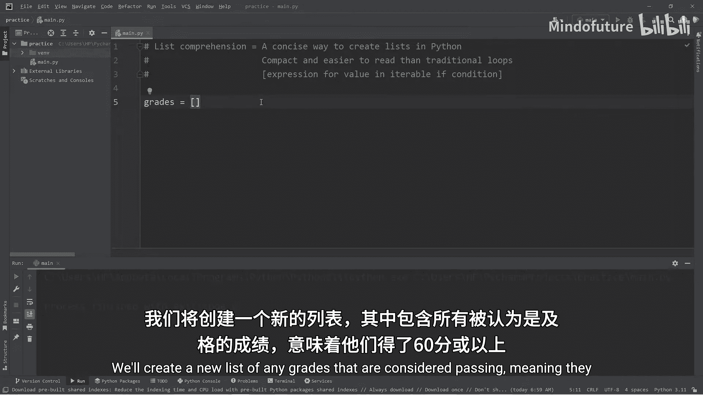

**练习8：筛选奇数**
```python
odd_nums = [num for num in numbers if num % 2 == 1]
print(odd_nums)  # 输出: [1, 3, 5, -7]
```

**练习9：筛选及格分数**
```python
grades = [85, 42, 79, 90, 56, 61, 30]
passing_grades = [grade for grade in grades if grade >= 60]
print(passing_grades)  # 输出: [85, 79, 90, 61]
```

### 总结

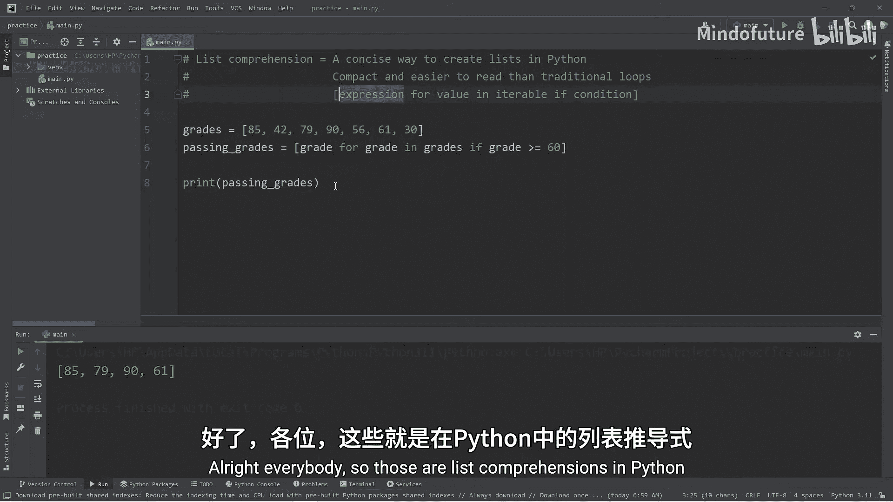

本节课中我们一起学习了Python的列表推导式。它是一种非常高效和优雅的创建列表的方法，其核心公式为 `[expression for item in iterable if condition]`。通过将循环、条件判断和表达式组合在一行代码中，列表推导式使得代码更加简洁、易读。从处理数字列表到字符串列表，再到结合条件进行筛选，列表推导式都是一个强大且实用的工具。