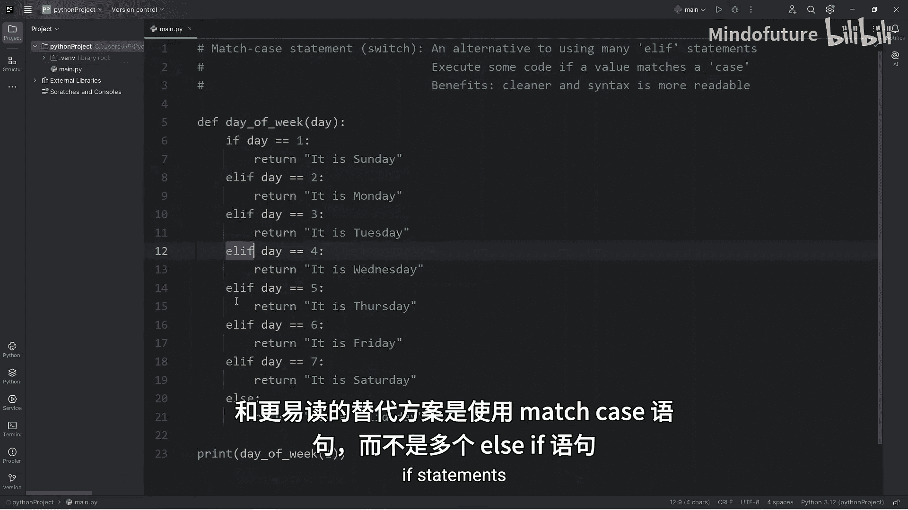
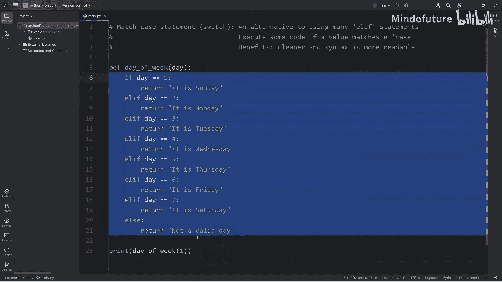
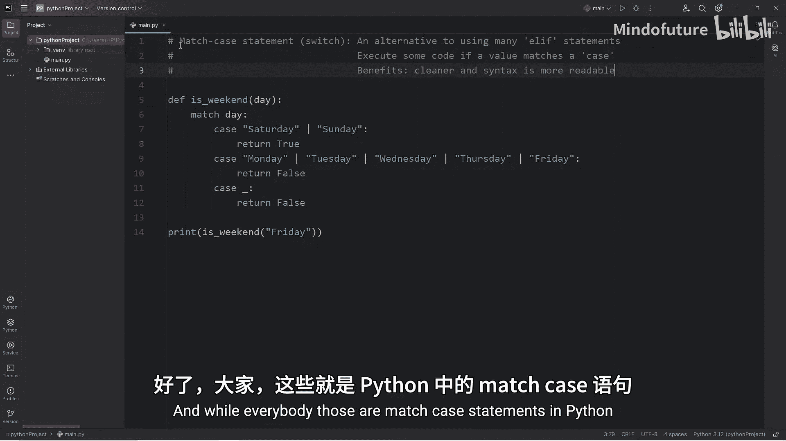

Python入门教程：P39：Match Case语句详解

在本节课中，我们将要学习Python中的`match case`语句。这是一种用于替代多重`if-elif`语句的结构，可以使代码更加清晰和易读。

`match case`语句在其他编程语言中也被称为`switch`语句。其核心逻辑是：当某个值匹配到特定的`case`时，就执行对应的代码块。使用`match case`的主要好处在于语法更简洁，代码结构更清晰。

### 第一个示例：将数字转换为星期几

首先，我们来看一个使用传统`if-elif-else`语句的函数。这个函数接收一个1到7的数字，返回对应的星期几字符串。

```python
def get_day_of_week(day):
    if day == 1:
        return "Sunday"
    elif day == 2:
        return "Monday"
    elif day == 3:
        return "Tuesday"
    elif day == 4:
        return "Wednesday"
    elif day == 5:
        return "Thursday"
    elif day == 6:
        return "Friday"
    elif day == 7:
        return "Saturday"
    else:
        return "Not a valid day"
```



上面的代码功能正常，但当条件分支很多时，会显得冗长。接下来，我们看看如何使用`match case`语句重写它。



```python
def get_day_of_week(day):
    match day:
        case 1:
            return "Sunday"
        case 2:
            return "Monday"
        case 3:
            return "Tuesday"
        case 4:
            return "Wednesday"
        case 5:
            return "Thursday"
        case 6:
            return "Friday"
        case 7:
            return "Saturday"
        case _:
            return "Not a valid day"
```

在`match case`语句中：
*   `match`后面跟要检查的变量（这里是`day`）。
*   每个`case`后面跟一个可能匹配的值。
*   `case _`是一个通配符，匹配所有未被前面`case`捕获的情况，相当于`else`子句。

测试这个函数：
*   `get_day_of_week(1)` 返回 `"Sunday"`
*   `get_day_of_week(2)` 返回 `"Monday"`
*   `get_day_of_week(7)` 返回 `"Saturday"`
*   `get_day_of_week("pizza")` 返回 `"Not a valid day"`

可以看到，`match case`版本在逻辑上与`if-elif-else`版本完全一致，但结构上更加规整。

### 第二个示例：判断是否为周末

上一节我们介绍了`match case`的基本语法，本节中我们来看看一个更实用的例子，并学习如何合并多个`case`。

假设我们要创建一个函数，根据输入的星期几字符串，判断是否为周末（周六或周日）。

初始版本可能如下：

```python
def is_weekend(day):
    match day:
        case "Sunday":
            return True
        case "Monday":
            return False
        case "Tuesday":
            return False
        case "Wednesday":
            return False
        case "Thursday":
            return False
        case "Friday":
            return False
        case "Saturday":
            return True
        case _:
            return False
```

这个版本虽然正确，但`Monday`到`Friday`都返回`False`，代码有重复。我们可以使用`|`（或）运算符来合并具有相同操作的`case`。

以下是优化后的版本：

```python
def is_weekend(day):
    match day:
        case "Saturday" | "Sunday":
            return True
        case "Monday" | "Tuesday" | "Wednesday" | "Thursday" | "Friday":
            return False
        case _:
            return False
```

在这个版本中：
*   `case "Saturday" | "Sunday":` 表示如果`day`是`"Saturday"`**或**`"Sunday"`，则匹配成功，返回`True`。
*   同理，工作日被合并到一个`case`中。
*   通配符`case _`处理所有其他无效输入。

测试这个函数：
*   `is_weekend("Saturday")` 返回 `True`
*   `is_weekend("Monday")` 返回 `False`
*   `is_weekend("Sunday")` 返回 `True`
*   `is_weekend("Friday")` 返回 `False`
*   `is_weekend("pizza")` 返回 `False`

通过合并`case`，代码变得更加简洁，逻辑也更清晰。

### 总结

本节课中我们一起学习了Python中的`match case`语句。

*   `match case`是多重`if-elif-else`语句的替代方案，用于根据一个变量的不同值执行不同的代码块。
*   其基本语法是 `match variable:` 后跟一系列 `case value:` 分支。
*   使用 `case _:` 作为通配符，处理所有未匹配的情况。
*   可以使用 `|` （或）运算符将多个值合并到一个`case`中，使代码更简洁。
*   与传统的`if-elif`链相比，`match case`语句的语法更清晰，可读性更强，尤其是在处理多个离散值时。



希望本教程能帮助你理解并使用`match case`语句来编写更优雅的Python代码。