# 040：什么是Python模块？📦

在本节课中，我们将要学习Python模块。模块是Python编程中组织代码的重要方式，它允许你将代码分割到不同的文件中，以便于管理和重用。

## 概述

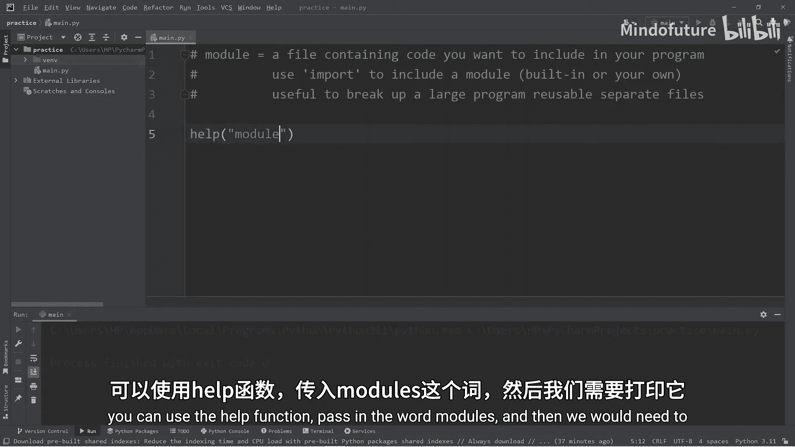

模块本质上就是一个包含Python代码的文件，你可以将其包含到你的程序中。使用模块有助于将大型程序拆分为可重用的独立文件。Python提供了丰富的内置模块，同时也允许你创建自己的模块。

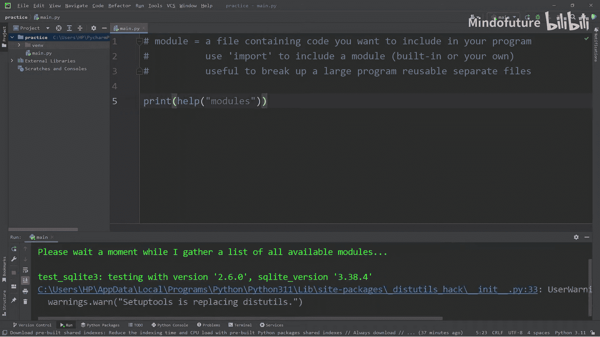

## 查看可用模块

要查看Python标准库中所有可用的模块，你可以使用`help()`函数。具体操作是：在函数中传入字符串`"modules"`，然后打印结果。

以下是部分可用的内置模块示例：
*   `math`：提供数学运算函数。
*   `string`：提供字符串操作工具。
*   `time`：提供时间相关的函数。
*   `pickle`：用于序列化和反序列化Python对象（注意：它和“泡菜”无关）。

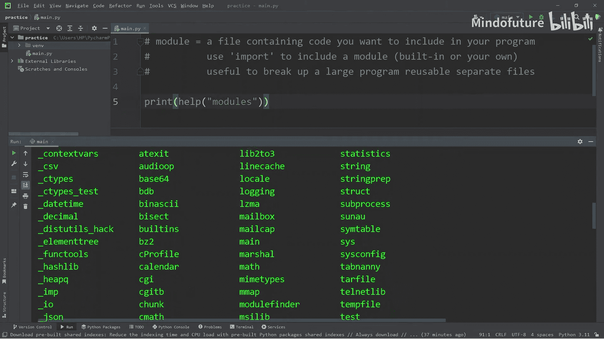

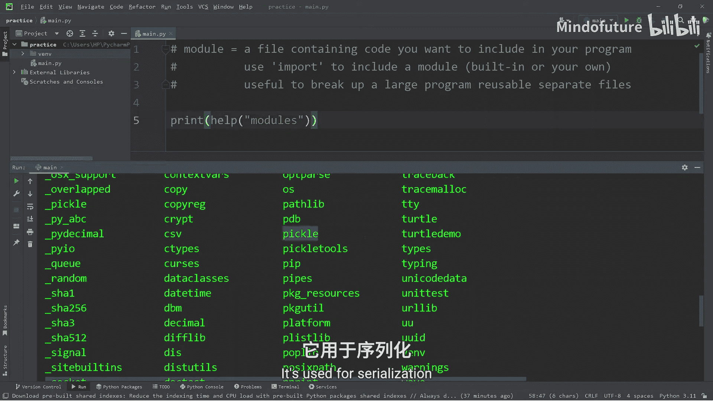

## 探索模块内容

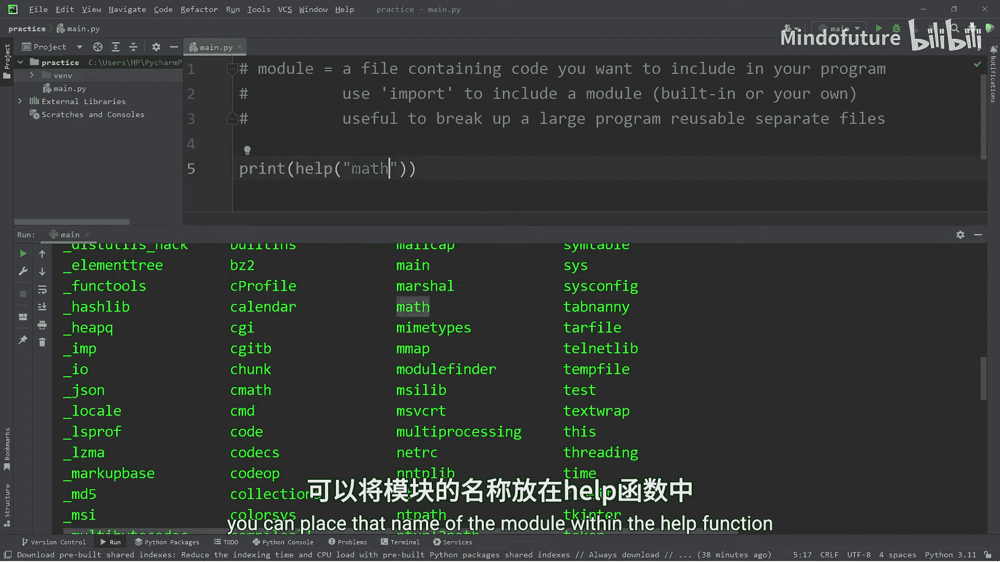

要查看一个模块内部包含的所有变量和函数，你可以将该模块的名称作为参数传递给`help()`函数。

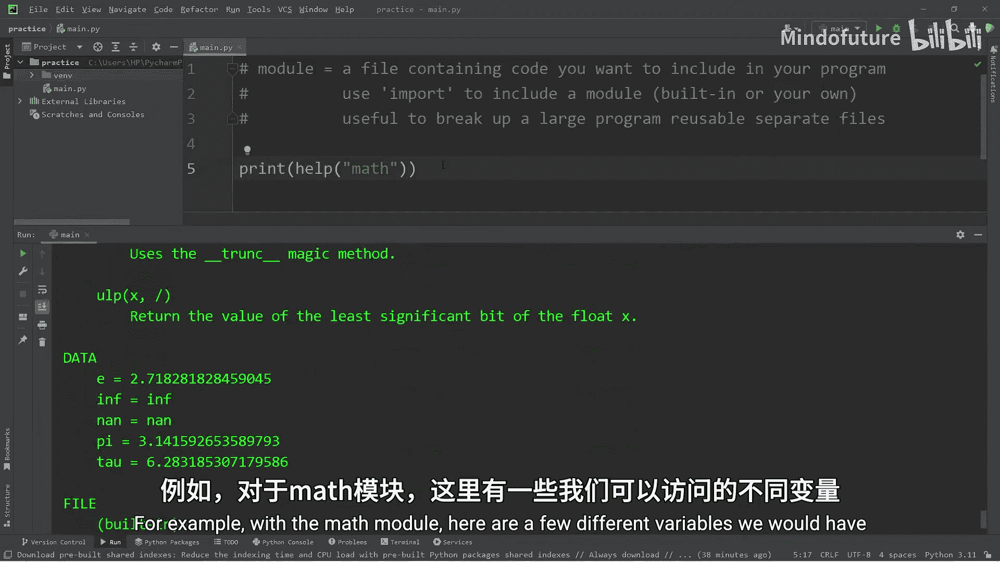

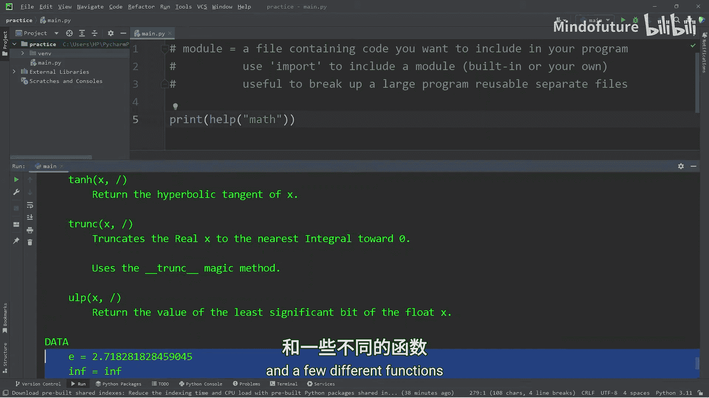

例如，对于`math`模块，使用`help(math)`可以列出其包含的变量（如`pi`、`e`）和函数（如`sqrt`、`sin`）。

## 导入模块

要使用一个模块，你需要先导入它。Python提供了几种导入方式。

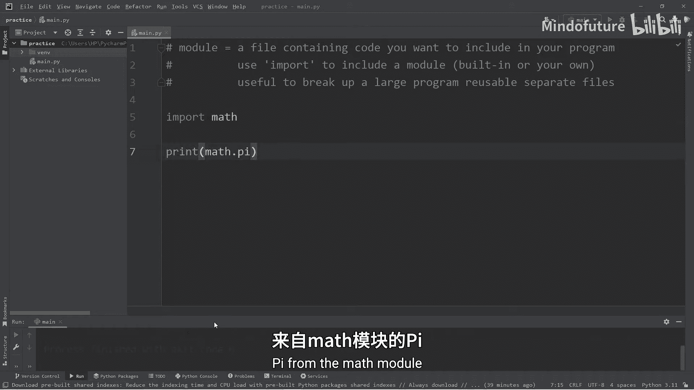

### 基本导入

使用`import`关键字，后跟模块名。导入后，你可以通过`模块名.变量名`或`模块名.函数名()`的格式访问其内容。

```python
import math
print(math.pi)  # 输出圆周率π的值
```

### 使用别名导入

使用`import ... as ...`语法可以为模块设置一个别名。这在模块名较长时非常有用，可以减少代码输入量。

```python
import math as m
print(m.pi)  # 使用别名`m`来访问
```

### 导入特定内容

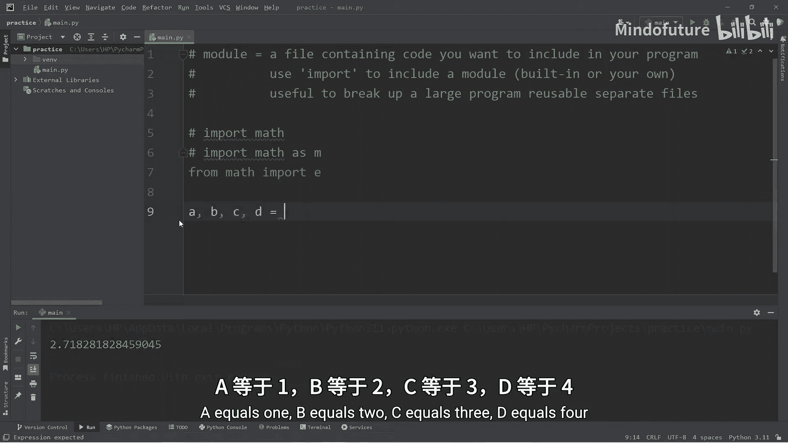

使用`from ... import ...`语法可以从模块中导入特定的变量或函数。导入后，可以直接使用其名称，无需前缀。

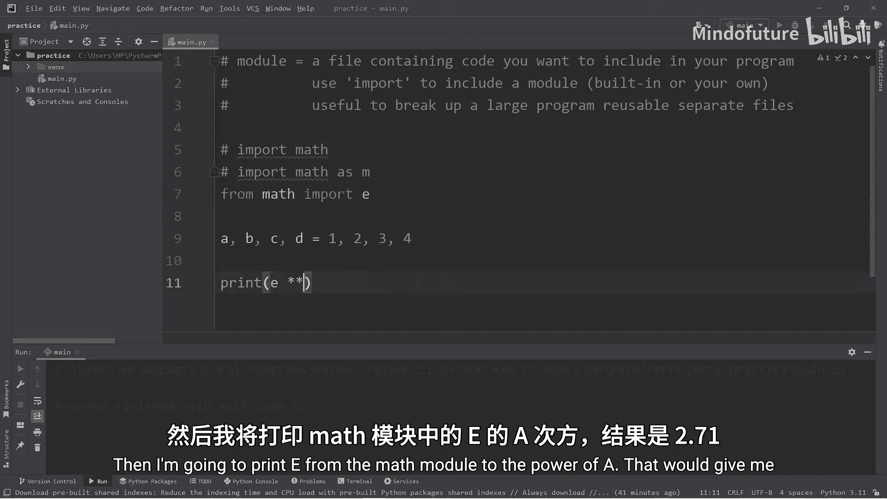

```python
from math import pi
print(pi)  # 直接使用`pi`，无需`math.`前缀
```

**注意**：这种方式可能导致命名冲突。如果你在程序中定义了一个同名的变量，它会覆盖从模块导入的内容，可能导致难以察觉的错误。

上一节我们介绍了导入模块的几种方法，本节中我们来看看一个因导入方式不当导致命名冲突的例子。

```python
from math import e  # 导入数学常数e (约等于2.718)
a, b, c, d = 1, 2, 3, 4
print(e ** a, e ** b, e ** c, e ** d)  # 输出e的1,2,3,4次方

e = 5  # 意外地重新定义了变量e，覆盖了从math导入的e
print(e ** e)  # 现在计算的是5的5次方，而非e的5次方，结果完全错误
```

为了避免这种问题，建议使用`import module_name`的方式，并在使用时显式地加上模块名前缀，使代码意图更清晰。

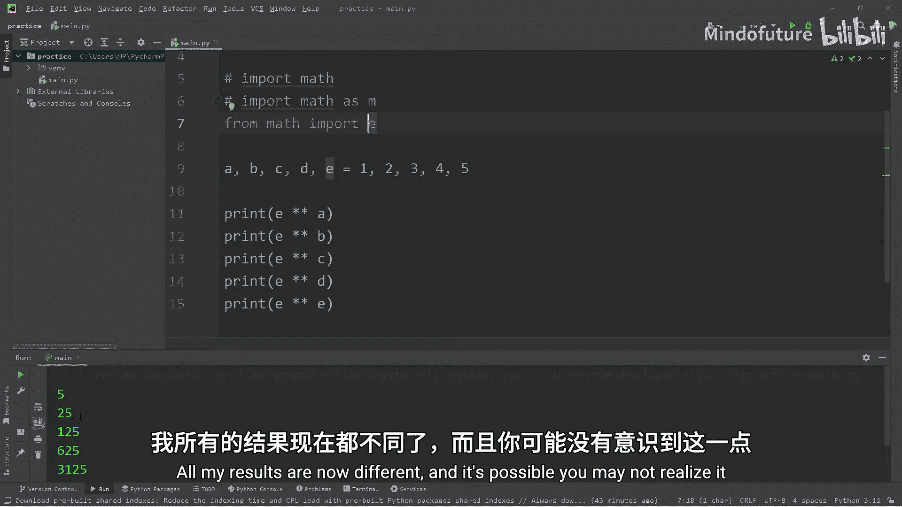

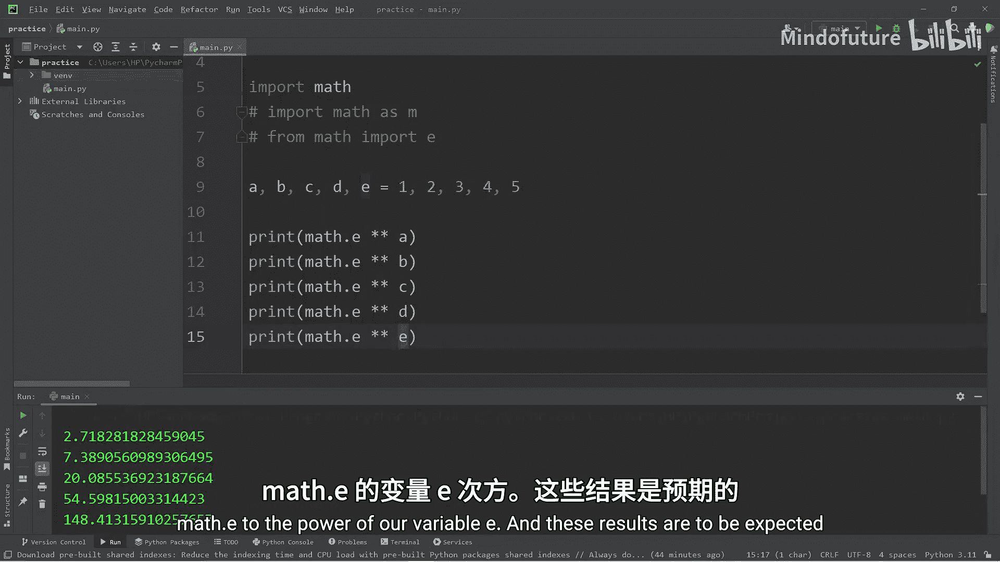

```python
import math
a, b, c, d = 1, 2, 3, 4
e = 5
print(math.e ** a, math.e ** b, math.e ** c, math.e ** d)  # 使用math.e
print(math.e ** e)  # 明确使用的是数学常数e
```

## 创建自定义模块

创建自己的模块非常简单，只需创建一个新的`.py`文件，并在其中编写代码即可。

以下是创建步骤：
1.  在你的项目文件夹中，新建一个Python文件（例如：`example.py`）。
2.  在这个文件中定义你需要的变量和函数。

例如，创建一个`example.py`模块文件：

```python
# example.py 文件内容
pi = 3.14159

def square(x):
    return x ** 2

def cube(x):
    return x ** 3

def circumference(radius):
    return 2 * pi * radius

def area(radius):
    return pi * radius ** 2
```

3.  在另一个Python程序（如`main.py`）中，导入并使用这个自定义模块。

```python
# main.py 文件内容
import example

print(example.pi)  # 输出: 3.14159
print(example.square(3))  # 输出: 9
print(example.cube(3))  # 输出: 27
print(example.circumference(3))  # 输出: 18.849539999999998
print(example.area(3))  # 输出: 28.27431
```

## 总结

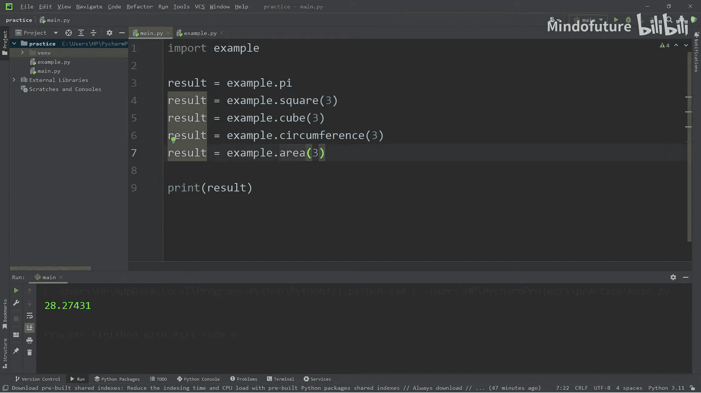

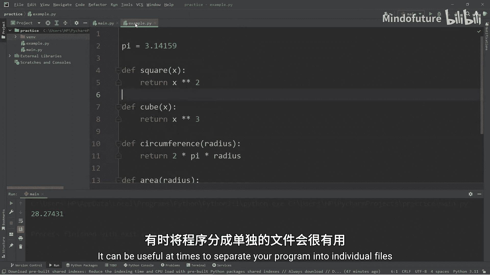

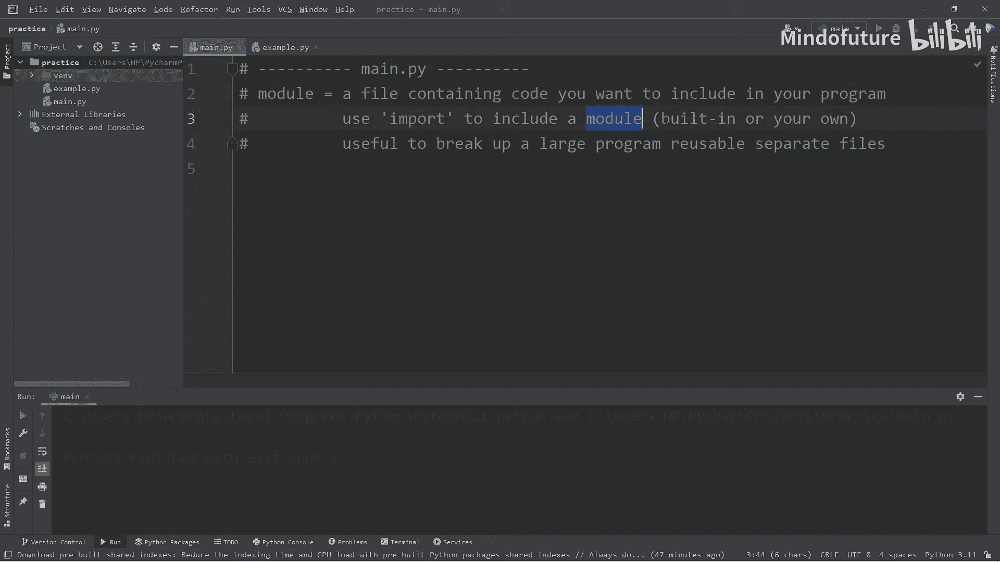

本节课中我们一起学习了Python模块。
*   模块是一个包含Python代码的文件，用于代码组织和重用。
*   使用`import`语句可以导入模块，包括内置模块和自定义模块。
*   导入方式有多种：基本导入、别名导入和导入特定内容，各有适用场景。
*   使用`help("modules")`可以查看所有可用模块，使用`help(module_name)`可以查看特定模块的详细信息。
*   创建自定义模块只需新建一个`.py`文件并编写代码，然后在其他文件中导入即可使用。

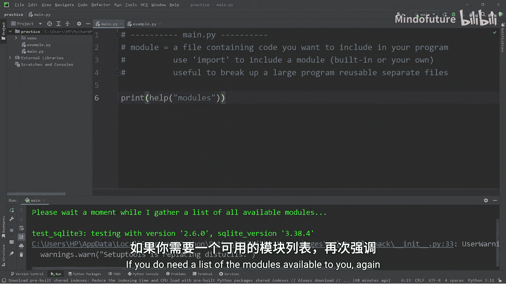

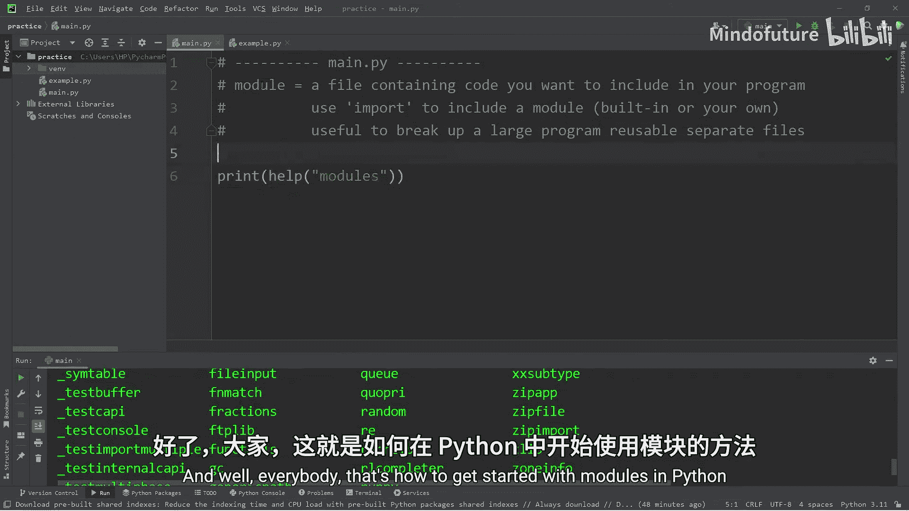

合理使用模块能让你的程序结构更清晰，更易于维护。