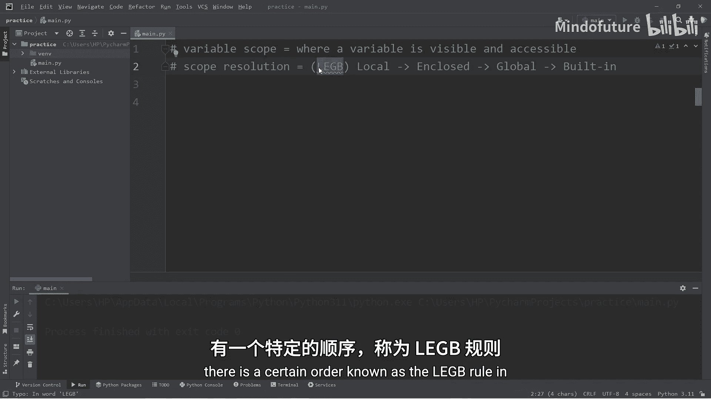
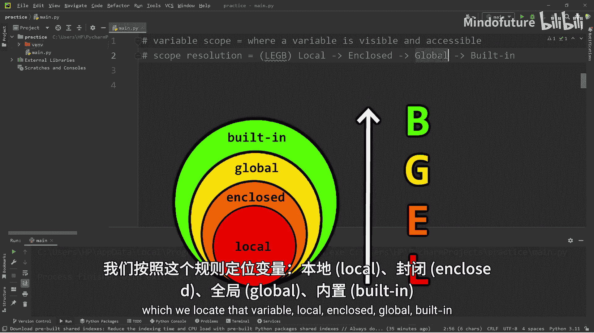
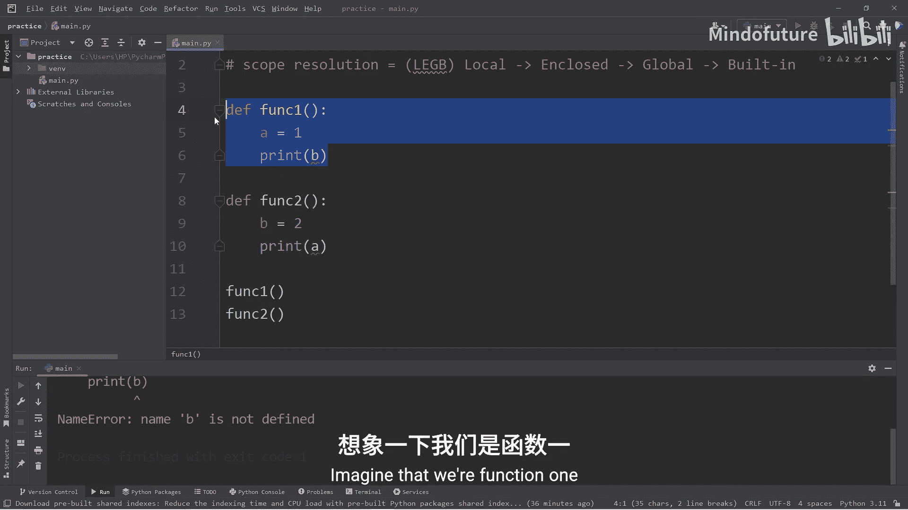
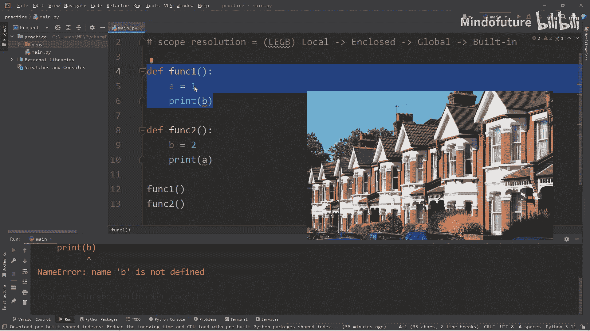
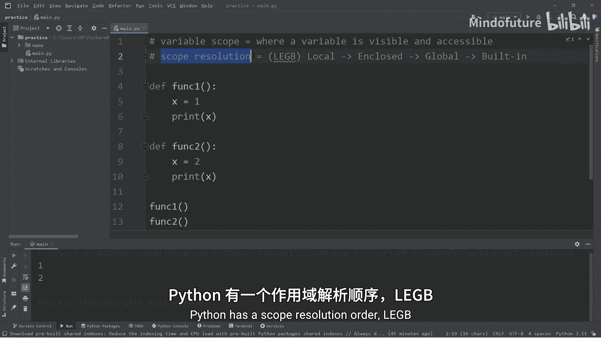
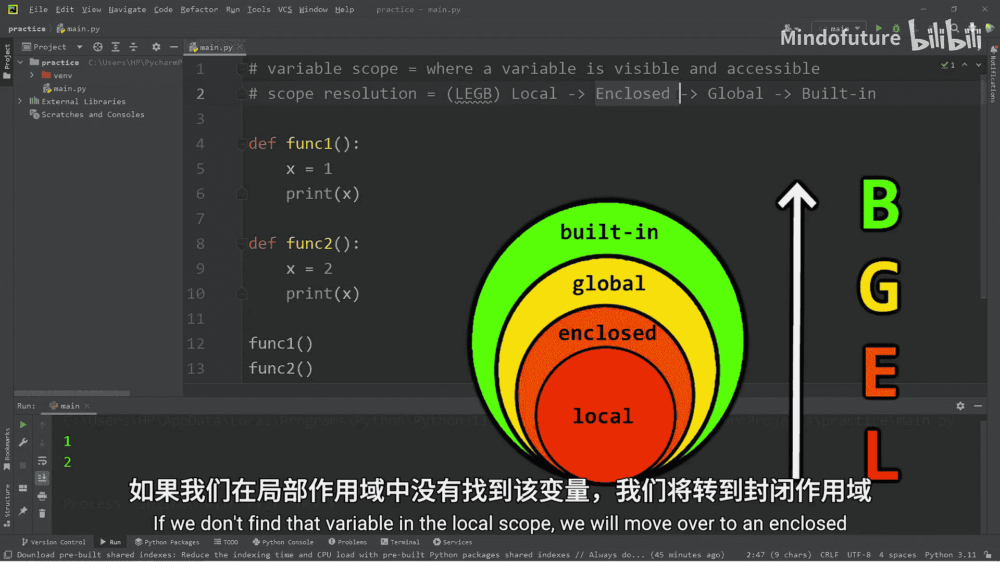
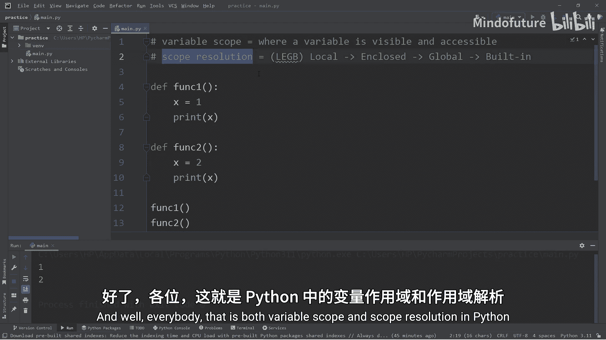

Python入门教程：P41：变量作用域与解析规则

在本节课中，我们将要学习Python中变量的作用域以及Python查找变量时所遵循的解析规则。理解这些概念对于编写清晰、无错误的代码至关重要。

## 变量作用域

变量作用域指的是一个变量在程序中**可见**和**可访问**的范围。简单来说，它决定了你在代码的哪个部分可以使用某个变量。

为了理解这个概念，我们先来看一个例子。假设我们有两个函数：





```python
def function1():
    a = 1
    print(a)

def function2():
    b = 2
    print(b)
```

如果我们调用 `function1()` 和 `function2()`，程序会分别打印出 `1` 和 `2`。在函数内部声明的变量拥有**局部作用域**。这意味着变量 `a` 是 `function1` 的局部变量，变量 `b` 是 `function2` 的局部变量。

在 `function1` 内部，如果我们尝试打印 `b`，或者在 `function2` 内部尝试打印 `a`，程序都会报错，提示 `NameError: name ‘b’ (或 ‘a’) is not defined`。这是因为函数无法看到其他函数内部的内容。

我们可以把每个函数想象成一个独立的房子。你只能看到自己房子（函数）里发生的事情，而看不到邻居房子（其他函数）里的情况。这就是变量作用域的核心：它限定了变量的可见范围。

基于这个原理，我们甚至可以在不同的作用域内创建同名变量。

```python
def function1():
    x = 1
    print(x)

def function2():
    x = 2
    print(x)
```

这里，我们有两个不同版本的 `x`：一个在 `function1` 中是局部变量，值为 `1`；另一个在 `function2` 中是局部变量，值为 `2`。它们互不干扰。





## 作用域解析顺序：LEGB规则

当我们使用一个变量时，Python会按照一个特定的顺序去查找它。这个顺序被称为 **LEGB规则**，即：

1.  **L**ocal：局部作用域
2.  **E**nclosed：闭包作用域
3.  **G**lobal：全局作用域
4.  **B**uilt-in：内置作用域

Python会按照这个顺序，从内到外逐层查找变量，直到找到为止。

### 1. 局部作用域

正如我们之前看到的，这是函数内部定义的变量。Python首先在局部作用域中查找变量。

### 2. 闭包作用域

这是一个稍高级的概念，当一个函数嵌套在另一个函数内部时，就形成了闭包。我们来看一个例子：

```python
def function1():
    x = 1  # 这是function2的“闭包作用域”变量
    def function2():
        print(x)  # 这里会使用闭包作用域中的 x=1
    function2()
```

在 `function2` 内部打印 `x` 时，Python首先在 `function2` 的局部作用域中查找 `x`。如果没有找到，它就会向外一层，到其闭包作用域（即 `function1` 的作用域）中查找。在这个例子中，它会找到 `x = 1`。

### 3. 全局作用域

全局作用域指的是在所有函数之外定义的变量。让我们修改之前的例子：

```python
x = 3  # 全局变量

def function1():
    print(x)  # 这里会使用全局作用域中的 x=3

def function2():
    print(x)  # 这里也会使用全局作用域中的 x=3
```

现在，两个函数内部都没有定义局部变量 `x`。因此，当它们打印 `x` 时，Python在局部作用域和闭包作用域中都找不到 `x`，于是继续向外查找，最终在全局作用域中找到了 `x = 3`。

### 4. 内置作用域

内置作用域包含了Python语言自身定义的名字，比如 `print`、`len`、`int` 等。我们来看一个与内置变量冲突的例子：

```python
from math import e  # 导入数学常数e，这是一个内置名称
print(e)  # 输出：2.718281828459045

e = 3  # 在全局作用域定义一个同名变量e

def function1():
    print(e)  # 这里会使用哪个e？

function1()  # 输出：3
print(e)     # 输出：3
```

在这个例子中，我们实际上有两个 `e`：一个是从 `math` 模块导入的**内置** `e`，另一个是我们自己定义的**全局** `e`。根据LEGB规则，当在函数或全局中查找 `e` 时，Python会先找到全局作用域中的 `e = 3`，因此最终打印的都是 `3`。内置的 `e` 被“遮盖”了。

## 总结

本节课中我们一起学习了Python中两个重要的基础概念。



*   **变量作用域**：决定了变量在代码中的可见性和可访问性。主要分为局部作用域和全局作用域。
*   **作用域解析规则（LEGB）**：这是Python查找变量时所遵循的固定顺序：**Local（局部） -> Enclosed（闭包） -> Global（全局） -> Built-in（内置）**。





理解这些规则能帮助你预测代码的行为，避免因变量名冲突或访问错误而导致的bug。记住，当使用一个变量时，Python总是从最内层的作用域开始，一层层向外查找。