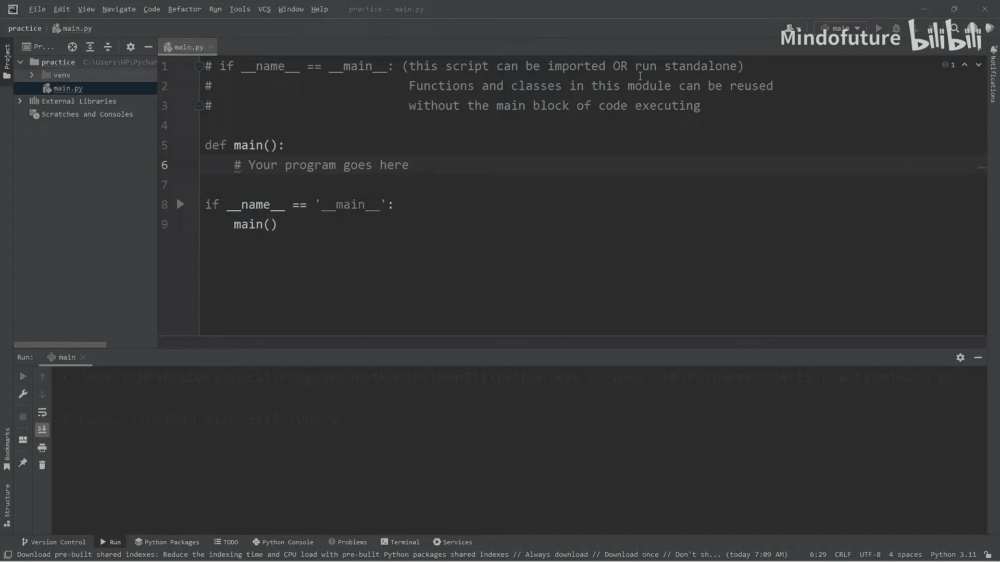
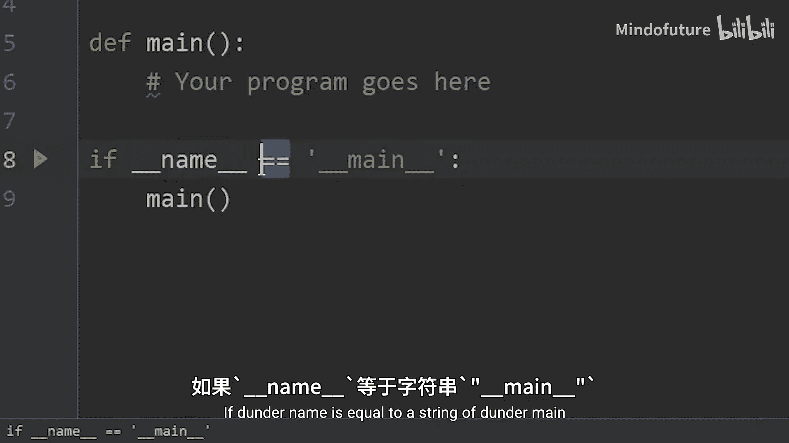
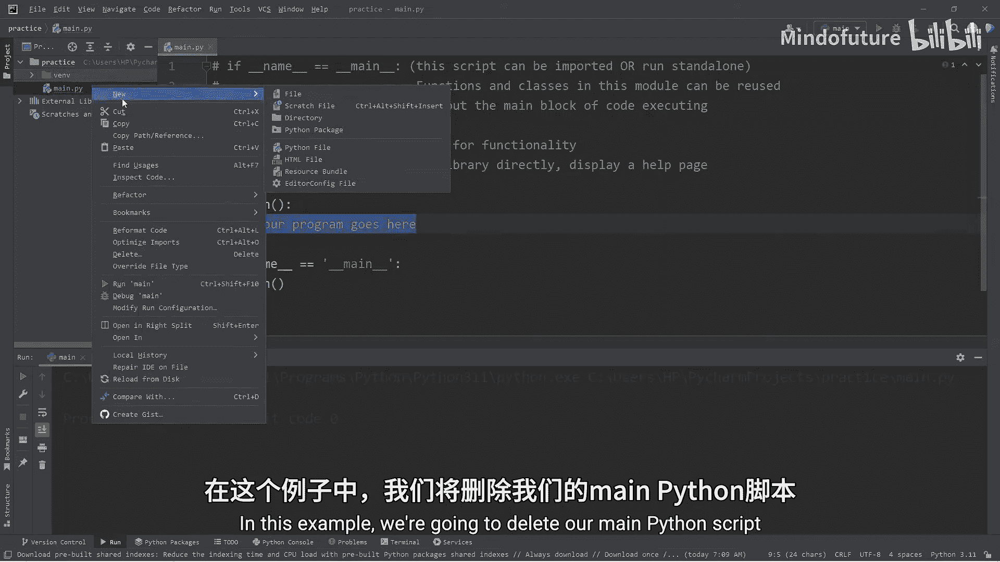
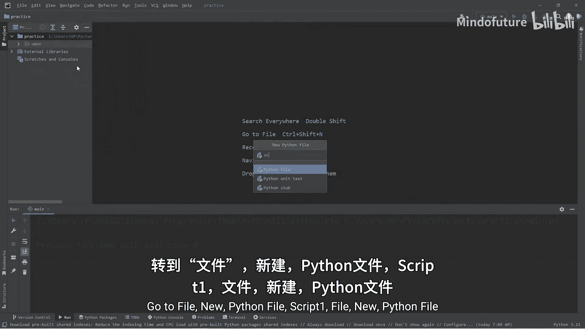
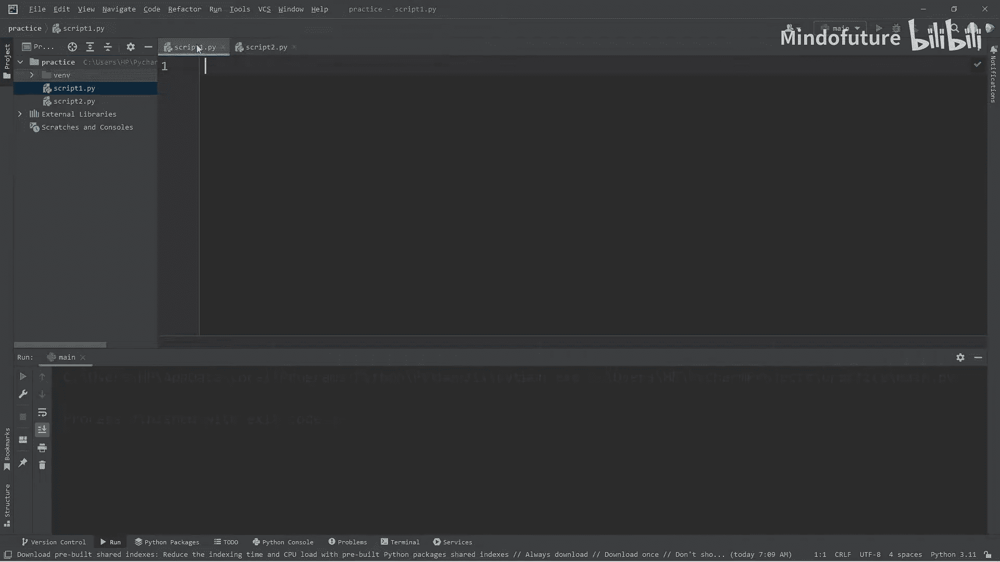
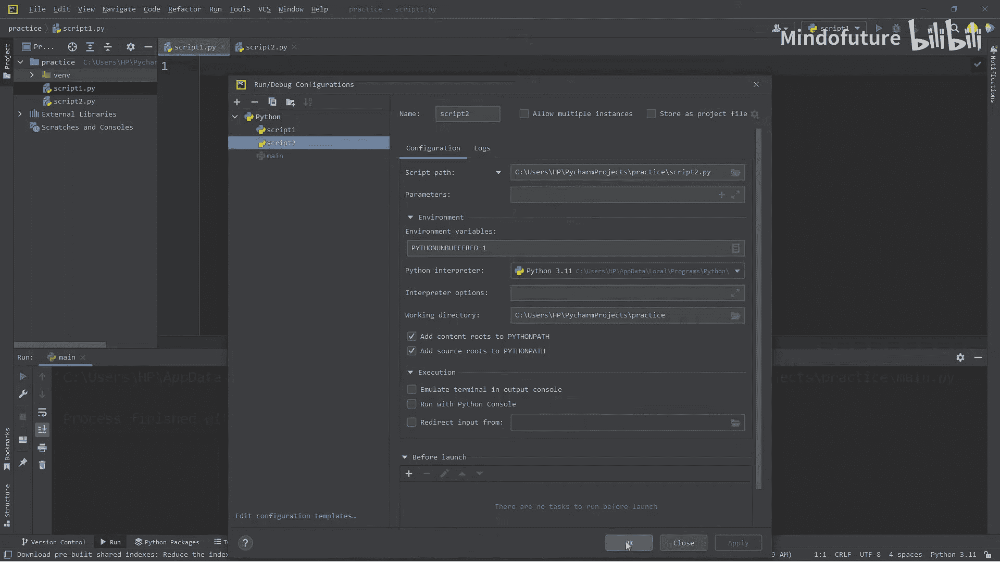
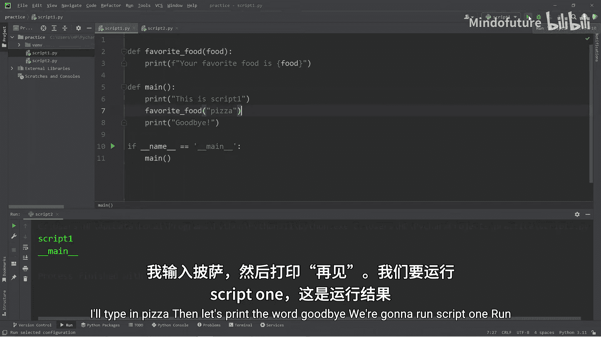
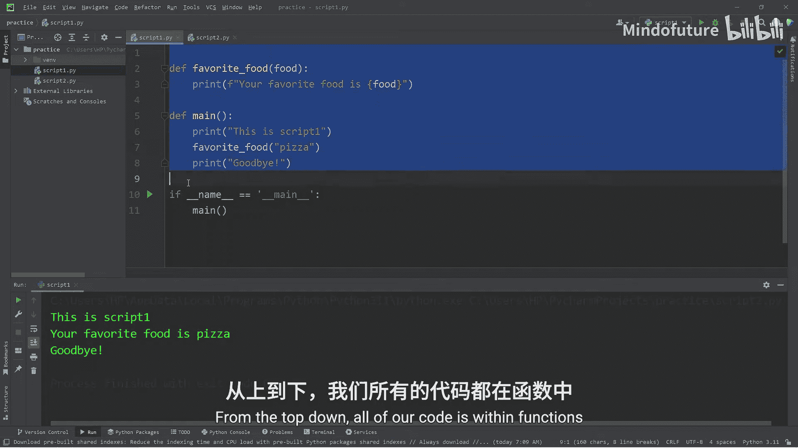
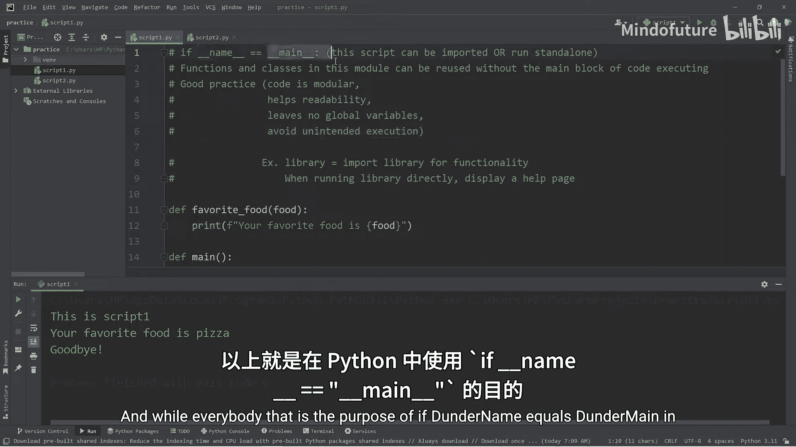

Python超全入门教程：P42：理解 `if __name__ == "__main__"` 🐍

在本节课中，我们将要学习Python中一个常见但重要的结构：`if __name__ == "__main__"`。这个语句用于控制代码的执行方式，使得一个Python文件既可以作为独立的程序运行，也可以作为模块被其他程序导入使用。

---

### 核心概念：`__name__` 变量

在Python中，每个模块（即每个`.py`文件）都有一个内置的变量叫做 `__name__`。这个变量的值取决于该模块是如何被使用的。

*   当一个模块被**直接运行**时，其 `__name__` 变量的值会被设置为字符串 `"__main__"`。
*   当一个模块被**导入**到另一个模块中时，其 `__name__` 变量的值会被设置为该模块的文件名（不带`.py`后缀）。

我们可以通过一个简单的打印语句来验证这一点。





```python
# 在一个名为 script1.py 的文件中
print(__name__)
```

---

### `if __name__ == "__main__"` 的作用





基于 `__name__` 变量的特性，我们可以在代码中使用 `if __name__ == "__main__"` 这个条件判断语句。它的作用是：**只有当这个文件被直接运行时，才执行其下方的代码块**。

这带来了两个主要好处：
1.  **模块化与复用性**：其他程序可以导入这个文件中的函数和类，而不会触发该文件作为独立程序时的执行逻辑。
2.  **避免意外执行**：确保只有在主动运行该文件时，其中的“主程序”部分才会启动。



---



### 实践演示：创建两个脚本

为了更好地理解，我们将创建两个Python脚本文件进行演示。

上一节我们介绍了 `__name__` 变量的概念，本节中我们来看看如何在实际代码中应用。

以下是创建和配置两个脚本的步骤：
1.  创建第一个脚本 `script1.py`。
2.  创建第二个脚本 `script2.py`。
3.  在集成开发环境（IDE）中为这两个脚本分别配置独立的运行配置，以便我们可以选择运行哪一个。

---

### 场景一：直接运行与导入的区别

现在，让我们在 `script1.py` 中编写一些代码。

```python
# script1.py
print(f"在 script1 中，__name__ 的值是：{__name__}")
```

如果我们直接运行 `script1.py`，输出将是：
```
在 script1 中，__name__ 的值是：__main__
```

接下来，我们在 `script2.py` 中导入 `script1`。

```python
# script2.py
import script1
print(f"在 script2 中，__name__ 的值是：{__name__}")
```

如果我们直接运行 `script2.py`，输出将是：
```
在 script1 中，__name__ 的值是：script1
在 script2 中，__name__ 的值是：__main__
```

可以看到，当 `script1` 被导入时，它的 `__name__` 不再是 `"__main__"`，而是其模块名 `"script1"`。

---

### 场景二：使用 `if __name__ == "__main__"` 控制执行

理解了直接运行和导入的区别后，我们就可以利用 `if __name__ == "__main__"` 来组织代码了。

以下是 `script1.py` 的改进版本：



```python
# script1.py

def favorite_food(food):
    print(f"你最喜欢的食物是：{food}")



def main():
    print("这是 script1 的主程序。")
    favorite_food("披萨")
    print("再见。")

if __name__ == "__main__":
    main()
```

当我们直接运行 `script1.py` 时，`if` 条件成立，`main()` 函数被调用，程序正常执行：
```
这是 script1 的主程序。
你最喜欢的食物是：披萨
再见。
```

现在，我们在 `script2.py` 中导入并使用 `script1` 的函数，但不希望触发 `script1` 的 `main()` 函数。

```python
# script2.py
import script1

print("这是 script2。")
# 复用 script1 中的函数
script1.favorite_food("寿司")
print("结束。")
```

运行 `script2.py`，输出如下：
```
这是 script2。
你最喜欢的食物是：寿司
结束。
```

`script1` 中的 `main()` 函数没有被执行，这正是我们想要的效果。我们成功地从 `script1` “借用”了 `favorite_food` 函数，而没有运行其主程序逻辑。

---

### 实际应用与最佳实践

一个非常实用的例子是Python库。许多库文件既可以作为模块被导入，提供各种功能函数；也可以直接运行，以显示帮助信息或进行自检。

在 `script2.py` 中，我们也可以遵循同样的模式，使其自身具备“可导入”和“可独立运行”两种特性。

```python
# script2.py (最终版)
import script1

def favorite_drink(drink):
    print(f"你最喜欢的饮料是：{drink}")

def main():
    print("这是 script2 的主程序。")
    script1.favorite_food("寿司")
    favorite_drink("咖啡")
    print("再见。")

if __name__ == "__main__":
    main()
```

这样做是良好的编程习惯，它使得代码：
*   **更加模块化**，易于管理和复用。
*   **提高可读性**，清晰地分离了模块定义和程序入口。
*   **避免全局变量污染**，将主逻辑封装在函数内。
*   **防止意外的代码执行**。

---



本节课中我们一起学习了 `if __name__ == "__main__"` 在Python中的用途。总结来说，它是一个强大的工具，允许你编写既可以作为独立脚本运行，又可以作为模块安全导入的Python代码。记住这个模式，它将使你的项目结构更加清晰和专业。