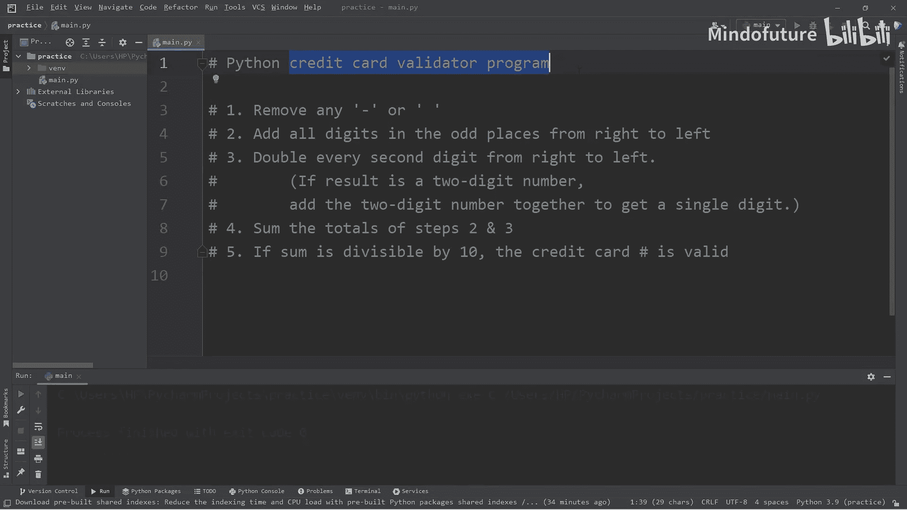
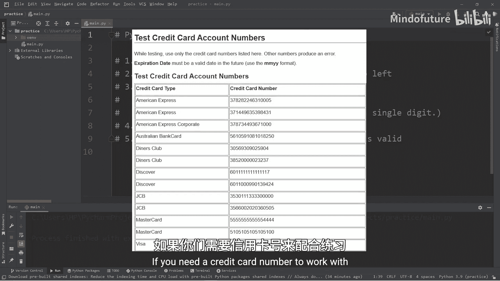
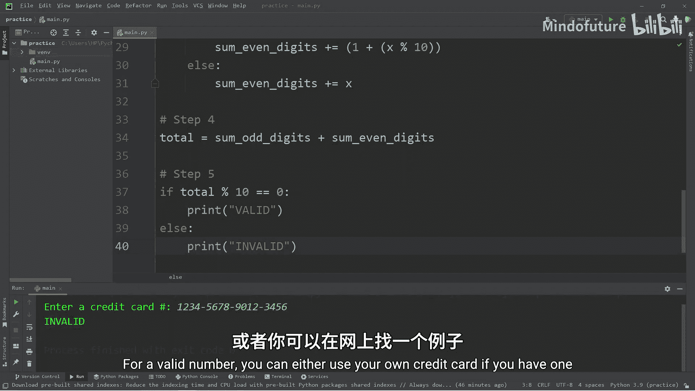
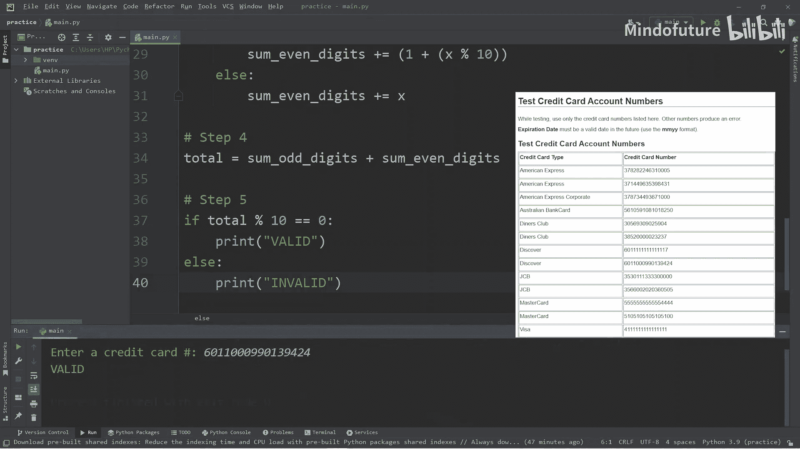
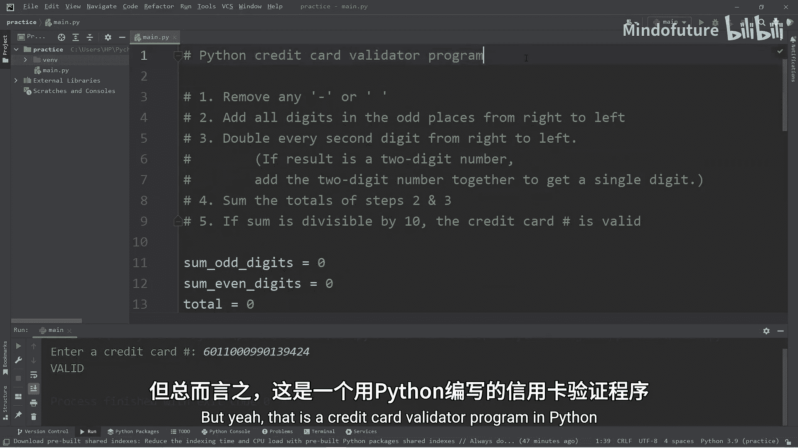

# 043：Python信用卡验证器 💳

在本节课中，我们将学习如何使用Python创建一个信用卡验证器程序。这个程序将遵循一个特定的算法来检查信用卡号码是否有效。我们将逐步分解这个过程，并使用字符串操作和循环来实现它。

---

## 概述 📋

信用卡验证通常使用卢恩算法（Luhn Algorithm）。我们将实现该算法的步骤，从用户那里获取一个信用卡号码，清理输入，然后进行计算以确定其有效性。

---





## 第一步：获取并清理用户输入

首先，我们需要从用户那里获取信用卡号码，并移除任何可能用于格式化的连字符（`-`）或空格。

以下是实现此步骤的代码：

```python
# 步骤 1: 获取用户输入并清理
card_number = input("请输入信用卡号码: ")
# 移除连字符
card_number = card_number.replace("-", "")
# 移除空格
card_number = card_number.replace(" ", "")
# 反转字符串以便从右向左处理
card_number = card_number[::-1]
```

上一节我们介绍了课程目标，本节中我们来看看如何开始处理用户输入。我们使用 `input()` 函数获取输入，然后使用字符串的 `replace()` 方法移除不需要的字符。最后，我们通过切片 `[::-1]` 反转字符串，这为后续从右向左处理数字做好了准备。

---

## 第二步：计算奇数位数字之和

根据算法，我们需要将从右向左数，处于奇数位置上的所有数字相加。

以下是计算奇数位数字之和的代码：

```python
# 步骤 2: 计算奇数位数字之和
sum_odd_digits = 0
for x in card_number[::2]:
    sum_odd_digits += int(x)
```

在清理了输入之后，我们现在开始计算。我们使用步长为2的切片 `[::2]` 来遍历反转后字符串中每隔一个的数字（即奇数位）。注意，我们需要将每个字符转换为整数（`int(x)`）再进行累加。

---

## 第三步：计算偶数位数字之和

接下来，我们需要处理从右向左数，处于偶数位置上的数字。规则是：将每个数字乘以2，如果结果是两位数，则将这两个数字相加得到一个一位数。

以下是计算偶数位数字之和的代码：

```python
# 步骤 3: 计算偶数位数字之和
sum_even_digits = 0
for x in card_number[1::2]:
    x = int(x) * 2
    if x >= 10:
        # 如果是两位数，则拆分并相加 (例如，12 -> 1 + 2 = 3)
        sum_even_digits += (x % 10) + 1
    else:
        sum_even_digits += x
```

上一节我们计算了奇数位之和，本节中我们来看看如何处理偶数位。我们使用切片 `[1::2]` 从索引1开始，每隔一个取一个数字（即偶数位）。对于每个数字，我们将其加倍。如果结果 `>= 10`，我们通过 `(x % 10) + 1` 这个公式来得到两个数字的和（例如，`12 -> 2 + 1 = 3`）。

---

## 第四步与第五步：计算总和并验证

最后，我们将奇数位和偶数位的和相加。如果总和能被10整除，则信用卡号码有效。

以下是完成验证的代码：

```python
# 步骤 4: 计算总和
total = sum_odd_digits + sum_even_digits

# 步骤 5: 验证
if total % 10 == 0:
    print("有效 ✅")
else:
    print("无效 ❌")
```

在分别计算了奇数位和偶数位的和之后，我们现在将它们相加得到总和。验证的逻辑很简单：**如果 `total % 10 == 0`，则号码有效**。

---

## 完整程序代码

以下是整合了所有步骤的完整程序：

```python
# 步骤 1: 获取并清理输入
card_number = input("请输入信用卡号码: ")
card_number = card_number.replace("-", "")
card_number = card_number.replace(" ", "")
card_number = card_number[::-1]  # 反转字符串

# 步骤 2: 计算奇数位数字之和
sum_odd_digits = 0
for x in card_number[::2]:
    sum_odd_digits += int(x)

# 步骤 3: 计算偶数位数字之和
sum_even_digits = 0
for x in card_number[1::2]:
    x = int(x) * 2
    if x >= 10:
        sum_even_digits += (x % 10) + 1
    else:
        sum_even_digits += x

# 步骤 4 & 5: 计算总和并验证
total = sum_odd_digits + sum_even_digits
if total % 10 == 0:
    print("有效 ✅")
else:
    print("无效 ❌")
```

---



## 总结 🎯

本节课中我们一起学习了如何用Python实现一个信用卡验证器。我们主要完成了以下工作：

1.  **获取并清理用户输入**：移除格式字符并反转字符串。
2.  **计算奇数位数字之和**：使用步长为2的切片进行遍历和累加。
3.  **计算偶数位数字之和**：将数字加倍，并按规则处理两位数结果。
4.  **验证结果**：检查总和是否能被10整除。





这个项目很好地练习了字符串处理、循环和条件判断。你可以使用网上找到的测试信用卡号码来验证程序的正确性。