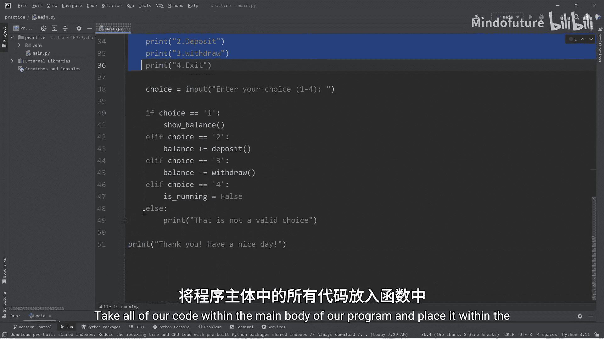
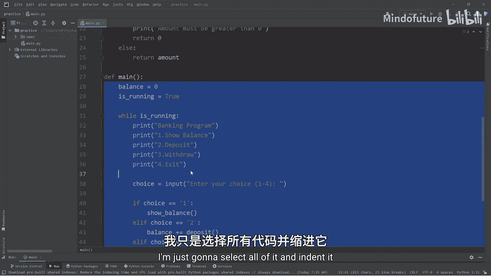
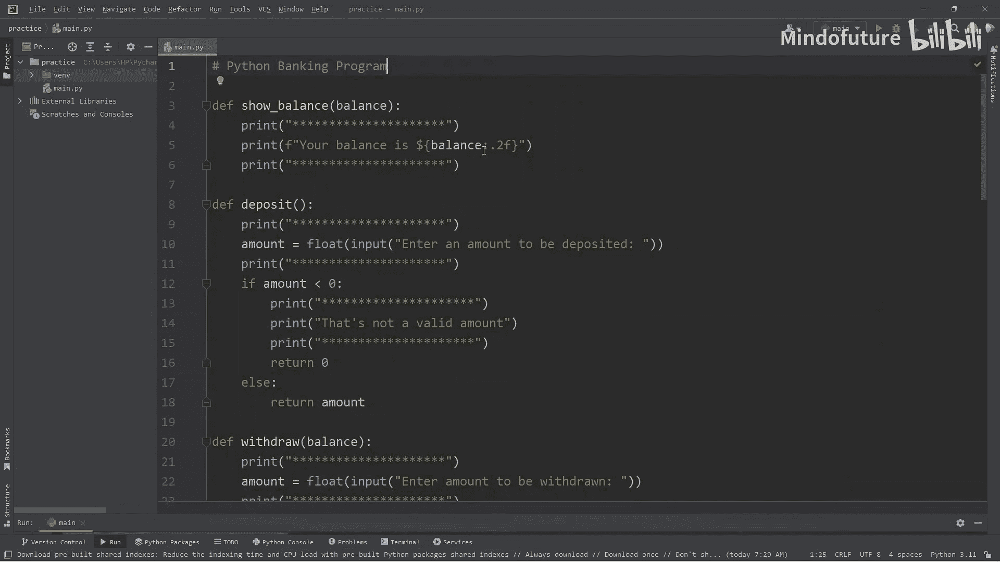

# 044：编写一个初学者 Python 银行程序 🏦

在本节课中，我们将学习如何使用 Python 创建一个简单的银行程序。这个项目旨在通过实践，帮助我们熟悉在项目中如何使用函数。我们将从规划功能开始，逐步实现显示余额、存款和取款等核心操作，并最终将所有代码封装到一个主函数中，使程序结构更清晰。

---

## 项目规划与函数声明

上一节我们介绍了本课程的目标。本节中，我们来看看如何开始构建程序。在创建项目时，我喜欢将其划分为更小的部分，并逐一处理。我们将首先声明银行程序所需的所有函数。

以下是程序需要的三个核心功能：
*   **显示余额**：定义一个名为 `show_balance` 的函数。
*   **存款**：定义一个名为 `deposit` 的函数。
*   **取款**：定义一个名为 `withdraw` 的函数。

目前，我们先用 `pass` 作为占位符来定义这些函数。

```python
def show_balance():
    pass

def deposit():
    pass

def withdraw():
    pass
```

---

## 定义主程序逻辑与变量

现在我们已经声明了三个核心函数。接下来，我们需要定义程序运行所需的主要变量和逻辑。

我们需要两个关键变量：
*   **余额**：初始值设为 `0`。
*   **程序运行状态**：一个布尔值 `is_running`，用于控制程序主循环。

我们将把主要代码放在一个 `while` 循环中，只要 `is_running` 为 `True`，程序就会持续运行。

```python
balance = 0
is_running = True

while is_running:
    # 主程序代码将放在这里
```

---

## 构建用户交互界面

在 `while` 循环内部，我们需要与用户进行交互。这包括显示欢迎信息、选项菜单，并接收用户输入。

以下是构建用户界面的步骤：
1.  打印程序标题和装饰线。
2.  列出用户可以选择的选项。
3.  提示用户输入他们的选择（1-4）。

```python
    print("******************")
    print("Banking Program")
    print("******************")
    print("1. Show Balance")
    print("2. Make Deposit")
    print("3. Make Withdrawal")
    print("4. Exit")
    choice = input("Enter your choice (1-4): ")
```

---

## 处理用户选择

获取用户输入后，我们需要根据不同的选择执行相应的操作。我们将使用一系列 `if-elif-else` 语句来处理。

以下是处理逻辑：
*   如果选择是 `"1"`，调用 `show_balance` 函数。
*   如果选择是 `"2"`，调用 `deposit` 函数。
*   如果选择是 `"3"`，调用 `withdraw` 函数。
*   如果选择是 `"4"`，将 `is_running` 设为 `False` 以退出循环。
*   如果输入无效（非1-4），则提示错误信息。

```python
    if choice == "1":
        show_balance()
    elif choice == "2":
        deposit()
    elif choice == "3":
        withdraw()
    elif choice == "4":
        is_running = False
    else:
        print("That is not a valid choice.")
```

当循环结束后，打印一条告别信息。

```python
print("Thank you! Have a nice day!")
```

---

## 实现 `show_balance` 函数

上一节我们搭建了程序的主框架。本节中，我们来具体实现第一个功能：显示余额。

`show_balance` 函数非常简单，它只需要打印出当前的余额。我们使用格式说明符 `:.2f` 来确保余额始终显示两位小数。

```python
def show_balance():
    print("******************")
    print(f"Your balance is ${balance:.2f}")
    print("******************")
```

---

## 实现 `deposit` 函数

现在我们已经可以显示余额了。接下来，我们实现存款功能，让用户可以向账户中存钱。

`deposit` 函数需要执行以下步骤：
1.  提示用户输入存款金额。
2.  将输入的字符串转换为浮点数。
3.  验证金额是否大于0（不允许存入负数）。
4.  如果金额有效，则将其加到总余额中。

```python
def deposit():
    print("******************")
    amount = float(input("Enter amount to be deposited: "))
    if amount <= 0:
        print("That's not a valid amount.")
        return 0
    else:
        global balance
        balance += amount
        return amount
```

---

## 实现 `withdraw` 函数

存款功能完成后，与之对应的就是取款功能。本节我们来实现 `withdraw` 函数。

`withdraw` 函数需要处理以下逻辑：
1.  提示用户输入取款金额。
2.  将输入的字符串转换为浮点数。
3.  进行两项验证：
    *   取款金额不能大于当前余额。
    *   取款金额必须大于0。
4.  如果验证通过，则从余额中减去该金额。

```python
def withdraw():
    print("******************")
    amount = float(input("Enter amount to be withdrawn: "))
    global balance
    if amount > balance:
        print("Insufficient funds.")
        return 0
    elif amount <= 0:
        print("Amount must be greater than 0.")
        return 0
    else:
        balance -= amount
        return amount
```

---

## 重构：使用 `main` 函数封装代码

目前，我们的变量（如 `balance`）是全局变量。为了更好的代码结构和可读性，我们将把所有主逻辑封装到一个 `main` 函数中。

这意味着 `balance` 和 `is_running` 将成为 `main` 函数的局部变量。因此，我们需要将它们作为参数传递给 `show_balance`、`deposit` 和 `withdraw` 函数，并相应地修改这些函数的定义。



最后，我们使用 `if __name__ == "__main__":` 这个常见的Python惯用法来调用 `main` 函数，这确保了我们的程序既可以独立运行，也可以作为模块被导入。



```python
def main():
    balance = 0
    is_running = True
    # ... (将之前while循环内的所有代码移到这里，并缩进)
    # 调用函数时传入balance参数，例如：show_balance(balance)

if __name__ == "__main__":
    main()
```

---

## 最终程序与总结

本节课中，我们一起学习并完成了一个简单的Python银行程序。我们从规划功能开始，逐步实现了显示余额、存款和取款的核心逻辑，并通过 `main` 函数和参数传递优化了代码结构。

以下是完整的程序代码，它包含了所有讨论过的改进，如文本装饰和参数传递：

```python
def show_balance(balance):
    print("******************")
    print(f"Your balance is ${balance:.2f}")
    print("******************")

def deposit():
    print("******************")
    amount = float(input("Enter amount to be deposited: "))
    if amount <= 0:
        print("That's not a valid amount.")
        return 0
    else:
        return amount

def withdraw(balance):
    print("******************")
    amount = float(input("Enter amount to be withdrawn: "))
    if amount > balance:
        print("Insufficient funds.")
        return 0
    elif amount <= 0:
        print("Amount must be greater than 0.")
        return 0
    else:
        return amount

def main():
    balance = 0
    is_running = True

    while is_running:
        print("******************")
        print("Banking Program")
        print("******************")
        print("1. Show Balance")
        print("2. Make Deposit")
        print("3. Make Withdrawal")
        print("4. Exit")
        choice = input("Enter your choice (1-4): ")

        if choice == "1":
            show_balance(balance)
        elif choice == "2":
            balance += deposit()
        elif choice == "3":
            balance -= withdraw(balance)
        elif choice == "4":
            is_running = False
        else:
            print("That is not a valid choice.")

    print("Thank you! Have a nice day!")

if __name__ == "__main__":
    main()
```



通过这个项目，你实践了函数定义、循环控制、条件判断、用户输入处理以及基本的程序结构设计。你可以在此基础上继续扩展，例如添加用户认证、交易记录等功能。