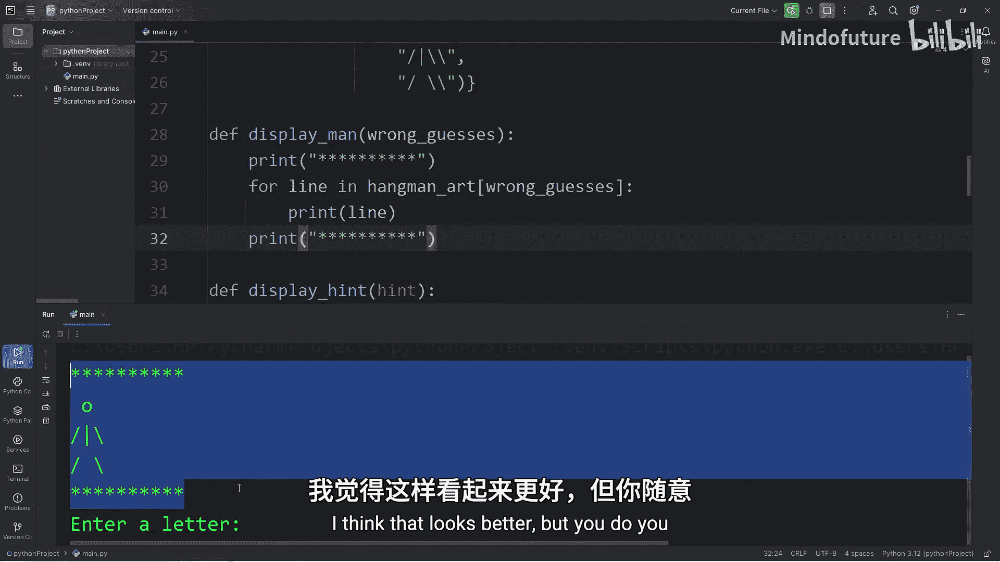
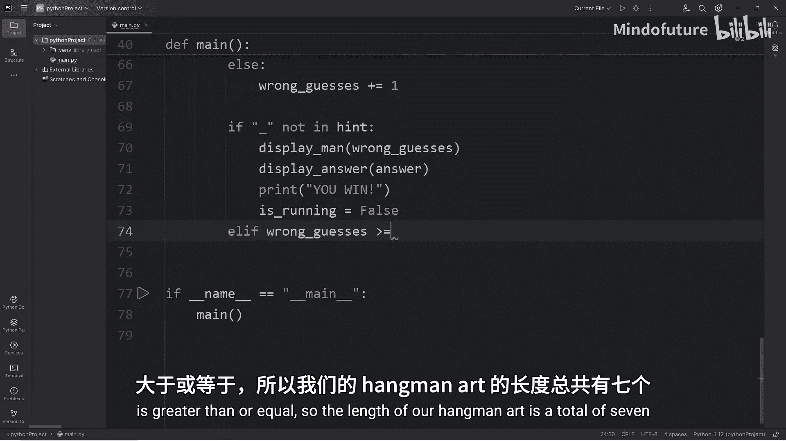
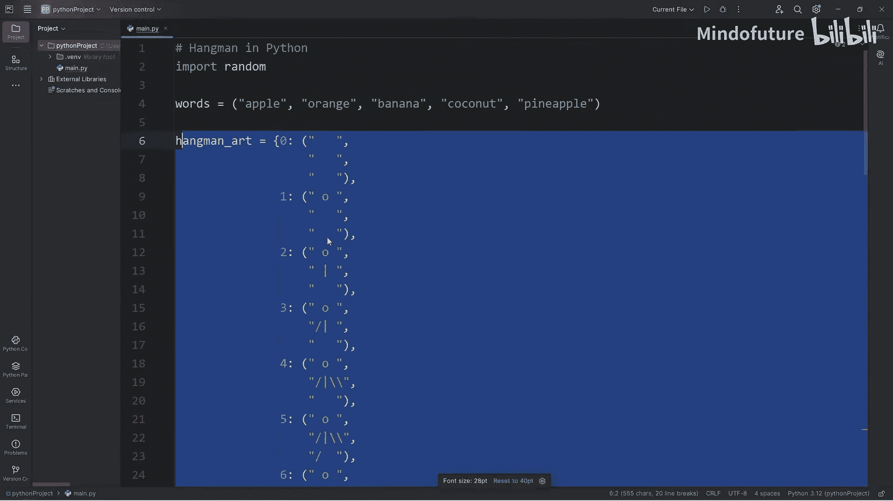
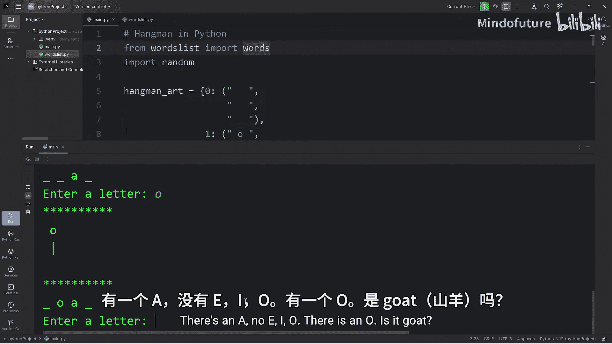
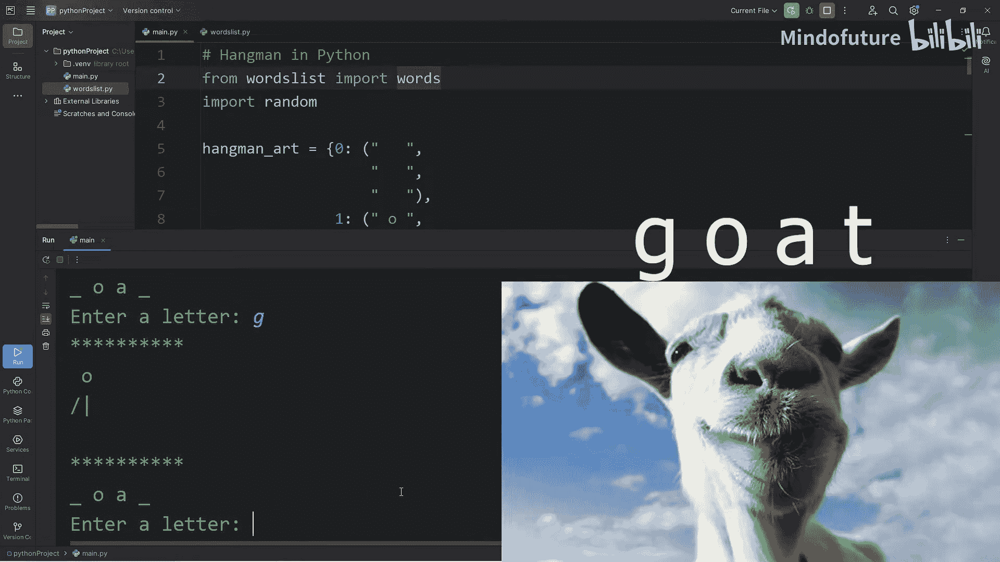
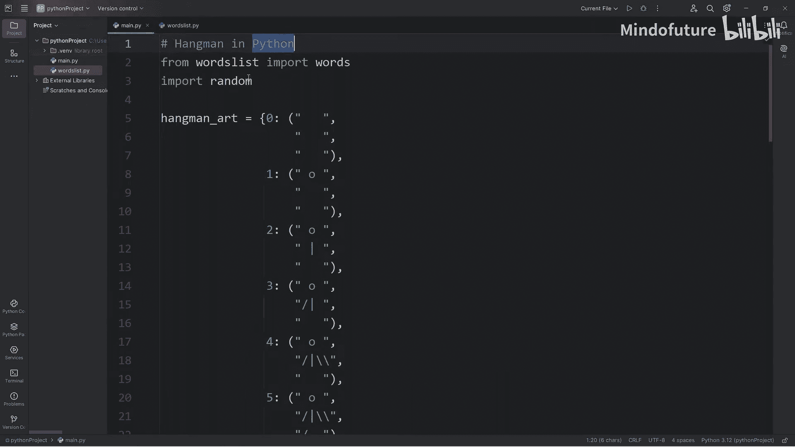

# 046：用 Python 编写一个猜词游戏（Hangman）

在本节课中，我们将一起使用 Python 创建一个经典的猜词游戏（Hangman）。我们将学习如何组织代码、使用字典存储数据、处理用户输入以及实现游戏逻辑。这是一个很好的小型项目，能帮助我们巩固编程知识。

## 概述

我们将创建一个猜词游戏。计算机会从一个单词列表中随机选择一个单词，玩家需要一次猜一个字母。如果猜错，屏幕上会逐步显示一个绞刑架小人。在猜错六次之前猜出所有字母则获胜，否则失败。

## 1. 导入模块与定义单词列表

首先，我们需要导入 `random` 模块，以便从列表中随机选择单词。同时，我们定义一个初始的单词列表。

```python
import random

words = {"apple", "orange", "banana", "coconut", "pineapple"}
```

## 2. 创建绞刑架小人图案字典

接下来，我们需要一个字典来存储不同错误次数下对应的绞刑架小人 ASCII 图案。字典的键是错误次数（0到6），值是一个包含三行字符串的元组。

```python
hangman_art = {
    0: ("", "", ""),
    1: ("   O   ", "   |   ", "       "),
    2: ("   O   ", "  /|   ", "       "),
    3: ("   O   ", "  /|\\  ", "       "),
    4: ("   O   ", "  /|\\  ", "  /    "),
    5: ("   O   ", "  /|\\  ", "  / \\  "),
    6: ("   O   ", "  /|\\  ", "  / \\  ")
}
```

## 3. 定义核心函数框架

在编写主逻辑之前，我们先定义几个核心函数的框架，这有助于组织代码结构。

```python
def display_man(wrong_guesses):
    """根据错误次数显示绞刑架小人"""
    pass

def display_hint(hint):
    """显示当前猜词进度（如 _ _ _ _ _）"""
    pass

def display_answer(answer):
    """游戏结束时显示正确答案"""
    pass

def main():
    """游戏主函数，包含主要逻辑"""
    pass

if __name__ == "__main__":
    main()
```

## 4. 实现 `display_man` 函数

上一节我们定义了函数框架，本节中我们来实现 `display_man` 函数。它的功能是根据错误次数 `wrong_guesses` 从 `hangman_art` 字典中取出对应的图案并打印。

```python
def display_man(wrong_guesses):
    print("**********")
    for line in hangman_art[wrong_guesses]:
        print(line)
    print("**********")
```

## 5. 实现 `display_hint` 和 `display_answer` 函数

现在，我们来实现显示提示和答案的函数。`display_hint` 函数将列表形式的提示（如 `['_', '_', '_']`）用空格连接并打印。`display_answer` 函数类似，但直接打印正确答案。



```python
def display_hint(hint):
    print(" ".join(hint))

def display_answer(answer):
    print(" ".join(answer))
```

## 6. 编写游戏主逻辑

接下来，我们填充 `main` 函数，这是游戏的核心。我们将在这里初始化变量、处理游戏循环和用户交互。

首先，在 `main` 函数开头初始化游戏状态。

```python
def main():
    # 随机选择答案
    answer = random.choice(list(words))
    # 初始化提示（与答案等长的下划线列表）
    hint = ["_"] * len(answer)
    # 记录错误次数
    wrong_guesses = 0
    # 记录已猜过的字母
    guessed_letters = set()
    # 游戏运行状态
    is_running = True
```

## 7. 构建游戏主循环

游戏将在 `while is_running:` 循环中持续运行。在循环中，我们需要依次执行以下步骤：

以下是游戏主循环中每一步的详细说明：

1.  **显示当前状态**：调用 `display_man(wrong_guesses)` 和 `display_hint(hint)` 显示绞刑架小人和猜词进度。
2.  **获取用户输入**：提示用户输入一个字母，并将其转换为小写。
3.  **输入验证**：检查输入是否有效（单个字母、未猜过、是字母）。
4.  **处理猜测**：
    *   如果猜对，更新提示列表 `hint`。
    *   如果猜错，错误次数 `wrong_guesses` 加一。
5.  **检查游戏结束条件**：
    *   如果提示列表中没有下划线 `_`，玩家获胜。
    *   如果错误次数达到6次，玩家失败。

以下是实现这些步骤的代码：

```python
    while is_running:
        display_man(wrong_guesses)
        display_hint(hint)

        guess = input("请输入一个字母: ").lower()

        # 输入验证
        if len(guess) != 1 or not guess.isalpha():
            print("无效输入，请输入单个字母。")
            continue
        if guess in guessed_letters:
            print(f"字母 {guess} 已经猜过了。")
            continue

        guessed_letters.add(guess)

        # 处理猜测
        if guess in answer:
            for i in range(len(answer)):
                if answer[i] == guess:
                    hint[i] = guess
        else:
            wrong_guesses += 1

        # 检查获胜条件
        if "_" not in hint:
            display_man(wrong_guesses)
            display_answer(answer)
            print("恭喜，你赢了！")
            is_running = False

        # 检查失败条件
        if wrong_guesses >= 6:
            display_man(wrong_guesses)
            display_answer(answer)
            print("很遗憾，你输了。")
            is_running = False
```

## 8. 扩展：从外部文件导入单词列表

为了让游戏有更多单词可选，我们可以将单词列表放在一个单独的 Python 文件中。

创建一个名为 `words_list.py` 的新文件，内容如下：

```python
# words_list.py
# 猜词游戏单词库
words = {
    "apple", "orange", "banana", "coconut", "pineapple",
    "elephant", "giraffe", "kangaroo", "penguin", "dolphin"
    # 可以在这里添加更多单词
}
```



然后，在主程序文件开头修改导入语句：



```python
from words_list import words
# 删除或注释掉本地的 words 定义
# words = {"apple", "orange", ...}
```

## 总结

本节课中我们一起学习了如何使用 Python 创建一个完整的猜词游戏（Hangman）。我们涵盖了以下核心知识点：

*   使用 **字典** 存储不同状态下的 ASCII 图案。
*   使用 **列表** 来管理游戏提示和状态。
*   使用 **集合** 来记录已猜过的字母，避免重复。
*   构建 **主循环** 来处理游戏流程和用户交互。
*   实现 **输入验证** 和 **游戏结束条件判断**。
*   通过 **模块导入** 将单词列表分离到外部文件，提高代码可维护性。







通过这个项目，你将能够更好地理解 Python 基础语法在实际项目中的应用，并掌握小型游戏开发的基本流程。