# 047：面向对象编程 🐍

在本节课中，我们将要学习Python面向对象编程的核心概念。面向对象编程是一种重要的编程范式，它允许我们将数据和操作数据的方法捆绑在一起，形成“对象”。我们将通过创建“汽车”类及其对象来理解属性、方法和类的概念。

## 什么是对象？📦

在Python中，对象是相关属性和方法的集合。属性类似于变量，用于描述对象拥有什么。方法则是属于对象的函数，定义了对象能做什么。

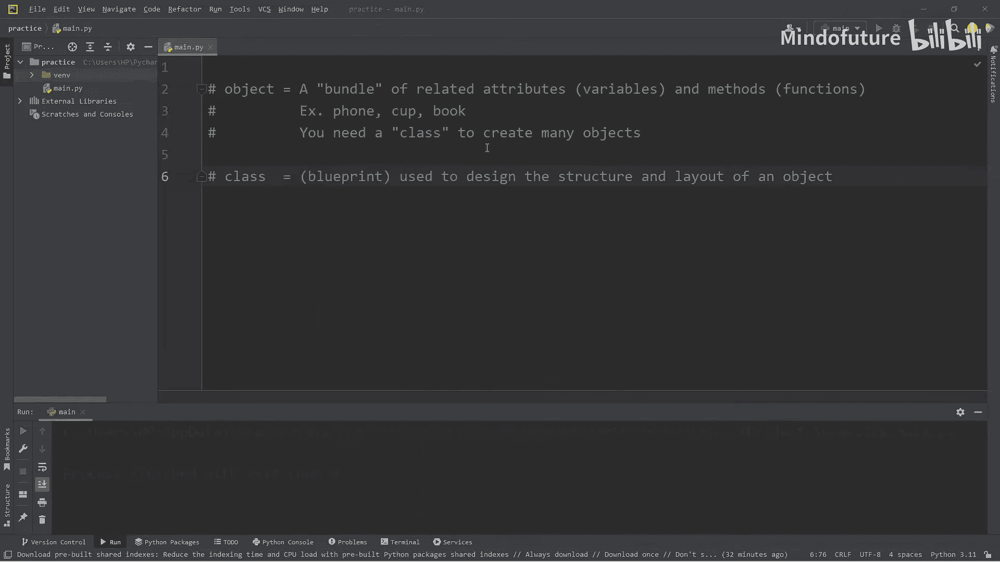

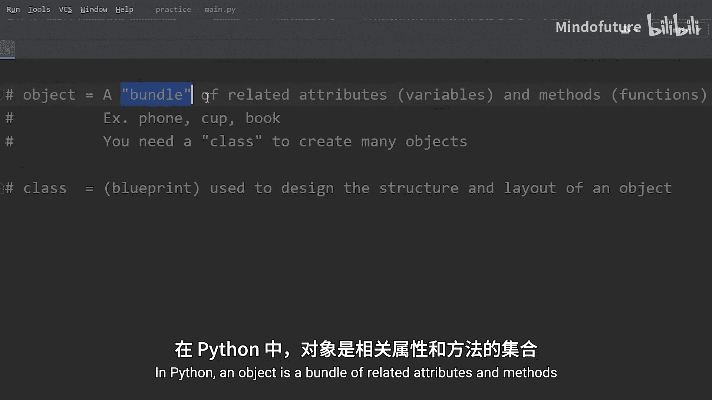

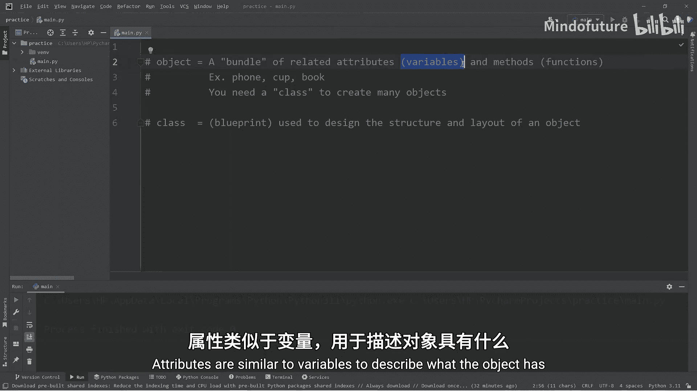

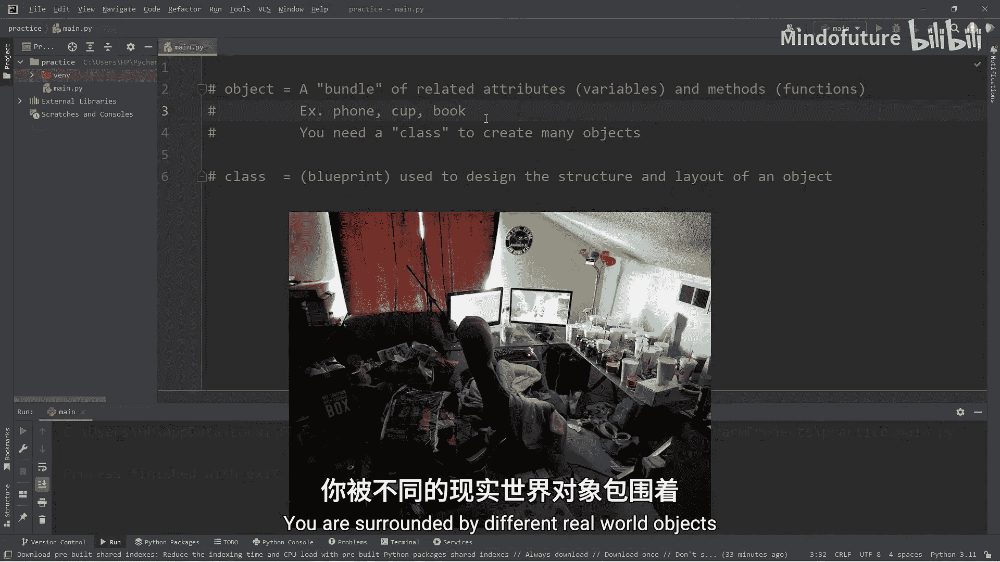

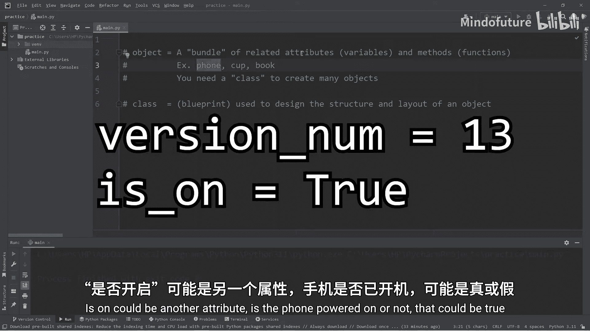

环顾四周，你会发现许多现实世界的物体，例如手机、杯子和书。每个物体都可以用不同的属性来描述。例如，手机的属性可能包括版本号、是否开机和价格。杯子的属性可能包括内部液体和温度。书的属性可能包括书名和页数。

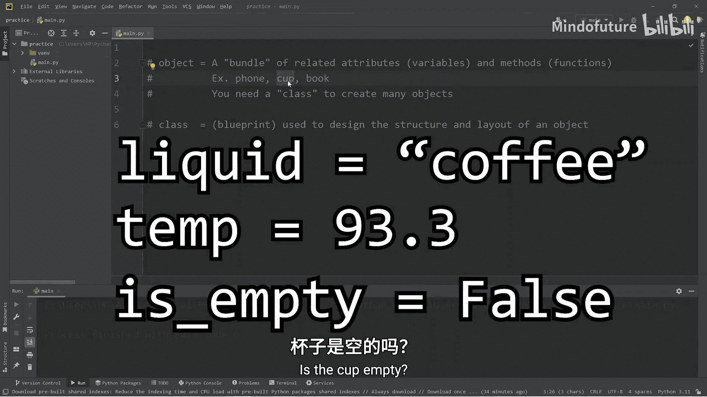

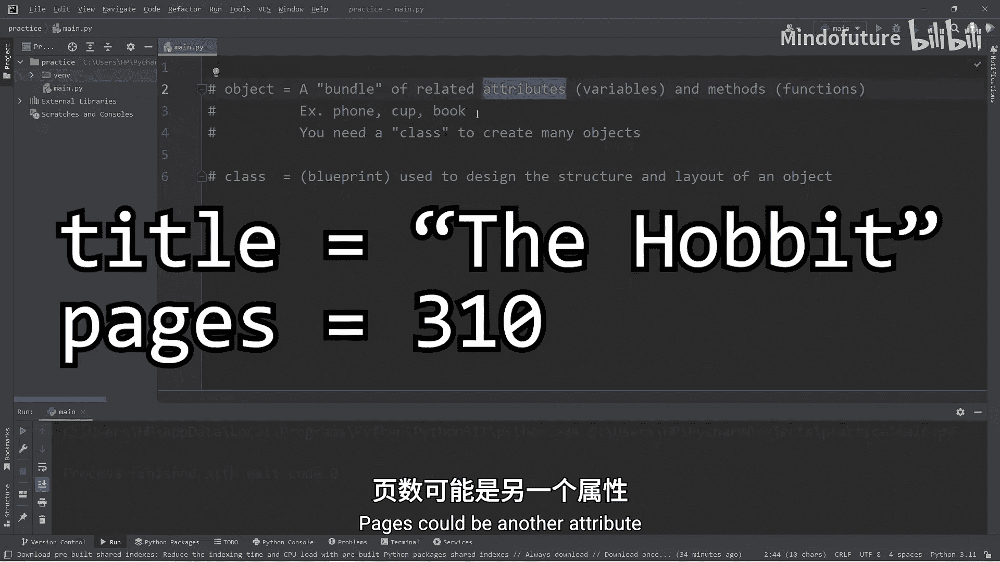

## 什么是类？📐

为了创建多个对象，我们需要使用类。类是一种蓝图，用于设计对象的结构和布局。它定义了对象应具有的属性和方法。

我们将创建一个`Car`类，并基于它来创建汽车对象。

## 创建Car类 🚗

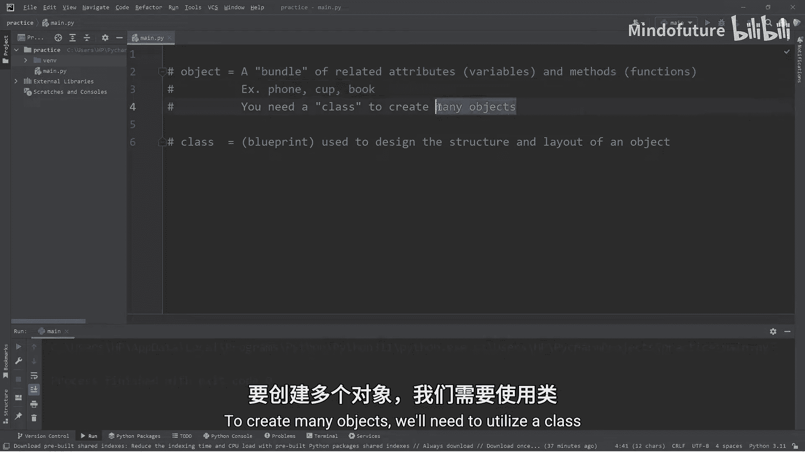

首先，我们定义一个名为`Car`的类。为了构造汽车对象，我们需要一个特殊的方法——构造函数。

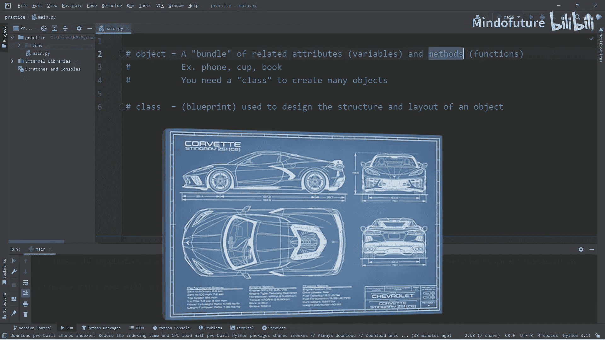

```python
class Car:
    def __init__(self, model, year, color, for_sale):
        self.model = model
        self.year = year
        self.color = color
        self.for_sale = for_sale
```

构造函数`__init__`是一个“双下划线”方法，用于初始化对象。`self`参数代表我们正在创建的这个对象本身。在构造函数内部，我们为汽车对象定义了四个属性：`model`（型号）、`year`（年份）、`color`（颜色）和`for_sale`（是否出售）。

## 创建汽车对象

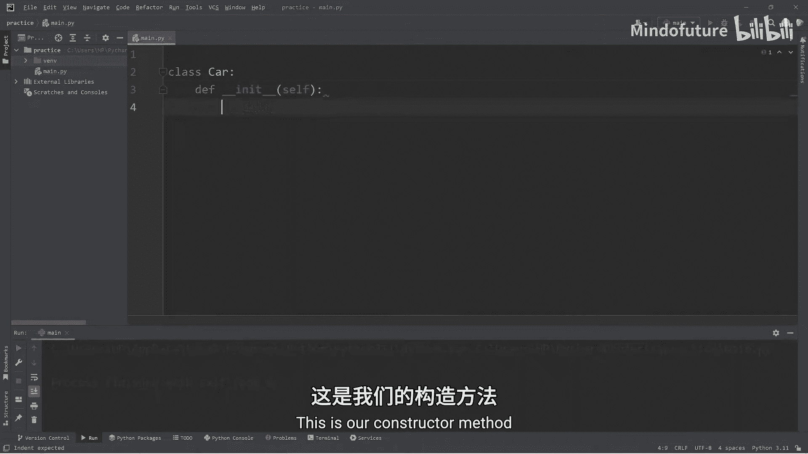


现在，我们可以使用`Car`类来创建具体的汽车对象。

```python
car1 = Car("Mustang", 2024, "red", False)
car2 = Car("Corvette", 2025, "blue", True)
car3 = Car("Charger", 2026, "yellow", True)
```

我们创建了三个汽车对象：`car1`、`car2`和`car3`，并为每个对象传递了不同的参数值。

## 访问对象属性

要访问对象的属性，我们使用点号`.`操作符。

```python
print(car1.model)  # 输出: Mustang
print(car1.year)   # 输出: 2024
print(car1.color)  # 输出: red
print(car1.for_sale) # 输出: False
```

通过这种方式，我们可以获取每个汽车对象的特定属性信息。

## 为类添加方法

上一节我们介绍了如何定义对象的属性，本节中我们来看看如何为对象添加行为，即方法。方法是属于对象的函数，定义了对象能执行的操作。

以下是我们可以为汽车添加的一些方法：

```python
class Car:
    def __init__(self, model, year, color, for_sale):
        self.model = model
        self.year = year
        self.color = color
        self.for_sale = for_sale

    def drive(self):
        print(f"You drive the {self.color} {self.model}")

    def stop(self):
        print(f"You stop the {self.color} {self.model}")

    def describe(self):
        print(f"{self.year} {self.color} {self.model}")
```

我们为`Car`类添加了三个方法：`drive`（驾驶）、`stop`（停止）和`describe`（描述）。在每个方法中，我们使用`self`来访问当前对象的属性，从而在输出中显示特定汽车的信息。

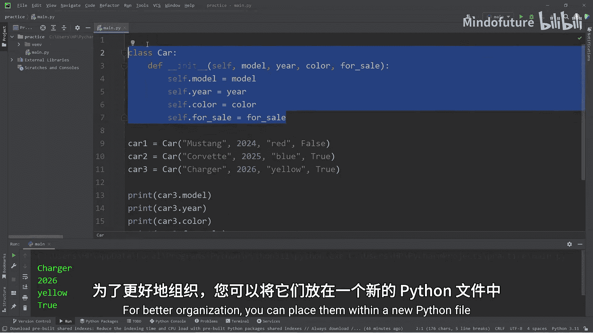

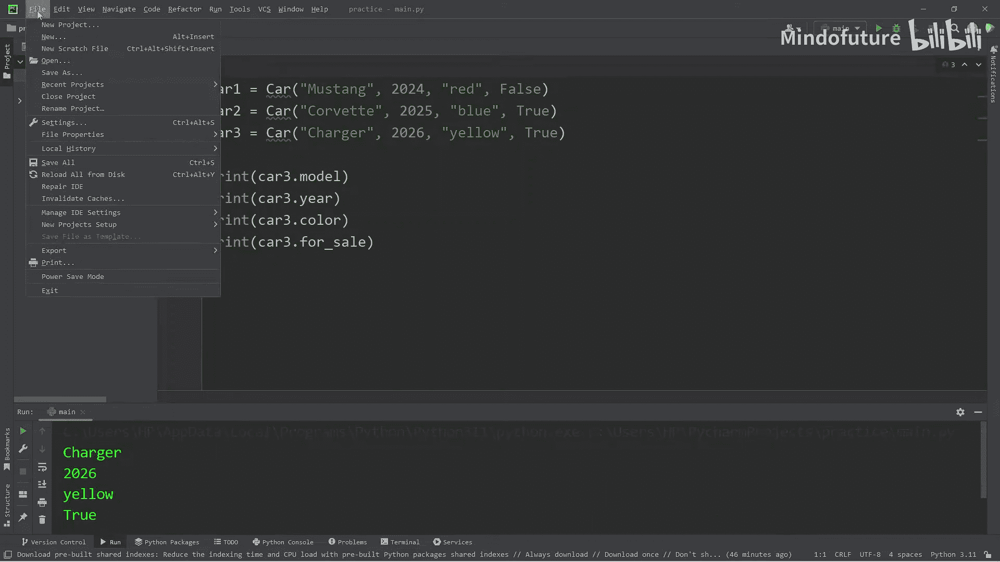

## 调用对象方法

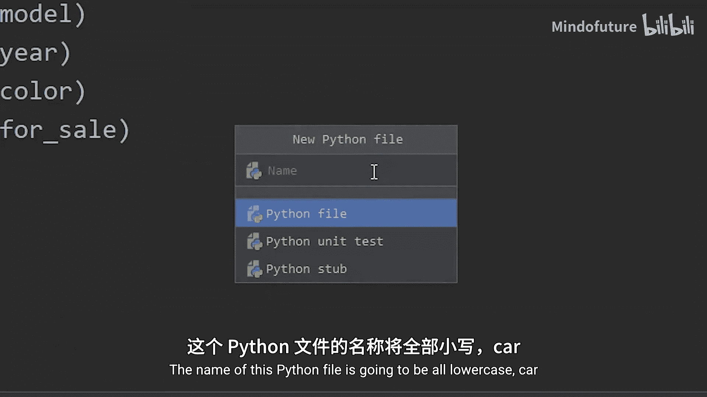

现在，我们可以调用这些方法来让汽车对象执行动作。

```python
car1.drive()   # 输出: You drive the red Mustang
car1.stop()    # 输出: You stop the red Mustang
car1.describe() # 输出: 2024 red Mustang

car2.drive()   # 输出: You drive the blue Corvette
car2.stop()    # 输出: You stop the blue Corvette
car2.describe() # 输出: 2025 blue Corvette
```

每个汽车对象都可以调用相同的方法，但会根据自身的属性值产生不同的输出。

## 代码组织

随着类变得复杂，为了更好的组织代码，我们可以将类定义放在单独的Python文件中。

1.  创建一个名为`car.py`的新文件。
2.  将`Car`类的代码剪切并粘贴到`car.py`中。
3.  在主Python文件中，使用`from car import Car`来导入`Car`类。

这样，主文件中的代码可以保持整洁，并且我们可以在多个项目中重用`Car`类。

## 总结

本节课中我们一起学习了Python面向对象编程的基础知识。我们了解到：

*   **对象**是相关**属性**和**方法**的集合。
*   **属性**是描述对象特征的变量。
*   **方法**是属于对象的函数，定义了对象的行为。
*   **类**是创建对象的蓝图，它定义了对象的结构。

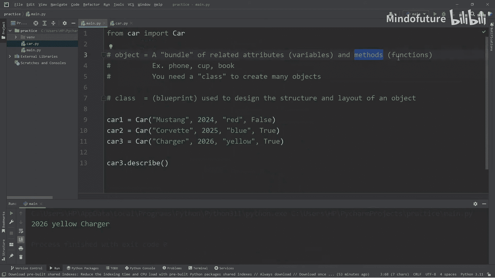

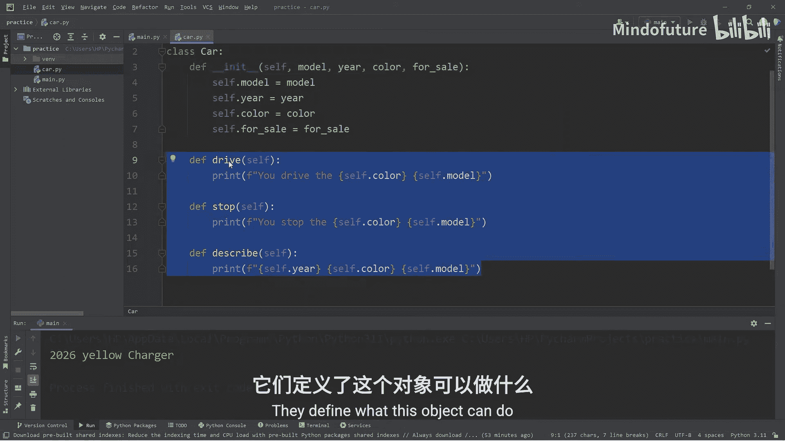

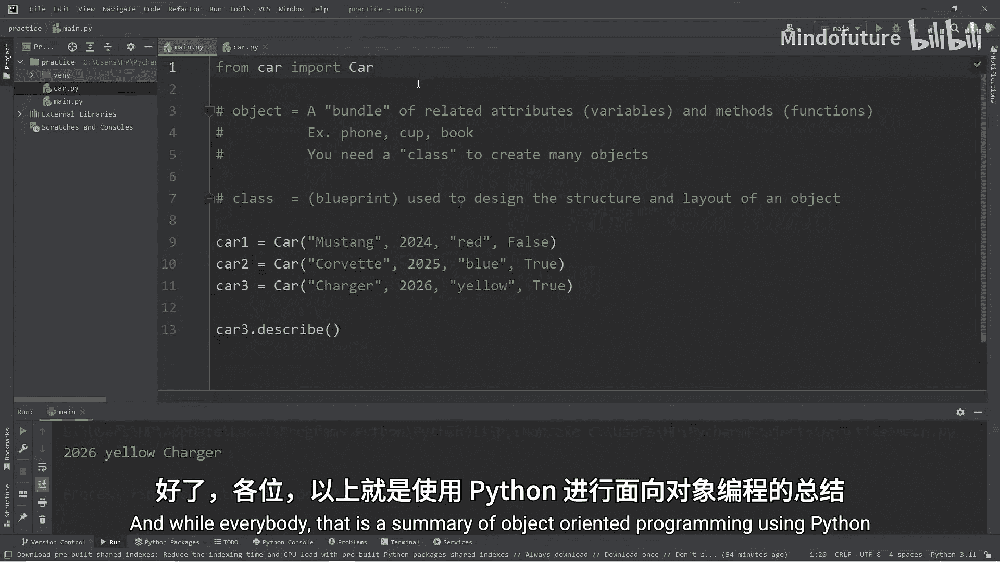

通过创建`Car`类和多个汽车对象，我们实践了如何定义属性、创建对象、访问属性以及调用方法。面向对象编程是构建复杂、模块化程序的重要工具，希望本教程能帮助你迈出坚实的第一步。