Python超全入门教程：P49：Python继承入门

在本节课中，我们将要学习Python中一个非常重要的概念——继承。继承允许一个类获取另一个类的属性和方法，这有助于代码的复用和扩展。我们将通过创建一个动物类，并让狗、猫和老鼠类继承它，来直观地理解这个概念。

### 什么是继承？🤔

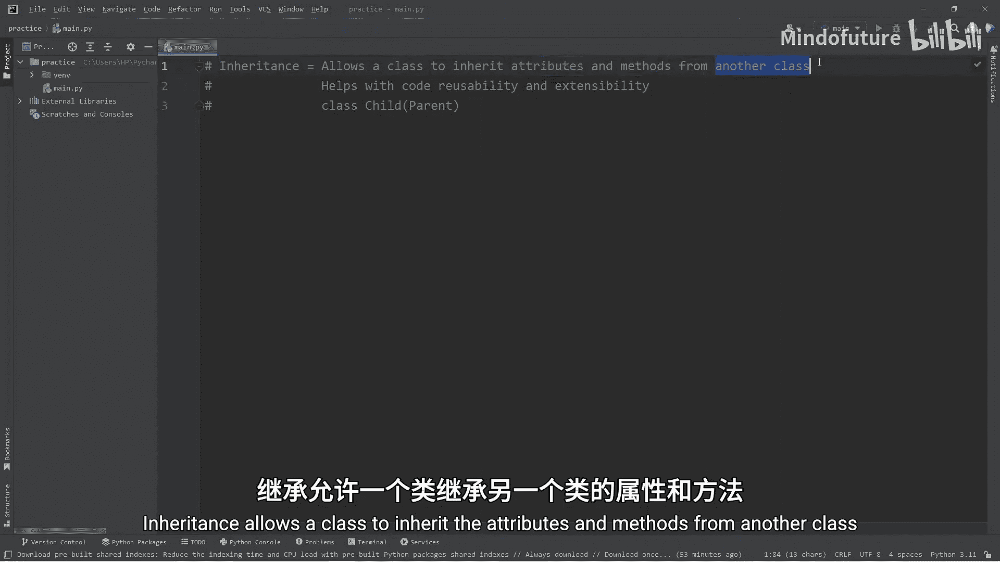

继承允许一个类从另一个类那里继承属性和方法。这类似于现实生活中的孩子可以从父母那里继承特征。通过让一个类继承另一个类的属性和方法，我们可以实现代码的复用和扩展。

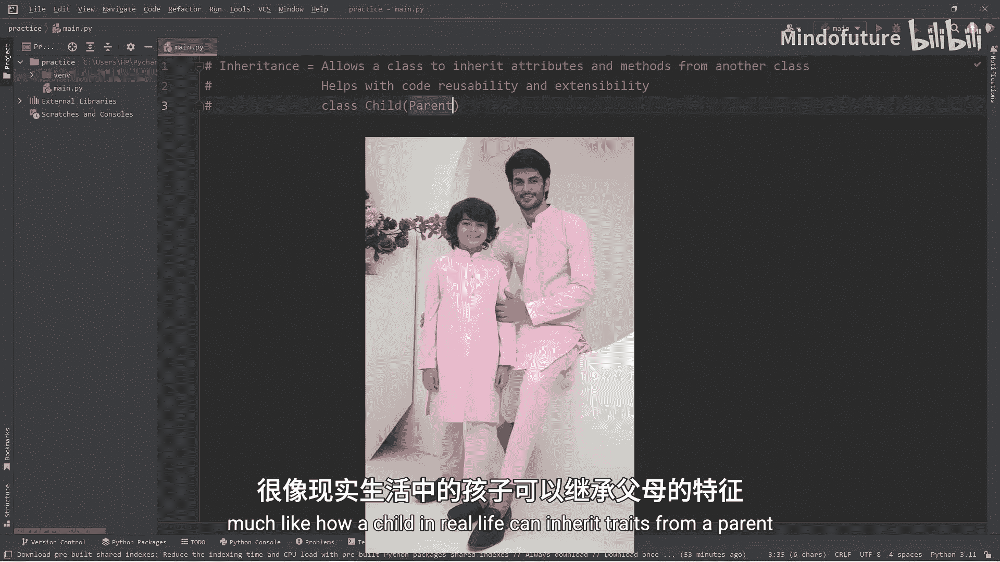

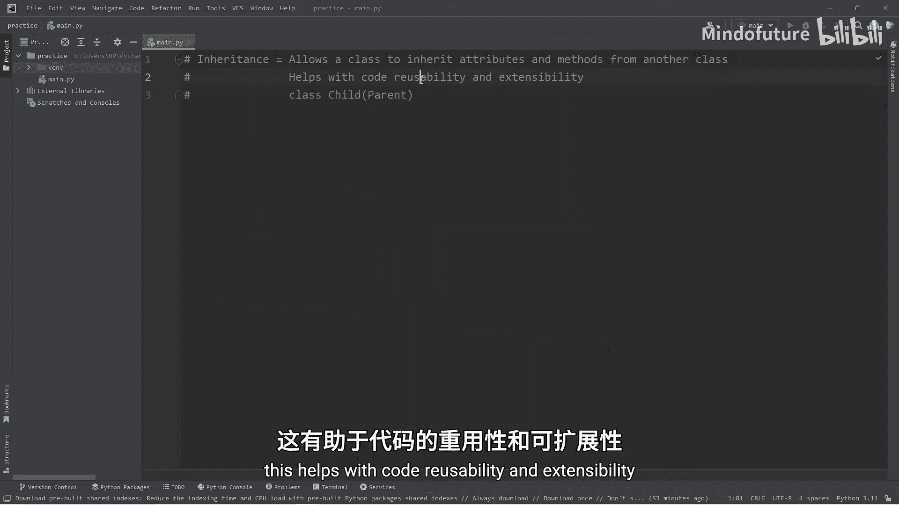

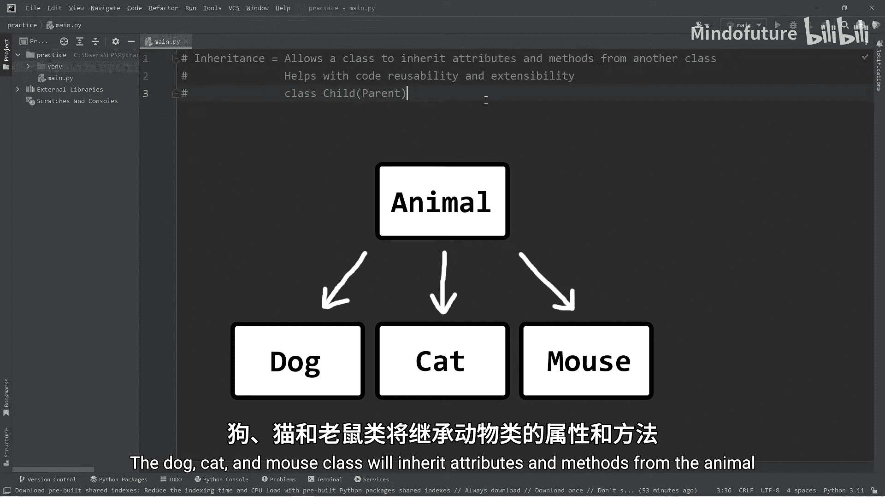

### 创建父类：动物类 🐾

首先，我们来创建一个名为 `Animal` 的父类。这个类将定义所有动物共有的基本属性和行为。

```python
class Animal:
    def __init__(self, name):
        self.name = name
        self.is_alive = True

    def eat(self):
        print(f"{self.name} is eating.")

    def sleep(self):
        print(f"{self.name} is sleeping.")
```

在上面的代码中：
*   `__init__` 是构造函数，用于初始化每个动物对象的名字，并设置 `is_alive` 属性为 `True`。
*   `eat` 和 `sleep` 是两个方法，分别表示动物的进食和睡眠行为。

### 创建子类：继承的实践 🐕🐈🐁

现在，我们将创建三个子类：`Dog`、`Cat` 和 `Mouse`。它们都将继承自 `Animal` 类。

```python
class Dog(Animal):
    pass

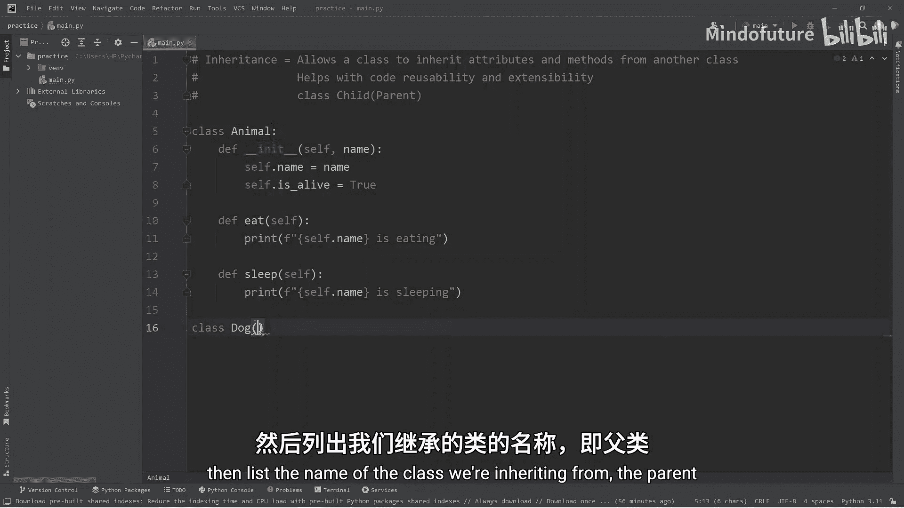

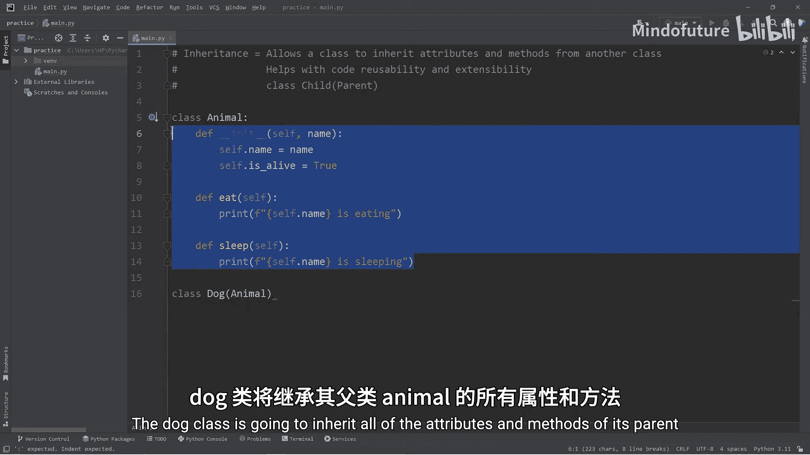

class Cat(Animal):
    pass

class Mouse(Animal):
    pass
```

注意，在定义子类时，我们在类名后的括号中写上了父类 `Animal` 的名字。这表示 `Dog`、`Cat` 和 `Mouse` 类将继承 `Animal` 类的所有属性和方法。目前，我们使用 `pass` 作为占位符，表示这些子类暂时没有自己独有的内容。

### 使用继承的类 🚀

尽管子类内部是空的，但它们已经拥有了父类的全部功能。让我们创建对象并测试一下。

```python
dog = Dog("Scooby")
cat = Cat("Garfield")
mouse = Mouse("Mickey")

print(dog.name)        # 输出: Scooby
print(dog.is_alive)    # 输出: True
dog.eat()              # 输出: Scooby is eating.
dog.sleep()            # 输出: Scooby is sleeping.

# 同样可以用于猫和老鼠
cat.eat()              # 输出: Garfield is eating.
mouse.sleep()          # 输出: Mickey is sleeping.
```

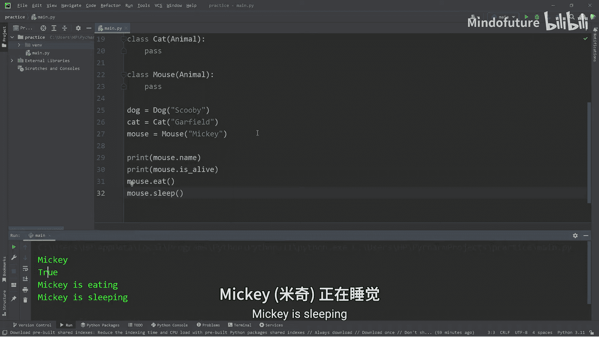

可以看到，子类对象成功使用了从父类继承来的属性和方法。

### 继承的优势：代码复用与维护 🔧

继承的核心优势在于避免代码重复。想象一下，如果没有继承，我们需要在 `Dog`、`Cat`、`Mouse` 每个类里都重复编写 `name`、`is_alive`、`eat()` 和 `sleep()`。这不仅代码冗长，而且一旦需要修改（比如把 `sleep` 方法输出的信息从 “is sleeping” 改为 “is asleep”），就必须在每个类里逐一修改，非常低效且容易出错。

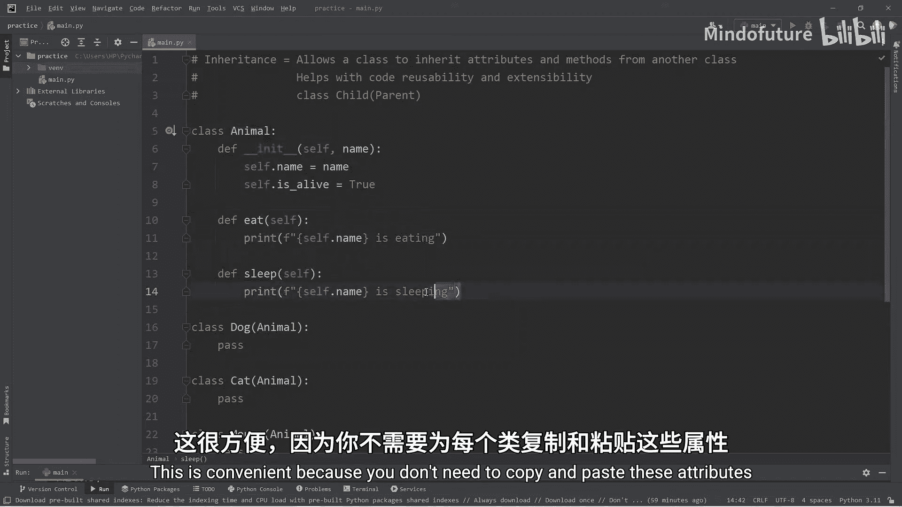

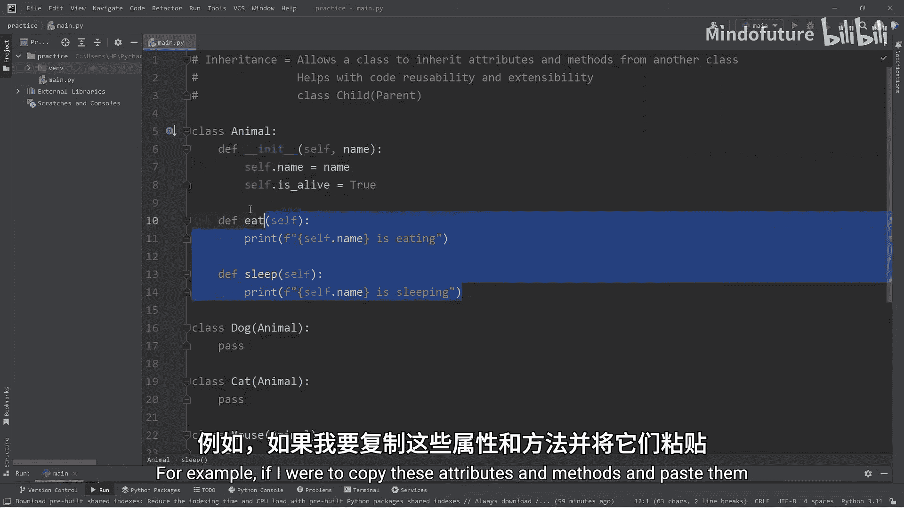

使用继承后，我们只需在父类 `Animal` 中修改一次：

```python
def sleep(self):
    print(f"{self.name} is asleep.")  # 修改这里
```

所有继承自 `Animal` 的子类都会自动应用这个更改。

### 扩展子类：添加特有行为 🎤

上一节我们介绍了继承如何复用代码，本节中我们来看看子类如何扩展父类的功能。子类不仅可以继承，还可以拥有自己独特的属性和方法。

例如，每种动物可能有不同的叫声：

```python
class Dog(Animal):
    def speak(self):
        print("Woof!")

class Cat(Animal):
    def speak(self):
        print("Meow!")

class Mouse(Animal):
    def speak(self):
        print("Squeak!")

# 使用特有的方法
dog.speak()  # 输出: Woof!
cat.speak()  # 输出: Meow!
mouse.speak() # 输出: Squeak!
```

这样，`Dog`、`Cat` 和 `Mouse` 在共享通用行为（吃、睡）的同时，也具备了各自独特的行为（叫）。

### 总结 📚

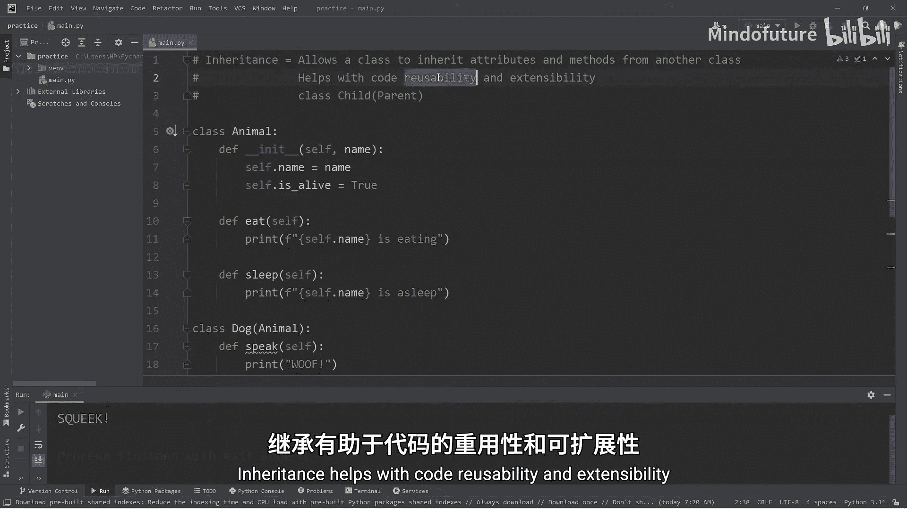

本节课中我们一起学习了Python中的继承。
*   **继承** 允许一个类（子类）获取另一个类（父类）的属性和方法，语法是 `class ChildClass(ParentClass):`。
*   它的主要优点是 **代码复用** 和 **易于维护**。通用代码只需在父类中编写一次，所有子类即可使用。修改也只需在父类中进行。
*   子类可以通过定义自己的方法来 **扩展** 功能，实现与父类或其他子类的差异化。

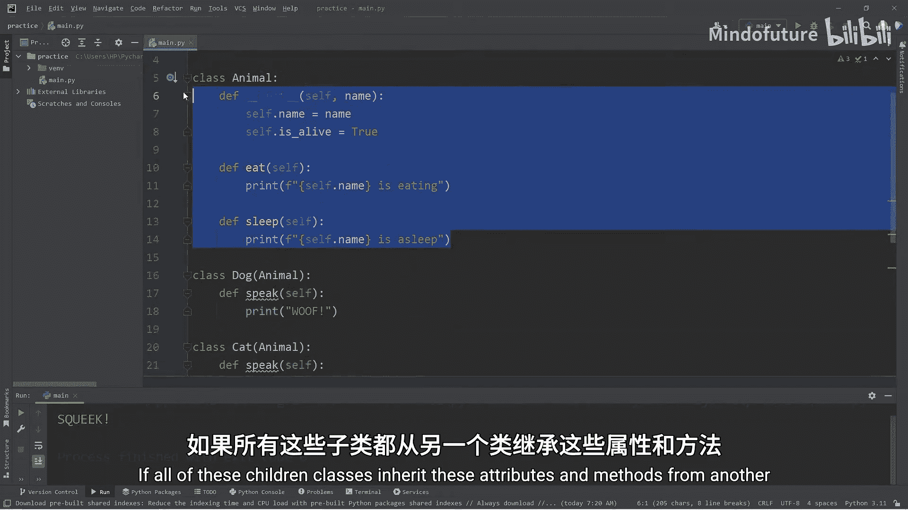

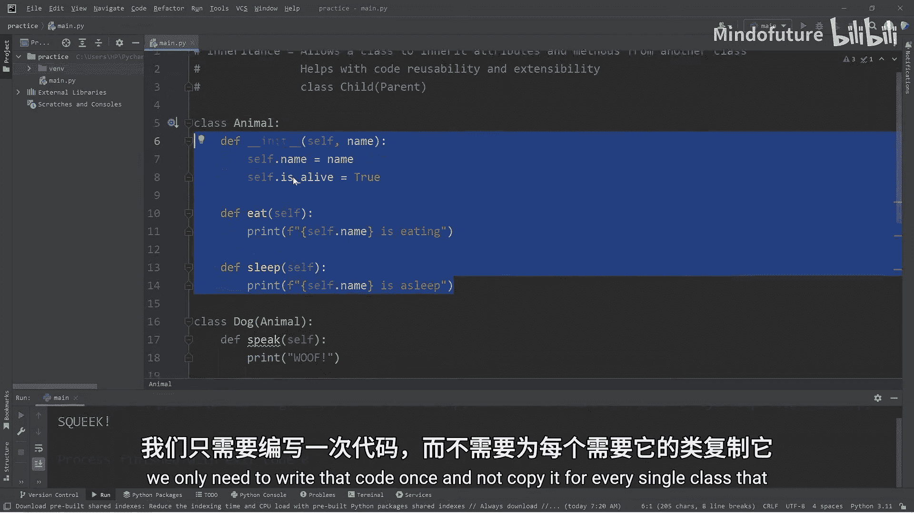

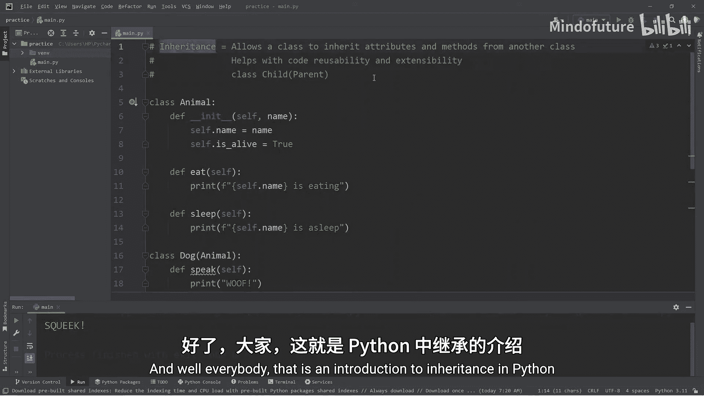

通过继承，我们可以构建出层次清晰、易于管理和扩展的代码结构。