# 050：多重继承与多级继承 🐍

在本节课中，我们将要学习Python面向对象编程中的两个重要概念：**多重继承**与**多级继承**。我们将通过一个生动的动物世界例子，来理解一个子类如何从多个父类继承特性，以及继承链是如何层层传递的。

## 概述

多重继承允许一个子类继承多个父类的属性和方法。多级继承则描述了继承的层级关系，例如子类、父类、祖父类。掌握这两种继承方式，能让你设计出更灵活、结构更清晰的代码。

---

## 多重继承：一个子类，多个父类 🧬

上一节我们介绍了单一继承。本节中我们来看看**多重继承**。多重继承是指一个子类可以继承自**多个**父类。

例如，一个类 `C` 可以同时继承类 `A` 和类 `B` 的特性。在Python中，只需在定义子类时，将多个父类放入继承列表中即可。

我们将通过创建“猎物”和“捕食者”两个父类来演示。

以下是创建父类的代码：

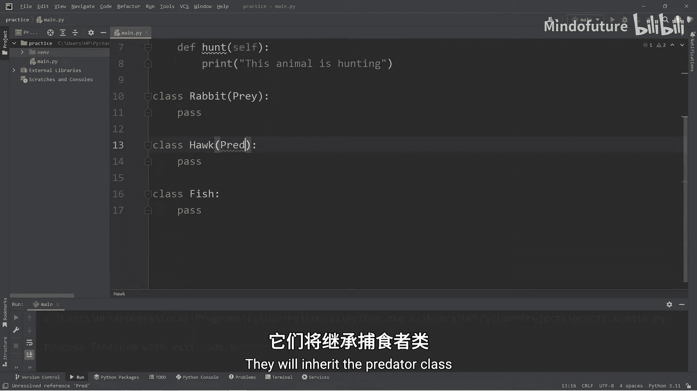

```python
class Prey:
    def flee(self):
        print(f"{self.name} is fleeing")

class Predator:
    def hunt(self):
        print(f"{self.name} is hunting")
```

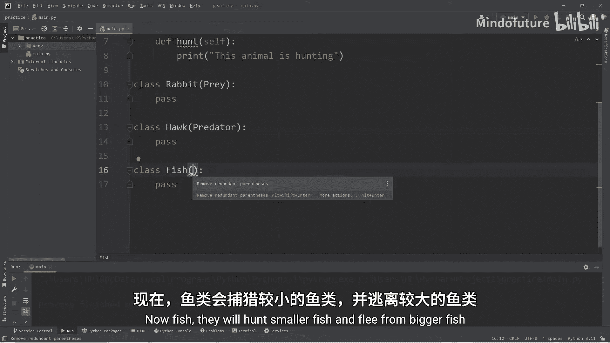

现在，我们创建几个子类。兔子是猎物，鹰是捕食者。

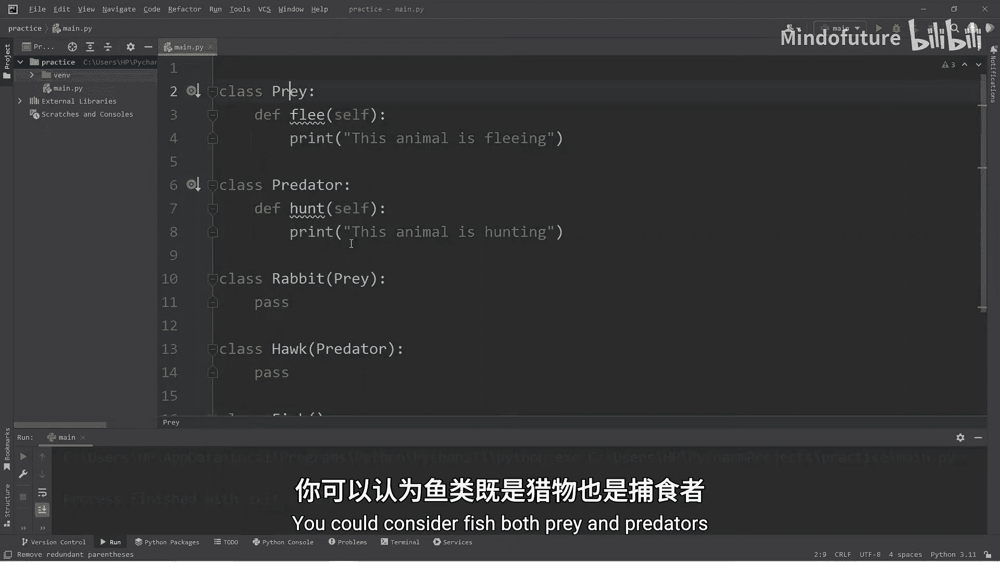

以下是创建子类的代码：

```python
class Rabbit(Prey):
    pass

class Hawk(Predator):
    pass
```

鱼类比较特殊，它们既是猎物（会被更大的鱼捕食），也是捕食者（会捕食更小的鱼）。因此，`Fish` 类需要同时继承 `Prey` 和 `Predator`。

以下是使用多重继承创建 `Fish` 类的代码：

```python
class Fish(Prey, Predator):
    pass
```

让我们测试一下这些类的功能。首先创建各个类的对象。

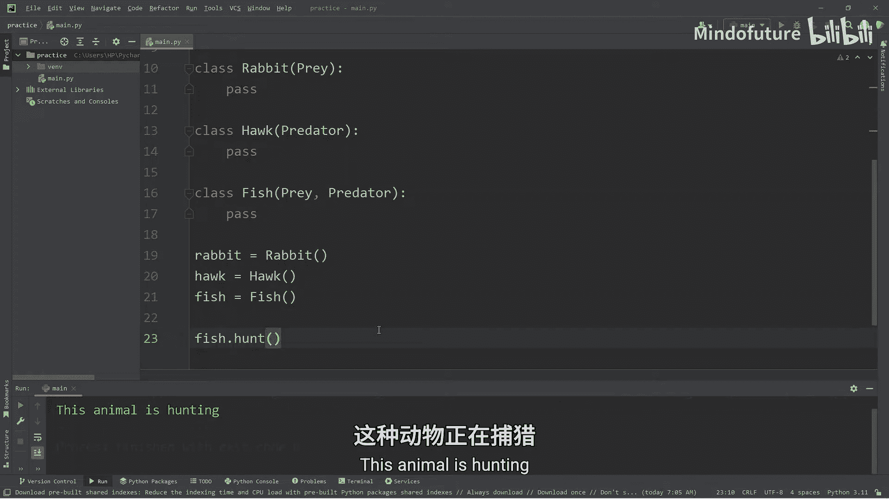

以下是测试代码：

```python
rabbit = Rabbit()
hawk = Hawk()
fish = Fish()

# 为对象添加名字属性以便输出更清晰
rabbit.name = "Bugs"
hawk.name = "Tony"
fish.name = "Nemo"

rabbit.flee()  # 输出：Bugs is fleeing
# rabbit.hunt() # 这行会报错，因为Rabbit没有hunt方法

hawk.hunt()    # 输出：Tony is hunting
# hawk.flee()  # 这行会报错，因为Hawk没有flee方法

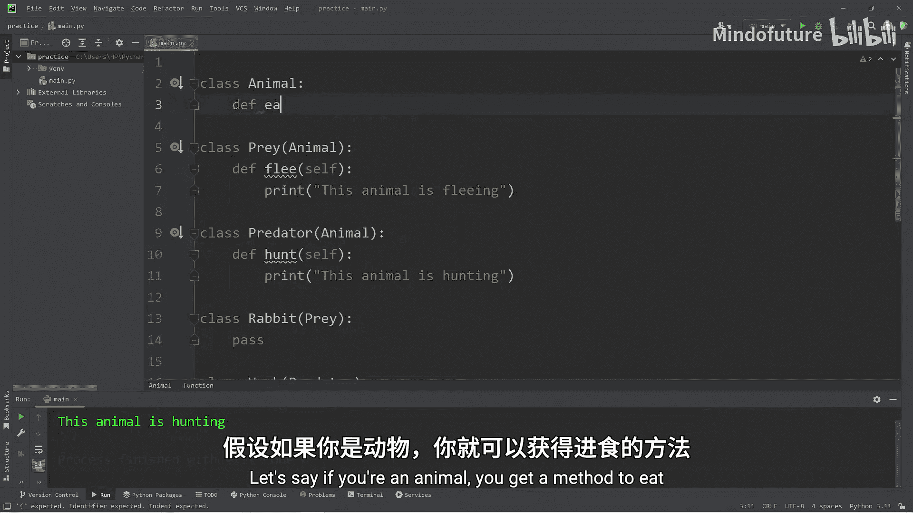

fish.flee()    # 输出：Nemo is fleeing
fish.hunt()    # 输出：Nemo is hunting
```

如你所见，`Fish` 对象成功地同时拥有了 `flee` 和 `hunt` 两个方法，这正是多重继承的威力。

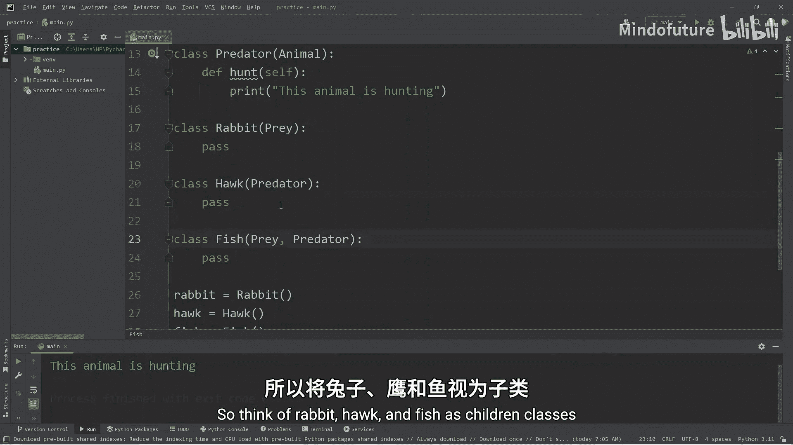

---

## 多级继承：继承的层级结构 🏗️

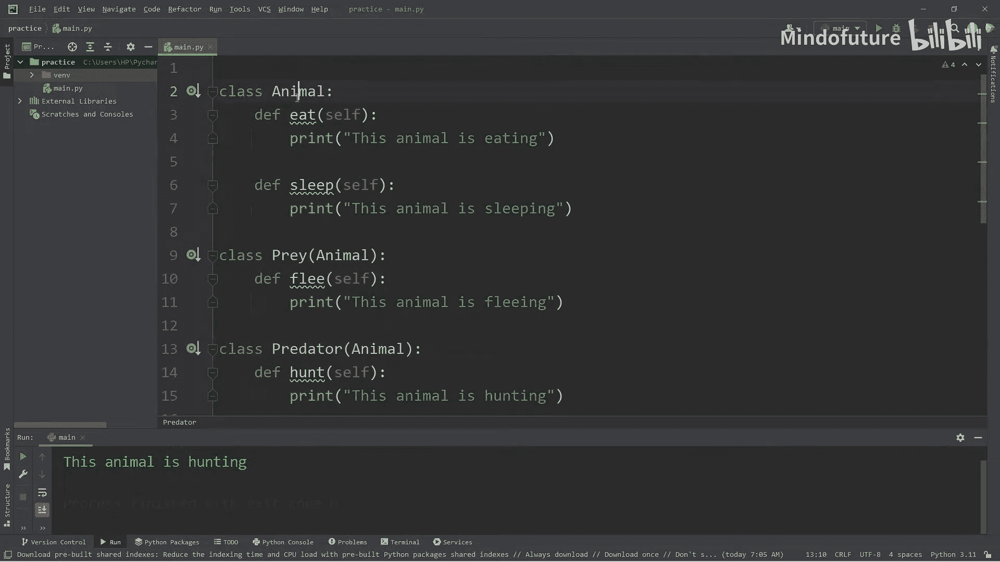

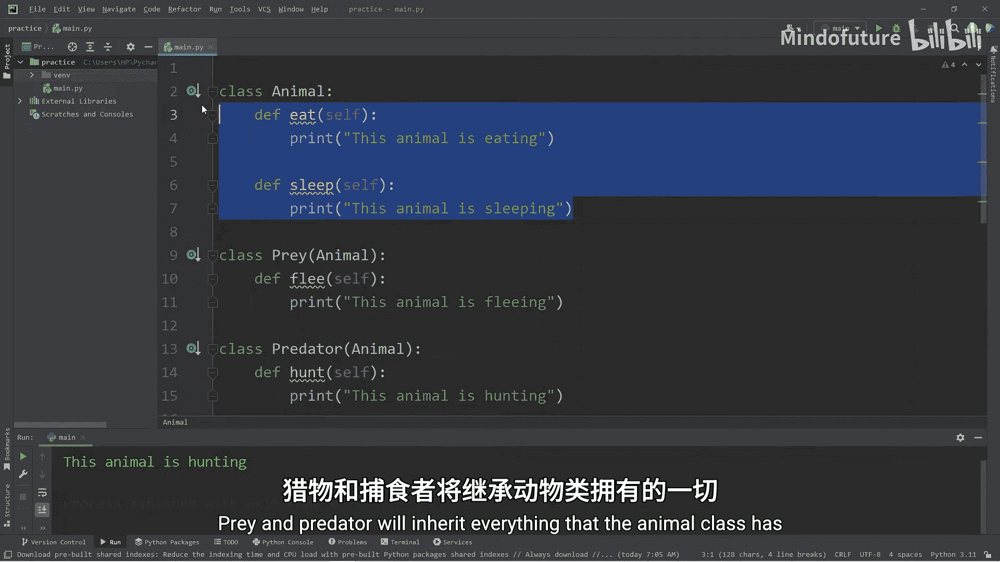

理解了多重继承后，我们再来看看**多级继承**。在多级继承中，一个父类本身也可以是另一个类的子类，从而形成一种层级或链条关系。

例如，我们可以创建一个所有动物的基类 `Animal`，让 `Prey` 和 `Predator` 继承它。这样，`Rabbit`、`Hawk`、`Fish` 这些“孙子辈”的类就能间接获得 `Animal` 类的特性。

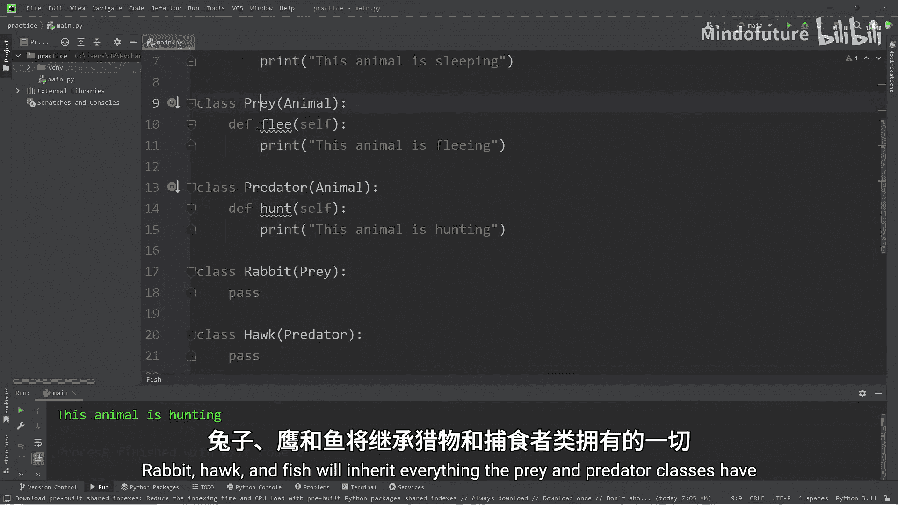

首先，我们创建 `Animal` 这个“祖父”类。

以下是创建 `Animal` 类并添加通用方法的代码：

```python
class Animal:
    def __init__(self, name):
        self.name = name

    def eat(self):
        print(f"{self.name} is eating")

    def sleep(self):
        print(f"{self.name} is sleeping")
```

现在，我们需要修改 `Prey` 和 `Predator` 类，让它们继承自 `Animal`。

以下是修改父类继承关系的代码：

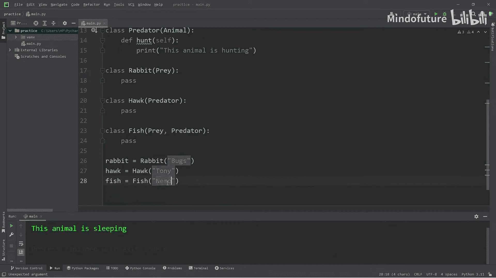

```python
class Prey(Animal):
    def flee(self):
        print(f"{self.name} is fleeing")

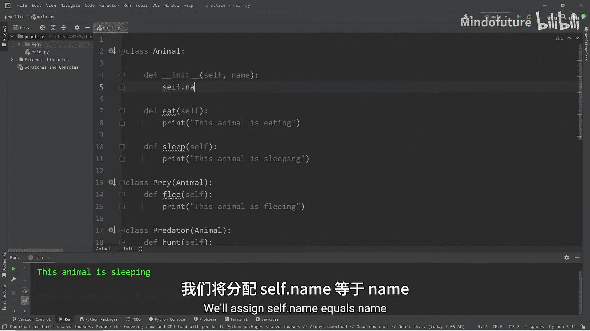

class Predator(Animal):
    def hunt(self):
        print(f"{self.name} is hunting")
```

子类 `Rabbit`、`Hawk`、`Fish` 的继承关系保持不变。但由于它们的父类现在继承自 `Animal`，它们也将自动获得 `eat` 和 `sleep` 方法。

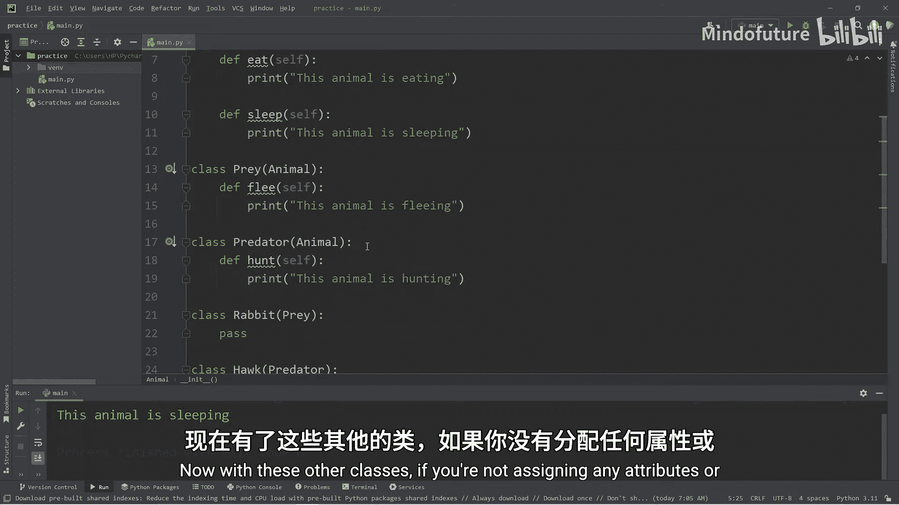

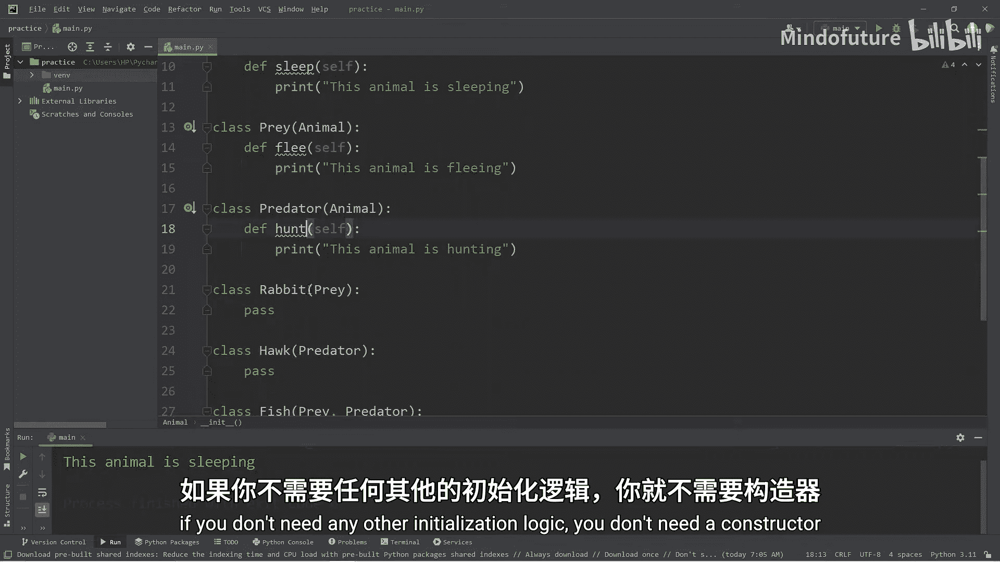

让我们创建对象并测试完整的继承链。

以下是完整的测试代码：

```python
# 创建对象时通过Animal的构造函数传入名字
rabbit = Rabbit("Bugs")
hawk = Hawk("Tony")
fish = Fish("Nemo")

# 测试从Animal继承的方法
rabbit.eat()   # 输出：Bugs is eating
rabbit.sleep() # 输出：Bugs is sleeping
rabbit.flee()  # 输出：Bugs is fleeing

hawk.eat()     # 输出：Tony is eating
hawk.sleep()   # 输出：Tony is sleeping
hawk.hunt()    # 输出：Tony is hunting

fish.eat()     # 输出：Nemo is eating
fish.sleep()   # 输出：Nemo is sleeping
fish.flee()    # 输出：Nemo is fleeing
fish.hunt()    # 输出：Nemo is hunting
```

通过多级继承，我们构建了 `Animal` -> `Prey/Predator` -> `Rabbit/Hawk/Fish` 这样的继承层级。最底层的子类拥有了所有祖先类的方法。

---

## 总结

本节课中我们一起学习了Python中两种重要的继承机制：

1.  **多重继承**：一个子类可以继承多个父类。语法是在定义子类时，在括号内用逗号分隔多个父类，例如 `class Child(Parent1, Parent2)`。
2.  **多级继承**：继承关系可以像家族树一样层层递进。一个类继承自父类，而这个父类又继承自另一个类（祖父类）。子类将拥有整个继承链上所有祖先的属性和方法。

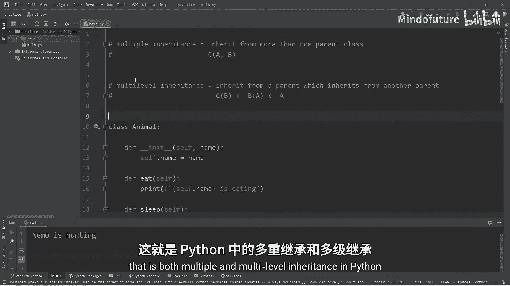

结合使用多重继承和多级继承，你可以设计出功能强大且层次分明的类结构，这是面向对象编程的核心技巧之一。记住，良好的继承设计能让代码更易于复用和维护。